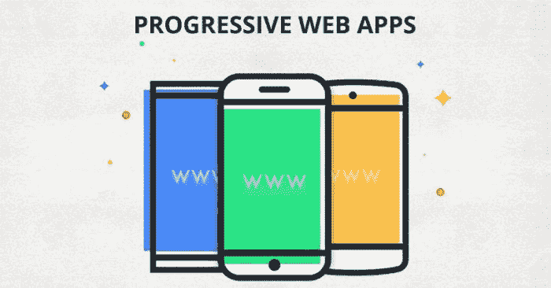
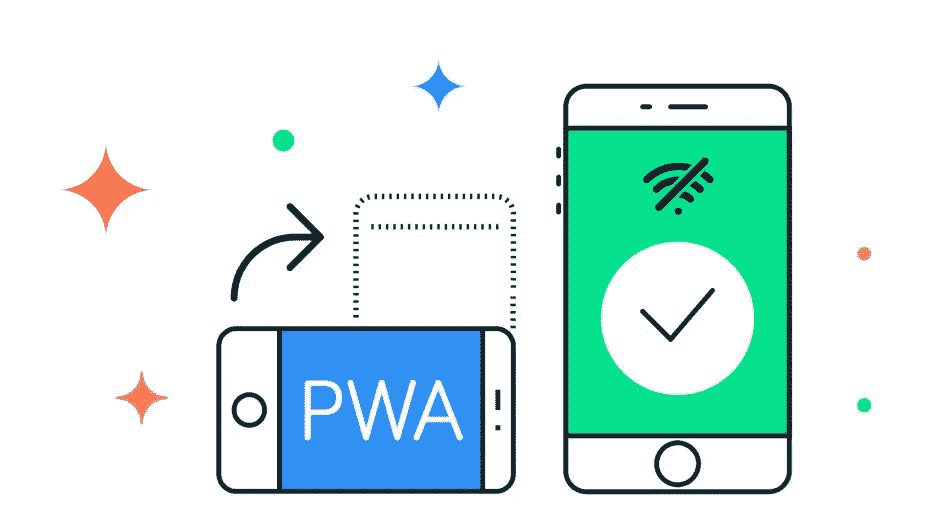

# 15+最佳新手 PWA 教程[2023 年 3 月] —在线学习 PWA

> 原文：<https://medium.com/quick-code/top-tutorials-to-learn-progressive-web-app-pwa-57bdf06af328?source=collection_archive---------0----------------------->

## 学习 PWA，在 2023 年为网站创建即时应用程序，为初学者提供最佳 PWA 教程

渐进式网络应用是一个术语，它总结了允许您提供类似移动体验的所有功能。不仅是谷歌大力推广。它也很快被 Twitter 或《华盛顿邮报》这样的大公司采用。

## 1.[渐进式网络应用(PWA) —完整指南](https://coursesity.com/r/site/progressive-web-apps-pwa-the-complete-guide-course)

使用设备摄像头、推送通知等等，构建一个类似于 iOS 和 Android 应用的渐进式网络应用(PWA)。

在本课程中，

*   构建外观和感觉都像 iOS 和 Android 原生移动应用的 web 应用
*   使用服务人员构建无需互联网连接也能工作的 web 应用程序(离线优先)
*   在您的网络应用中利用设备功能，如摄像头和地理定位
*   使用 web 推送通知来提高用户对您的 web 应用的参与度

您仍然需要创建一个 web 应用程序(HTML、CSS、JavaScript ),但本课程将教您如何添加一些功能，如摄像头访问、离线支持服务人员、推送通知等。这结合了两个世界的优点:您可以提供快速、引人入胜和可靠的体验，同时仍然具有网页的覆盖范围和可访问性。

对于现代 web 开发人员来说，拥有构建和优化这些类型的 web 应用程序的技能已经是一项重要的、高要求的技能，这种趋势只会加速！因此，学习如何构建 PWAs 将使您获得竞争优势！

具体来说，本课程将涵盖构建令人惊叹的 PWA 所需的一切——在谷歌的 PWA 审计工具“灯塔”中获得 100 分(满分为 100 分):

*   关于 PWA 到底是什么的详细解释
*   如何使用应用程序清单使您的 web 应用程序可安装在设备主屏幕上
*   使用服务人员通过缓存资产来提供离线支持
*   高级服务工作者使用和缓存策略
*   重温承诺和获取 API，因为这两个概念在 PWAs 中大量使用
*   如何通过添加推送通知来提高用户参与度
*   一种在后台同步数据的方法，即使连接丢失
*   如何访问本机设备功能，如摄像头或地理定位
*   使用 Workbox 简化服务人员管理
*   关于如何将你的下一个水疗项目转变为 PWA 的解释等等

这些当然都是通过建设课程项目来付诸实践的。为了确保您可以将这些知识应用到您的任何项目中，课程项目没有假设任何 JavaScript 框架，而是专注于上面提到的核心特性！

Best Progressive Web Apps Tutorials & Courses

# 2. [React:构建渐进式网络应用(pwa)](https://linkedin-learning.pxf.io/c/1137078/646189/8005?u=https%3A%2F%2Fwww.linkedin.com%2Flearning%2Freact-building-progressive-web-apps-pwas&subId1=quickcode)

了解如何使用 React(灵活的前端框架)构建自己的 PWAs。

该课程包括:

*   PWAs 简介
*   创建 React 应用程序
*   PWA 工具
*   了解 PWA 功能

该课程解释了如何构建 PWA 组件、获取数据、使用 Lighthouse 验证您的应用程序，以及添加离线功能以保持您的应用程序即使在互联网中断时也能运行。

此外，了解如何使用 Chrome 和 Safari for iOS 等浏览器在本地安装应用程序。

# 3.[通过构建渐进式网络应用(PWA)学习 Angular 8](https://www.eduonix.com/learn-angular-8-by-building-a-progressive-web-app-pwa/UHJvZHVjdC0zMjMyMDA=)

通过构建渐进式 Web 应用程序(PWA)来学习 Angular 8

在本课程中，您将了解:

*   PWA 的特征。
*   正在安装 node.js 预览版。
*   安装角度 CLI。
*   安装 Firebase 工具。
*   正在安装 VS 代码。
*   与 omdbapi.com[创建账户](http://omdbapi.com/)。
*   主页和标题组件。
*   路由和单页应用程序。

渐进式 web 应用程序或 PWA 是一种具有一组功能(类似于原生应用程序)的 Web 应用程序，可为用户提供类似应用程序的体验。

pwa 需要满足一系列基本要求，您将在接下来看到这些要求。pwa 类似于本地应用程序，但通过 URL 从 web 服务器部署和访问，因此我们不需要通过应用程序商店。

# 4.[渐进式网络应用从零到英雄](https://www.educative.io/courses/zero-to-hero-with-progressive-web-apps?affiliate_id=5088579051061248)

本课程开始时，您将回顾什么是 pwa，以及它们相对于本机和 web 应用程序的优势。

在本课程中，您将学习:

*   什么是 pwa，以及它们相对于本机和 web 应用程序的优势。
*   像服务人员这样的基本概念，是所有 PWAs 基础上的重要概念。
*   如何通过 Firebase 部署真正的 PWA？

你将进入更基本的概念，如服务人员，这是一个重要的概念，是所有 PWAs 的基础。

一旦您对服务工作者和缓存有了深刻的理解，您将学习如何通过 Firebase 部署一个真正的 PWA。

# 5.[用 Ionic 构建渐进式网络应用](https://pluralsight.pxf.io/c/1137078/424552/7490?u=https%3A%2F%2Fwww.pluralsight.com%2Fcourses%2Fprogressive-web-apps-ionic&subId1=quickcode)

构建一个可以在任何地方运行的渐进式 Web 应用程序。

在本课程中，您将学习:

*   什么是 PWA，以及如何创建一个可以在任何地方运行的 web 应用程序:浏览器、桌面或移动客户端。
*   如何使用 Ionic Framework、Angular 和 Firebase 来创建、部署和优化一个基本的 web 应用程序，使之成为一个成熟的 PWA。
*   创建和部署您自己的渐进式 Web 应用程序。

您将学习基础知识，并获得创建可在任何地方运行的 web 应用程序的能力:浏览器、桌面或移动客户端。

首先，您将了解什么是渐进式 Web 应用程序(或 PWA)。接下来，您将了解如何使用 Ionic Framework、Angular 和 Firebase 来创建、部署和优化一个基本的 web 应用程序，使之成为一个成熟的 PWA。

最后，您将探索如何配置应用程序，使其可以在 Androids 和 iPhones 上安装和运行。

完成本课程后，您将具备创建和部署自己的渐进式 Web 应用所需的 Ionic 和 PWAs 技能和知识。

# 6.[渐进式网络应用——简明 PWA 大师班](https://click.linksynergy.com/deeplink?id=Fh5UMknfYAU&mid=39197&u1=quickcode&murl=https%3A%2F%2Fwww.udemy.com%2Fprogressive-web-apps%2F)

从头开始构建渐进式 Web 应用或将现有 Web 应用升级到 PWAs 所需的一切。

在本课程中，

*   理解 PWAs 的目的。
*   深入学习服务工作者 API 和缓存 API 的各个方面。
*   学习在渐进式改进的帮助下将 PWA 技术添加到现有的 web 应用程序中。
*   将现有的 web 应用程序转换为功能全面的渐进式 Web 应用程序，而不影响对旧浏览器的支持。
*   在 Google Lighthouse 测试工具的帮助下审计和改进一个渐进式 Web 应用程序。

学习从头开始构建可发现的、引人入胜的渐进式 Web 应用程序(pwa ),或者使用服务人员、缓存 API 和 Web 应用程序清单将现有 Web 应用程序升级到 pwa。

学习 PWAs 背后的基本技术和概念，以便尽可能快速有效地开始。

了解 PWA 的用途及其解决的问题了解支持使用 PWA 的 JavaScript 概念，包括承诺和 Fetch API 实用、深入的课程，内容涉及构建 PWA 服务工作人员推送通知缓存本机功能的各个方面

本课程旨在教授对渐进式网络应用的坚实理解，适合任何对浏览器中的 HTML、CSS 和 JavaScript 有基本了解的人。

本课程首先介绍渐进式网络应用的概念，然后详细介绍服务人员。服务工作者部分包括支持 JavaScript 概念的简短课程，包括 Promises 和 Fetch API。

本课程还专门用了一整节来了解缓存 API，并与服务人员一起使用它。

最后，为了将整个课程内容付诸实践，实际项目部分涵盖了评估和升级现有 Web 应用程序的过程，以使其完全渐进，同时通过渐进增强保持其初始完整性。

学完本课程后，您将具备立即开始构建完全定制的、生产就绪的渐进式 Web 应用程序的实用技能。

# 7.[用 Ionic & Angular- Ionic 4](https://click.linksynergy.com/deeplink?id=Fh5UMknfYAU&mid=39197&u1=quickcode&murl=https%3A%2F%2Fwww.udemy.com%2Fcourse%2Fionic-2-the-practical-guide-to-building-ios-android-apps%2F) 构建 iOS、Android &网络应用

使用 Angular、Capacitor 和 Ionic 框架构建原生 iOS 和 Android 以及渐进式网络应用。

***课程评分:4.7 分(总分 9417 分)***

在本课程中，您将学习:

*   从同一个代码库构建本地应用和渐进式 web 应用
*   使用 Angular 和 Ionic 4 提供的强大功能，为 iOS 和 Android 构建原生应用
*   深入探究 Ionic 4，了解更多关于核心和高级功能的信息
*   在真实设备上测试 iOS 和 Android 应用，并将这些应用发布到这两个平台的应用商店

在本课程中，您将学习如何设置您的 Ionic 项目以及导航如何工作的基础知识，如何构建项目以及如何使用其丰富的组件库，如何使用 Ionic ships 的许多漂亮组件，如何使用不同类型的导航概念:“后退”-按钮导航，标签和侧菜单。

本课程还将教你如何显示模态、提醒、祝酒词和许多许多更有用的 UI 组件，如何在浏览器、模拟器或真实设备上测试应用程序，如何通过输入、文本字段、下拉菜单、对话框等获取和处理用户输入。如何认证用户并访问 web 服务器以存储和加载数据，如何访问本地设备存储和本机设备功能，如摄像头或地理定位。

本课程结束时，您将学习如何配置您的应用程序并将其发布到 App Store 或谷歌 Play 商店(或作为渐进式 web 应用程序)

# 8.[Angular Progressive Web Apps(PWA)master class(免费电子书](https://click.linksynergy.com/deeplink?id=Fh5UMknfYAU&mid=39197&u1=quickcode&murl=https%3A%2F%2Fwww.udemy.com%2Fangular-pwa-course%2F)

Angular 6 渐进式 Web 应用(PWA)实用指南。

在本课程中，

*   详细了解 Angular 服务人员提供的多种功能
*   了解如何将您的角度应用转化为 PWA
*   让你的 Angular 应用程序可以下载和安装
*   让你的角应用一键式安装与应用清单
*   添加应用程序外壳以提高初始启动性能
*   使用 Angular Service Worker 添加推送通知
*   通过应用数据缓存提高应用性能
*   学习服务人员基础知识
*   详细了解服务人员的生命周期
*   使用 Chrome 开发工具调试服务人员

课程的第一部分将直接介绍 Angular 服务人员和内置 Angular CLI PWA 支持。它将以一个普通的 Angular 应用程序为起点，并开始在其上添加 PWA 功能，以便将其转变为一个渐进的 Web 应用程序。

您将了解关于应用程序版本管理的所有内容，并且您将了解可用于缓存应用程序包和应用程序数据的多种缓存策略。

然后，它将使用 Angular CLI 和 Angular Universal 添加一个应用程序外壳，并使用应用程序清单使应用程序一键式安装。最后，它将使用 Angular Service Worker 向应用程序添加推送通知，以获得完整的类似移动设备的 PWA 体验。

在第二部分中，您将了解渐进式 Web 应用程序的一般知识(包括服务工作者、应用程序清单和缓存存储 API)。)，您将使用这些 API 来实现几个类似本机的功能:一键安装、离线支持、应用程序下载和安装、应用程序数据缓存等等。

您还将直接使用内置浏览器 API 从基本原则中学习服务人员网络基础知识，我们将使用 PWA 内置 Chrome 开发工具来确认我们对每一步的理解。

Angular CLI PWA 支持和 Angular Service Worker 将 PWA 功能提升到了另一个层次:it 部门将能够通过 Angular CLI 以透明的方式将 PWA 功能可靠地添加到他们的应用程序中，作为生产构建流程的一部分。

您将了解有关服务工作人员生命周期的所有内容，浏览器如何处理多个版本的服务工作人员，并且您将了解多个服务工作人员安装和激活问题。然后，您将构建一个服务工作器，使用缓存 API 为应用程序提供在网络中断时显示离线页面的能力。

大多数 PWA APIs 都是基于承诺的，所以为了使代码更具可读性，在给定的示例中将使用 Async / Await。然后是应用程序下载和安装的实现:将看到如何使用服务人员将网站的一个版本完全下载到用户的手机或桌面上，以及如何处理应用程序的多个版本的安装。

将通过模拟慢速网络演示本地缓存完整应用程序的性能优势，并了解如何清理应用程序的早期版本。您还将学习如何使用索引数据库和服务工作器在客户端缓存特定于 UI 的数据和派生视图模型数据，您还将学习如何实现后台同步。

课程的下一部分将涵盖所有关于应用程序清单的内容，以及如何配置我们期待的一键式安装体验。之后，我们将使用 Lighthouse 工具检查我们的应用程序，并分析生成的报告。

本 PWA 基础部分的最后一部分将介绍网络推送和通知。在本节中，我们将设置一个具有 Web 推送功能的节点服务器，然后将它链接到我们的服务人员，以便实现类似移动设备的通知。

您将能够设计、开发 PWA 并对其进行故障排除，此外，您还将知道如何利用 Angular CLI 和 Angular Service Worker 将 PWA 功能快速添加到 Angular 应用程序中。

# 9.[现代网页设计&开发:在 Angular 8](https://click.linksynergy.com/deeplink?id=Fh5UMknfYAU&mid=39197&u1=quickcode&murl=https%3A%2F%2Fwww.udemy.com%2Fcourse%2F2019-guide-to-creating-a-progressive-web-app-portfolio%2F) 中创建 PWA

适合所有级别—学习设计原则、Angular CLI、Firebase、照片编辑等。

***课程评分:4.9 分(共 5 分)***

在本课程中，您将学习:

*   使用 Angular 和 Firebase 构建响应式渐进式 web 应用程序
*   实践将应用于印刷和网络项目的设计原则
*   创建自己独特的投资组合网站
*   对 Visual Studio 代码有扎实的理解
*   了解如何使用 Photopea 创建项目模型
*   有能力使用 Chrome 开发者工具测试和审计网站

在本课程中，您将能够使用 Angular 和 Firebase 构建反应灵敏的渐进式 web 应用程序，实践将应用于印刷和 Web 项目的设计原则，并创建自己独特的组合网站。

本课程结束时，您将对 Visual Studio 代码有一个坚实的理解。您将学习如何使用 Photopea 创建项目模型，并能够使用 Chrome 开发工具测试和审计网站。

Top PWA Tutorials to learn Progressive Web Apps

# 10.[使用 Angular-Ionic 4 构建 PWA 和移动应用](https://click.linksynergy.com/deeplink?id=Fh5UMknfYAU&mid=39197&u1=quickcode&murl=https%3A%2F%2Fwww.udemy.com%2Fcourse%2Fionic-4-build-pwa-and-mobile-apps-with-angular%2F)

使用 Ionic 4 和 Angular 构建渐进式网络应用、原生 Android 和 iOS 应用

***课程评分:4.6 分(总分 184 分)***

在本课程中，您将学习:

*   角度复习和离子基础
*   如何设置您的 Ionic 4 项目
*   使用不同的 Ionic 4 模板空白、标签和侧菜单
*   关于 Ionic 4 的基础知识——导航是如何工作的，你的项目是如何构建的，以及你如何使用它丰富的组件库
*   Ionic 4 项目架构
*   用漂亮的 Ionic 4 组件创建用户界面
*   显示模态，警报，祝酒词和许多更有用的用户界面组件
*   在浏览器、模拟器和真实设备上测试应用程序
*   使用离子存储
*   构建 PWA 并在 Firebase 主机上部署

本课程带你从零到发布 app。在本课程中，您将通过学习如何使用 Ionic 组件库，如何获取和处理用户输入，如何存储数据来构建一个新闻应用程序。

# **11。**[**Ionic 4 Angular-Build Web App，原生 Android，IOS App**](https://click.linksynergy.com/deeplink?id=Fh5UMknfYAU&mid=39197&u1=quickcode&murl=https%3A%2F%2Fwww.udemy.com%2Fcourse%2Fionic-angular%2F)

带角形框架的 Ionic 4。使用 HTML、CSS 和 JavaScript 构建 PWA、Android、IOS 应用程序。带 REST API 的 Ionic 4。

***课程评分:4.4 分(共 44 分)***

在本课程中，您将学习:

*   一次编写，随处运行:Android、IOS、PWA
*   使用 Ionic 框架和 Angular 构建混合应用
*   离子用户界面组件，如离子卡，下拉刷新，烤面包和警报控制器等。
*   将 Ionic 与 REST API 集成
*   将 Ionic App 作为 Web App 部署到独立服务器(例如 Nodejs)。
*   将 Ionic 应用程序部署到真正的原生 Android 设备以及 Android 模拟器
*   离子网格响应设计
*   主题化 Ionic 应用
*   离子角度 LazyLoading、Routing 和 Routing 参数
*   离子存储模块

在本课程中，您将把 Ionic app 作为 Web 应用程序部署到独立服务器，将 Ionic app 部署到真正的原生 Android 设备。您将了解如何添加、更新、更改应用程序图标和闪屏，在多任务视图中更改应用程序状态栏颜色和标题颜色，更改应用程序名称、包名称和本机应用程序的版本，以及在 Android 模拟器中运行应用程序。

# 12.[渐进式 Web 应用开发:完整指南:二合一](https://click.linksynergy.com/deeplink?id=Fh5UMknfYAU&mid=39197&u1=quickcode&murl=https%3A%2F%2Fwww.udemy.com%2Fprogressive-web-app-development-a-complete-guide-2-in-1%2F)

通过创建具有改进功能的应用程序，简化您的应用程序开发和部署。

在本课程中，

*   用 NPM 管理现代 web 应用中的复杂依赖关系
*   用 Webpack 构建您的代码
*   应用程序的样式、林挺和格式
*   构建外观和感觉都像本地移动应用的 web 应用
*   用不同的工具审计和改进项目工作评估
*   通过使用推送通知提高用户参与度

构建可发现的、引人入胜的渐进式 web 应用程序，使其可离线使用，并让服务人员以极快的速度停止网络请求和 web 应用程序清单。

第一门课程“Web 开发人员工具箱——现代 Web 开发的基础”，从了解 NPM 和纱的复杂依赖管理以及它将如何帮助您简化应用程序开发和部署开始。接下来，您将介绍基本的工具和框架(例如，现代日期时间计算库 instant . js ),并获取一个高速 HTTP 请求库，以及开发人员工具包的其他相关工具。最后，我们将建立网络包。

第二门课程，渐进式网络应用程序开发，旨在使用缓存应用编程接口构建引人入胜的 PWA。这将使网络应用程序离线就绪。此外，我们将探索快速服务工作人员、各种类似本机的特性，并深入了解 Fetch API、Promise 和 App manifest。这样，您将非常熟悉 PWA，并获得实际项目的实践经验..

在本培训课程结束时，您不仅将熟悉渐进式网络应用程序是如何工作的，还将构建并部署一个具有顶级功能的生产就绪型应用程序。

# 13.[带有反作用跳转的渐进式网络应用程序](https://click.linksynergy.com/deeplink?id=Fh5UMknfYAU&mid=39197&u1=quickcode&murl=https%3A%2F%2Fwww.udemy.com%2Fprogressive-web-app-with-react-jumpstart%2F)

为 iOS 和安卓构建看起来和感觉都像本地移动应用的网络应用。

在本课程中，

*   了解推送通知是如何工作的
*   使用服务工作人员构建离线网络应用程序
*   在反应生态系统中使用渐进式网络应用
*   缓存网络请求调用

本课程将构建两个应用程序，将教您构建渐进式网络应用程序的基础和技术。它也会对同样的事情做出反应！它将使用最新的反作用创建应用程序来构建它的项目。所有这些项目都是从头开始的！

在本课程结束时，您将有足够的信心理解渐进式 Web 应用程序背后的关键概念:服务、工作应用程序、外壳架构、离线/在线通知、添加到“主屏幕”、缓存和离线加载推送通知等等！

# 14.[渐进式网络应用开发](https://click.linksynergy.com/deeplink?id=Fh5UMknfYAU&mid=39197&u1=quickcode&murl=https%3A%2F%2Fwww.udemy.com%2Fprogressive-web-application-development%2F)

学习构建速度惊人的应用程序的技能，这些应用程序看起来就像您的本地移动应用程序。

在本课程中，

*   构建看起来和感觉都像本地移动应用的网络应用
*   利用新的网络技术，如获取应用编程接口和承诺。
*   使用不同的工具审核和改进 PWA
*   将现有应用程序转换为 PWA
*   借助渐进式增强和方法，提高您的 web 应用程序速度。
*   通过使用推送通知提高用户参与度
*   关于服务人员的详细信息
*   离线存储和不同的缓存 API。

它首先介绍渐进式 web 应用程序的核心概念，详细解释每一个概念，最后将它们实现到一个生产就绪的应用程序中。

在本课程中，您将掌握新 API 的强大功能，包括 Fetch API、promises 等。了解如何通过添加推送通知来提高用户对应用的参与度。

它还深入介绍了应用程序清单，让用户可以将他们的应用程序添加到他们的移动主屏幕上，并像点击 web 应用程序图标一样轻松地重新打开应用程序，就像其他原生移动应用程序一样。由于增加了闪屏、应用程序外壳、原生默认颜色等，用户体验感觉像是原生移动应用程序。

本课程中的所有主题都包含在一个实际项目中，在课程结束时，该项目已准备好部署到生产中。为了确保该应用程序对任何类型的项目都有用，也为了确保您可以深入了解所有内容，课程项目是纯 JS/CSS/HTML 创建的。

SPAs(单页应用程序)非常关键，因为这些天来它们在 web 开发和构建混合和本地移动应用程序中扮演着如此重要的角色。因此，本课程专门有一节向您展示如何使用 Angular、React、Ember 和 Vue.js 来构建渐进式 web 应用程序。

# 15.[渐进式网络应用(PWA)——从初学者到专家](https://click.linksynergy.com/deeplink?id=Fh5UMknfYAU&mid=39197&u1=quickcode&murl=https%3A%2F%2Fwww.udemy.com%2Fprogressive-web-apps-pwa-from-beginner-to-expert%2F)

了解如何使用最好的 Web 技术提供最好的用户体验。

在本课程中，

*   如何构建一流的 web 应用程序
*   什么是渐进式网络应用程序，为什么要开发它们
*   如何打造完美的主屏体验
*   为什么所有网站都应该是安全的，以及如何保护它们
*   什么是服务人员
*   如何使用良好的 JavaScript 实践开发服务人员
*   服务工作者生命周期
*   什么是服务工作者缓存
*   不同的缓存策略以及如何在实际应用中应用它们
*   渐进式 Web 应用程序和服务工作者工具
*   如何丰富传统浏览器和平台，以提供许多 PWA 功能
*   如何向任何网站添加原生推送通知

本课程从针对初学者的每一部分开始，假设你之前对该主题没有任何知识。每一部分都在进展，涵盖越来越多的细节，直到几乎没有角落或缝隙没有暴露。

本课程包括视频模块，这些模块回顾了幻灯片和代码演示的组合。幻灯片和源代码参考包括在内，因此您可以在课程之外继续学习。测验也包括在内，所以你可以确定你可能需要复习和提高的主题。最后，本课程还包括一些关于所选主题的文章作为额外参考。

您将掌握 web 清单文件，这样您就可以告诉浏览器如何呈现您的品牌所期望的体验。

您将了解到:

*   HTTPS
*   主屏幕/安装体验
*   每个浏览器如何以及计划如何实现 PWA 支持
*   服务人员
*   服务人员生命周期
*   服务工作者缓存
*   推送通知
*   后台同步
*   基本性能
*   最佳实践
*   以及如何实现 PRPL 和铁路模式。

本课程不使用任何 JavaScript 框架。所有的例子，主要是一个名为 Fast Furniture 的演示站点，都依赖于普通的 JavaScript。

该网站使用 Bootstrap 4 作为 CSS 库，但需要事先了解 Bootstrap 知识。

# 16.[用 GraphQL 和 React+WordPress-Gatsby JS 建立 PWA 博客](https://click.linksynergy.com/deeplink?id=Fh5UMknfYAU&mid=39197&u1=quickcode&murl=https%3A%2F%2Fwww.udemy.com%2Fcourse%2Fgatsby-js-build-pwa-blog-with-graphql-and-react-wordpress%2F)

使用 GraphQL 和 React + WordPress 创建 Gatsby JS Progressive Web 应用程序，并将 Jam Stack 添加到您的技能中

***课程评分:4.5 分(总分 62 分)***

在本课程中，您将了解:

*   如何用 Gatsby JS 创建快速网站
*   Gatsby Starters 的使用& Gatsby JS 中全局 CSS 和模块 CSS 的使用
*   如何使用 GraphQL 和 Gatsby 中的布局，并使用 Markdown Remark 作为数据源
*   如何使用 WordPress 的来源数据，SEO 优化您的网站和灯塔网站审计，以提高分数
*   如何用 Netlify 部署你的网站，用 GitHub 持续部署，Netlify 和用 Netlify 使用 Webhooks，WordPress 和 GitHub

# 17.[构建 PWA，原生 Android，iOS — Ionic 4 Firebase 带 Angular](https://click.linksynergy.com/deeplink?id=Fh5UMknfYAU&mid=39197&u1=quickcode&murl=https%3A%2F%2Fwww.udemy.com%2Fcourse%2Fionic-4-firebase-with-angular-build-pwa-native-android-ios%2F)

离子 4 角与 Firebase 和云 Firestore NoSQL DB。用 Firebase Auth 和 Firestore DB 构建真实世界 ionic 4

***课程评分:5.0 分中的 4.2 分(共 25 分)***

在本课程中，您将学习:

*   使用 angular 和 firebase 构建真实世界的 ionic 应用程序
*   单一代码库，可在任何平台上运行:web、原生 android、ios
*   ionic 中的 Firebase 电子邮件密码认证
*   Firebase 谷歌网络登录
*   原生 android、ios 的 FIrebase Google 登录
*   ionic app 中云 firestore db 的 CRUD 操作
*   将 ionic 应用程序构建为 PWA
*   为生产和发布构建 APK
*   创建漂亮和精确的应用程序图标和闪屏
*   将应用部署到本机设备
*   使用 Nodejs Express 提供 ionic 应用程序
*   对 ionic UI 组件及其在 android、ios 等不同平台上的行为有深刻的理解
*   Angular 中的各种模块加载策略以及 ionic 如何使用它
*   角度概念，如路由、模块、组件、服务、可注入、条件类等等
*   在离子色谱中使用角度进行强大的反应形式验证
*   创建密钥库并签署 APK

> 感谢您阅读本文。我们策划了更多主题的顶级教程，您可能想看看:

 [## 10+最佳科特林初学者教程-在线学习科特林

### 2021 年用最好的 Kotlin 初学者教程学习 Kotlin for android 开发

medium.com](/quick-code/top-tutorials-to-learn-kotlin-android-development-for-beginners-fad63af16996)  [## 初学者的 9 个最佳 ARKit 教程——在线学习 ARKit

### 2021 年，学习 ARKit 的增强现实应用程序开发，为初学者提供最佳 ARKit 教程

medium.com](/quick-code/top-6-tutorials-to-learn-and-build-app-with-arkit-on-apple-94a3ad0bb0f9)  [## 10+最佳 Swift 初学者教程—在线学习 Swift

### 学习 Swift，在 2021 年成为拥有最佳 Swift 初学者教程的高级移动开发者

medium.com](/quick-code/top-tutorials-to-learn-ios12-swift-4-ed1c934535e4) 

披露:我们与本文中提到的一些资源有关联。如果你通过本页的链接购买课程，我们可能会得到一小笔佣金。谢谢你。