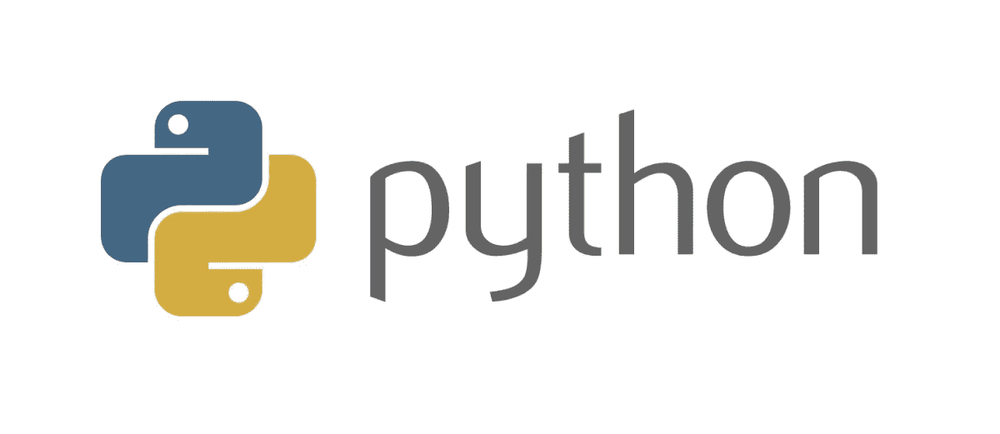
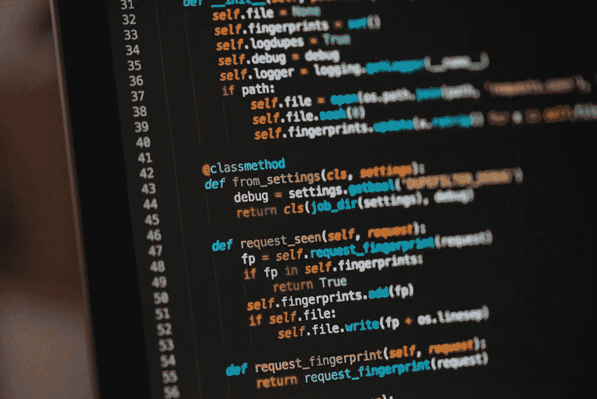

# 面向初学者的 15 门以上最佳 Python 课程[2022 年 7 月]—在线学习 Python

> 原文：<https://medium.com/quick-code/top-tutorials-to-learn-python-programming-200a4283995f?source=collection_archive---------6----------------------->

## 2022 年用最好的 Python 教程学习 Python，产生更清晰更有逻辑的代码

Python 一直被列为就业市场上最受欢迎的编程语言。它在数据科学、机器学习、web 开发、无人驾驶汽车、自动化和许多其他学科中都有应用。基于评级、评论和质量，由专家策划的顶级 Python 教程列表。让我们从以下课程开始学习 Python。下面是从顶级 Python 教程 列表中挑选出来的一些课程，这些教程是由专家们策划的，你应该参加这些课程来深入研究 Python 开发。

# 1.[完整的 Python 训练营:学习 Python 编程和代码](https://click.linksynergy.com/deeplink?id=Fh5UMknfYAU&mid=39197&u1=quickcode&murl=https%3A%2F%2Fwww.udemy.com%2Fcomplete-python-bootcamp%2F)

像专业人士一样学习 Python！从基础开始，一直到创建自己的应用程序和游戏！

在本课程中，您将:

*   学会专业使用 Python，既学 Python 2 又学 Python 3
*   使用 Python 创建游戏，如井字游戏和 21 点游戏
*   了解高级 Python 特性，如集合模块以及如何处理时间戳
*   学习在类中使用面向对象编程
*   理解复杂的话题，比如装修工。
*   了解如何使用 Jupyter 笔记本和创建。py 文件
*   了解如何在 Jupyter 笔记本系统中创建 GUI
*   从头开始构建对 Python 的完整理解

本课程包括小测验、测验、家庭作业以及 3 个主要项目来创建一个 Python 项目组合。它以实用的方式教授 Python 3，每次讲座都有完整的编码截屏和相应的代码笔记本。

本课程涵盖多种主题，包括:命令行基础、安装 python、运行 python 代码、字符串、列表、字典、元组、集合、数字数据类型、打印、格式化函数、范围 args/kwargs、内置函数、调试和错误处理模块、外部模块、面向对象编程、继承、多态性、文件 I/O、高级方法、单元测试。

## 2. [Python 编程:简明介绍](https://coursera.pxf.io/c/1137078/1213622/14726?u=https%3A%2F%2Fwww.coursera.org%2Flearn%2Fpython-programming-introduction&subId1=BotTutorials)

了解如何安装 Python 和使用 Spyder IDE(集成开发环境)编写和调试程序。

在本课程中，您将学习如何:

*   使用方便的 Spyder 开发环境用 Python 编写函数。
*   使用 Spyder 中的编辑器键入一个函数，然后运行它。
*   使用列表、数据类型、库和随机库。
*   构建各种类型的列表以及如何对这些列表进行排序。

将向您介绍使用方便的 Spyder 开发环境用 Python 编写函数。

本课首先介绍如何安装流行的 Python Anaconda 发行版，其中包括 Spyder。接下来展示了如何使用 Spyder 中的编辑器输入函数，然后运行它。

您将学习 Python 主题，如打印语句、算术运算符、输入语句、字符串组合、if 语句、while 循环和 for 循环。

您将学习使用列表、数据类型、库和随机库。到目前为止，只有一种集合数据类型，即列表。好吧，你还需要两个:元组和数据字典。

之后，将向您介绍如何读写文本文件，并给出一些说明性的例子。接下来，您将开始读写逗号分隔值(CSV)文件。

您将看到函数如何返回值。然后，您将看到如何构建各种类型的列表，以及如何对这些列表进行排序。

之后，您将使用统计库学习基本的描述性统计。

最后，您将学习如何在打印语句中使用格式。

# 3. [Python 面向对象编程](https://linkedin-learning.pxf.io/c/1137078/646189/8005?u=https%3A%2F%2Fwww.linkedin.com%2Flearning%2Fpython-object-oriented-programming&subId1=quickcode)

Python 中的面向对象编程(OOP)特性使得构建日益复杂和模块化的程序变得更加容易。

该课程包括:

*   面向对象的 Python
*   继承和构成
*   魔法对象方法
*   数据类别

您可以学习如何应用继承和组合等核心 OOP 原则，以及一些 Python 特有的特性，如“神奇的”方法和数据类，来构建可扩展且高效的程序。

首先复习一些面向对象的基础知识，然后使用 Python 特性(如 magic methods)使您的类与 Python 语言和数据类紧密集成，从而大大减少构建以数据为中心的对象所需的样板代码的数量。

# 4. [Python 编程圣经|网络、图形用户界面、电子邮件、XML、CGI](https://www.eduonix.com/python-programming-bible-networking-gui-email-xml-cgi/UHJvZHVjdC0zMjMyMDA=)

Python 3 是最流行的编程语言之一。像脸书、微软和苹果这样的公司都想要 Python

该课程包括:

*   什么是 Python
*   如何用 Python 语言编程
*   Python 编程语言的特性
*   编码语义学
*   网站编程
*   应用程序设计实践
*   应用程序设计
*   GUI 编程
*   CGI 编程
*   网络编程
*   电子邮件编程
*   XML 编程

了解 Python 应用程序的所有知识以及如何对它们进行编程。一步一步的过程是用来显示和解释这些主题的每一个方面。

## 5.[面向所有人的编程(Python 入门)](https://click.linksynergy.com/deeplink?id=BuGceriufQM&mid=42801&u1=quickcode&murl=https%3A%2F%2Fwww.futurelearn.com%2Fcourses%2Fprogramming-for-everybody-python)

掌握 Python 编程的基础，和密歇根大学一起学习如何使用编程工具和变量。

在本课程中，您将学习如何:

*   描述 Python 编程语言的基础。
*   使用变量来存储、检索和计算信息。
*   安装 Python，编写你的第一个程序。
*   利用核心编程工具，如函数和循环。

你将从完成基本练习开始，这些练习集中在编程的核心概念上。随着您的进步，您将学习如何使用变量来存储、检索和计算信息。

然后，您将安装 Python，编写您的第一个程序，并开始使用核心编程工具，如函数和循环。

学完本课程后，你将具备计算机编程技能，可以独自进一步学习。

# 6.[学习 Python 中的面向对象编程](https://www.educative.io/courses/learn-object-oriented-programming-in-python?affiliate_id=5088579051061248)

通过掌握面向对象编程(OOP ),学习用 Python 编写更简洁、更模块化、更可伸缩的代码。

该课程包括:

*   面向对象编程简介
*   类别和对象
*   信息隐蔽
*   遗产
*   多态性
*   对象关系

您将从面向对象编程的基础开始，逐步学习更高级的概念，如继承、信息隐藏和多态。

在这个过程中，您将了解每个概念如何特别适用于 Python，以及各种 Python 特性如何使它特别适合 OOP。

# 7.[核心 Python:类和面向对象](https://pluralsight.pxf.io/c/1137078/424552/7490?u=https%3A%2F%2Fwww.pluralsight.com%2Fcourses%2Fcore-python-classes-object-orientation&subId1=quickcode)

本课程将加深您对 Python 中面向对象编程的了解，扩展您熟悉的概念，并介绍将拓宽您的 Python 设计调色板的新工具。

该课程包括:

*   类属性、方法和属性
*   对象的字符串表示
*   多重继承和方法解析顺序
*   班级装饰者
*   数据类别

您将学习如何在 Python 中应用面向对象编程(OOP)的基本原则。

首先，您将学习如何区分类和实例，并定义两者的属性。接下来，您将探索使用它们来封装状态的属性。

最后，您将发现如何使用继承和多重继承来组合类，并让这些类以 Python 语言特有的方式协作。

完成本课程后，您将具备开发更大、更健壮的软件系统所需的核心 Python 语言的技能和知识。

## 8.[学习 Python 3](https://www.pjatr.com/t/TUJGR0lLR0JHR0pMSUtCR0ZISk1N?sid=quickcode&url=https%3A%2F%2Fwww.codecademy.com%2Flearn%2Flearn-python-3)

本课程介绍了基本的编程概念和 Python 编程语言。

在本课程中，您将学习如何:

*   在本课中开始学习 Python 语法，然后为家具店创建一个销售点系统。
*   理解 Python 函数的代码重用。
*   为著名的物理公式创建函数。
*   通过包含 if、else 和 elif 语句以及 try 和 except 语句，在 python 代码中构建控制流。
*   理解布尔变量和逻辑运算符。
*   理解列表，Python 中的一种数据结构，用于存储有序的数据组。
*   读循环，写出来解决自己的问题。
*   自动创建、重新排列、重新分配、分解和重组文本块。
*   模块在 Python 编程语言中工作。
*   在代码中创建和使用键值对。
*   以自动化的方式处理文件。
*   通过读写文本、CSV 和 JSON 文件来研究它们的属性。
*   理解 Python 中数据类型之间的差异。
*   创建自己的类、对象和接口。
*   以不同的方式声明、调用函数并与函数交互。

# 9.[Python 大型课程:构建 10 个真实世界的应用](https://click.linksynergy.com/deeplink?id=Fh5UMknfYAU&mid=39197&u1=quickcode&murl=https%3A%2F%2Fwww.udemy.com%2Fthe-python-mega-course%2F)

从基础开始学习 Python，学习如何创建 10 个在现实世界中使用的令人惊叹的专业 Python 程序！

通过本课程，您将:

*   创建 10 个真实世界的 Python 程序(没有井字游戏)
*   在整个课程中，通过额外的实践活动巩固您的技能
*   创建一个翻译英语单词的应用程序
*   创建 web 地图应用程序
*   创建一个作品集网站
*   创建一个桌面应用程序来存储书籍信息
*   创建一个检测物体的网络摄像头视频应用程序
*   创建 web scraper
*   创建数据可视化应用程序
*   创建数据库应用程序
*   创建地理编码 web 应用程序
*   创建网站拦截器
*   发送自动电子邮件
*   分析和可视化数据
*   使用 Python 根据计算机事件安排程序。
*   学习 OOP(面向对象编程)
*   学习 GUI(图形用户界面)

该课程使用现代教学方法，学生在实践中学习 Python 编程。本课程有 24 个部分，包含视频、代码示例、测验、练习、项目和其他额外材料。在前两节中，你将学习 Python 的基础知识，如函数、循环、条件、字符串、列表等。如果你已经知道了基础知识，那么前两节可以作为复习。其他 22 节完全专注于使用 Python 3 构建真实世界的应用程序。

具体来说，您将要构建的 10 个 Python 应用程序是:

一个返回英语单词定义的程序，一个阻止访问令人分心的网站的程序，一个可视化火山和人口的 web 地图，一个组合网站，一个带有数据库后端的桌面图形程序，一个网络摄像头运动检测器，一个房地产数据的 web 刮刀，一个交互式 web 图形，一个数据库 web 应用程序，以及一个将地址转换为坐标的 web 服务。

# 10.[学习 Python 编程大师班](https://click.linksynergy.com/deeplink?id=Fh5UMknfYAU&mid=39197&u1=quickcode&murl=https%3A%2F%2Fwww.udemy.com%2Fpython-the-complete-python-developer-course%2F)

这个 python 初学者课程快速教你 python 语言。包括 python 3 的 python 在线培训。

通过本课程，您将:

*   对 Python 编程语言有基本的了解。
*   拥有 Python 的技能和理解，才能理直气壮地申请 Python 编程的工作。
*   获得进入特定分支(机器学习、数据科学等)的必备 Python 技能..
*   将 Python 面向对象编程(OOP)技能添加到你的简历中。
*   了解如何创建自己的 Python 程序。
*   向有经验的专业软件开发人员学习 Python。
*   既懂 Python 2 又懂 Python 3。

本课程面向从未编程的完全初学者，以及希望通过学习 Python 增加职业选择的现有程序员。

本课程将让你对 Python 编程语言有一个核心的、坚实的理解。它将带您浏览所有必要的 Python 关键字、操作符、语句和表达式，以完全理解您正在编写什么以及为什么编写——使编程更容易掌握，更少令人沮丧。

完成关于面向对象编程和 Python 的许多其他方面的章节，包括 tKInter(用于构建 GUI 界面)和在 Python 中使用数据库。尽管这主要是一门 Python 3 课程，但 Python 开发者需要不时地使用 Python 2 项目。

# 11.[用 Python 编程自动化枯燥的东西](https://click.linksynergy.com/deeplink?id=Fh5UMknfYAU&mid=39197&u1=quickcode&murl=https%3A%2F%2Fwww.udemy.com%2Fautomate%2F)

这是一门实用的编程课程，面向希望提高工作效率的办公人员、学者和管理人员。

在本课程中，您将学习如何:

*   通过编写简单的 Python 程序在他们的计算机上自动完成任务。
*   用“正则表达式”写可以做文本模式识别的程序。
*   以编程方式生成和更新 Excel 电子表格。
*   解析 pdf 和 Word 文档。
*   抓取网站并从网上获取信息。
*   编写发送电子邮件通知的程序。
*   使用 Python 的调试工具快速找出代码中的错误。
*   以编程方式控制鼠标和键盘为您点击和键入。

你不需要知道排序算法或面向对象的编程，所以本课程跳过了所有的计算机科学，专注于编写完成任务的代码。您将学习基本概念以及网页抓取、解析 pdf 和 excel 电子表格、自动化键盘和鼠标、发送电子邮件和文本。

# 12.[Python 圣经](https://click.linksynergy.com/deeplink?id=Fh5UMknfYAU&mid=39197&u1=quickcode&murl=https%3A%2F%2Fwww.udemy.com%2Fthe-python-bible%2F)

通过世界上最有趣的基于项目的 python 课程，构建 11 个项目，从 python 初学者到专业人员！

通过本课程，您将能够:

*   通过构建自定义 python 函数来自动化编码任务
*   了解面向对象编程(OOP)
*   使用变量跟踪 Python 程序中的数据
*   使用 numbers 创建“幕后”功能
*   使用字符串创建定制的、引人入胜的用户体验
*   创建能使用逻辑和数据结构思考的程序
*   使用循环来提高效率，节省时间，最大限度地提高生产力

本课程将向您介绍变量——学习在 python 程序中方便地存储数据，数字——了解数字在 python 程序中的幕后工作方式，字符串——掌握 python 文本并使用字符串、逻辑和数据结构自动处理消息——教您的程序思考和决策，循环——通过让计算机为您完成繁重的工作来节省时间和精力，函数——通过构建您自己的可以反复使用的 Python 函数来自动处理任务。

# 13.[用 Python 编码(现代 Python 3 Bootcamp)](https://click.linksynergy.com/deeplink?id=Fh5UMknfYAU&mid=39197&u1=quickcode&murl=https%3A%2F%2Fwww.udemy.com%2Fthe-modern-python3-bootcamp%2F)

独特的交互式 Python 体验，包含近 200 个练习和测验

在本课程中，您将:

*   学习 Python 中的所有编码基础知识
*   完成近 200 个练习和测验
*   了解 Python 3.6 中的所有最新功能
*   使用 Python 创建自动化网络爬虫和抓取器
*   使用 Python 向 API 发出复杂的 HTTP 请求
*   掌握 Python 风格和惯例的特点
*   理解 Python 中的面向对象编程
*   用 Python 学习测试和 TDD(测试驱动开发)
*   编写你自己的装饰器和高阶函数
*   编写自己的生成器和其他迭代器
*   自信地与 lambdas 一起工作
*   掌握复杂的主题，如多重继承和多态性
*   用 Python 构建游戏
*   构建跨越多个文件的大型项目
*   使用所有 Python 数据结构:列表、字典、集合、元组
*   成为理解列表和词典的专家
*   掌握内置 python 函数，如 zip 和 filter
*   处理错误和调试代码
*   编写您自己的定制模块
*   处理文件，包括 CSV

本课程完全围绕编码练习展开。本课程涵盖了 Python 语言的所有最新补充和变化。该课程还非常强调像 Python 开发者一样思考，并以“Python”方式编写代码。它还涵盖了更高级的主题，如 web 抓取、爬行和测试等。

# 14. [Python 初学者用示例](https://click.linksynergy.com/deeplink?id=Fh5UMknfYAU&mid=39197&u1=quickcode&murl=https%3A%2F%2Fwww.udemy.com%2Fardit-sulce-python-for-beginners%2F)

一个直截了当的 Python 课程，让你快速开始编写 Python 代码和创建 Python 程序。

在本课程中，您将:

*   获得独立编写真实世界非复杂程序的技能。
*   了解如何快速设置 Python 环境及其相关库
*   学习执行各种批处理操作
*   编写集成了语言基本块的小 Python 程序
*   编写一个完整的 Python 程序，接受用户输入，处理并输出结果
*   使用 Python Tkinter 库为您的 Python 程序创建图形用户界面
*   创建一个最终的可执行文件，作为一个独立的程序在 Windows 和 Mac 上运行
*   能够在 Python 中加载和使用 CSV 和 TXT 文件中的数据
*   将数据从 CSV 文件映射到谷歌地球 KML 文件。

它首先介绍 Python 基础知识，然后教您如何使用这些代码来构建一些真实的示例程序。您将从零开始，学习所有 Python 基础知识，并慢慢进入更高级的 Python 第三方库。您将实际构建一个真正的 Python 程序，它有一个用 Python 构建的图形用户界面(GUI)。

您还将学习如何将该程序转换为可执行文件，作为独立程序在 Windows 和 Mac 上运行，这样您就可以将您的程序提供给任何人。课程内容由视频讲座、测验、练习和讨论组成。

# 15. [30 天的巨蟒](https://click.linksynergy.com/deeplink?id=Fh5UMknfYAU&mid=39197&u1=quickcode&murl=https%3A%2F%2Fwww.udemy.com%2F30-days-of-python%2F)

Python 对于初学者来说足够简单，对于专业人士来说足够强大。将其用于 IOT、网络抓取、大数据等。

在本课程中，您将:

*   了解 Python 的基础知识
*   使用 Python 构建应用程序
*   使用 Python 发送电子邮件
*   用 Python 刮网站拉数据
*   用 Python 抓取动态加载(javascript 加载)的网站
*   使用 Python 阅读和解析电子邮件
*   读/写 CSV(逗号分隔值)文件以在 Excel/Numbers 中工作
*   使用 twitter API 通过几行代码轻松发送推文
*   使用 yelp API 获取他们网站上所有企业的数据

本课程的目标是让你通过一步一步地构建真实的项目来学习 Python，同时解释过程中的每个概念。

# 16.[完整的 Python 3 课程:从初级到高级！](https://click.linksynergy.com/deeplink?id=Fh5UMknfYAU&mid=39197&u1=quickcode&murl=https%3A%2F%2Fwww.udemy.com%2Fpython-complete%2F)

通过涵盖游戏和网页开发、网页抓取、MongoDB、Django、PyQt 和数据可视化的项目学习 Python！

本课程将教您如何:

*   安装 Python
*   设置 IDE
*   使用编程基础建立一个计算器
*   使用高级 Python 概念编写 RPG 代码
*   寻找更多的包来扩展 Python 的功能
*   安装基本模块
*   为网页抓取编写应用程序
*   使用 PyMongo 创建一个 NoSQL 数据库
*   使用 Web.py 创建 web 应用程序
*   Django web 服务器设置
*   实时故障排除

学习 Python，因为本课程将带您了解编程基础、高级 Python 概念、编写计算器代码、基本模块、创建“最终幻想式”RPG 战斗脚本、web 抓取、PyMongo、WebPy 开发、Django web 框架、GUI 编程、数据可视化和机器学习。

# 17.[完整的 Python 3 教程:从初级到高级！](https://click.linksynergy.com/deeplink?id=Fh5UMknfYAU&mid=39197&u1=quickcode&murl=https%3A%2F%2Fwww.udemy.com%2Flearn-python-3-from-beginner-to-advanced%2F)

学习如何用 Python 编程的完整指南。通过编码练习，从 Python 初学者到高级水平！

通过本课程，您将:

*   通过学习面向对象编程的所有基础知识，从初级到高级学习 python 编程。
*   获得关于 Python 编程语言的一般知识
*   为一般生产任务编写脚本
*   阅读和理解 Python 代码
*   获得关于一般编程概念的知识

课程的每一部分都与前一部分联系起来，利用已经学过的知识，每个主题都有大量的例子，在学习过程中会有帮助。

> 感谢您阅读本文。我们策划了更多主题的顶级教程，您可能想看看:

 [## 15+最佳 Django 初学者教程——在线学习 Django

### 用 2021 年的最佳 Django 初学者教程学习 Django 进行 web 开发

medium.com](/quick-code/top-tutorials-to-learn-django-framework-for-python-beginners-fe1a9e315aa9)  [## 10+初学者最佳 Flask Python 教程—在线学习 Flask

### 用 2021 年初学者的最佳 Flask 教程学习 Flask for web 开发

medium.com](/quick-code/top-online-tutorials-to-learn-flask-python-c2723df5326c)  [## 10+适合初学者的最佳 Python 教程—在线学习 Python

### 2021 年，通过最佳 Python 初学者教程，学习 Python，更轻松地进行 web 开发

medium.com](/quick-code/top-free-online-courses-to-learn-python-dcd22b03db62) 

*原载于*

*披露:我们与本文中提到的一些资源有关联。如果你通过本页的链接购买课程，我们可能会得到一小笔佣金。谢谢你。*