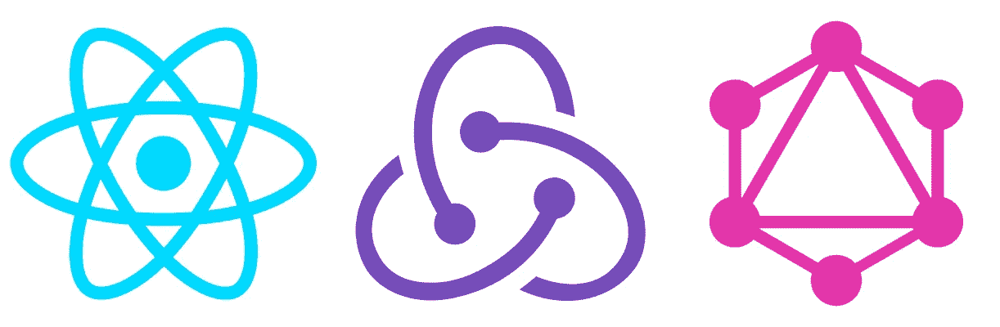
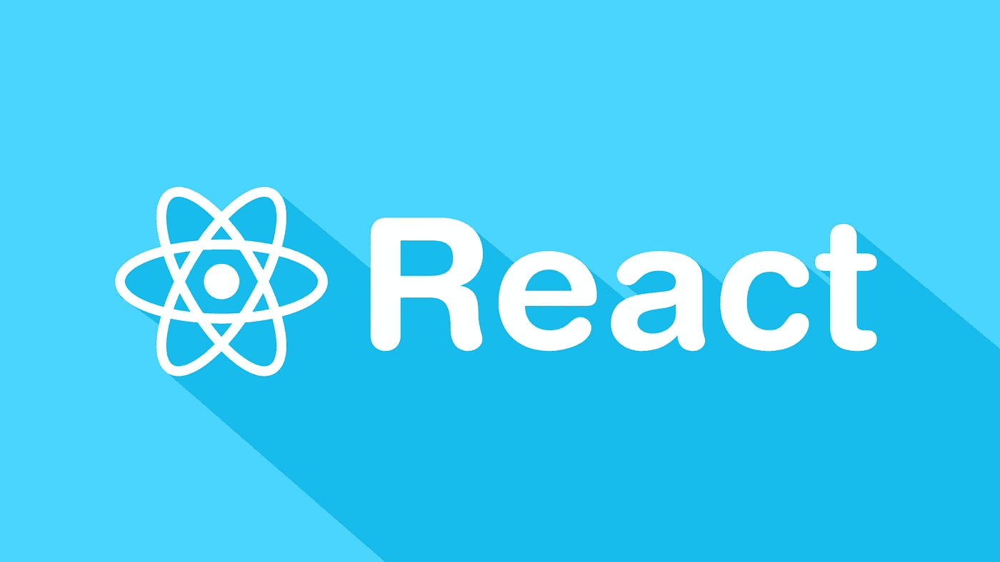

# 15+初学者最佳 React Js 教程[2023 年 3 月]—在线学习 React Js

> 原文：<https://medium.com/quick-code/top-tutorials-to-learn-react-development-online-ca95164d9617?source=collection_archive---------2----------------------->

## 学习 React Js，用 2023 年最好的 React Js 初学者教程创建快速 web 应用。

JavaScript 是现代 web 应用程序的主要驱动力，因为它是唯一一种在浏览器中运行的编程语言，因此允许您提供高度反应性的应用程序。你将能够在网络上获得类似移动应用的用户体验。但是使用 JavaScript 可能具有挑战性——只用普通的 JavaScript 和 jQuery 创建一个好的 web 应用程序很快变得势不可挡。对救援做出反应。React 是脸书的一个库，用来创建快速、模块化的 web 应用程序，所有的事情都可以通过 Javascript 来完成。

**React 是关于组件的**——基本上是定制的 HTML 元素——用它你可以快速构建令人惊叹的强大的网络应用。只需构建一次组件，根据您的需求进行配置，动态地向其中传递数据，并根据需要经常重用它。

# 1.[现代 React with Redux【2019 更新】](https://www.udemy.com/react-redux/?ranMID=39197&ranEAID=Fh5UMknfYAU&ranSiteID=Fh5UMknfYAU-17fNWx_.ojyLhL5R7nkTEg&LSNPUBID=Fh5UMknfYAU)

掌握 React v16.6.3 和 Redux 用 React 路由器、Webpack、Create-React-App。包括钩子！

在本课程中，您将学习:

*   使用 React JS 和 Redux 构建令人惊叹的单页面应用程序
*   掌握构造 Redux 应用程序背后的基本概念
*   实现构建可组合组件的能力
*   做一个工程师，向其他人解释 Redux 是如何工作的，因为你非常了解基本原理
*   熟练掌握支持 React 的工具链，包括 NPM、Webpack、Babel 和 ES6/ES2015 Javascript 语法

本课程以数百个视频和几十个自定义图表为特色，帮助您理解 React 和 Redux 是如何工作的。本课程包含的每个主题都是逐步增加的，以确保您有坚实的知识基础。

本课程涵盖主题包括:

*   掌握 React 的基本功能，包括 JSX、状态和道具
*   从头开始，理解如何构建可重用的组件
*   深入 Redux 的源代码，了解它在幕后是如何工作的
*   通过大量的编码练习测试您的知识并磨练您的技能
*   集成 React 与先进的浏览器功能，甚至地理定位 API 的！
*   使用流行的样式库来构建漂亮的应用程序
*   掌握不同的部署技术，这样您就可以展示您构建的应用程序了！
*   通过组件的组合，了解构建 UI 的不同方法

## 2.[使用 React 进行前端 Web 开发](https://coursera.pxf.io/c/1137078/1213622/14726?u=https%3A%2F%2Fwww.coursera.org%2Flearn%2Ffront-end-react&subId1=BotTutorials)

本课程探索基于 Javascript 的前端应用程序开发，特别是 React 库(目前版本。16.3).本课程将使用 JavaScript ES6 开发 React 应用程序。将向您介绍 React 组件的各个方面。您将了解 React router 及其在开发单页面应用程序中的用途。

在本课程中，您将:

*   熟悉客户端 Javascript 应用程序开发和 React 库
*   在 React 中实现单页面应用程序
*   使用各种 React 功能，包括组件和表单
*   使用 React 实现功能性前端 web 应用程序
*   使用 Reactstrap 设计响应式 React 应用程序
*   使用 Redux 设计 React-Redux 应用程序的架构

您还将学习如何设计受控表单。将向您介绍 Flux 架构和 Redux。您将探索 Redux 的各个方面，并使用它来开发 React-Redux 支持的应用程序。然后，您将学习使用 Fetch 进行客户端-服务器通信，以及在服务器端使用 REST API。快速浏览 React 动画支持和测试是本课程的圆满结束。

# 3. [React.js 基础训练](https://linkedin-learning.pxf.io/c/1137078/646189/8005?u=https%3A%2F%2Fwww.linkedin.com%2Flearning%2Freact-js-essential-training-3&subId1=quickcode)

在所有其他 JavaScript 库中，React.js 脱颖而出。它依赖于可重用的组件而不是模板进行 UI 开发，允许开发人员呈现数据随时间变化的视图。

在本课程中，您将了解:

*   React 库的基础使用最现代的语法和最佳实践来创建 React 组件。
*   如何设置 React 的 Chrome 工具？
*   创建新组件。
*   使用 props 和 state 在组件之间传递数据。

React 应用程序更具可伸缩性和可维护性，使开发人员更高效，用户更满意。在本课程中，将向您介绍 React 库的基础知识，使用最现代的语法和最佳实践来创建 React 组件。

一路上，你将学习如何为 React 设置 Chrome 工具；创建新组件；使用 props 和 state 在组件之间传递数据。

本课程结束时，您将了解 React.js 的要点，并能够开始构建自己的基于浏览器的项目。

# 4.[用 React 和 Redux 构建应用](https://pluralsight.pxf.io/xoZDO)

了解如何使用 Redux、React 路由器和现代 JavaScript，通过 React 构建一个应用程序。使用 Webpack、Babel、ESLint、Jest、React 测试库、Enzyme 等构建自定义的 React 开发环境，从头开始构建流程。

在本课程中，还将分享 Redux 为何变得如此受欢迎。然后，你就搭建了一个牛逼的开发环境。您将继续探索创建 React 组件的许多方法。然后，您将构建我们的初始应用程序结构，并设置 React 路由器，以便有一个有用的应用程序来工作。在奠定了这个基础之后，您就可以在剩下的课程中详细探索 Redux 了。您将从头开始构建一个课程管理应用程序，以便我们可以通过示例学习 Redux。

# 5.[绝对新手反应](https://www.eduonix.com/affiliates/id/160-10656-0-QC15)

本课程剥离了 React 中令人恐惧的复杂的点点滴滴，并将其简化，使其更容易理解。从 React 及其核心组件的基本定义开始。从这里你可以分解 React 的重要方面，比如 JSX、循环、ES、错误修复、状态、道具、库、动作、Redux 等等。

该课程采用互动的方式，这意味着没有枯燥的理论讲座。你应该和老师一起研究代码片段和不同的例子。本教程还附有测验和例子，这样你可以对这个主题有更透彻的理解。

在本课程结束时，您将对 React 及其组件(如 JSX、Redux 等)有更深入的了解。您还将能够将 React 与您自己的工作项目实际集成。

您将了解到:

*   React 及其核心组件的完整介绍。
*   JSX 简介
*   学习构建您的第一个组件
*   事件循环和错误修复
*   查看状态和属性，包括如何在组件内部或组件之间传递数据
*   数据、库和 API 简介
*   其他重要概念如 Redux、Actions、Reducers 等。

# 6.[路学反应过来](https://www.educative.io/collection/5740745361195008/5676830073815040?affiliate_id=5088579051061248)

本课程将所有固执己见的路线图编织成一个路线图，以掌握 React。它为您提供了成为一名成功的 React 开发人员所需的所有基础知识。您将通过构建一个黑客新闻应用程序来获得实践经验。之后，您将准备构建自己的应用程序。

## 7.[学习 React.js:第一部分](https://www.pjatr.com/t/TUJGR0lLR0JHR0pMSUtCR0ZISk1N?sid=quickcode&url=https%3A%2F%2Fwww.codecademy.com%2Flearn%2Freact-101)

ReactJS 为前端编程的一些最顽固的问题提供了优雅的解决方案。

在本课程中，您将学习如何:

*   使用 React.js 的基本语法 JSX
*   制作 React 组件，所有 React.js 应用程序的构建块。
*   使反应组分相互作用。

您将对 React 最基本的概念有深刻的理解:JSX、组件以及通过道具和状态存储信息。

您将能够在 React 的模块化编程风格中结合这些思想。

## 8.[学习 React.js:第二部分](https://www.pjatr.com/t/TUJGR0lLR0JHR0pMSUtCR0ZISk1N?sid=quickcode&url=https%3A%2F%2Fwww.codecademy.com%2Flearn%2Freact-102)

ReactJS 为一些前端编程最持久的问题提供了优雅的解决方案。

在本课程中，您将学习:

*   混合有状态和无状态组件的 React 编程模式。
*   剩下的最基本的反应原理。
*   将行动与组件生命周期中的特定时刻挂钩。

您将掌握任何 React.js 程序员都应该知道的更重要的工具，包括生命周期方法、proptypes、基本样式和无状态功能组件。

还将向您介绍 React.js 编程模式，并学习在本地计算机上设置 React。

# 9.[成为 React 开发者](https://imp.i115008.net/c/1137078/788805/11298?u=https%3A%2F%2Fwww.udacity.com%2Fcourse%2Freact-nanodegree--nd019&subId1=quickcode)

React 正在彻底改变前端开发。通过 Udacity 掌握这个来自脸书的强大 UI 库。

在本课程中，您将学习如何:

*   编写声明性的、可组合的用户界面来构建生产就绪的应用程序。
*   借助 Redux 管理复杂状态，构建企业级应用。
*   开发可以在 iOS 和 Android 设备上运行的 React 应用程序。

您将了解如何使用 React 为 web 构建声明式用户界面，以及如何使用 React Native 为 iOS 和 Android 构建声明式用户界面。

您还将学习如何使用 Redux 在您的应用程序中更可预测地管理状态。

# 10. [React JS Web 开发—基础训练营](https://www.udemy.com/react-js-and-redux-mastering-web-apps/?ranMID=39197&ranEAID=Fh5UMknfYAU&ranSiteID=Fh5UMknfYAU-KO..ys.cJVhDP43A2xS5FQ&LSNPUBID=Fh5UMknfYAU)

这个基于项目的课程会让你马上学会编码。在本课程中构建四个经过深思熟虑的示例应用程序将提高你在现代 web 开发中的技能。创建您一直想要的 React JS & Redux 应用程序。构建 4 个项目，发现开发窍门，掌握 React。

首先，通过构建两个应用程序来学习 React JS 的原理。一篇介绍 ES6/Babel，另一篇介绍如何使用 API 在 React 中处理 HTTP Web 请求。使用第三个应用程序，学习如何操作浏览器 cookie**。**最后，您将创建一个完整的应用程序，该应用程序具有完整的身份验证和实时数据库。还有，学习 Redux 的工程。你会发现 Redux 可以归结为三个简单的步骤。

# 11.[完整的 React Web 开发人员课程(带 Redux)](https://www.udemy.com/react-2nd-edition/?ranMID=39197&ranEAID=Fh5UMknfYAU&ranSiteID=Fh5UMknfYAU-r_AV6BZnUZnxkQbHlXiNjw&LSNPUBID=Fh5UMknfYAU)

了解如何使用 React v16、Redux、Webpack、React-Router v4 等构建和启动 React web 应用程序！

完整的 React web 开发人员课程 2 从基础知识开始，涵盖了构建和启动 React Web 应用程序所需的一切。您将看到构建和启动 React 应用程序需要做什么，从第一行代码到最终的生产部署。本课程围绕一个目标设计:将您变成一名能够开发、测试和部署真实生产应用程序的专业 React 开发人员。

在本课程中，您将学习:

*   构建、测试和启动 React 应用
*   使用尖端的 ES6/ES7 JavaScript
*   设置身份验证和用户帐户
*   将 React 应用实时部署到网络上
*   了解最新的 React 库和工具
*   Master React、Redux、React-Router 等等

在整个课程中，您将构建两个 React web 应用程序:

1.  第一个 app，一个叫优柔寡断应用的决策类 app。您将学习 React 的基础知识，同时了解如何让 React 应用程序正常运行。
2.  第二个 app，一个叫预算的费用管理器。它拥有你期望从真实应用程序中得到的所有特性。您将设置身份验证、用户帐户、路由、测试、表单验证、数据库存储等等。

# 12.[从地上反应过来](https://click.linksynergy.com/deeplink?id=Fh5UMknfYAU&mid=39197&u1=quickcode&murl=https%3A%2F%2Fwww.udemy.com%2Freactjs-from-the-ground-up%2F)

学习 React JS——本课程涵盖了在新项目和现有项目中使用 React JS 所需的所有内容。本教程将带您了解掌握使用 ReactJS 进行 web 开发所需的一切。

本课程将涵盖 ReactJS、ES6、Webpack、Redux，并构建一些精彩的项目来演示如何在现代 web 开发中使用 ReactJS。

对 React JS 有了很好的理解，你就能构建出色的、构建良好的个人和专业项目。这也会让你成为雇主的热门人选，在雇主那里，了解和理解反应会让你领先于其他人。

在整个课程中，您将使用 React 构建迷你项目，然后继续构建口袋妖怪仪表板应用程序，将您新发现的 React 技能付诸实践。然后，您将构建一个应用程序，该应用程序将教您 Redux 背后的所有原则，以及您如何自信而轻松地使用 React with Redux 来构建应用程序。

# 13.[完成 React JS web developer 与 ES6 —构建 10 个项目](https://click.linksynergy.com/deeplink?id=Fh5UMknfYAU&mid=39197&u1=quickcode&murl=https%3A%2F%2Fwww.udemy.com%2Fcomplete-react-js-course%2F)

主 react JS，ES6，firebase，Auth0。连同 reactjs 的基础知识，创建 10 个项目。这门课程非常适合对 HTML、CSS 和 Javascript 知之甚少的人。我们并不是说你需要精通 javascript，但是像循环和函数这样的小概念你应该很熟悉。如果你知道 ES6 那太好了，如果不知道，不用担心，ES6 也在本课程中涉及。

此外，如果你想进入 react-native 应用程序开发，react js 也是一个不错的选择。一旦你熟悉了像 JSX、道具和状态这样的概念；相同的概念也适用于 react native。搬进 react-native 只是小菜一碟。

*   项目 1 —手动创建 react 应用程序。
*   项目 2——将一个简单的博客转换成 react 组件
*   项目 3 —计时器应用程序
*   项目 4 —单页应用程序中的购物车
*   项目 5——利用 Firebase 数据库
*   项目 6 — Firebase 登录设置
*   项目 7——Google 用 Firebase 登录
*   项目 8 —使用 axios 的 Reddit API
*   项目 9 — Auth0 登录系统
*   项目 10 — Github API，带有获取和认证登录系统

# 14. [React 16+ —完整指南(包括 React 路由器 4 & Redux)](https://www.eduonix.com/affiliates/id/160-10587-0-QC15)

本课程将从最基础的开始，解释 React 到底是什么，以及如何使用它(以及用于哪种应用)。它会一路从基础到高级。它不会仅仅触及表面，而是深入 React 以及像 react-router 和 Redux 这样的流行库。课程结束时，您可以构建令人惊叹的 React(单页)应用程序！

在本课程中，您将学习:

*   “什么”、“为什么”和“如何”
*   React 基础知识(基本功能、语法和概念)
*   如何输出列表和条件内容
*   React 组件的样式
*   如何从 React 应用程序中访问 Http 内容(AJAX)
*   Redux，Redux，Redux…从基础到高级！
*   React 应用程序中的表单和表单验证
*   证明
*   单元测试简介
*   Next.js 简介
*   React 应用程序部署说明

## 15.【React 专业化的全栈 Web 开发

构建完整的 Web 和混合移动解决方案。四门综合课精通前端 web、混合移动 app、服务器端开发。

本专业的前两门课程涵盖前端框架:Bootstrap 4 和 React。您还将学习使用 React Native 创建混合移动应用程序。

在服务器端，您将学习使用 MongoDB 实现 NoSQL 数据库，在 Node.js 环境和 Express 框架内工作，并通过 RESTful API 与客户端通信。理想情况下，学习者应该按照指定的顺序完成课程。

# 16. [React —完整指南(包括 React 路由器、Redux)](https://click.linksynergy.com/deeplink?id=Fh5UMknfYAU&mid=39197&u1=quickcode&murl=https%3A%2F%2Fwww.udemy.com%2Freact-the-complete-guide-incl-redux%2F)

一头扎进去，从头开始学习 React。学习 Reactjs、Redux、React Routing、动画、Next.js 基础知识等等。

学习反应或深入研究。学习理论，解决作业，在演示项目中实践，并构建一个在整个课程中不断改进的大型应用程序:汉堡生成器。

本课程将从最基础的开始，解释 React 到底是什么，以及如何使用它(以及用于哪种应用)。此后，你将一路从基础到高级。您将不会只触及表面，而是深入 React 以及像 react-router 和 Redux 这样的流行库。课程结束时，您可以构建令人惊叹的 React(单页)应用程序！

> 感谢您阅读本文。我们策划了更多主题的顶级教程，您可能想看看:

 [## 8 个最适合初学者的 React Native 教程——在线学习 React Native

### 通过 2021 年面向初学者的最佳 React Native 教程，了解面向 Android 和 iOS 移动应用开发的 React Native

medium.com](/quick-code/top-tutorials-to-learn-react-native-90867a836c3e)  [## 10+最佳 Vue JS 初学者教程—在线学习 Vue JS

### 学习 VueJS 开始学习前端应用程序开发，最好的 VueJS 初学者教程在…

medium.com](/quick-code/top-tutorials-to-learn-vue-js-for-beginners-6c693e41091d)  [## 10+最佳 ECMAScript 初学者教程—在线学习 ES6

### 通过 2021 年面向初学者的最佳 ECMAScript 教程，在万维网上学习用于客户端脚本的 ES6

medium.com](/quick-code/the-best-tutorials-to-learn-ecmascript-es6-for-beginners-55fe602382cd) 

披露:我们与本文中提到的一些资源有关联。如果你通过本页的链接购买课程，我们可能会得到一小笔佣金。谢谢你。