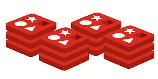

# 8 个最佳 Redis 初学者教程[2023 年 3 月]——在线学习 Redis

> 原文：<https://medium.com/quick-code/top-tutorials-to-learn-redis-for-beginners-b06c55639e43?source=collection_archive---------0----------------------->

## 用 2023 年最好的 Redis 初学者教程学习数据库管理的 Redis。

数据库是应用程序的一个重要方面，通常只是事后才被考虑。然而，对于许多开发人员来说，在构建应用程序时决定使用哪个数据库是一个关键的决定。

在许多流行的数据结构中，如 MySQL、MongoDB 和 Oracle，Redis 在 NoSQL 数据库中逐渐流行起来。虽然 Redis 已经为包括 Twitter 和 Github 在内的许多公司发挥了支持作用，但它现在正作为一个主要的数据库获得牵引力。

Redis 是一个开源的数据结构服务器，它允许开发人员使用键值存储方法来组织数据。这个强大的数据库非常适合高速缓存等高性能工作。Redis 是一个简单快速的数据库，具有许多不同的功能，包括缓存或消息代理。

## 1.[从零开始学习 Redis】](https://coursesity.com/r/site/learn-redis-from-scratch-for-high-performance-key-value-storage)

学习和使用 Redis 数据结构存储的综合指南。

这个 Redis 教程是你从 Redis 新手进步到高级用户的最好地方。从对 Redis 一无所知到能够使用这个强大的数据库创建一个应用程序。

这个 Redis 课程是专门为从未使用过 Redis 的初学者设计的。你将学到你需要知道的关于 Redis 的一切，包括什么是 Redis，这个数据库最好用来做什么，如何在你的系统上安装 Redis 等等。

您将了解 Redis 的所有基本知识，比如不同的数据结构、使用 Redis 的各种客户机、不同的键-值对命令(scan、config、commands 和 client)、如何将数据持久化到磁盘，甚至持久化数据的不同方法。

在您学习了基础知识之后，您将与讲师一起构建一个功能性的工作任务管理器，讲师将在一个真实的例子中教授如何实际使用 Redis。您将使用 NodeJS 和 Redis 构建一个任务管理器。您还将学习如何整合 Twitter Bootstrap 来设计管理器。

## 2.[学习 Redis](https://linkedin-learning.pxf.io/c/1137078/646189/8005?u=https%3A%2F%2Fwww.linkedin.com%2Flearning%2Flearning-redis&subId1=quickcode)

Redis 是内存中的数据结构存储，不同于 MySQL 等关系数据库和 MongoDB 等 NoSQL 数据库。

在本课程中，您将学习:

*   Redis 是什么，它是如何工作的。
*   如何使用 ioredis 客户机和 Node.js 服务器构建客户机实现。

本课程解释了如何安装和设置 Redis，并涵盖了基本的 Redis 工具和概念，包括持久性和复制。

此外，它还回顾了不同的可用数据类型，并演示了如何使用字符串、散列和列表。最后，本课程将介绍保护 Redis 实例的安全选项和最佳实践。

## 3.[面向开发者的 Redis】](https://www.eduonix.com/redis-for-developers/UHJvZHVjdC0zMjMyMDA=)

Redis 是一种开源的内存数据结构存储，通常用作数据库、缓存和消息代理。

该课程包括:

*   简介和设置
*   从数据类型开始
*   PHP 客户端和更多数据类型
*   Python 客户端和高级数据类型
*   强大的功能
*   各种命令

在 Redis 课程中，您将深入了解 Redis，确切地学习如何开始使用这个出色的数据库。

本教程将从数据类型和命令开始，并充满了大量的例子。

您还将通过将 Redis 与 PHP 和 Python 客户机集成来学习，这将向您展示在两种流行的语言中使用 Redis 作为抽象适配器是多么容易。

## 4.【Redis 入门

这是一本让您开始使用 Redis 并介绍集群、安全性和 sentinel 等中级主题的指南。

Redis 是一个强大的 NoSQL 数据库，它正迅速成为 NoSQL 数据库中使用最多、最受欢迎的选项之一。Redis 提供了一个易于使用的界面、丰富的文档和大量的客户端来集成到您的应用程序中。

Redis 入门提供了 Redis 的基本主题、Redis 的安装，还提供了一个演示，演示了如何创建 Redis 集群并使您的 Redis 配置高度可用。

无论您是应用程序开发的新手还是经验丰富的专业人员，数据库几乎总是必不可少的。Redis 入门将展示为什么 Redis 非常适合这项任务。

在本课程结束时，您将了解 Redis 的基础知识，并对中级 Redis 概念有所介绍，如 Redis 安全、Redis 集群和 Redis Sentinel。

## 5.[面向大数据的全 NoSQL(h base+Cassandra+MongoDB+Redis)](https://click.linksynergy.com/deeplink?id=Fh5UMknfYAU&mid=39197&u1=quickcode&murl=https%3A%2F%2Fwww.udemy.com%2Flearn-complete-nosql-dbs-hbasecassandramongodbredis%2F)

了解大数据测试和开发的完整 NoSQL 数据库(HBase + Cassandra + MongoDB + Redis)。

本课程专为所有 profile 学生设计，即希望将其职业生涯发展到现实世界中的大数据领域的开发人员和测试人员。本课程旨在让学员能够开始使用所有 NoSQL 数据库，即 HBASE、卡珊德拉、MONGODB、REDIS 等完整的大数据。所有在大数据领域工作或寻找职业生涯并希望进入测试领域的用户都应该参加本课程，并仔细阅读包含初学者进阶知识的完整教程。

它将在完整的查询/命令中提供用于开发和测试 NoSQL 数据库应用程序的不同命令和查询的详细信息，测试人员需要这些信息才能进入更大的领域，即大数据生态系统环境。

本课程结构合理，包含不同 NoSQL 数据库的所有元素，即完整大数据中的 HBASE +卡珊德拉+ MONGODB + REDIS，并通过不同主题以实用方式提供高级命令。希望从头开始学习完整大数据中的端到端 NoSQL 数据库的学生应该学习本课程。

## 6.[使用 Redis、Express 和 Socket 的 Web 应用程序开发](https://click.linksynergy.com/deeplink?id=Fh5UMknfYAU&mid=39197&u1=quickcode&murl=https%3A%2F%2Fwww.udemy.com%2Fweb-application-development-using-redis-express-and-socket%2F)

使用 Node.js 的强大框架开始构建健壮、动态、实时的应用程序

这是 Packt 的视频学习途径之一，它是一系列单独的视频产品，以逻辑和逐步的方式放在一起，这样每个视频都建立在之前视频中学习的技能之上。

在这条学习路径中，您将看到如何使用 SocketIO、Express 和 Redis 在网站上实现实时应用程序。

SocketIO 因其强大的实时引擎而被用于创建许多实时聊天和博客应用程序。是的，插座。IO 具有最快和最可靠的实时引擎之一。这使得它对于实时分析、即时消息以及浏览器和 web 应用程序之间的双向通信来说几乎是完美的。Redis 通过使数据更快、更容易获取打开了大门。最后，Express 通过简化全功能 web 应用程序来提供帮助。这三者的强大组合将为您带来令人惊叹的应用程序体验，您将能够立即创建快速、可伸缩、动态的实时应用程序。

从本质上来说，这个学习路径是一个关于集成 Redis 和 NodeJS 以及使用 Node.js 和 SocketIO 创建一个实时站点的实践指南。

学习结束时，您将成为一名合格的 SocketIO 开发人员，能够创建快速、可伸缩的动态实时应用程序。

## 7.[完成数据库课程 2018:1 期 6 门课程](https://click.linksynergy.com/deeplink?id=Fh5UMknfYAU&mid=39197&u1=quickcode&murl=https%3A%2F%2Fwww.udemy.com%2Fdatabase-course%2F)

通过实际例子和练习，成为 RDBMS 和 NoSQL 数据库的专家。MySQL、MongoDB、Redis 等等。

完成本课程后，您将能够使用 RDBMS 数据库和 NoSQL 数据库读写基本和复杂的查询。本课程让你对世界上最流行的 RDBMS 数据库(如 MySQL)和 NoSQL 数据库(如 MongoDB、Redis 等)有实际操作和实践经验。这种技能也适用于任何其他 RDMBS 数据库(如 Oracle、MS SQL Server、SQLite 等)和 NoSQL 数据库(CouchDB、Amazon Dynamo DB 等)。

学习 SQL 和 NoSQL 是提升你职业生涯的最快方法之一。希望本课程能对你未来的职业生涯有所帮助。请挖掘免费预览视频了解更多信息。

## 8.[两个流行工具——轻松学会与 Redis 合作，流浪者](https://click.linksynergy.com/deeplink?id=Fh5UMknfYAU&mid=39197&u1=quickcode&murl=https%3A%2F%2Fwww.udemy.com%2Feasy-in-demand-developer-tools-for-job-set1-redis-vagrant%2F)——【免费课程】

Redis，流浪者——在一门课程中学习两个主题。Redis、vagger 是企业和开发者中最受欢迎的工具。

Redis 在企业中实现了 350%的破纪录增长。它正在取代并将取代大多数传统的数据库、发布-订阅系统、文档存储，这主要是由于它作为内存数据库的闪电般速度。

这门课程是为初学者设计的。课程结束后，你将能够自信而清晰地与 Redis 和 vagger 一起工作。

> 感谢您阅读本文。我们策划了更多主题的顶级教程，您可能想看看:

 [## 10 个最好的 PostgreSQL 初学者教程——在线学习 PostgreSQL

### 学习 PostgreSQL 的学习强大的数据库管理系统与最好的 PostgreSQL 教程初学者在…

medium.com](/quick-code/top-tutorials-to-learn-postgresql-database-for-beginners-99ff0deb9f84)  [## 初学者的 8 个最佳 Cassandra 教程——在线学习 Cassandra

### 用 2022 年最好的 Cassandra 初学者教程学习数据库管理的 Cassandra

medium.com](/quick-code/top-tutorials-to-learn-cassandra-for-beginners-bbc03ea3e676)  [## 10+最佳 MongoDB 初学者教程—在线学习 MongoDB

### 用 2022 年最好的 MongoDB 初学者教程学习 MongoDB，实现高效的数据库管理

medium.com](/quick-code/top-tutorials-to-learn-mongo-db-f1e52bee7445) 

***披露:*** *如果您通过本页的链接购买课程，我们可能会获得一小笔会员佣金。谢谢你。*