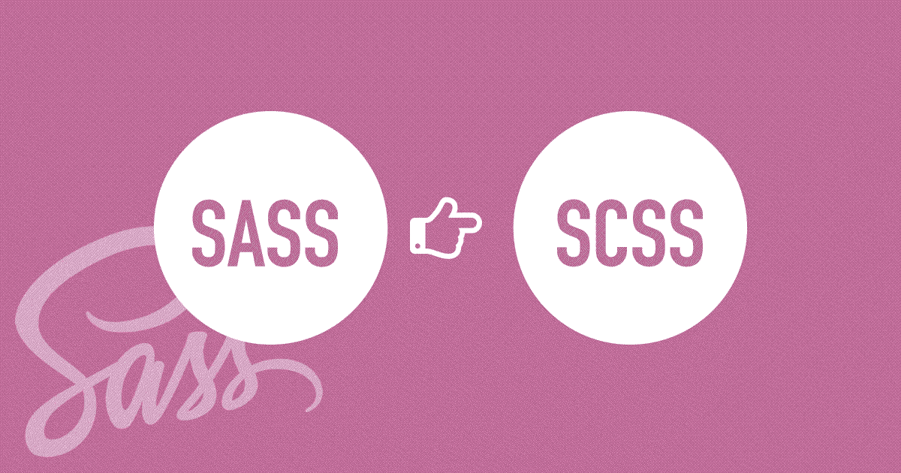
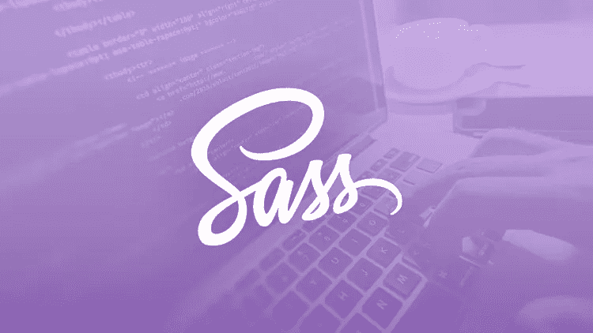

# 10+初学者最佳萨斯教程[2023 年 3 月]——在线学习萨斯和 SCSS

> 原文：<https://medium.com/quick-code/top-tutorials-to-learn-sass-and-scss-33e4dcd63e9b?source=collection_archive---------0----------------------->

## 学习萨斯和 SCSS，在 2023 年为初学者创建最好的萨斯教程的专业网站

Sass(语法上令人敬畏的样式表)是一种样式表脚本语言，最早出现于 2007 年，现在在整个 web 上使用。业内认可，兼容所有 CSS 版本，比其他 CSS 扩展语言拥有更多的特性和能力，是世界上同类语言中最稳定、最强大的。通过掌握 Sass，你将能够毫不费力地创建具有时尚、专业外观的漂亮网站。

# 1.[完全萨斯& SCSS 课程:从初级到高级](https://click.linksynergy.com/deeplink?id=Fh5UMknfYAU&mid=39197&u1=quickcode&murl=https%3A%2F%2Fwww.udemy.com%2Fsasscourse%2F)

用强大的 CSS 预处理器萨斯和 SCSS 增强你的网站设计技能。

Sass 允许编写更易维护和更简洁的 CSS Sass 允许使用强大的 CSS 功能。一些特性包括:编写和定义变量明确继承嵌套规则使用 Mixins 作为可重用对象用运算符(+、-、*、/)和函数做数学运算。

本课程是萨斯和 SCSS 开发的完整大师课。它涵盖了您需要了解的关于这项令人惊叹的技术的所有信息，包括:

**一、**如何使用 Sass / SCSS 在更短的时间内创建更灵活的设计，并从中生成 CSS 代码

**二世。**如何使用变量来存储颜色、大小、字体等等，以避免重复并使你的设计更加灵活和可重用

**三。**如何在你的 Sass & SCSS 代码中执行计算，以创建响应迅速且灵活的布局

**四。如何使用 mixins 和 imports 来重用您现有的设计，并立即完成新项目**

**v.** 如何在 Sass 中使用继承来避免重复代码和随之而来的讨厌的 bug

**六。**如何使用 Sass 为大型项目编写可伸缩的 CSS 代码

您还将学习如何自信地使用 Sublime Text 3，这是最流行的轻量级文本编辑器之一，并以闪电般的速度编写代码。

在本课程中，您将在 Sass 中创建有用的代码片段，您可以在未来的项目中使用这些代码片段来加倍您的开发速度——并且您将拥有创建更多这样的代码片段所需的所有工具，以进一步提高您的生产力并让客户满意。

在我们创建强大的代码片段库时，您可以通过几个测验和编码来测试您所学的内容。

在本课程中，您将，

*   使 CSS 文件自动压缩
*   使用 SASS 的语言语法
*   创建专业的清洁项目
*   使用 SASS 创建响应式网页设计

如果你想写干净且易于维护的代码，或者你不知道 SASS 是什么，那么你是在正确的地方。

学完这个课程后，你将会更快地编写你的 CSS 你的代码将会变得干净并且易于维护。

# 2.[带 Sass 的 Bootstrap 4](https://linkedin-learning.pxf.io/c/1137078/646189/8005?u=https%3A%2F%2Fwww.linkedin.com%2Flearning%2Fbootstrap-4-with-sass&subId1=quickcode)

本课程探讨了常规 Bootstrap 和新的 Sass 驱动版本 Bootstrap 4 之间的差异，并展示了如何使用 Sass 支持的功能来构建更加定制化的站点。

本课程包括:

*   安装
*   自定义您的安装
*   使用全局引导设置
*   使用实用程序混合

在本课程中，您将学习如何安装库来添加自定义字体、图标和动画；使用 Sass 变量、地图和 mixins 创建自定义布局。修改全局设置；并使用 CSS 和 Sass 定制现有组件。

# 3. [SASS —完整的 SASS 课程(CSS 预处理器)](https://www.eduonix.com/sass-the-complete-sass-course-css-preprocessor/UHJvZHVjdC0zMjMyMDA=)

SASS——学习最流行的 CSS 扩展 SASS。使用 SASS 和大量 CSS 构建现代而美丽的项目

在本课程中，您将学习如何:

*   建立现代和美丽的网站-餐厅“格鲁吉亚”。
*   使用 SASS 构建您的代码。

你将从 SASS 基础主题开始，比如如何安装 SASS 编译器，如何创建变量和 mixins 以便编写更简洁灵活的代码。

此外，您还将涉及以下主题:扩展、占位符选择器、函数、导入和片段。

接下来，您将讨论 SASS 中的一些高级内容。您将能够了解 SASS 数据类型、插值、循环和 IF 指令。

在整个课程中，你将遇到关于 SASS 如何工作的详细解释，同时，你将介绍现代实践和解决方案。

# 4.[用 Sass 和普通 JavaScript 创建生活方式指南](https://pluralsight.pxf.io/c/1137078/424552/7490?u=https%3A%2F%2Fwww.pluralsight.com%2Fcourses%2Fcreating-living-style-guide-sass-vanilla-javascript&subId1=quickcode)

本课程将教你如何用全局助手和可重复使用的组件创建一个定制的风格指南，你可以在不同的项目中重复使用。

在本课程中，您将学习如何:

*   确定设计系统的组成部分。
*   将这些构件转化为模块化风格和可重用组件。

在这里，您将获得构建风格指南的能力，该指南在核心级别解决这些问题，并弥合设计和开发之间的差距。

您将探索如何为用户交互添加有状态样式，以及具有不同需求的用户的可访问性。

当你完成本课程时，你将具备构建一个轻量级的定制风格指南所需的风格指南驱动开发的技能和知识。

## 5.[学会顶嘴](https://www.pjatr.com/t/TUJGR0lLR0JHR0pMSUtCR0ZISk1N?sid=quickcode&url=https%3A%2F%2Fwww.codecademy.com%2Flearn%2Flearn-sass)

本课程将教你如何使用嵌套、变量、混合、占位符和函数来编写更具表现力和可重用的样式。

在本课程中，您将学习如何:

*   通过编译 Sass 和学习使用变量和嵌套选择器来设计你自己的柠檬水站点。
*   使用 mixins 和& selector 创建一个交互式索引卡，当你悬停时它会翻转。
*   使用 Sass 函数、循环和条件来设计网页不同组件的样式。
*   了解最佳 Sass 实践，如部分文件、占位符和@import。

在课程结束时，你将能够转换一个 CSS 代码库到 SCSS，并设计多个网站。

# 6.[萨斯课程！学习现实世界网站的 Sass】](https://click.linksynergy.com/deeplink?id=Fh5UMknfYAU&mid=39197&u1=quickcode&murl=https%3A%2F%2Fwww.udemy.com%2Flearn-sass%2F)

指南学习 Sass，改善您的工作流程和风格省时，干净的网站。

本课程涵盖:

*   设计和编码定制网站比以前快得多
*   自信轻松地使用 Sass 设计网站
*   在现实项目中使用 Sass
*   使用命令行(和其他工具)快速方便地安装和编译 Sass
*   使用 Compass、Bourbon 和 Neat 等框架优化您的 Sass 工作流程
*   设计一个漂亮的投资组合登陆页面(你可以把它作为你的投资组合！)
*   选择最适合您的环境和工作流的代码编辑器
*   了解设计可伸缩网站的最佳实践
*   使用和理解变量、部分和导入，使你的样式表非常灵活和易于导航
*   代码混合，以节省击键和回收 CSS 样式
*   利用扩展在选择器之间共享 CSS 属性块
*   了解在哪里可以了解更多信息，并扩展您的 Sass 知识
*   访问由志同道合的设计师、程序员和学生组成的社区

## 7.[高级 CSS 和 Sass: Flexbox、网格、动画等等！](https://coursesity.com/r/site/advanced-css-and-sass-flexbox-grid-animations-and-more)

互联网上最先进和现代的 CSS 课程:主 flexbox，CSS 网格，响应设计，等等。

本课程涵盖:

*   大量现代 CSS 技术创造出令人惊叹的设计和效果
*   带有@关键帧、动画和过渡的高级 CSS 动画
*   CSS 如何在幕后工作:级联、特异性、继承等。
*   CSS 架构:基于组件的设计、BEM、编写可重用代码等。
*   Flexbox 布局:用 flexbox 构建一个巨大的真实项目
*   CSS 网格布局:用 CSS 网格构建一个巨大的现实世界项目
*   在现实世界的项目中使用 Sass:全局变量、构建 CSS、管理媒体查询等。
*   先进的响应设计:媒体查询、移动优先与桌面优先、em 与 rem 单元等。
*   HTML 和 CSS 中的响应图像可加快页面加载速度
*   HTML 和 CSS 中的 SVG 图像和视频:构建背景视频效果
*   NPM 生态系统:开发工作流程和构建过程

你将学习复杂的 CSS 动画，高级响应设计技术，flexbox 布局，Sass，CSS 架构，基本的 CSS 概念，等等。

完成本课程后，您将:

1)了解最现代和最先进的 CSS 属性和技术；

2)掌握了前沿的布局技术 Flexbox 和 CSS Grid

3)准备好为各种设备和情况建立响应布局；

4)真正理解 CSS 的幕后工作原理；

5)能够使用 Sass 为可重用性和可维护性设计大型 CSS 代码库。

这门课程非常庞大，需要 20 多个小时。下面是你将学到的东西:

大量现代先进的 CSS 技术来创建令人惊叹的设计和效果:剪辑路径、背景剪辑、蒙版图像、背景混合模式、外部形状、滤镜、背景滤镜、对象适配、变换、列数、连字符、透视、calc()和自定义 CSS 属性；

带有@关键帧、动画和过渡的高级 CSS 动画；

现代 CSS 开发所需的高级 CSS 选择器、伪类和伪元素；

CSS 如何在幕后工作:级联、特性、继承、值处理、可视格式模型、盒子模型、盒子类型、定位方案和堆叠上下文；

CSS 架构:7–1 规则，基于组件的设计，BEM 方法，编写可重用、可维护和可扩展的代码；

Sass 简介:变量、嵌套、部分、导入、混合、函数、扩展等等；

在现实项目中使用 Sass:设置全局变量、构建可重用性、构建 CSS 和管理媒体查询；

NPM 生态系统:建立一个开发过程来编译 Sass 和自动浏览器重载，并创建一个构建过程来连接、添加前缀和压缩 CSS 文件；

现代响应设计:流体网格、布局类型、灵活的图像，使用媒体查询来测试不同的屏幕宽度、像素密度和触摸能力；

先进的响应式设计工作流程:移动优先与桌面优先策略、选择断点、em 与 rem 单元以及测试浏览器支持的功能查询；

HTML 和 CSS 中的快速响应图像:分辨率切换、密度切换、艺术指导；

HTML 和 CSS 中的 SVG 图像:如何和为什么使用 SVG，生成 SVG 精灵，在 CSS 中更改 SVG 颜色和最佳实践；

HTML 和 CSS 格式的视频:构建背景视频效果；

Flexbox 布局:主要概念、flex 容器和 flex 项目特定属性的介绍、应用于大型现实项目的高级定位技术；

*   CSS 网格布局:主要概念，CSS 网格与 flexbox，以及应用于现实项目的布局技术。

# 8.[学习萨斯和 SCSS](https://click.linksynergy.com/deeplink?id=Fh5UMknfYAU&mid=39197&u1=quickcode&murl=https%3A%2F%2Fwww.udemy.com%2Flearn-sass-and-scss%2F)

增压你的 CSS！利用 SASS 和 SCSS 释放 CSS 预处理的优势。

*   建立一个 SAAS 项目
*   理解和应用 SAAS 嵌套
*   使用和应用细分的概念
*   将 SAAS 变量集成到您的工作中
*   理解 SCSS 混合和 SCSS 函数
*   创建你自己的混音
*   了解并应用最佳实践

不要再浪费时间为混乱或糟糕的 CSS 而烦恼了。

# **9。** [**萨斯—初级速成班**](https://click.linksynergy.com/deeplink?id=Fh5UMknfYAU&mid=39197&u1=quickcode&murl=https%3A%2F%2Fwww.udemy.com%2Fsass-beginner-crash-course%2F)

让你的 CSS 更上一层楼&用 Sass 加速你的 web 开发过程。

这门课结束后，

*   你将能够用变量、混合和函数编写并轻松维护面向对象的 CSS
*   您将通过完成更多的工作、更少的代码和更少的重复来加速您的 web 开发过程
*   您将知道如何编写自己的定制 mixins 来更快地构建
*   您将了解如何使用操作符和函数在样式表中直接执行数学计算

Sass 是一个 CSS 预处理器。

而且，它得到了大型开发人员社区的积极支持，以保持领先地位。

虽然 CSS 是一种很棒的语言，但它也有一些限制。

每个 web 开发人员或前端 UI 工程师都应该在传统 CSS 上使用预处理语言

在 SASS-初学者速成课程中，你将发现 SASS 的力量，并学会将你的 CSS 带到下一个层次。有几个演示和例子。您将看到预处理器语言的强大功能。

# 10.[CSS 的 Sass 简介](https://click.linksynergy.com/deeplink?id=Fh5UMknfYAU&mid=39197&u1=quickcode&murl=https%3A%2F%2Fwww.udemy.com%2Fintroduction-to-sass-for-css%2F)

学习 Sass，CSS 预处理器扩展将使您的生活变得更加轻松。

*   在 Sass 中构建警报面板
*   为开发配置 Sass
*   用 Sass 掌握 CSS 效率

编译并使用 Sass 的核心功能学习与任何 CSS 版本兼容的样式表语言组织您的 CSS 以使其更具可读性配置 Sass 进行开发并掌握 CSS 效率

这个课程是为网页设计者，网页开发者，以及任何已经掌握 CSS 知识的人设计的。它并不涵盖 Sass 安装或文本编辑器的配置，而是直接跳到使用实际的、真实的 Sass 实例。因此，本课程不适合对 CSS 了解有限或一无所知的学生。

在本课程中，你将掌握 Sass 的核心特性，如变量、继承、嵌套和混合等。您将学习如何构建警告面板，如何为开发配置 Sass，以及如何使用 Sass 掌握 CSS 效率，使您的代码更具可读性和更简洁。

完成本课程后，您将对 Sass 有一个扎实的了解，并能够立即实施。更好的是，您将重新发现最初是什么让 CSS 变得有趣！

# 11.[学习 SASS:在 Windows 中优化你的 CSS 技能& Mac OSX](https://click.linksynergy.com/deeplink?id=Fh5UMknfYAU&mid=39197&u1=quickcode&murl=https%3A%2F%2Fwww.udemy.com%2Flearn-sass-optimize-your-css-skills-in-windows-mac-osx%2F)

学习用 SASS 编写更快更有效的 CSS，这是 CSS 预处理器的终极扩展。

本课程涵盖以下主题，

*   安装 SASS
*   安装 Visual Studio 2015 社区(免费)
*   安装 Visual Studio 代码(免费)
*   了解如何在 Mac 和 Windows PC 上编写和编译 SASS
*   用 SASS 编写优雅而有组织的代码
*   编写 SCSS 页面
*   导入 SCSS 文件以优化代码编译
*   学习 SCSS 语言语法
*   创建一个有组织的、专业的 web 项目结构
*   在 SCSS 创建混合、变量和函数
*   用 SASS 实现响应式设计技术
*   在 SCSS 中使用继承和条件语句

Web 开发人员和设计人员每天都在所有的 web 活动和项目中使用 CSS。CSS 可能非常耗时、复杂和混乱。SASS 是所有 CSS 问题的解决方案。SASS 使您能够在现有 CSS 知识库的基础上进行构建，而无需牺牲时间。

在本课程中，您将学习如何利用 SASS 编写更快、更易维护的 CSS。您将了解如何在 Windows 操作系统上的 Visual Studio 2015 中编写和编译 SASS，以及如何在 Mac OS X 上编写和编译 Visual Studio 代码。

# 12.[学习 Sass——CSS 变得令人兴奋。](https://click.linksynergy.com/deeplink?id=Fh5UMknfYAU&mid=39197&u1=quickcode&murl=https%3A%2F%2Fwww.udemy.com%2Flearning-sass%2F)

学会用 Sass 增强你的 CSS。这是一门简单易懂的课程，告诉你关于 Sass 你需要知道的一切。

来自 Infinite Skills 的 Sass 培训课程教你关于 CSS 样式表扩展语言的所有知识。这个课程是为绝对初学者设计的，这意味着不需要预先了解 Sass，但是建议对 CSS 和 HTML 有基本的了解。您将从学习如何在 Windows 和 Mac OS 上安装和使用 Sass 开始，然后开始学习变量和嵌套。这个视频培训课程将教你关于偏旁音、Sass Mixins 和高级继承技术。最后，您将学习如何将 Sass 与 WordPress 和 Ruby on Rails 集成。

# 13.[Compass——强大的 SASS 库，让您的生活更加轻松](https://click.linksynergy.com/deeplink?id=Fh5UMknfYAU&mid=39197&u1=quickcode&murl=https%3A%2F%2Fwww.udemy.com%2Fcompass-powerful-sass-library-that-makes-your-life-easier%2F)

通过学习 Compass 框架的优点来提高您的 SASS 技能，Compass 框架有许多节省时间的有用工具

本课程涵盖以下主题:

*   安装指南针
*   集成指南针和 SASS
*   探索 Compass 框架
*   使用并了解什么是精灵
*   知道如何使用 mixins 创建供应商前缀
*   将 Compass 和 SASS 集成到伟大的 ide 中，这样编译的过程将会自动进行，你不会浪费你的宝贵时间
*   混合/功能

Compass 是 SASS 的一个框架(库),这意味着在它的内部你可以找到很多有用的工具——这将在本课程中向你展示。

这些工具可以节省你开发网站的时间。通过使用 Compass，您可以使用其他程序员创建的各种函数/mixin，而这些通常需要您自己编写。

使用 Compass 中的精灵让你的网站加载更快。有了指南针，你可以立即创建精灵。如果你不知道精灵是什么，看看关于精灵的免费课程，你会发现这个课程值得一上。

# 14.[下一步用萨斯和指南针](https://click.linksynergy.com/deeplink?id=Fh5UMknfYAU&mid=39197&u1=quickcode&murl=https%3A%2F%2Fwww.udemy.com%2Fthe-next-step-with-sass-and-compass%2F)

让你的 Sass 技巧更上一层楼。学习如何使用数学、列表、控制指令和指南针更快地编码。

在本课程中，

*   探索使 Sass 开发更容易的工具
*   理解 Sass 数学
*   了解 Sass 列表的强大功能以及如何使用它们
*   了解如何像程序员一样编写 Sass 代码，以及为什么您想这样做
*   了解如何创建一个可定制的 Sass 动画混合，在所有浏览器中工作
*   探索 Compass 框架
*   查看 Sass 和 Compass 颜色函数的运行情况
*   用指南针创建一个 CSS 精灵(不用 Photoshop)
*   如何使用媒体询问和 Sass 来创建响应网站

Sass 和 Compass 的下一步是为已经了解 Sass 基础知识的人提供的中级 Sass 课程。这是逐步 Sass 的后续课程，但是任何理解变量、混合、嵌套、扩展和父选择器的基本 Sass 概念的人都可以完成。

在这堂课中，我们将深入探讨 Sass，并通过使用数学、列表和控制指令(如@for、@each 或@if 和@else)来了解它的强大功能。所有这些让你实际上写你的 CSS 更像一个编程语言，这可以使你的代码更容易维护。

本课程使用一个真实的项目。在其中，我们创建了一个只有 CSS 的动画幻灯片，并使用 Sass 使其完全可修改。我们探索 Compass 框架及其许多有用的工具和混合。我们了解到用 Compass 创建和维护 CSS 精灵是多么简单，我们将探索用 Sass 和 Compass 得到的许多颜色函数。

本课程还涵盖了媒体查询如何在 Sass 中工作，以及@content 如何帮助更轻松地开发响应式网站。

完成本课程后，您将了解 Sass 的强大功能，以及如何使用它更快地完成工作。

# 15。 [**步步萨斯**](https://click.linksynergy.com/deeplink?id=Fh5UMknfYAU&mid=39197&u1=quickcode&murl=https%3A%2F%2Fwww.udemy.com%2Fstep-by-step-sass%2F)

在本课程中，

*   在一个多小时内学会如何使用 CSS 预处理器。
*   理解使用 CSS 预处理器的好处
*   知道如何使用 Sass 语法编写 CSS 来节省时间
*   使用 Sass 编写更易维护的 CSS

Sass 是一种节省时间的 CSS 元语言，并允许您编写质量更好的代码。在 Step by Step Sass 中，您将学习如何在 5-10 分钟的简单步骤中使用这个强大的预处理器。

您不需要理解 Sass 的每个概念来使用它——一旦您完成了安装和设置，您就可以立即开始使用它。

用 Sass 编写 CSS 代码可以节省您的时间，并允许您编写更整洁、更一致的代码。你花在完成本课程上的时间将很容易在你的下一个网络项目中得到弥补！

> **更新**:我们创建了最新版本的顶级教程[学习 SASS](http://blog.coursesity.com/best-sass-tutorials/?utm_source=botsfloor&utm_medium=referral&utm_campaign=mediumPost&utm_term=learn-sass) 。请随意查看年度最佳 sass 教程。

> 感谢您阅读本文。我们策划了更多主题的顶级教程，您可能想看看:

 [## 15+初学者最佳 Bootstrap 4 教程—在线学习 Bootstrap 4

### 在 2021 年，用最好的初学者引导教程学习 web 开发的引导

medium.com](/quick-code/top-tutorials-to-develop-responsive-websites-using-bootstrap-4-c934172f3ebd)  [## 初学者的 15 个最佳 Web 开发教程——在线学习 Web 开发

### 用 2021 年最好的新手网页开发教程学习网页开发

medium.com](/quick-code/top-tutorials-to-learn-web-development-for-beginners-4023595ebaa0)  [## 10+最佳 UX 初学者设计课程——在线学习 UX 设计

### 学习 UX 设计，在 2021 年为初学者提供最佳 UX 设计教程，创造惊人的用户体验。

medium.com](/quick-code/top-online-courses-to-learn-ux-design-efdd9a18689e) 

披露:我们与本文中提到的一些资源有关联。如果你通过本页的链接购买课程，我们可能会得到一小笔佣金。谢谢你。