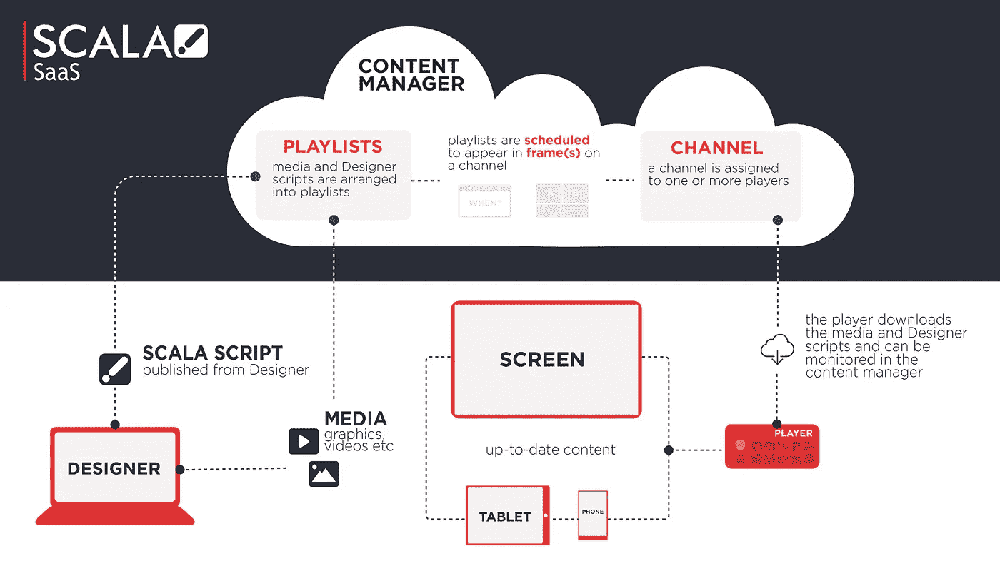
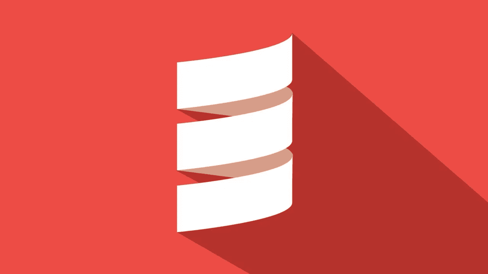
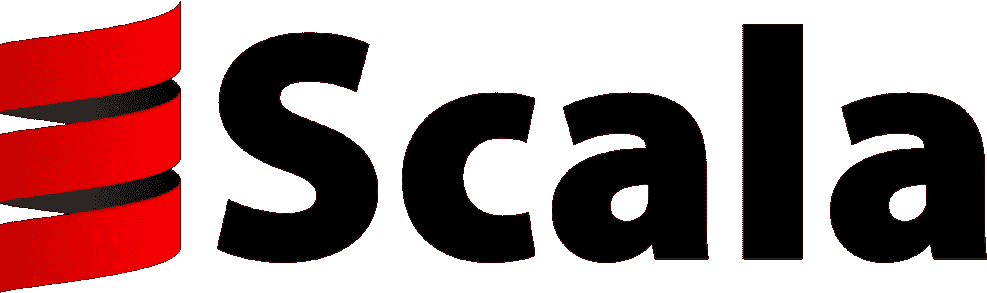
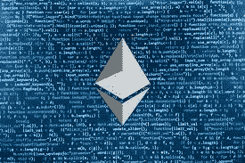

# 面向初学者的 10 个最佳 Scala 教程[2023 年 3 月]——在线学习 Scala

> 原文：<https://medium.com/quick-code/top-tutorials-to-learn-scala-3a221bf4ef85?source=collection_archive---------0----------------------->

## 用 2023 年最好的 Scala 初学者教程学习 Scala 编程，建立命令式、逻辑式、函数式和 OOP 技能。

Apache Spark 赋予我们无限的能力来构建尖端应用程序。就其对大数据世界的颠覆而言，它也是过去十年中最引人注目的技术之一。

Apache Scala Spark 提供了内存集群计算，极大地提高了迭代算法和交互式数据挖掘任务的速度。

Apache Spark 是下一代大数据处理引擎。

成千上万的公司正在采用 Apache Spark 从海量数据集中提取意义，今天，您可以在桌面上访问相同的大数据技术。

Apache Spark 正在成为大数据工程师和数据科学家的必备工具。

## 1.[举一反三:Scala](https://click.linksynergy.com/deeplink?id=Fh5UMknfYAU&mid=39197&u1=quickcode&murl=https%3A%2F%2Fwww.udemy.com%2Flearn-by-example-scala%2F)

*   Scala 很酷，因为它风靡大数据应用程序，也因为它比 Java 更复杂、更优雅。
*   也就是说，Java 是一个稳定可靠的朋友——一种你可以依赖的语言，你可以用它来表达自己。
*   这 65 个例子将帮助你像信任 Java 一样信任 Scala。每一个都是自包含的，附有源代码，并且跨越特定的 Scala 用例。每个例子都很简单，但并不简单化。

## 2.[Scala 中的函数式编程原理](https://coursera.pxf.io/c/1137078/1213622/14726?u=https%3A%2F%2Fwww.coursera.org%2Flearn%2Fprogfun1&subId1=BotTutorials)

函数式编程在工业界越来越普遍。这种趋势是由 Scala 作为许多应用程序的主要编程语言所推动的。

在本课程中，您将学习如何:

*   探索函数式编程风格的元素。
*   在日常编程任务中有效地应用这些元素。
*   通过触及不变量的证明和符号化的执行跟踪，为函数式程序的推理打下坚实的基础。

您将了解函数式命令式编程。您将逐步了解 Scala 的基础知识；涵盖表达式、求值、条件、函数和递归。

您将了解到作为一级值的函数，以及更高阶的函数。您还将了解 Scala 的语法以及它是如何被正式定义的。

通过有理数数据结构的设计，您将了解方法、类和数据抽象。

您将了解特征，并学习如何将类组织成层次结构。您将了解标准 Scala 类型的层次结构，并了解如何将类和特征组织到包中。

您将会接触到 Scala 中不同种类的多态性。你将了解 Scala 中函数和对象之间的关系；函数就是对象！

您将关注 Scala 的类型系统，涵盖子类型和泛型，并继续关注 Scala 类型系统的更高级方面，如 variance。

最后，您将了解 Scala 最广泛使用的数据结构——列表，以及 Scala 最强大的工具之一——模式匹配。

## 3. [Scala 基础训练](https://linkedin-learning.pxf.io/c/1137078/646189/8005?u=https%3A%2F%2Fwww.linkedin.com%2Flearning%2Fscala-essential-training&subId1=quickcode)

本课程将帮助您开始使用 Scala，因此您可以利用它提供的独特功能。

在本课程中，您将了解:

*   Scala 的基础知识。
*   类型推断、变量、循环、函数和运算符的基础知识。
*   如何使用控制台读取文件、执行模式匹配以及处理异常。
*   如何使用类、字段、方法和对象。

首先，学习类型推断、变量、循环、函数和运算符的基础知识。然后，了解如何使用控制台读取文件、执行模式匹配和处理异常。

## 4. [Scala 基础:类型系统](https://pluralsight.pxf.io/c/1137078/424552/7490?u=https%3A%2F%2Fwww.pluralsight.com%2Fcourses%2Fscala-fundamentals-type-system&subId1=quickcode)

从介绍一个简单的类到编写一个类型类，本课程解释了利用 Scala 漂亮的静态类型系统所需的概念。它将有助于实现代码抽象，并使您能够编写更少的代码，实现更多。

在本课程中，您将学习:

*   利用 Scala 丰富的类型系统编写类型安全、易于理解、抽象简洁的代码。
*   编写类、对象、用例类和特征等结构的方法。
*   类型界限和方差的概念

在这门课程《Scala 基础:类型系统》中，你将学会使用 Scala 的广泛类型系统来编写类型安全、易于理解、抽象简洁的代码。

首先，您将探索编写像类、对象、case 类和 traits 这样的构造的方法，它们作为类型工作。然后，您将学习如何使它们通用化。

接下来，您将发现类型界限和方差的概念。最后，您将深入研究编写类型类。

当你完成本课程时，你将拥有编写易于理解和编辑器友好的代码所需的 Scala 广泛类型系统的技能和知识。

## 5.[从零开始学习 Scala】](https://www.educative.io/collection/10370001/4974430444847104?affiliate_id=5088579051061248)

本课程将教授如何在 scala 中编程，以及学习 Scala 的优势，例如轻松有效地构建可扩展程序，将函数式编程和面向对象编程结合到一个灵活的包中。本课程提供免费预习课程。

在课程结束时，你将成为 scala 的大师，并保持领先地位，开发出色的、可扩展的应用程序。它是一种静态类型的高级语言。

## 6.[阶梯阶梯应用，第 1 部分](https://coursesity.com/r/site/scala-for-beginners-learn-the-core-concepts-and-syntax)

Scala 语言编程介绍。核心语法和概念。

学习完 Scala 第 1 部分之后，您将能够:

*   使用 REPL(Scala 交互式 Shell)进行实验和娱乐
*   理解 Scala 语法的基础，包括 val，var，def，if，while，try，for 等等
*   创建类、对象和实例
*   定义和使用函数文字和高阶函数
*   理解 Scala 类型推断的基础以及如何使用它
*   编写定制的控制结构来扩充语言中内置的控制结构
*   开始走一条更函数式的编程之路
*   为 Scala 应用阶梯的第 2 部分做好准备，这部分将深入探讨 Scala 和其他语言之间的一些差异

本课程一半是理论，一半是实践，包括围绕测试驱动开发示例构建的编码练习。如果你完成了所有的三个部分，以及所有的练习，你会发现除了语言理论的坚实基础之外，你还将拥有用 Scala 编码的实用技能和舒适，以及这样做所必需的工具。

该课程由两位经验丰富的 Scala 开发人员讲授，他们每天都在真实的商业项目中使用 Scala，并且都已经使用了好几年。

## 7.[摇滚 JVM！面向初学者的 Scala 和函数式编程](https://click.linksynergy.com/deeplink?id=Fh5UMknfYAU&mid=39197&u1=quickcode&murl=https%3A%2F%2Fwww.udemy.com%2Frock-the-jvm-scala-for-beginners%2F)

了解如何使用 Scala、Akka、Spark 等工具编写反应式应用程序。

在本课程中，我们将学习 Scala 和函数式编程的基础知识，这是当今软件行业的两个热门话题。

为什么选择 Scala:

*   它是目前基于 Java 虚拟机的最热门的语言 Scala 的工作数量激增，但是需求*甚至更高*
*   它提供了比同等级别的 Java 职位高得多的薪酬(> 20%)
*   这非常有趣——如果你学习了 Scala，你会很难想回去
*   它打开了一些最新技术的大门——Spark、Akka 等等

你将学习的这门课程，

1.  解构 Scala——否则很难学习——成为你需要的关键部分
2.  选择最重要的概念，并将其分为简单但重要的概念和强大但更高级的概念(技能库)
3.  在整个学习过程中，以“点击”和有意义的方式对想法进行排序

## 8.[面向大数据和机器学习的 Scala 和 Spark】](https://coursesity.com/course-detail/scala-and-spark-for-big-data-and-machine-learning)

了解最新的大数据技术——Spark 和 Scala，包括 Spark 2.0 数据框架。

了解如何利用当今市场上最有价值的技术， **Scala 和 Spark** ！在本课程中，我们将向您展示如何使用 Scala 和 Spark 来分析大数据。

Scala 和 Spark 是目前最受欢迎的两种技能，通过本课程，您可以快速轻松地学习它们！本课程内容丰富:

*   Scala 编程速成班
*   Spark 和大数据生态系统概述
*   使用 Spark 的 MLlib 进行机器学习
*   使用亚马逊网络服务扩大 Spark 工作
*   了解如何使用 Databrick 的大数据平台
*   还有更多！

本课程为您提供完整的项目，包括分析财务数据或使用机器学习对电子商务客户行为进行分类等主题！我们教授 **Spark 2.0** 的最新方法论，所以你可以学习如何使用 SparkSQL、Spark DataFrames 和 Spark 的 MLlib！

完成本课程后，你会觉得在简历中加入 Scala 和 Spark 很舒服！

谢谢，我们在球场上见！

## 9.[Spark with Scala:Scala+Spark Core，SQL 和 Streaming](https://click.linksynergy.com/deeplink?id=Fh5UMknfYAU&mid=39197&u1=quickcode&murl=https%3A%2F%2Fwww.udemy.com%2Fspark-with-scala%2F)

用实例学习 Spark。

本课程涵盖了编写复杂 Spark 应用程序所需的所有基础知识。本课程结束时，您将深入了解 Spark 核心、Spark SQL 和 Spark 流。

本课程分为 9 个模块

1.  **深入 Scala** —了解编程 Spark 应用程序所需的 Scala 基础知识。了解 Scala 的基本构造，比如变量类型、控制结构、集合等等。
2.  **Scala 中的 OOPS 和函数式编程** —了解 Scala 中的面向对象编程和函数式编程技术
3.  **Apache Spark 简介** —了解 Spark 架构、Spark 组件和 Spark 用例
4.  **Spark 基础知识** —了解如何在 eclipse/intellij 中配置/运行 Spark
5.  **在 Spark 中使用 rdd**—了解什么是弹性分布式数据集，可以应用于 rdd 的不同类型的操作和转换
6.  **用对 RDD 聚合数据** —了解对 RDD 与 RDD 有何不同，可应用于对 rdd 的不同类型的操作和转换
7.  **高级 Spark 概念** —了解 Spark 如何使用广播变量和累加器来执行计算，持久性和分区如何帮助实现性能
8.  **Spark SQL 和数据框架** —了解数据框架和数据集的区别
9.  **Spark Streaming** —了解如何动态分析大量数据集

所有的概念都用实际例子来解释。本课程涵盖 10 多个大数据实践示例，例如

*   探索 2014 年世界杯的球员数据
*   来自 ebay 在线拍卖数据的 Agregate 数据
*   从 Adhaar 数据中了解不同的数据点
*   开发应用程序来分析印度创业公司收到的资金
*   通过查看加利福尼亚州的房地产数据来探索价格趋势
*   帮助零售商找出班加罗尔连锁店的有效和无效采购交易
*   编写 Spark 程序，从美国各州和商店位置数据中找出每个美国地区的商店数量
*   开发 Spark 流应用程序来执行 Twitter 情绪分析

**30 天退款保证！参加本课程，您将获得 Udemy 提供的 30 天退款保证。**

如果不满意，只需在 30 天内要求退款。你会得到全额退款。什么问题都没问。

## 10.[使用 Scala 和 Spark 进行可扩展编程](https://click.linksynergy.com/deeplink?id=Fh5UMknfYAU&mid=39197&u1=quickcode&murl=https%3A%2F%2Fwww.udemy.com%2Fscalable-programming-with-scala-and-spark%2F)

使用 Scala 和 Spark 进行数据分析、机器学习和分析。

**由**4 人团队授课，包括 2 名斯坦福毕业的前谷歌员工和 2 名前 Flipkart 首席分析师。这个团队在使用 Java 和数十亿行数据方面有数十年的实践经验。

***使用 Spark 和 Scala 进行分析、机器学习和数据科学，让您的数据飞起来***

让我们分析一下。

**什么是火花？**如果你是一名分析师或数据科学家，你会习惯使用多个系统来处理数据。SQL，Python，R，Java 等。有了 Spark，你就有了一个单一的引擎，你可以探索和处理大量的数据，运行机器学习算法，然后使用相同的系统生产你的代码。

Scala: Scala 是一种通用编程语言，就像 Java 或 C++。它的函数式编程特性和 REPL 环境的可用性使它特别适合 Spark 这样的分布式计算框架。

**分析:**使用 Spark 和 Scala，您可以在交互式环境中分析和探索您的数据，并获得快速反馈。本课程将展示如何利用 rdd 和数据帧的力量来轻松操作数据。

**机器学习和数据科学:** Spark 的核心功能和内置库使得用很少几行代码就能轻松实现像推荐这样的复杂算法。我们将涵盖各种数据集和算法，包括 PageRank、MapReduce 和 Graph 数据集。

**内容:**

**Scala 编程构造:**类、特征、一级函数、闭包、Currying、Case 类

许多很酷的东西..

*   使用交替最小二乘法和 Audioscrobbler 数据集的音乐推荐
*   Dataframes 和 Spark SQL 处理 Twitter 数据
*   对 Google web 图形数据集使用 PageRank 算法
*   使用火花流进行流处理
*   使用漫威社交网络数据集处理图表数据

**..当然还有所有的 Spark 基本和高级功能:**

*   弹性分布式数据集、转换(映射、过滤、平面映射)、操作(减少、聚集)
*   配对 rdd，reduceByKey，combineByKey
*   广播和累加器变量
*   MapReduce 的火花
*   Spark 的 Java API
*   Spark SQL、Spark Streaming、MLlib 和 GraphX

目标受众是谁？

*   没错。希望使用分布式计算引擎进行批处理或流处理或两者兼有的工程师
*   没错。希望利用 Spark 分析有趣数据集的分析师
*   没错。想要一个引擎来分析和建模数据以及生产数据的数据科学家。

## 11. [Scala 高级版，第 1 部分——Scala 类型系统](https://click.linksynergy.com/deeplink?id=Fh5UMknfYAU&mid=39197&u1=quickcode&murl=https%3A%2F%2Fwww.udemy.com%2Fscala-advanced-part-1-the-scala-type-system%2F)

可变状态，Scala 类型系统深入，隐式。

**Scala 高级版，第 1 部分**

升级软件 Scala 高级课程面向希望提高技能的有经验的 Scala 开发人员，特别是库和 API 设计和开发。它涵盖了有效生成高质量、正确、强大和灵活的 Scala 库所需的主题，这些库仍然易于其他人使用。

第 1 部分深入介绍了 Scala 类型系统，这是任何库开发的重要基础。我们从 Scala 中可变共享状态的危险和安全使用开始，包括属性和缓存。从这里我们深入探讨 Scala 类型系统，包括:

*   无商标消费品
*   协变和反变
*   上限和下限
*   类型推理
*   类型参数和类型成员
*   路径相关类型
*   细化类型
*   结构类型
*   递归类型
*   f 有界多态性

最后两个模块接着转移到第二个隐式类型系统，它增强了常规的 Scala 类型系统，包括:

*   简单隐式参数
*   类型类别
*   隐式类、对象和方法
*   铅字课作文
*   隐式约束
*   =:=和<:/>
*   Implicit Class and Type Tags
*   Implicit Conversions
*   extends AnyVal

And more.

Parts 2 and 3 (available separately) cover topics like best practices, idioms, patterns, advanced functional programming, asynchronous programming, parser-combinators, macros, performance profiling and optimization, and much more. These parts rely on information presented during this advanced part 1 course.

## 12\. [开始 Scala 编程](https://click.linksynergy.com/deeplink?id=Fh5UMknfYAU&mid=39197&u1=quickcode&murl=https%3A%2F%2Fwww.udemy.com%2Fbeginning-scala-programming%2F)

深入理解 Scala 编程——初学者课程。

这个来自 Infinite Skills 的 Scala 培训课程教你关于 Scala 编程语言的所有知识。本课程是为已经有一些编程经验的用户设计的。

您将从学习 Scala 的语言基础开始，包括序列、递归和嵌套函数。然后课程会教你 Scala 的面向对象方面，trait 方法的线性化，以及用 XML 构建和编写。这个视频教程还涵盖了文本处理、并行性和 actors，以及单元测试的库。

一旦你完成了这个基于计算机的培训课程，你将拥有扎实的 Scala 编程语言的工作知识，并且能够开始你自己的基于 Scala 的项目。工作文件包括在内，允许您跟随作者在整个课程。

> **更新**:我们为[学习 Scala](http://blog.coursesity.com/best-scala-tutorials?utm_source=botsfloor&utm_medium=referral&utm_campaign=mediumPost&utm_term=learn-scala) 创建了最新版本的顶级教程。请随意查看今年最好的 scala 教程。

> 感谢您阅读本文。我们策划了更多主题的顶级教程，您可能想看看:

 [## 10+最佳新手 Git 教程——在线学习 Git

### 在 2022 年的最佳 Git 初学者教程中学习 Git 的代码管理和版本控制

medium.com](/quick-code/top-tutorials-to-learn-git-for-beginners-622289ffdfe5)  [## 10+最佳围棋初学者编程教程—在线学习 Golang

### 2022 年，学习 Go 编程，寻找计算机编程方面的工作，并为初学者提供最佳 golang 教程

medium.com](/quick-code/top-online-courses-to-learn-go-programming-language-golang-for-beginners-c228c615946c)  [## 学习 Kali—面向初学者的顶级 Kali Linux 教程—[2022 年更新]

### 了解 Kali for Linux 以及它如何与初学者的最佳 Kali 教程一起工作

medium.com](/quick-code/top-tutorials-to-learn-kali-linux-for-beginners-131a654b81ad) 

*披露:如果你通过本页的链接购买课程，我们可能会得到一小笔代销商佣金。谢谢你。*