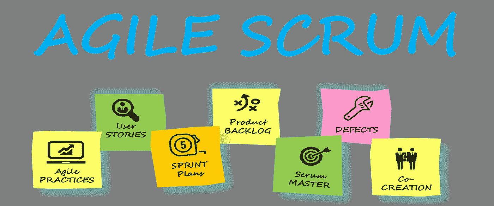
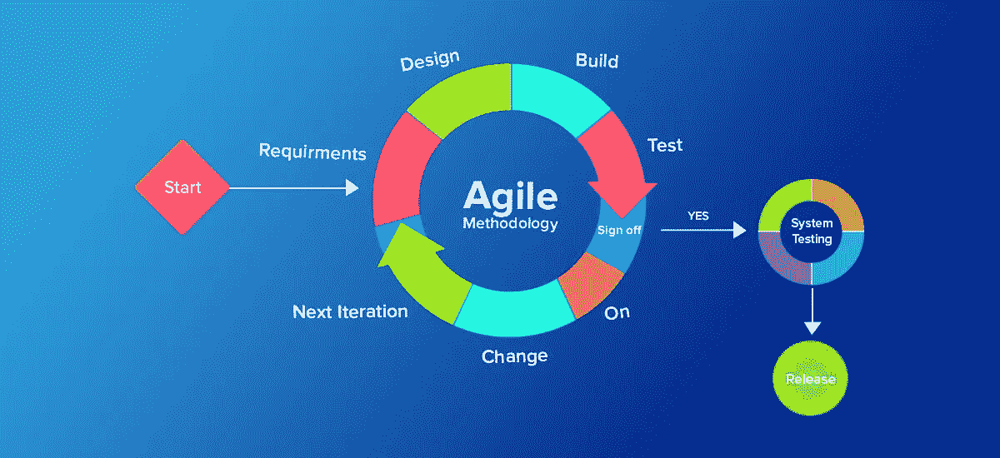

# 10+最佳敏捷和 Scrum 初学者教程[2022 年 7 月]——学习敏捷 Scrum

> 原文：<https://medium.com/quick-code/top-tutorials-to-learn-scrum-and-agile-4199b0f36c24?source=collection_archive---------0----------------------->

## 学习敏捷和 Scrum，在 2022 年用最好的敏捷 Scrum 初学者教程来发展你作为软件项目经理的职业生涯

# 1. [Scrum 认证准备+Scrum 大师+敏捷 Scrum 培训](https://click.linksynergy.com/deeplink?id=Fh5UMknfYAU&mid=39197&u1=quickcode&murl=https%3A%2F%2Fwww.udemy.com%2Fscrum-certification%2F)

Scrum 敏捷项目管理概述+常见问题+通过 PSM scrum org 在线 Scrum Master 认证的技巧。

通过本课程:

*   了解 scrum 是什么，为什么它对于按时交付最复杂的项目如此强大。
*   在参加 Scrum 认证之前，对参加 Scrum 开放评估充满信心
*   解释什么是 Scrum 实践
*   了解按时交付项目的技术
*   解释敏捷和 Scrum 的区别
*   解释什么是瀑布模型，为什么它没有敏捷灵活
*   理解敏捷是什么&它与 Scrum 有什么不同
*   解释角色、事件和工件之间的区别
*   了解最新版本的 scrum 指南更新了什么

在本课程中，你将学习 scrum 的简明概述——使用 Scrum 交付项目的确切事件、角色、规则和工件，以及 Scrum 的历史。这个课程包括关于冲刺计划的基础知识，日常 scrum，冲刺回顾，冲刺回顾，scrum 工件等等。

本课程以视频为基础，不需要任何支持文件。每一部分都概述了 Scrum 的一个特定方面，比如 Scrum 角色、事件或工件，随后是关键考试点和行业中常见误解的总结。

## 2.[敏捷软件开发](https://coursera.pxf.io/c/1137078/1213622/14726?u=https%3A%2F%2Fwww.coursera.org%2Flearn%2Fagile-software-development&subId1=BotTutorials)

本课程将帮助你获得什么是敏捷的知识？为什么敏捷更适合这些情况？你还将深入探讨一些最常见的敏捷框架，比如 scrum 和 XP。

在本课程中，您将学习如何:

*   展示有效参与软件开发敏捷实践/过程的能力。
*   解释常见敏捷实践背后的目的。
*   理解在特定情况下应用敏捷原则和价值观的能力。
*   具备识别和解决在采用敏捷方法时遇到的最常见问题的能力。

您将了解敏捷思维，这是许多敏捷方法背后的核心。敏捷方法与传统方法有何不同，以及何时使用敏捷方法。

您将了解如何应用敏捷思维，并最终回顾可用于实施敏捷的不同框架。您将了解用户故事以及敏捷评估和规划技术。

你将了解 Scrum，它是最流行的敏捷框架之一。您还将了解 scrum 实践以及这些实践背后的目的。

最后，您将比较 Scrum 和 XP，并了解一些来自 XP 的工程实践。

# 3.敏捷软件开发:开发人员的 Scrum

Scrum 是一个敏捷框架，帮助组织向客户交付高质量的产品。

在本课程中，您将学习如何:

*   使用 scrum 和项目管理工具，如吉拉和 Confluence 来管理软件开发。
*   使用流行的软件开发工具来协助 scrum 的实现。

学习如何使用 scrum 和项目管理工具，如吉拉和 Confluence 来管理软件开发。本课程采用实际的方法，用真实的例子展示 scrum 是如何执行的。

它涵盖了 scrum 角色、规则、工件和事件，并使用吉拉和 Confluence 展示了流行的软件开发工具是如何帮助 scrum 实现的。

# 4.[项目计划:从瀑布到敏捷- Scrum 的过渡](https://www.eduonix.com/project-planning-transition-from-waterfall-to-agile-scrum/UHJvZHVjdC0zMjMyMDA=)

实际学习如何计划您的项目，并成功地从瀑布方法过渡到敏捷开发

在本课程中，您将学习:

*   有效的项目规划技术，成功地将您的项目从瀑布式项目过渡到敏捷项目。
*   敏捷开发和关键阶段。
*   有效的计划技术和 Scrum 基本原理，以及关键定义。
*   有效地使用沟通方法来提供更好的结果。
*   目标设定和如何让你的组织盈利。
*   完整的项目生命周期。
*   如何区分瀑布到敏捷的转变？

您将学习如何从传统的瀑布方法过渡到敏捷方法，以获得巨大的利益和高盈利能力。

你将获得关键的提示和技巧，从项目一开始就探索和理解你的目标，并考虑所有可能影响项目执行的因素。

一步一步地，你将学习敏捷的各个阶段，以及如何成功地从传统的瀑布模型过渡到 scrum-agile 框架。

# 5.[将 Scrum 应用于敏捷项目管理](https://www.awin1.com/cread.php?awinmid=6798&awinaffid=466009&clickref=quickcode&ued=https%3A%2F%2Fwww.edx.org%2Fcourse%2Fusmx-applied-scrum-for-project-management-2)

学习 Scrum 背后的项目管理过程、角色、机制和哲学，Scrum 是在团队层面管理工作的最简单和最纯粹的方法。

在本课程中，您将学习:

*   为什么敏捷正在接管:历史、案例研究和证明敏捷工作得更好
*   谁根据行业规模、利益相关者和工程来使用敏捷
*   如何运行一个成功的 Scrum 团队来提高速度、创新、领导力和控制力
*   Scrum 团队组成、用户故事写作、冲刺计划、执行和复古工具
*   Scrum 在规模上是什么样子，它的替代品，以及如何避免长期的陷阱

首先，你将从学习 Scrum 背后的关键项目管理过程、角色、机制和哲学开始。

这将为所有人在四周的时间里以最纯粹的形式理解敏捷提供基础，探索为什么、谁、如何以及最终 Scrum 在现实世界中的应用。

从理解敏捷团队成员，比如 scrum master 和产品负责人，到精益和敏捷过程的重要区别。

虽然本课程不会让你成为敏捷认证从业者(PMI-ACP)或认证 scrum master (CSM ),但它提供了一个更基础的敏捷认证，该认证基于敏捷原则以及敏捷在当今行业中的应用。

# 6.[介绍 Scrum](https://pluralsight.pxf.io/c/1137078/424552/7490?u=https%3A%2F%2Fwww.pluralsight.com%2Fcourses%2Fintroducing-scrum&subId1=quickcode)

本课程提供了 Scrum 的快速浏览，以及解释 Scrum“是什么”和“为什么”的基础信息。这些知识会一直帮助你掌握 Scrum。

该课程包括:

*   引入敏捷性
*   解读敏捷软件的原则
*   描述 Scrum 元素
*   在 5 分钟内概述 Scrum
*   理解经验主义
*   连接 Scrum、经验主义和复杂性
*   致力于 Scrum 价值观

你将学到 Scrum 的基础知识。首先，你会发现敏捷宣言以及 Scrum 是如何帮助构建它的。

接下来，你将学习经验主义和复杂性如何与 Scrum 联系起来。最后，您将探索如何利用 Scrum 价值观。

当你完成本课程时，你将拥有 Scrum 所需的技能和知识，为掌握这个主题建立一个坚实的基础。

# 7.[敏捷项目管理:Scrum 分步示例](https://click.linksynergy.com/deeplink?id=Fh5UMknfYAU&mid=39197&u1=quickcode&murl=https%3A%2F%2Fwww.udemy.com%2Fscrum-master-training%2F)

用基于真实世界的例子来解释 scrum master，产品所有者，团队和项目经理

通过本课程:

*   了解 scrum 是什么，为什么它对按时交付项目如此强大
*   深入了解如何使用敏捷实践，如速度、容量驱动计划、速度驱动计划、发布计划、启动会议、持续改进
*   了解如何在真实场景中改进敏捷 Scrum 项目的运行。
*   在现实世界中，对任何产品、业务、服务或团队来说，对实现更高质量的 scrum 项目充满信心
*   理解什么是根本原因分析，以及启动会议如何帮助更有效地交付项目
*   解释所有敏捷 Scrum 事件是什么，以及它们将如何使你的团队或业务更有效率
*   理解所有 scrum 会议背后的概念，以及如何计划和执行它们以获得 Scrum 的成功

在这堂课中，你将深入了解 scrum——它给出了每个 Scrum 实践的例子和建议，比如日常 Scrum、冲刺计划、冲刺回顾和冲刺回顾。

每一部分都概述了 Scrum 的一个特定方面，比如启动一个项目和运行 Sprint Planning 的技巧。整个课程都包含了例子，并有高质量的视频和音频。一切都是基于现实世界的经验。

# 8. [Scrum 和敏捷基础——理论、实践提示、PSM1 技巧](https://click.linksynergy.com/deeplink?id=Fh5UMknfYAU&mid=39197&u1=quickcode&murl=https%3A%2F%2Fwww.udemy.com%2Fscrum-for-beginners-and-intermediate-certification-tips%2F)

发现 Scrum 和敏捷原则，学习实际例子，通过专业 Scrum Master 证书。

通过本课程，您将学会如何:

*   列出所有核心 Scrum 元素(角色、工件和事件)并解释它们的含义。
*   指出敏捷方法和瀑布方法之间的区别。
*   成为一名成功的 Scrum 团队成员。
*   避免最常见的错误。
*   利用课程中介绍的实践练习和技巧。
*   走近专业 Scrum Master 证书。

这个 Scrum 课程分为多个模块。每个模块由多个部分组成，并以测验结束，有助于巩固知识。该课程涵盖了所有核心的 Scrum 框架元素，例如:Scrum 事件、Scrum 角色、Scrum 工件，但也附带了额外的模块，专门讨论 Scrum 价值观(2016 年 Scrum 指南中新增的部分)、敏捷方法和瀑布方法之间的差异(帮助学生获得更广阔的视角)以及专业的 Scrum Master 认证。

# 9. [Scrum 大师培训:案例研究和自白](https://click.linksynergy.com/deeplink?id=Fh5UMknfYAU&mid=39197&u1=quickcode&murl=https%3A%2F%2Fwww.udemy.com%2Fscrum-case-studies%2F)

从 7 个基于 scrum 项目的案例研究中学习——如何应对难相处的人和具有挑战性的情况

通过本课程:

*   使用真实的案例研究来学习如何改进你的敏捷 scrum 实践，处理具有挑战性的情况和难相处的人
*   了解 scrum 是什么，为什么它对交付项目如此强大，不管你所处的环境有多么具有挑战性
*   学习如何使用敏捷 scrum 来改进任何项目情况，包括每日站立会议、冲刺计划、发布计划、冲刺回顾、启动会议、bug backlog 会议等等
*   对任何开发、服务、维护或支持团队实现这些 scrum 改进充满信心
*   理解敏捷 scrum 案例研究的价值，以及使用这些敏捷 scrum 案例研究如何帮助你更有效地交付项目
*   解释“完成”的定义是什么，以及它将如何使你的团队或企业更有效率
*   理解经验过程控制理论背后的概念，完成和持续改进的定义。
*   scrum 的完整概述，以及如何使用它按时交付最复杂的项目

在这堂课上，你将学到:
基于真实行业经验和研究的短篇故事/案例研究——改进和处理困难情况的正确方法对于掌握敏捷 scrum 至关重要。

每个部分都有一个案例研究/小故事，概述了 scrum 角色在日常站立、冲刺计划、发布计划、冲刺回顾、启动会议、bug backlog 会议等过程中遇到的特定问题。在每个案例研究的结尾都有一个“经验教训”部分，这样你就知道如何利用它来改进你自己的团队或业务。整个课程都包含了例子，并有高质量的视频和音频。

# 10. [Scrum 高级:软件开发&项目管理](https://click.linksynergy.com/deeplink?id=Fh5UMknfYAU&mid=39197&u1=quickcode&murl=https%3A%2F%2Fwww.udemy.com%2Fnexus-scrum-advanced%2F)

通过用 72 个理由解释 scrum，学习 Scrum 技术的 Scrum，如何成为 Scrum 大师以及如何蔻驰

在本课程中，您将学习:

*   高级 scrum 技术的简明概述
*   如何管理多个 scrum 团队
*   如何解释、指导和影响他人使用 scrum
*   如何通过 7 个简单的步骤成为 scrum 大师？

基于真实行业经验和研究的事实——正确的术语和 scrum 的使用是掌握它的关键。本课程以视频为基础，不需要任何支持文件。

每一部分都概述了高级 scrum 技术的一个特定方面，比如它的起源以及它如何发展成更高级的方法。整个课程都包含了例子，并有高质量的视频和音频。

# 11.[项目管理:按时交付+ Scrum 项目交付](https://click.linksynergy.com/deeplink?id=Fh5UMknfYAU&mid=39197&u1=quickcode&murl=https%3A%2F%2Fwww.udemy.com%2Fagile-project-management-scrum%2F)

学习如何使用 Scrum 持续按时交付项目管理要点，一致地满足截止日期。

通过本课程:

*   学习如何使用敏捷 scrum 和项目管理要点技术来满足项目期限并改进项目交付。
*   了解 scrum 是什么，以及为什么它对于高质量地按时交付项目如此强大
*   了解如何使用清单来帮助按时交付项目价值
*   使用清单帮助按时交付价值——获取 scrum master、产品负责人和开发团队角色的视频和免费文档 scrum 清单。
*   学习如何使用 scrum 和敏捷项目管理技术产品积压整理、任务缓冲、经验证据、有效的沟通、激励、scrum 清单和回顾，以便始终如一地按时交付项目
*   理解敏捷清单、启动会议、产品积压评估和整理、冲刺计划、每日 scrum、冲刺回顾和冲刺回顾背后的概念。
*   敏捷 scrum 框架的概述，以及它是如何被用来帮助你按时交付价值的敏捷项目管理框架

每个部分都概述了如何使用敏捷 scrum 按时交付项目的一个特定方面，比如它的理论、实践、技巧和例子，这些都包含在整个课程中，并配有高质量的视频和音频。

# 12.[掌握敏捷项目交付和 SCRUM](https://click.linksynergy.com/deeplink?id=Fh5UMknfYAU&mid=39197&u1=quickcode&murl=https%3A%2F%2Fwww.udemy.com%2Fmastering-agile-project-delivery-and-scrum%2F)

一小时内完成你的敏捷生涯

通过本课程:

*   理解瀑布方法和敏捷方法之间的区别
*   对敏捷框架的深刻理解
*   理解 SCRUM 框架，并在他们的项目中应用这些概念
*   开发用户故事

本课程将引导你了解敏捷项目交付的原则，并给你使用 SCRUM 框架成功交付敏捷项目所需的所有弹药。
本课程分为 3 个部分和 10 个视频讲座，需要不到一个小时完成。作为奖励，它还包括敏捷备忘单，可以下载并贴在你的工作场所，总结敏捷项目交付原则。

课程包括:敏捷简介，瀑布和敏捷方法论的优势，敏捷的背景和演变，敏捷的原则和敏捷项目的规划，SCRUM 框架简介，SCRUM 事件，SCRUM 团队，SCRUM 工件。

# 13.[掌握敏捷 Scrum 项目管理](https://click.linksynergy.com/deeplink?id=Fh5UMknfYAU&mid=39197&u1=quickcode&murl=https%3A%2F%2Fwww.udemy.com%2Fmastering-agile-scrum-project-management-pmi-rep%2F)

回顾并掌握你职业生涯中的敏捷开发和 scrum 方法论。认可的 PMI 提供商。

通过本课程:

*   回顾敏捷简介、原则、变更管理、优先级、利益相关者期望、团队授权、规划适应水平等等。
*   当您检查强大的团队建设技能和有效的计划和评估时，涵盖敏捷开发。
*   掌握 Scrum 和极限编程的敏捷方法和框架的基础、原则和实践。
*   探索敏捷评估中的各种环境因素，以及制定敏捷评估策略的最佳工具和技术。
*   了解每种类型的敏捷经理的基础知识，它们的相似性和差异，如何使用可用的工具和技术，以及敏捷管理在敏捷项目中的作用。
*   讨论测量质量所需的技能，并理解质量在提供产品标准价值和预期质量水平中的作用。
*   为本课程的每堂课下载额外的可打印和可保存的闪存卡、游戏、幻灯片和其他补充材料
*   专注于检测问题、错误、议题和其他被认为超出我们可接受的控制范围的事物的需求和方法。
*   确保持续改进敏捷项目、你自己、团队、文化、组织和其他领域的能力，无论是直接的还是间接的。

在本课程学习中，为项目范围内的许多迭代级别设定了敏捷、详细的目标，特别关注预期变更、时间估计、预算和项目优先级。这个独家培训包彻底检查了敏捷开发，以便学生可以学习强大的团队建设技能以及有效的计划和评估。更多主题的顶级教程，您可能想看:

 [## 初学者的 9 个最佳 GraphQL 教程——在线学习 GraphQL

### 用 2021 年最好的初学者 GraphQL 教程学习后端开发工作的 GraphQL](https://tutorials.botsfloor.com/top-online-video-tutorials-to-learn-graphql-458056e3b583)  [## 面向初学者的 8 门最佳看板培训认证课程——在线学习看板

### 学习看板，通过 2021 年面向初学者的最佳看板课程来提高您的敏捷项目管理技能

medium.com](/quick-code/top-online-tutorials-to-learn-kanban-for-project-management-779d0dec0cad)  [## 10+最佳 JIRA 初学者教程—在线学习 JIRA

### 2021 年，用最佳 Jira 初学者教程学习吉拉软件管理错误跟踪和敏捷项目管理

medium.com](/quick-code/top-tutorials-to-learn-jira-9120b409ccee) 

披露:我们与本文中提到的一些资源有关联。如果你通过本页的链接购买课程，我们可能会得到一小笔佣金。谢谢你。