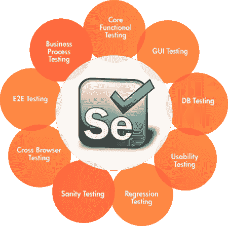
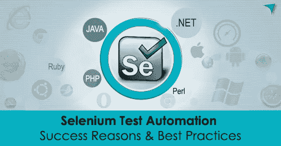

# 初学者的 10 个最佳 Selenium 教程[2023 年 3 月]——在线学习 Selenium

> 原文：<https://medium.com/quick-code/top-tutorials-to-learn-selenium-for-beginners-4e1f301585?source=collection_archive---------1----------------------->

## 学习 Selenium，成为更好的测试开发人员和质量工程师，拥有 2023 年面向初学者的最佳 Selenium 教程。

Selenium Webdriver 是最知名的测试框架之一。它是一个开源项目，允许测试人员和开发人员开发功能测试来驱动浏览器。 **Selenium Webdriver** 可以在任何支持 JavaScript 的浏览器上工作，因为 Selenium 是使用
JavaScript 构建的。

## 1. [Selenium Webdriver 完整课程—构建框架](https://click.linksynergy.com/deeplink?id=Fh5UMknfYAU&mid=39197&u1=quickcode&murl=https%3A%2F%2Fwww.udemy.com%2Fselenium-with-c%2F)

世界上排名第一的 Selenium WebDriver 课程帮助您在没有任何先验知识的情况下创建一个测试自动化框架。

因为没有人教 QA 工程师如何使用 Selenium WebDriver 构建一个令人惊叹的测试自动化框架，所以我决定这么做。

完整的 Selenium WebDriver with C#课程由专业人员精心制作，旨在将一个完全的初学者变成最伟大的自动化测试工程师。通过本课程，您将能够在几分钟内编写 Selenium WebDriver 测试！

你的硒测试将易于阅读和理解。编写测试将经得起时间的考验。

一切都是精心策划和执行的高质量视频教程。教程中充满了实际应用的练习，以确保更高的保持率。

什么是自动化测试？

*   学习一点关于测试自动化的知识，以及如何在不考虑工具的情况下做好它。

什么是 Selenium WebDriver？

*   理解什么是 Selenium WebDriver 以及为什么使用它

如何为课程安装正确的工具？

*   学习课程工具的正确安装

硒元素鉴定

*   掌握识别任何网页元素所需的关键技能

鼠标和键盘交互

*   理解使用鼠标和键盘交互进行拖放等操作的重要性

隐式和显式等待

*   了解何时使用一个而不是另一个

自动化测试最佳实践

无论您使用什么工具，您都需要了解自动化的最佳实践，这将使您的任何测试都非常稳定。掌握四个重要的规则和原则:

*   单一责任原则
*   不要重复你自己
*   页面对象模式
*   验收测试驱动的自动化

两个 Web 应用的 Selenium WebDriver 自动化框架

*   使用一个应用程序来练习 WebDriver 自动化框架的发展——在一个 web 应用程序上练习，这将教你如何随着时间的推移维护你的测试自动化代码。你的代码将坚如磐石。
*   使用第二个应用程序来实践 Selenium WebDriver 框架组织——在第二个 web 应用程序上执行测试自动化，您将学习如何为您的框架创建不同的特性和测试。您的测试架构和组织将完美无瑕。

创建日志和报告

*   只需即插即用—随着您学习如何轻松快速地创建漂亮的 HTML 报告和日志，您的框架将更上一层楼。

C#

*   网站上唯一的 C#教程是专门为使用 Selenium WebDriver 的测试自动化工程师设计的。掌握非凡的测试自动化所需的一切。不要把时间浪费在你不需要学习的课程上。

其他课程特色

*   利用硒网络驱动程序 3.0+
*   利用最新的自动化测试框架

## 2.[Java se WebDriver-从基础到高级&访谈](https://coursesity.com/r/site/selenium-webdriver-with-java--basics-to-advancedframeworks)

加入我们吧-“排名第一的大师硒 java 课程——36，000 多名学生通过出色的协作共同学习。

本课程包括 Java basic core+Selenium web driver+Advanced Selenium+面试准备+框架设计(TestNG、ANT、Pageobject、Maven、Jenkins、Excel Datadriven、黄瓜、log 4j)+Selenium Grid+DataBase Testing+Selenium 脚本性能测试+移动测试基础+简历准备，包括“生存时间支持(按需 skype 会话)+材料+工作帮助”(-美国、印度、加拿大)

**主题包括:**

1.  硒的设计
2.  Java OOPS
3.  网络驱动程序架构基础
4.  硒的折旧版本中的循环孔
5.  火狐、Chrome、IE 中的网站端到端
6.  Webdriver API 方法
7.  在所有支持的浏览器中自动化 Web 应用程序的实例
    使用高级 WebDriver API 处理富 Web UI 的策略
8.  我们在网络驱动程序和解决方案中面临的实时挑战
9.  硒网格跨浏览器测试
10.  硒负载试验
11.  硒的流动检测
12.  硒的数据库测试
13.  框架设计(TestNG，ANT，PageObject，Maven，Jenkins，Excel Datadriven，cuple，log4j)

## 3.【Java 语言硒网络驱动程序

本课程将帮助您学习使用 Webdriver (Selenium 2.0)测试 web 应用程序的高级技术。

第一章

1.在 Eclipse 中配置网络驱动程序
2。使用网络驱动程序
3 运行示例代码。火狐个人资料，网络驱动程序设计功能类
4。关闭并退出，HTMl 单元驱动程序

第二章

1.Xpath 及其在 Webdriver 中的用法
2。Xpath 函数，绝对和相对 XPath
3。Xpath 查找链接，按钮，输入框，单选按钮，复选框

第三章

1.WebDriver，WebElement 接口
2。使用选择类
3 处理下拉列表。用 selenium Webdriver
4 截图。查找页面上是否存在对象

第四章

1.隐式和显式等待
2。WebDriverWait 类
3。预期条件类
4。等待条件

第五章

1.处理多个浏览器窗口
2。处理 JavaScript 警告
3。用 Webdriver
4 附加文件。JavaScriptExecutor 执行器

## 4.[Selenium web driver-使用元素](https://click.linksynergy.com/deeplink?id=Fh5UMknfYAU&mid=39197&u1=quickcode&murl=https%3A%2F%2Fwww.udemy.com%2Fselenium-working-with-elements%2F)

使用 Selenium WebDriver 掌握 web 元素的识别、操作和查询。

本课程是关于在 Selenium WebDriver 中使用 web 元素的完整指南。完成本课程后，您将知道如何在任何时间、任何 web 应用程序上使用任何 web 元素。

你会学到什么？

*   HTML 基础
*   Selenium WebDriver 的所有不同定位器策略
*   如何使用 Selenium WebDriver 识别 web 元素
*   主 XPath
*   使用 Selenium WebDriver 导航
*   Web 元素操作
*   Web 元素询问
*   Selenium WebDriver 的鼠标和键盘操作
*   执行诸如拖放、绘制、悬停等操作
*   隐式和显式等待
*   如何正确地处理元素标识，使您的测试不容易出错
*   Selenium WebDriver 中的预期条件。

## 5.[面向初学者的带 C#的 Selenium WebDriver 现场测试站点](https://coursesity.com/course-detail/selenium-webdriver-masterclass-with-c)

Selenium 是测试网站最流行的工具！和我以及数百名学生一起学习 Selenium Webdriver 吧！

Selenium Webdriver 是一个免费的 web 应用程序自动化测试工具。它能够与不同的浏览器如 Chrome，Firefox，IE，Opera 一起工作，并模拟类似人类的行为。Selenium 能够与网页中所有不同的元素进行交互。它可以点击它们，输入文本，提取文本等等。通过用 Selenium 测试覆盖网站上所有不同的功能，您将能够快速捕捉新的和重现的旧错误。这将为您的团队节省时间和金钱。

这个课程非常适合于初学者或者想要转向自动化测试的手工测试人员。本课程我们将重点关注图形用户界面和功能测试，我们将学习如何使用各种元素选择器和特殊元素，如:

*   ID、名称、CSS、Xpath 和类选择器
*   文本框、复选框、单选按钮、下拉菜单
*   JavaScript 警告框
*   何时应该使用这些选择器中的任何一个；
*   什么是测试用例/场景
*   如何在测试中使用思维导图

本课程还包括以下讲座:

*   使用*硒*和*苹果*在移动设备上运行测试
*   使用 *Selenium* 和 *NUnit3* 进行并行测试(同时运行多个测试)
*   使用 *Selenium* 和 *NUnit3* 为我们的测试结果生成漂亮的 HTML 报告
*   使用不同的浏览器— *Chrome、Opera、Internet Explorer、Firefox*
*   用*硒*截图
*   使用 PhantomJS 驱动程序和 *Selenium* (我们在这里有一个项目，可以从一个网站下载所有帖子！)
*   处理元素属性(大小、位置、样式，例如改变颜色或使元素消失)
*   使用 *Selenium* 通过 C#执行 Javascript
*   使用浏览器属性(大小、位置、新选项卡/窗口、选项卡/窗口句柄)

## 6.[机器人框架测试自动化—1 级(Selenium )](https://click.linksynergy.com/deeplink?id=Fh5UMknfYAU&mid=39197&u1=quickcode&murl=https%3A%2F%2Fwww.udemy.com%2Frobot-framework-level-1%2F)

最快最简单的 Selenium 测试自动化方法！移动测试自动化，API 测试自动化，还有数据库。淹没在不断扩大的回归测试用例集合中？你需要将它们自动化！如果您因为缺乏 Selenium 编程技能而不敢学习测试自动化，那么您将会激动地发现 Robot Framework 将会多么容易地允许您自动化您的测试。

Robot Framework 是一个预先构建的测试自动化框架。相比之下……Robot Framework 比 Selenium Webdriver(用 Java、Python、C#或 PHP)好学多了，因为你的脚本是用英文单词而不是代码写的。

如果你已经是 Selenium Webdriver、Cucumber 或 QTP/UFT 的资深用户，你会很快了解到与这些工具相比，机器人框架是多么优雅和强大。

这个 5 个多小时的视频课程将:

*   概述免费的开源机器人框架测试自动化工具
*   教你如何安装和配置 Robot Framework 以及 Selenium、API、数据库等库
*   帮助您在几分钟内创建并运行您的第一个 Selenium 测试自动化脚本
*   向您展示如何更容易地创建 Selenium Webdriver 测试自动化脚本
*   向您展示如何使一个简单的测试自动化脚本更加高效和可读
*   帮助您发现变量和页面对象如何使您的测试自动化脚本更加灵活
*   带您了解测试 web (Selenium)、API、数据库、XML 和文件测试的基础知识

## 7.[带 Java 的 Selenium WebDriver 新手到忍者+面试](https://coursesity.com/r/site/selenium-webdriver-with-java-novice-to-ninja-interview)

本课程包括广泛的主题，包括 Selenium WebDriver 基础和高级、Java 概念、TestNG 框架、自动化框架设计(页面对象、页面工厂、数据驱动、读取 Excel 文件)、Log4j 日志、最佳报告工具—高级报告、Selenium Grid 2.0 的跨浏览器测试、Maven 构建管理、与 Jenkins 的持续集成、Git 与 Jenkins 的集成、数据库测试、性能测试、使用 Cucumber 的行为驱动测试、Sauce Labs 集成、面试准备。所有材料，包括代码文件。

我们从如何用 Java 编码开始，然后学习 selenium、TestNG、selenium grid、log4j、maven、jenkins、数据库测试、性能测试、使用 cucumber 和 gherkin 语言的行为驱动测试。

主题包括:

*   Selenium Webdriver 3.x
*   详细的 Java 概念
*   测试框架
*   高级报告
*   使用 Log4j 的日志基础设施
*   页面对象模型
*   页面工厂框架
*   数据驱动框架
*   使用 Selenium Grid 2.0 在远程机器上执行测试
*   使用 Maven 进行构建管理
*   与 Jenkins 的持续集成
*   数据库测试
*   性能试验
*   使用黄瓜和小黄瓜语言的行为驱动测试

## 8.[Selenium web driver 中的页面对象模式](https://click.linksynergy.com/deeplink?id=Fh5UMknfYAU&mid=39197&u1=quickcode&murl=https%3A%2F%2Fwww.udemy.com%2Fselenium-webdriver-page-objects%2F)

通过学习页面对象模式，极大地稳定您的自动化测试。

本课程旨在教你如何使用 Selenium Webdriver 和 C#正确编写页面对象模式。

然而，这里的所有信息同样适用于任何其他功能测试工具，因为页面对象模式是一个通用的原则，它使得测试自动化更加健壮。类似于不重复自己或单一责任原则等其他普遍概念。

因此，如果你知道面向对象编程和不同的功能自动化工具，你仍然可以轻松地遵循我在本课程中列出的所有原则和模式。

你会学到什么？

*   为什么其他的方法，比如记录和重放或者关键字驱动，在自动化测试中不起作用
*   自动化中的页面对象模式是什么
*   页面对象的优点和缺点
*   如何使用 Selenium Webdriver 实现页面对象
*   如何提高你的页面对象遵循干燥原则
*   如何改进页面对象以遵循 SRP 原则
*   如何为巨大的网页创建惊人的页面对象

## 9.[从头开始完成 Selenium WebDriver:构建框架](https://click.linksynergy.com/deeplink?id=Fh5UMknfYAU&mid=39197&u1=quickcode&murl=https%3A%2F%2Fwww.udemy.com%2Fselenium-webdriver-web-based-automation-testing%2F)

Selenium 混合框架& Cucumber BDD 框架设计，Selenium WebDriver 用 Java，TestNG，Maven 用 Jenkins。

*   Selenium 网络驱动程序培训—专家级
*   具有所有高级概念的 TestNG/sele liun web driver
    Selenium 网格
*   JUnit / TestNG、ANT、报告生成、批处理执行
    SVN 和 MAVEN
*   Git，GitHUB
*   持续集成—詹金斯/哈德森
*   数据驱动框架
*   混合(关键字+数据驱动)框架
*   带有工厂的页面对象模型
*   酱油实验室集成
*   硒 3.0 —硒机器人
*   黄瓜框架设计

## 10.[为测试人员完成一步一步的 Java】](https://click.linksynergy.com/deeplink?id=Fh5UMknfYAU&mid=39197&u1=quickcode&murl=https%3A%2F%2Fwww.udemy.com%2Fcomplete-java-for-test-automation%2F)

学习 Java 的 A-Z 指南什么最适合您的 Selenium WebDriver 和测试自动化需求。

这是唯一一门与 Java 相关的课程，它很棒，因为它涵盖了自动化所需的适量 Java，但这门课程不涵盖 Selenium WebDriver 或任何其他类型的自动化工具。

这是一门关于 java 编程语言的全面而简单的课程，它专注于 Selenium WebDriver 或任何其他自动化工具所需的 Java 编程概念。

本课程假设你没有编程背景。如果你有一些经验，这只是一个加分点。你从来没有编码，有一些经验或有很多其他编程语言的经验，这个课程是你的一站。

Java 是最有用的编程语言之一，学习它你可以构建 web 应用程序的后端，构建健壮的测试自动化框架。特别是对于 Selenium WebDriver GUI 自动化，Java 是最受欢迎的选择，拥有最大的社区。

本课程结构非常合理:

*   每个讲座包括一个视频截屏和代码文件
*   有测验和家庭作业来测试你的知识
*   高度关注实践和提问
*   您还将学习编码最佳实践

> 感谢您阅读本文。我们策划了更多主题的顶级教程，您可能想看看:

 [## 初学者的 9 个最佳 GraphQL 教程——在线学习 GraphQL

### 用 2022 年最佳新手 GraphQL 教程学习后端开发工作的 GraphQL。

medium.com](/quick-code/top-online-video-tutorials-to-learn-graphql-458056e3b583)  [## 初学者的 9 个最佳 Appium 教程——在线学习 Appium

### 学习 Appium，通过 2022 年面向初学者的最佳 Appium 教程，自动化 android、iOS 和混合移动应用的移动应用测试。

medium.com](/quick-code/top-tutorials-to-learn-appium-for-mobile-automation-testing-8b87ac3bfd69)  [## 面向初学者的 8 个最佳 SoapUI 教程——在线学习 SoapUI

### 学习 SoapUI 创建 web 服务和 REST APIs 的测试自动化，拥有 2022 年面向初学者的最佳 SoapUI 教程。

medium.com](/quick-code/top-tutorials-to-learn-soapui-for-rest-api-testing-1b3e14b1037e) 

披露:我们与本文中提到的一些资源有关联。如果你通过本页的链接购买课程，我们可能会得到一小笔佣金。谢谢你。

> **更新**:我们创建了最新版本的[顶级硒教程](http://blog.coursesity.com/best-selenium-tutorials?utm_source=botsfloor&utm_medium=referral&utm_campaign=mediumPost&utm_term=selenium)。请随意查看年度最佳 selenium 教程。