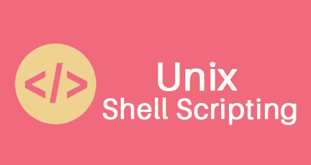
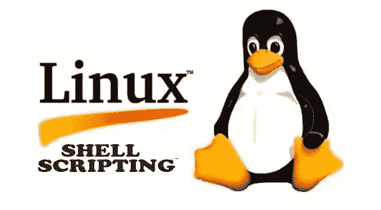
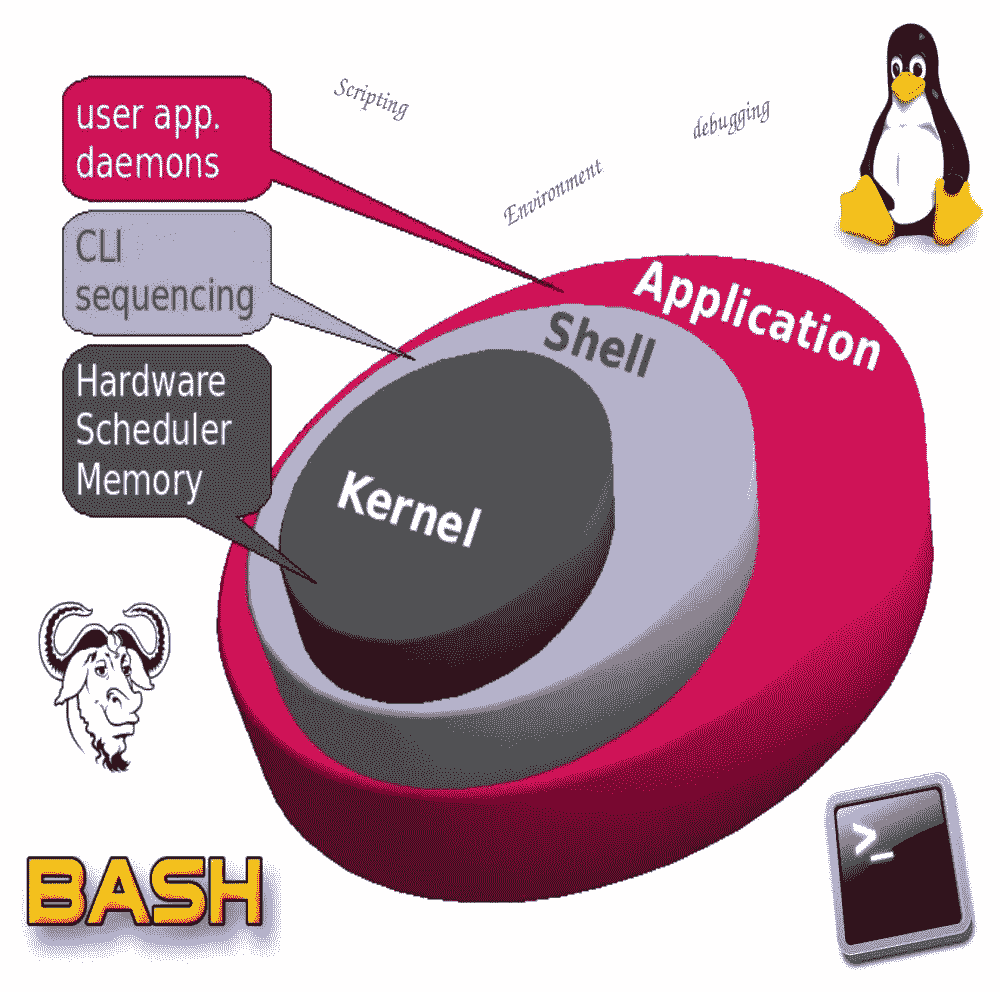
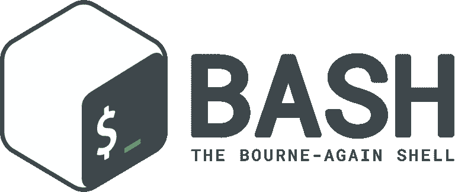
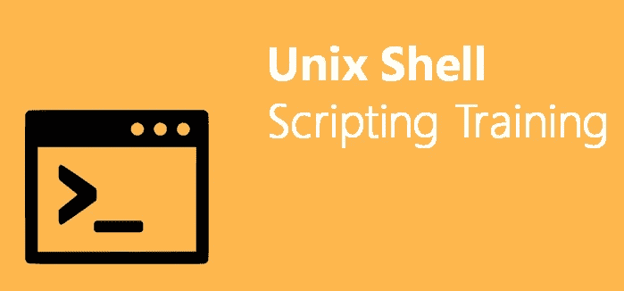
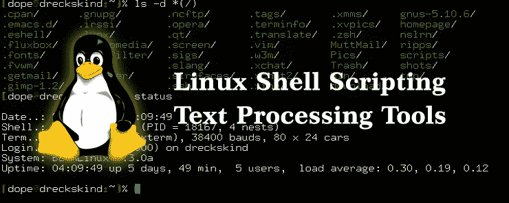

# 初学者的 10 个最佳 Linux Shell 脚本教程[2023 年 3 月]—在线学习 Shell 脚本

> 原文：<https://medium.com/quick-code/top-tutorials-to-learn-shell-scripting-on-linux-platform-c250f375e0e5?source=collection_archive---------0----------------------->

## 学习 Linux shell 脚本，通过 2023 年面向初学者的最佳 Linux shell 脚本教程来帮助自动化日常任务。

Linux 有各种不同的 shell，如 Bourne shell (sh)、C shell (csh)、Korn shell (ksh)、TC shell (tcsh)、Bourne Again shell (bash)。当然，最流行的 shell 是“bash”。Bash 是一个 sh 兼容的 shell，它结合了 Korn shell (ksh)和 C shell (csh)的有用特性。bash 不仅是一个优秀的命令行 shell，它本身也是一种脚本语言。Shell 脚本允许我们使用 shell 的功能，并自动执行许多原本需要大量命令的任务。

Bash shell 是 Linux 操作系统最常见的命令行解释器。它是各种命令行解释器几十年发展的结果，每一个都建立在它的前身的良好特性之上，并增加了自己的改进。

在今天的世界中，脚本在任何地方都取得了进展——从网络设备到超级计算机。一旦您掌握了用于常见管理任务的 Bash，您就可以更容易地学习 Python 或 Perl，因为您已经对 Linux 能做什么和不能做什么有了坚实的基础。

尽管 Bash 不是一种成熟的编程语言，但是由于它的循环、条件、变量以及将多个命令链接在一起的特性，shell 脚本已经不仅仅是命令行表达式的组合。

Bash 脚本将帮助您自动化日常任务并节省宝贵的时间，无论您是系统管理员、Linux 用户还是软件开发人员。Shell 脚本比用任何其他语言编程都要快得多。

## 1. [Linux Shell 脚本:基于项目的学习方法](https://coursesity.com/r/site/linux-shell-scripting-a-project-based-approach-to-learning)

通过基于项目的培训(Bash 脚本、Bash 编程、Grep、Awk 等等)学习如何编写 shell 脚本。

它是基于项目的，这意味着您将编写可以在现实世界中使用的实际 shell 脚本，而不是学习零碎的信息。你有机会立即把你学到的东西用上，这样你就能完全理解并记住它。

在本 Linux shell 脚本课程中，您将学习如何:

*   命名您的 shell 脚本。
*   对您的 shell 脚本使用适当的权限。
*   在脚本中创建和使用变量。
*   使用 shell 内置命令和操作系统命令。
*   充分利用脚本中可用的特殊变量。
*   通过使用 if 语句和执行几种不同类型的测试来做出决策
*   检查命令的退出状态以及为什么需要这样做。
*   使用加密哈希函数
*   创建随机数据，这样您就可以为用户帐户自动生成强密码。
*   利用 for 循环、while 循环和无限循环对一系列数据执行相同的操作或一组操作。
*   控制所有类型的输入和输出。
*   接受来自用户和其他程序的标准输入。
*   重定向标准输出和标准错误。
*   组合标准输出和标准误差
*   使用命令管道
*   执行文本和字符串操作。
*   处理命令行参数
*   创建函数以及何时创建函数。
*   解析、分析和报告日志文件、CSV 文件和其他数据。
*   编写在其他系统上执行命令的脚本。
*   很多，很多，更多…

## 2.[Bash Shell 脚本简介](https://coursera.pxf.io/c/1137078/1213622/14726?u=https%3A%2F%2Fwww.coursera.org%2Fprojects%2Fintroduction-to-bash-shell-scripting&subId1=BotTutorials)

本课程将帮助那些不熟悉 shell 和 shell 脚本的人建立 Bash shell 的基础。

在本课程中，您将学习如何:

*   创建别名。
*   创建 cron 作业。
*   操作文件和目录。
*   编写一个 Bash shell 脚本。

您将学习几个 Bash shell 命令，这些命令将允许您在日常任务中导航和使用 shell。

您还将编写一个 Bash shell 脚本，该脚本将备份一个目录并通过电子邮件发送压缩文件，这是您将介绍的所有命令的高潮。

您将学到定制您的系统的知识，您将有一个坚实的基础来扩展您可以在命令行和脚本中使用 Bash 做什么。

## 3.[学习 Linux Shell 脚本](https://linkedin-learning.pxf.io/c/1137078/646189/8005?u=https%3A%2F%2Fwww.linkedin.com%2Flearning%2Flearning-linux-shell-scripting-2&subId1=quickcode)

Linux shell 脚本是消除重复、枯燥任务的有用工具。脚本使许多工作——从编程到系统管理——变得更容易、更可预测、更有趣。

在本课程中，您将学习:

*   脚本的基础，例如打印到控制台和定义变量。
*   如何阅读和创建脚本来自动化 Linux 中的多种任务。
*   如何创建交互式脚本和处理不良输入数据？

在本课程的帮助下，你将能够阅读和创建脚本来自动化 Linux 中的多种任务。

它首先涵盖了脚本的基础知识，比如打印到控制台和定义变量。然后展示了如何编写接受参数、读写文件和监控其他系统进程的脚本。

另外，您将了解如何创建交互式脚本和处理错误的输入数据。

## 4.[初学 Linux Shell 编程](https://www.eduonix.com/courses/system-programming/linux-shell-programming-for-beginners/UHJvZHVjdC0zMjMyMDA=)

这个 BASH 课程将从基础开始，回答您关于 BASH 和编写 Shell 脚本的任何问题。它将涵盖诸如什么是 shell、什么是 shell 脚本、交互式 shell 和 shell 脚本之间的区别、定制您的 shell、条件语句、循环、命令行选项等等主题。

本课程结束时，您将学会:

*   如何编写文档完整、模块化、高效且复杂的 shell 脚本
*   如何自动化您的日常路由工作
*   牢固掌握一般编程概念，如循环、命令、语句
*   如何有效地编写命令行处理、进程管理甚至操纵命令行功能
*   编程概念的基础，可以帮助您学习高级编程语言，如 Java 或 C#。
*   这个小小的课程包含了这么多内容，对您来说，开始学习 BASH 再合适不过了。立即注册，让我们实现自动化！

## 5.[在企业 Linux 中创建 Shell 脚本](https://pluralsight.pxf.io/c/1137078/424552/7490?u=https%3A%2F%2Fwww.pluralsight.com%2Fcourses%2Fcreating-shell-scripts-enterprise-linux&subId1=quickcode)

对于 Linux 管理员来说，能够创建 shell 脚本是最重要的。本课程教你将枯燥和费力的工作自动化，这样你就可以专注于重要的事情。

该课程包括:

*   自动化枯燥的东西
*   写你的第一个剧本
*   收集用户输入和代码逻辑
*   在脚本中使用函数和循环
*   在 BASH 中构建菜单

在本课程“在 Enterprise Linux 中创建 shell 脚本”中，您将获得 Linux 中 Shell 脚本的基础知识，以帮助您和您的操作员。

首先，您将学习在 vim 中编写有效的脚本和使用快捷方式。接下来，您将发现 BASH 中条件语句的强大功能，它将逻辑引入到您的脚本中，测试用户输入。

最后，您将探索如何为操作员构建菜单，并限制他们只能执行菜单中分配的任务。

学完本课程后，您将掌握 Linux Shell 脚本编写的技能和知识，能够创建部署到您的系统上的脚本。

## 6. [Bash 脚本和 Shell 编程(Linux 命令行)](https://coursesity.com/r/site/bash-scripting-and-shell-programming-course-linux-command-line)

学习针对 Linux、Unix 和 Mac 的 bash 编程。学习如何像专家一样编写 bash 脚本&解决现实世界的问题。

以下是您通过参加这个 *Bash 脚本*课程将获得和学到的东西:

*   编写解决现实问题的 bash shell 脚本的循序渐进的过程。
*   每次创建 bash 脚本时必须做的第一件事。
*   如何快速找到并修复最常见的 shell 脚本错误。
*   对于那些想马上开始编程的人，请观看两个视频 shell 脚本速成课程。如果您除了观看这两个视频之外什么也不做，那么您将领先于大多数 bash 程序员。
*   如何接受用户的输入，然后根据输入做出决定。
*   如何接受和处理命令行参数？
*   有哪些特殊变量可用，如何在 shell 脚本中使用它们，以及何时使用。
*   shell 脚本创建检查表——您再也不用猜测每个 shell 脚本中包含什么了。只需使用这个简单的检查表。
*   外壳脚本模板(样板文件)。对每个 shell 脚本使用这种格式。它准确地显示了要包含的内容以及所有内容的去向。消除猜测！
*   用解决方案进行练习，这样你就可以马上开始使用你所学到的东西。
*   我个人收藏的 shell 脚本的真实例子。
*   包含演示文稿和课程中使用的脚本的下载。你将能够观察和实验你所学的一切。
*   每个部分之后的测验只是为了确保您学习了 shell 脚本最重要的方面。

您在本课程中学到的内容可以应用于任何 shell，但是重点是 bash shell，您将学到一些真正高级的 bash 特性。同样，无论您使用的是 bash、bourne (sh)、KornShell (ksh)、C shell (csh)、Z shell (zsh)，甚至是 tcsh shell，您都可以很好地运用您在本课程中学到的知识。

## 7. [Bash Shell 脚本:初学者速成班](https://click.linksynergy.com/deeplink?id=Fh5UMknfYAU&mid=39197&u1=quickcode&murl=https%3A%2F%2Fwww.udemy.com%2Fbash-shell-scripting-crash-course-for-beginners%2F)

向初学者学习 Bash Shell 脚本:从命令行开始，以一个真实的 Shell 脚本项目结束。

本课程将让您清楚地了解如何编写 Shell 脚本。在这个课程中，每件事都以缓慢的速度解释，以确保你能理解每件事。

此外，在向您介绍了 Shell 脚本的所有基础知识之后，最后两个部分是基于项目的，在那里，我们将结合您在课程中学到的所有知识来创建一个解决现实世界问题的脚本。

本课程结束时，您将能够编写自己的 Shell 脚本，特别是您将学会如何:

*   使用命令行
*   使用 Shell 脚本自动执行任务
*   在脚本中创建和使用变量
*   使用 if-else 语句进行决策
*   基于字符串、变量或文件做出决策
*   使用算术表达式
*   用“for”和“while”循环遍历文件和文件夹
*   使用功能
*   处理变量范围
*   创建解决现实世界问题的 Shell 脚本
*   还有更多…

## 8.[面向初学者的 Linux Shell 编程](https://click.linksynergy.com/deeplink?id=Fh5UMknfYAU&mid=39197&u1=quickcode&murl=https%3A%2F%2Fwww.udemy.com%2Flinux-shell-programming-for-beginners%2F)

掌握 Linux Bash shell 脚本的完整课程。

课程从最开始开始，包括什么是 BASH，什么是 shell，shell 脚本是什么意思，定制您的 shell，shell 脚本和交互式 shell 之间的区别，命令行选项，语句，循环等等。

除了为您提供关于 BASH 和 Shell 脚本的理论信息之外，本课程还将在每个步骤中给出大量示例，让您熟悉脚本的工作原理以及执行某个脚本时会发生什么。此外，还将为您提供教师用来自己尝试的所有脚本。

学习如何编写文档完善、模块化、高效和复杂的 shell 脚本，自动化日常例程，循环、命令和语句等基本编程概念，如何有效地编写命令行处理、进程管理甚至操纵命令行功能。

## 9. [Bash Shell 脚本](https://click.linksynergy.com/deeplink?id=Fh5UMknfYAU&mid=39197&u1=quickcode&murl=https%3A%2F%2Fwww.udemy.com%2Fcomplete-bash-shell-scripting%2F)

Linux Bash 脚本和命令行最佳完整教程。

Bash Shell 脚本是一种非常详细的方法，可以帮助学生熟悉 Bash 编程的概念，并在命令、分析、调试等各种领域帮助学生掌握实际的例子和实践。这些例子是可以下载的。

1.  帮助解决面试问题

2.用 shell 脚本自动化枯燥的东西

3.积累了 Linux 命令行方面的专业知识

4.了解系统内部和引导过程

## 10. [Bash Shell 脚本初学者教程](https://click.linksynergy.com/deeplink?id=Fh5UMknfYAU&mid=39197&u1=quickcode&murl=https%3A%2F%2Fwww.udemy.com%2Fbash-shell-scripting-tutorial-for-beginners%2F)

学习 Bash Shell 脚本来自动化经常执行的任务。

本课程的目标是为您提供关于 **Bash 脚本**的工作知识。我们将从基础开始，从创建我们的第一个 **Bash 脚本**并运行它开始。接下来，您将学习 bash 环境、局部变量、条件语句、函数、循环、case 语句、字符串操作和 co 进程。

## 11. [Bash Shell 脚本和自动化](https://click.linksynergy.com/deeplink?id=Fh5UMknfYAU&mid=39197&u1=quickcode&murl=https%3A%2F%2Fwww.udemy.com%2Fbash-shell-scripting%2F)

Linux 命令行和 Bash Shell 脚本。

1.  学习完整的 linux 和 bash 命令集。
2.  了解如何在 Linux 中实现自动化
3.  学习如何在 Bash Shell 中编程和编写专业的防水脚本。
4.  了解关于 grep、fgrep、egrep 等及其各种用例的详尽细节。
5.  学习并理解 exec 和 shell 重定向以及各种用例。
6.  了解如何利用管道和重定向来满足您的定制需求。
7.  学习 shell 脚本的构造，如数组、退出状态、各种条件语句、开关情况、测试表达式、字符串处理、命令行参数。
8.  详细描述 shell 如何与内核交互，以及什么是用例。了解查找命令和各种变化的详尽细节，如查找可执行文件、零大小文件、特定大小范围的文件、特定日期范围的文件等。
9.  非常详细地了解如何处理专业脚本脚本实践的管道和信号。
10.  学习如何在实践中调试 Shell 脚本，如何成为 Shell 脚本编写的冠军。

本课程深入探讨了各种命令的内部原理，以便理解它们的工作原理，这有助于巩固 shell 脚本知识的基础，并作为一个很好的粘合剂来记忆各种内容。

您还将了解 Unix/Linux 文件和目录层次结构，以及更改文件和目录的权限和所有权的各种方式。

## 12. [Bash Shell 脚本初学者:1 小时学会 Bash！](https://click.linksynergy.com/deeplink?id=Fh5UMknfYAU&mid=39197&u1=quickcode&murl=https%3A%2F%2Fwww.udemy.com%2Fbashshell%2F)

立即学习 shell 编程！像专家一样在 Linux、UNIX、Mac 和 Windows 上自动化和编写 bash 脚本。

本课程逐步介绍了如何使用 Bash Shell 编写程序、自动化任务等等。全部由经验丰富的系统管理员教授。编写你的第一个脚本，变量，cron 自动化，循环等等——这些都是一步一步来的。本课程将为您提供对 Bash Shell 脚本的坚实的理论理解，以及在工作中熟练使用它的实践技能。

你将在本课程中学到什么。

*   首先，您将了解 Bash shell 是什么，以及它是如何发展到现在这个阶段的。
*   然后，当我们用 DigitalOcean 安装一个 VPS 时，你将变得实用，并学习 Bash 中脚本的基本知识，添加像变量、重定向和管道这样的特性。
*   您还将学习如何使用 cron 作业(调度任务)自动化任务，以及 Bash 作为编程语言的高级特性(if…else、循环、函数和用户输入)。

为了把所有的碎片放在一起，也许增加一些新的，有两个案例研究。一个用于安装 subversion 服务器以共享您编写的脚本，另一个案例研究将从 web 服务器(Apache)日志中提取信息，并将它们放入数据库(mysql)。

每个部分都将有一个充满训练问题的练习视频，这样你可以在我们进行的过程中测试和提高你的技能。

## 13.[初学者学习 Linux 中的 Bash Shell](https://click.linksynergy.com/deeplink?id=Fh5UMknfYAU&mid=39197&u1=quickcode&murl=https%3A%2F%2Fwww.udemy.com%2Flearn-bash-shell-in-linux-for-beginners%2F)

本课程教授如何在 Bash shell 中开始 Linux shell 脚本编写。

本课程教授如何在 Bash shell 中开始 Linux shell 脚本编写。本课程的重点是脚本语言本身:使用脚本来自动化常见任务，以及语言中用于控制脚本执行的逻辑。本课程分为两个单元，包含一个多小时的演示和讨论。这是 EDUMobile Academy 的 Linux 系列课程的第二部分。

在本课程的第一单元，我们将探索 shell 环境本身，并涵盖以下主题:

*   一个简单的 hello world 脚本
*   使脚本可执行
*   为什么我们用./运行脚本，以及如何删除它
*   运行脚本以作用于当前运行的 shell
*   变量以及如何使用它们
*   的。bashrc 文件

第二单元介绍脚本命令，尤其是控制流。主题包括:

*   shell 命令的退出状态
*   if 语句和测试
*   处理命令行参数
*   随机数
*   循环(while、until 和 for)
*   案例陈述

## 14.[初学 Linux Shell 编程](https://www.eduonix.com/courses/system-programming/linux-shell-programming-for-beginners/UHJvZHVjdC0zMjMyMDA=)

这个 BASH 课程将从基础开始，回答您关于 BASH 和编写 Shell 脚本的任何问题。它将涵盖诸如什么是 shell、什么是 shell 脚本、交互式 shell 和 shell 脚本之间的区别、定制您的 shell、条件语句、循环、命令行选项等等主题。

本课程结束时，您将学会:

*   如何编写文档完整、模块化、高效且复杂的 shell 脚本
*   如何自动化您的日常路由工作
*   牢固掌握一般编程概念，如循环、命令、语句
*   如何有效地编写命令行处理、进程管理甚至操纵命令行功能
*   编程概念的基础，可以帮助您学习高级编程语言，如 Java 或 C#。
*   这个小小的课程包含了这么多内容，对您来说，开始学习 BASH 再合适不过了。立即注册，让我们实现自动化！

## 15. [Shell 脚本:了解如何自动化命令行任务](https://coursesity.com/course-detail/shell-scripting-discover-how-to-automate-command-line-tasks)

学习 Linux、Unix 和 Mac 的 shell 编程。学习如何像专家一样编写 shell 脚本&解决现实世界中的问题。

本课程结束后，您将能够轻松创建 shell 脚本。您将学习如何在 Linux、Unix 或 MAC 系统上，将乏味且重复的任务转化为节省时间并简化生活的程序。

以下是您通过参加本 *Shell 脚本*课程将获得和学到的内容:

*   编写解决实际问题的 shell 脚本的循序渐进的过程。
*   每次创建 shell 脚本时必须做的第一件事。
*   如何快速找到并修复最常见的 shell 脚本错误。
*   对于那些想马上开始编写脚本的人，请观看两个视频 shell 脚本速成课程。如果你除了看这两个视频之外什么也不做，你将领先于大多数 shell 程序员。
*   如何接受用户的输入，然后根据输入做出决定。
*   如何接受和处理命令行参数？
*   有哪些特殊变量可用，如何在 shell 脚本中使用它们，以及何时使用。
*   shell 脚本创建检查表——您再也不用猜测每个 shell 脚本中包含什么了。只需使用这个简单的检查表。
*   外壳脚本模板(样板文件)。对每个 shell 脚本使用这种格式。它准确地显示了要包含的内容以及所有内容的去向。消除猜测！
*   用解决方案进行练习，这样你就可以马上开始使用你所学到的东西。
*   我个人收藏的 shell 脚本的真实例子。
*   包含演示文稿和课程中使用的脚本的下载。你将能够观察和实验你所学的一切。
*   每个部分之后的测验只是为了确保您学习了 shell 脚本最重要的方面。

您在本课程中学到的内容可以应用于任何 shell，但是重点是 bash shell，您将学到一些真正高级的 bash 特性。同样，无论您使用的是 bash、bourne (sh)、KornShell (ksh)、C shell (csh)、Z shell (zsh)，甚至是 tcsh shell，您都可以很好地运用您在本课程中学到的知识。

此外，您将能够在任何 Linux 环境下使用这些脚本，包括 Ubuntu、Debian、Linux Mint、RedHat、Fedora、OpenSUSE、Slackware、Kali Linux 等等。你的脚本甚至可以在其他操作系统上运行，比如苹果的 Mac OS X、甲骨文的 Solaris、IBM 的 AIX、惠普的 HP-UX、FreeBSD、NetBSD 和 OpenBSD。

> **更新**:我们创建了最新版本的 [top shell 脚本教程](http://blog.coursesity.com/best-linux-shell-scripting-courses?utm_source=botsfloor&utm_medium=referral&utm_campaign=mediumPost&utm_term=shell-script)。请随意查看本年度最好的 shell 脚本教程。

> 感谢您阅读本文。我们策划了更多主题的顶级教程，您可能想看看:

 [## 10+最佳 Kubernetes 初学者教程—在线学习 Kubernetes

### 用 2022 年最好的 Kubernetes 初学者教程学习 Kubernetes 的容器管理。

medium.com](/quick-code/top-tutorials-to-learn-kubernetes-e9507e76d9a4)  [## 学习 Kali—面向初学者的顶级 Kali Linux 教程—[2022 年更新]

### 了解 Kali for Linux 以及它如何与初学者的最佳 Kali 教程一起工作

medium.com](/quick-code/top-tutorials-to-learn-kali-linux-for-beginners-131a654b81ad) 

*披露:如果你通过本页的链接购买课程，我们可能会得到一小笔会员佣金。谢谢你。*