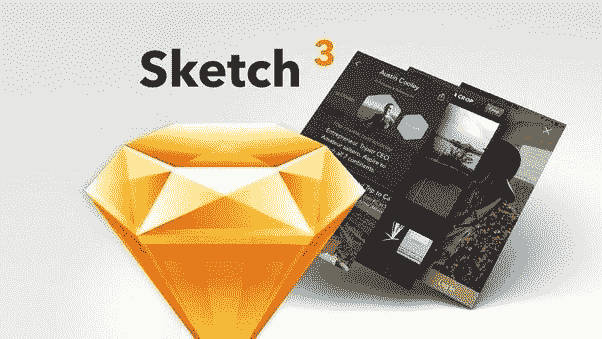

# 10+最佳初学者素描教程——在线学习素描

> 原文：<https://medium.com/quick-code/top-tutorials-to-learn-sketch-for-ui-and-ux-design-ddb0cd7e8a9b?source=collection_archive---------0----------------------->

## 学习素描矢量图形编辑与 2021 年初学者的最佳素描教程

# 1.[使用 Sketch 3、Principle App 和 Flinto 的 UI 动画](https://click.linksynergy.com/deeplink?id=Fh5UMknfYAU&mid=39197&u1=quickcode&murl=https%3A%2F%2Fwww.udemy.com%2Fui-animation%2F)

学习使用 Sketch，Flinto，Principle，漫威和 Invision Craft 插件制作 UI 动画和微交互原型。

在本课程中，您将学习如何使用 Sketch 3 设计 web 和移动产品。您还将学习如何使用业内最新的应用程序(如 Flinto、Principle、漫威应用程序和 Invision 的 Craft 插件)构建完整的流程和微交互原型。这个课程最酷的部分是学习如何创建详细的 UI 动画，以及如何将它们应用到你的项目中。

这门课教-

*   学习素描的基础和一些高级技巧
*   为移动设备和网络创建逼真的原型
*   使用 Flinto 创建 UI 动画和微交互
*   使用 Principle 创建 UI 动画和微交互
*   使用漫威应用程序创建简单的原型

本课程分为不同的部分，因此您可以根据自己的技能水平进行选择。您将能够学习如何使用工具从头开始制作自己的设计。您还将在实践中学习，亲身体验更高级的项目。

本课程涵盖了基础知识，但也详细介绍了我在日常工作流程中使用的一些高级功能、技巧和插件。你将从事一些很酷的项目，你将能够制作原型并在移动设备和网络上分享。您将做一些 UI 动画和微交互，使您的原型看起来非常逼真。

Sketch 3 是一款专注于用户界面和用户体验设计的设计工具。由于其简单性，它非常适合于为多种移动设备进行设计，从事响应式 web 设计，以一种简单的方式交付资产，并使与开发人员的协作令人惊叹。

Flinto 可以让设计师快速制作他们的移动、桌面或 web 应用程序的交互式原型，带有自定义动画和手势。漫威的这个简单的编辑器可以让你在几秒钟内将所有的设计链接在一起，然后添加手势和过渡，让你的原型感觉就像一个真正的应用程序或网站。

# 2.[UX 设计草图](https://linkedin-learning.pxf.io/c/1137078/646189/8005?u=https%3A%2F%2Fwww.linkedin.com%2Flearning%2Fsketch-for-ux-design-2&subId1=quickcode)

了解如何使用这款流行的矢量应用为数字设备和屏幕打造引人注目的用户体验。

该课程包括:

*   创建线框
*   视觉设计和符号
*   图书馆
*   原型制作和协作
*   出口和资产管理

在本课程中，您将逐步了解一个示例移动应用程序的设计流程，完成草图工作流程中的每个阶段。

了解如何使用形状、文本和图形工具创建线框来可视化您的概念；构建可重复使用的符号；并融入风格和视觉效果。

然后，本课程将展示如何将您的设计转化为可点击的原型，以便在移动设备上直接查看。

最后，学习如何导出您的资产并生成风格指南和设计系统，以保持您的产品一致和设计同步。

在这一过程中，该课程介绍了各种有用的插件和配套软件，如 Sketch Measure、Zeplin、Zeroheight 和 InVision，它们将扩展您使用 Sketch 的工作和协作方式。

# 3.[草图基础](https://pluralsight.pxf.io/c/1137078/424552/7490?u=https%3A%2F%2Fwww.pluralsight.com%2Fcourses%2Fsketch-fundamentals&subId1=quickcode)

从传统创意人员到经验丰富的开发人员，理解和创建用户界面是一项非常有价值的技能，而 Sketch 正在这个新兴行业中引领潮流。

该课程包括:

*   素描及其界面入门
*   创建和修改基本矢量形状
*   添加对象和存储预设
*   素描的支柱:符号
*   原型设计和设计预览
*   使用库和导出文件

在本课程“草图基础”中，您将了解到草图提供的所有功能。

首先，你将学习设计布局和创建交互式原型。然后，您将探索如何导出生产就绪资产。

最后，您将发现如何利用可重用组件的力量，以及如何在团队中使用共享库。

一旦你完成了这个课程，并且尝到了用户界面设计变得多么流畅的滋味，你会想为什么你没有早点掌握这些技能；无论你想在哪个平台上成为专业人士，从移动应用到网页设计，甚至是游戏界面！

# 4.[草图三手机 App 设计:UX 和 UI 设计从零开始](https://click.linksynergy.com/deeplink?id=Fh5UMknfYAU&mid=39197&u1=quickcode&murl=https%3A%2F%2Fwww.udemy.com%2Fthe-complete-design-course%2F)

使用 Sketch 3 从头开始设计移动应用。主草图 3，UX 方法论，图标设计，用户界面设计。

使用 Sketch 3 学习用户体验、应用程序设计和工具的基础知识，在应用程序或 google play 商店上构建最漂亮和用户友好的移动应用程序。用这个教程为初学者建立 Sketch 3 和用户体验设计的强大基础。

在本课程中，您将学习

*   从头开始创建移动应用程序设计
*   考虑 UX 因素的应用程序设计方法
*   了解 UX 研究的最佳实践
*   掌握平面设计师的最新计划，草图 3
*   创建自定义图标包
*   作为一名 UI/UX 设计师开始新的职业生涯

这门课程非常适合零设计经验的人，或者想学习和掌握 Sketch 3 的有经验的设计师。内容比任何其他素描课程都多，你将学习应用程序设计基础，并对以用户为中心的设计背后的概念有很好的理解。在整个课程中，我们会提供额外的资源、测验和作业来不断测试你的知识。

从对 Sketch 3 界面的介绍开始，它将很快直接进入设计我们的第一个移动应用程序屏幕。通过边做边学，您将对基本的草图功能和工具有一个深刻的理解。

本课程将带你了解我们所谓的素描学校 101 和 UX 学校 101。在这些章节中，你将学习掌握 Sketch 3 所需的一切，以及用户体验研究和应用的基本原理。

然后，是时候应用我们的知识和新获得的技能来创建我们自己的应用程序了，从创意、研究、模拟、设计，最后是原型制作和向开发人员部署资产。

这个课程是为平面设计新手设计的，一直到想学习素描 3 的专家

# 5.[从头到尾素描:成为一名 App 设计师](https://click.linksynergy.com/deeplink?id=Fh5UMknfYAU&mid=39197&u1=quickcode&murl=https%3A%2F%2Fwww.udemy.com%2Flearnsketch3%2F)

使用 Sketch 设计移动应用的综合指南。从头到尾学习设计一个 app。

本课程将教你使用 Sketch 3 程序设计动态的、开发就绪的移动应用程序用户界面，给客户留下深刻印象并吸引用户。

掌握素描的基本原理和工具。发现能增强你的创造潜力的设计技巧。学习和实现 UI 最佳实践，以确保质量和可用性。通过创建一个示例移动应用程序，完成从概念到完成的旅程。

无论你是初学者还是有 Photoshop 和 Illustrator 使用经验的资深设计师，你都会发现本课程的价值在于它将一步一步的指导与可定制的实践相结合。本课程将教你布尔运算的基础知识，以及 Sketch 中的许多其他高级设计技术。

本课程涵盖了从图层、形状和样式到文本编辑到导出完成的项目的所有内容。

在本课程中，您将了解到，

*   设计应用程序的用户界面
*   使用用户界面设计最佳实践
*   利用工具确保像素完美的设计工作
*   将完成的设计打包发送给开发人员进行构建

学习使用 Sketch 强大的工具和流畅的工作流程设计漂亮、高质量的移动应用程序 UI。本课程非常适合 Photoshop 或 Illustrator 用户。

# 6.[动手素描 4 大师班——学习网页和移动设计](https://click.linksynergy.com/deeplink?id=Fh5UMknfYAU&mid=39197&u1=quickcode&murl=https%3A%2F%2Fwww.udemy.com%2Fhands-on-sketch-4-masterclass-learn-web-and-mobile-design%2F)

手机，网站和标志设计草图 4。流行的插件，具有挑战性的项目和资源。

本课程将带你一步一步地了解素描的基础知识，并向你展示如何设计移动应用程序屏幕、网页、徽标等等。

有了这门课-

*   掌握平面设计最热门的程序之一
*   获得创建应用程序屏幕、徽标和网页的技能和信心
*   了解插件并提高您的工作效率
*   导出您的设计并发送给客户或开发人员
*   通过设计挑战和任务测试你的技能

本课程涵盖以下主题:

*从基础开始*:学习绘制和操作形状，组织你的工作空间，操作图像和定制字体。

*杂志封面项目* ***:*** 我们将集思广益，收集灵感和定制字体，创建一个线框，然后创建我们的最终设计。

*网页项目*:跟随我们为一个畅销网页模板从头到尾重新创建内容。

*移动应用程序屏幕*:学习构建最流行的移动应用程序界面的技术。

*徽标*:一步一步地创建十几个徽标。

完成本课程后，你将有信心和现实世界的经验，开始创造自己的设计草图。

# 7.[用草图 3 掌握手机 App 设计](https://click.linksynergy.com/deeplink?id=Fh5UMknfYAU&mid=39197&u1=quickcode&murl=https%3A%2F%2Fwww.udemy.com%2Fsketch-design%2F)

了解如何使用 Sketch 3 为初学者设计移动应用程序

用 Sketch 3 掌握手机 app 设计，将带你从绝对初学者到流畅的手机 App 设计师。除了学习 Sketch 应用程序，您还将学习核心设计原则，您可以将这些原则应用到任何设计工具中。

你从学习草图 3 的基础开始。然后，您将继续设计更高级的应用程序。当你开发应用程序时，你也可以完成练习，这样你就可以记住你刚刚学到的东西。

课程结束后你会知道，

*   流利地使用草图 3
*   知道如何做手机应用程序设计
*   使用 Sketch 3 为 iOS 应用和 Android 应用创建设计

# 8.[草图 3:学习创建手机和网页设计](https://click.linksynergy.com/deeplink?id=Fh5UMknfYAU&mid=39197&u1=quickcode&murl=https%3A%2F%2Fwww.udemy.com%2Flearn-sketch-design%2F)

了解 Sketch 的最新版本，让每个人都能快速创建设计和原型。学素描 3 设计。

了解如何使用 Sketch 3 轻松快速地为手机和网站创建设计。这个课程一步一步地教你如何获得素描的所有力量和最新添加到设计大师的应用程序和网站的力量。不到一个小时你就要开始设计了。

在本课程中，

*   从零到高级水平学习使用素描
*   掌握素描与先进的技术和技巧
*   利用逐步解决方案完成设计挑战
*   数百种资源加速您的设计过程
*   完成关于向量的额外课程
*   学习如何组织你的工作
*   从有经验的档案中学习
*   将草图设计导出到 HTML + CSS 的完整过程
*   真实设计的循序渐进的例子
*   导出资源，导入并在 Xcode 和 Framer 中使用它们
*   了解最新的 iOS9 趋势以及如何通过 Sketch 轻松应用它们

Sketch 是一款新工具，可以让您快速轻松地为移动设备和网络、Android iPhone 或 Windows phone 创建设计。了解如何按照我的方法快速使用应用程序，并准备好以一种非常简单的方式快速创建设计。

这门课程包括你开始设计所需要知道的一切。即使你是一个新手或专家，你也能完成这门课程，因为你将会学到矢量的基础知识和更高级的技巧。

本课程面向设计师、UX、自由职业者、开发人员或所有喜欢以简单和现代的方式进行设计的人。

# 9.[从零开始学素描 3 手机 App 设计](https://click.linksynergy.com/deeplink?id=Fh5UMknfYAU&mid=39197&u1=quickcode&murl=https%3A%2F%2Fwww.udemy.com%2Flearn-sketch-3-graphic-design-from-scratch%2F)

了解 Sketch 3 移动应用程序设计应用程序，并立即取消那些 Adobe CS 订阅。

了解素描 3 设计的来龙去脉。获得设计原则的基础知识。使用草图 3 进行平面设计的各个方面。在 Mac 上创建你自己的模拟脸书应用程序，即时，简单的移动应用程序。

本课程将教你在 Sketch 3 上创建移动应用所需的一切知识。你也将从整体上获得设计原则的扎实知识，这些知识也可以在其他平台上广泛使用。

本课程开始时，您将掌握在 Sketch 3 上构建和导出项目的基础知识。您将学习如何获得设计模板并编辑它们以创建独特的设计。您将了解如何处理页面和跨页面应用样式，以及如何处理形状和符号、创建图标和闪屏，以及 Sketch 3 中包含的各种其他工具。

本课程教授:

*   模拟移动应用程序
*   设计引人入胜的图标
*   创建闪屏
*   利用草图 3 进行平面设计的各个方面
*   理解并应用基本的设计原则

在整个课程中，你将根据脸书的功能和设计构建自己的模拟应用程序。完成后，你将具备在 Sketch 3 上创建各种功能和设计各异的移动应用所需的知识。

# 10.[素描 App —现代 UI 设计](https://click.linksynergy.com/deeplink?id=Fh5UMknfYAU&mid=39197&u1=quickcode&murl=https%3A%2F%2Fwww.udemy.com%2Fsketch-app-modern-ui-design%2F)

为应用和网络设计用户界面

*   在草图中创建用户界面
*   设计一个网络应用程序
*   设计一个移动应用程序
*   大师素描 App

本课程旨在向您展示 Sketch 的全部功能，教您如何最好地利用其潜力。有些主题最好在几节理论课中介绍，例如导出图形。其他的，比如为一个新项目准备资源，在实践中可以得到更好的解释。

第一部分是一个大大压缩的数百个重要技术，关键的捷径，提示和窍门的纲要。因为视频中凝聚的知识是多么的浩瀚，所以用快速旁白记录下来。

课程的后半部分着重于在移动优先方案中设计一个完整的项目。它将作为你必须学习并在实际项目中使用的特定技术组合的试验场。

学习课程的两个部分将教会你所有必要的理论概念，并使你具备日常项目工作所需的实践技能。

# 11. [UI/UX 设计:设计草图 4 和 Flinto 中的 Grab 手机 App](https://click.linksynergy.com/deeplink?id=Fh5UMknfYAU&mid=39197&u1=quickcode&murl=https%3A%2F%2Fwww.udemy.com%2Fgrab-mobile-app-design-in-sketch-4-and-flinto%2F)

使用 Sketch App 和 Flinto For Mac 从头开始设计 Grab 移动应用程序并制作原型

在本课程中，您将学习如何使用 Sketch app 为 Grab 制作设计移动应用程序。你将知道如何抓取应用程序的工作原理，以及如何使用 Flinto 为 UX 设计原型这个应用程序。在课程结束时，您将有许多屏幕设计，还有关于 Grab 应用程序的视频。你可以把它们用在你的作品集里，或者在你想申请 UI 或 UX 设计师的工作时帮到你。

本课程涵盖了用户界面和 UX 如何协同工作，学生还将学习如何使用 Sketch App 和 Flinto for Mac 为用户界面设计制作漂亮的布局，并了解用户界面指南课程。

# 12.[手机 App 设计从草图 3 开始:UX 和 UI](https://click.linksynergy.com/deeplink?id=Fh5UMknfYAU&mid=39197&u1=quickcode&murl=https%3A%2F%2Fwww.udemy.com%2Fmobile-app-design-from-scratch%2F)

一步一步的指南，学习如何设计一个伟大的移动应用程序。

每一课都代表设计过程中的一个步骤，将应用到我们将要构建的应用程序中，我们将帮助您应用到您自己的想法中。它将教你一个完整的设计工作流程，让你使用 Sketch 3 将你的想法变成一个设计完整、引人入胜的移动应用程序。

*   从头到尾创建一个引人入胜的移动应用程序设计
*   将你的想法变成一个完整设计的产品
*   像专业人士一样使用设计软件(草图)
*   创建图形插图，即使你从来没有画过任何东西

它将首先教你什么是 UX，它如何影响用户界面设计，以及你如何使用 UX 研究技术来制作一个伟大的应用程序。我们将向您展示如何高效地构建应用的首个快速版本，以及如何在设备上进行预览。这会让你习惯素描，我们会给你练习来建立你的设计技能。

然后，它将对你的应用程序的视觉概念起作用，你将了解颜色、字体以及如何正确使用它们。这将允许我们创建我们的应用程序的最终设计，美丽和功能。你甚至会学习如何为应用程序设计图标，并展示你完成的应用程序。

# 13.[用草图制作原型](https://click.linksynergy.com/deeplink?id=Fh5UMknfYAU&mid=39197&u1=quickcode&murl=https%3A%2F%2Fwww.udemy.com%2Fsketch-prototyping%2F)

为网络和移动设备绘制原型:用你学到的草图
创建获奖的原型

*   用草图设计用户界面
*   用草图设计用户体验
*   了解 Sktech 检查员面板
*   用草图操纵排版
*   为草图设计创建配色方案
*   定位设计中的所有元素
*   学习使用页面、画板、选择、移动、删除和锁定图层
*   了解如何使用样式元素
*   了解文本样式和图层样式，知道如何正确应用。
*   了解如何从草图中导出资源
*   了解如何优化资源以快速浏览网页
*   了解如何创建移动界面
*   了解 Sketch 的插件架构
*   介绍给 InVision 的工艺插件
*   理解和使用检查器面板
*   了解如何使用检查器调整对齐
*   向原型设计添加和编辑形状
*   使用草图的遮罩功能
*   使用草图中的布局功能

> 感谢您阅读本文。我们策划了更多主题的顶级教程，您可能想看看:

 [## 10 个最适合初学者的标志设计教程——在线学习标志设计

### 学习如何设计一个标志与 2021 年最佳标志设计初学者教程

medium.com](/quick-code/best-online-tutorials-to-learn-logo-design-ae3ad84ec111)  [## 面向初学者的 10+最佳平面设计教程——在线学习平面设计

### 2021 年，学习平面设计的基础知识及其与最佳初学者平面设计教程的合作

medium.com](/quick-code/top-tutorials-to-learn-graphic-design-fb0f732d892f)  [## 7 个最佳 Figma 初学者教程——在线学习 Figma

### 用 2021 年最好的 Figma 初学者教程学习 UI/UX 设计的 Figma。

medium.com](/quick-code/top-online-tutorials-to-learn-figma-for-ui-ux-design-4e9c6721a72d) 

> 你喜欢邮报吗？
> 
> 给我鼓掌👏！你可以给 clap 50 次，让更多的人发现和知道这个帖子，当然，不要忘记分享。
> 
> 让我们看看掌声！

披露:我们与本文中提到的一些资源有关联。如果你通过本页的链接购买课程，我们可能会得到一小笔佣金。谢谢你。