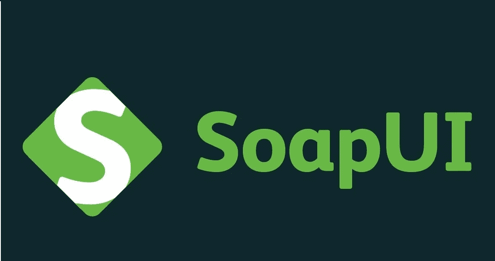

# 面向初学者的 8 个最佳 SoapUI 教程[2022 年 7 月]——在线学习 SoapUI

> 原文：<https://medium.com/quick-code/top-tutorials-to-learn-soapui-for-rest-api-testing-1b3e14b1037e?source=collection_archive---------0----------------------->

## 学习 SoapUI 创建 web 服务和 Rest APIs 的测试自动化 2022 年最好的 SoapUI 初学者教程

Web 服务是通过开放协议(如 HTTP 和 XML)进行通信的应用程序组件。Web 服务测试正在成为质量保证的主要部分。SoapUI 是一个针对 REST 和基于 SOA 的应用程序的 web 服务测试应用程序。使用 SoapUI，您可以通过执行检查、调用、开发、模拟和模仿来测试 web 服务。它对于功能测试、负载和符合性测试也很有用。

# 1.[使用 SoapUI+实时项目进行 web 服务/REST API 测试](https://click.linksynergy.com/deeplink?id=Fh5UMknfYAU&mid=39197&u1=quickcode&murl=https%3A%2F%2Fwww.udemy.com%2Fwebservices-testing-with-soap-ui%2F)

最受欢迎的#1 SoapUI 测试自动化课程。

通过本课程:

*   获得关于 web 服务、API 及其功能的完整知识
*   了解如何使用 SoapUI 测试 web 服务和 REST API
*   能够使用 SoapUI 特性为所有 API 测试开发健壮的自动化脚本
*   学习名为 groovy 的新语言，用 SoapUI 内置方法自动化 web 服务
*   能够为 API 的测试用例开发健壮的自动化框架
*   理解模仿 web 服务的重要性和步骤
*   学习使用 SoapUI 进行数据库测试的基本 SQL 概念和过程
*   使用 SoapUI 清楚地了解安全性测试
*   了解如何为执行结果生成简洁的报告

课程结束后，您将掌握 REST API/web 服务，测试并能在您工作场所成功实施。本课程解释了:

*   什么是网络服务
*   如何使用 Soap UI 测试 web 服务
*   Groovy 脚本概念
*   如何用 Groovy 自动化 Soap UI 中的 web 服务和测试用例
*   Soap UI 和 Soap UI Pro 之间的区别
*   Soap UI pro 特性
*   什么是 rest API
*   测试静态 API
*   使用 Soap UI 进行安全性测试
*   使用 Soap UI 进行数据库测试
*   Soap UI 与 Eclipse 的集成
*   如何模仿网络服务

本课程结束时，您将理解 web 服务规范，并编写各种有效的手动和自动化测试案例(功能/安全/数据库测试案例)，通过使用工具上的不同功能在 SoapUI 中对其进行测试。

6 Best SoapUI Tutorials

# 2.[使用 SoapUI 的 API 测试自动化](https://linkedin-learning.pxf.io/c/1137078/646189/8005?u=https%3A%2F%2Fwww.linkedin.com%2Flearning%2Fapi-test-automation-with-soapui&subId1=quickcode)

本课程旨在帮助您开始使用 SoapUI，并涵盖如何使用它的基础知识。

该课程包括:

*   在 SoapUI 中创建测试
*   在 SoapUI 中使用断言
*   脚本和属性
*   高级 SoapUI 功能
*   将 SoapUI 集成到构建管道中

本课程解释了如何建立你的第一个项目，创建新的测试，执行负载和安全测试，并通过脚本使你的测试更加自动化和高效。

另外，了解如何将 SoapUI 与基于 Docker 的构建管道集成在一起。培训中充满了以真实世界的公共 API 为特色的示例，因此您可以看到 SoapUI 在真实测试场景中是如何工作的。

# 3.[学习 Java 中的 REST 和 SOAP API 测试自动化](https://www.educative.io/courses/learn-rest-soap-api-test-automation-java?affiliate_id=5088579051061248)

在软件开发中，微服务和 API 用于编写业务逻辑。API 测试已经成为测试周期中的一个重要组成部分，因为它可以用来测试功能、集成流程、负载和性能。

该课程包括:

*   API 和 web 服务
*   HTTP 简介
*   REST API 简介
*   放心使用 REST API 自动化
*   SOAP API 简介
*   SOAP API 自动化
*   整合测试
*   诱惑报道
*   手动测试:REST 和 SOAP API
*   API 测试自动化框架

在本课程中，您将学习如何执行 REST 和 SOAP API 测试自动化。

本课程涵盖了从头开始编写 API 和集成测试所需的所有细节。

它也将为你的测试自动化面试做准备。作为课程的一部分，您将能够下载一个示例 API 自动化框架。

您可以使用它来编写模块或应用程序的自动化测试，或者只是扩展和定制它供您自己使用。

# 4.[使用 SoapUI +实时场景进行 Rest API/Web 服务测试](https://click.linksynergy.com/deeplink?id=Fh5UMknfYAU&mid=39197&u1=quickcode&murl=https%3A%2F%2Fwww.udemy.com%2Fweb-services-testing-with-soap-ui%2F)

使用 SoapUI + Groovy 脚本+模拟考试+实时项目+面试问题的 Web 服务测试

在本课程中，您将学习:

*   为 SOAP/RESTFul API/Web 服务编写测试用例。
*   使用 Groovy 编写自动化脚本
*   使用 excel 表格准备测试数据
*   从 Swagger 导入 REST 项目
*   用于实践目的的带有 web 服务的示例项目
*   在 SoapUI 免费/专业版中管理环境
*   生成测试报告
*   面试问题
*   了解数据库(MySQL)基础知识
*   持续集成
*   创建自动化脚本，在不同的环境下从构建工具中执行您的测试用例

在本课程中，你将熟悉使用 Groovy 脚本手动和自动测试 web 服务(基于 SOAP 和 REST 服务)。

# 5. [WebServices/REST API 测试-SoapUI +项目+认证](https://click.linksynergy.com/deeplink?id=Fh5UMknfYAU&mid=39197&u1=quickcode&murl=https%3A%2F%2Fwww.udemy.com%2Fsoapui-with-groovy-with-realtime-projects%2F)

详细的 Groovy + 2 个实时项目+认证范围+ Soapui 教程，Rest API 测试，Soapui 免费&专业

通过本课程，您将成为 SOAP & REST 服务测试方面的专家，并能在您的工作场所成功实施。

本课程涵盖:

*   Xpath 断言
*   XQuery 断言
*   处理 CData 测试运行器对象
*   消息交换对象
*   XML 持有者
*   JSON 解析器认证准备
*   HTML 监控
*   与 ANT 和 Jenkins 的集成

课程的设计方式使得用户不需要事先了解 groovy 和 SoapUI。本课程解释了:

*   什么是网络服务
*   如何使用 Soap UI 测试 web 服务
*   Groovy 脚本概念
*   如何用 Groovy 自动化 Soap UI 中的 web 服务测试用例
*   测试静态 API
*   使用 Soap UI 进行安全性测试
*   使用 Soap UI 进行数据库测试
*   如何模拟 web 服务

本课程结束时，您将能够理解 web 服务规范，并编写各种有效的手动和自动化测试案例(功能/安全/数据库测试案例)，通过使用工具上的不同功能在 Soap UI 中对其进行测试。

# 6.[使用 SoapUI 的 Web 服务测试](https://click.linksynergy.com/deeplink?id=Fh5UMknfYAU&mid=39197&u1=quickcode&murl=https%3A%2F%2Fwww.udemy.com%2Fweb-services-testing-using-soapui%2F)

使用流行的工具 SoapUI 成为 web 服务测试专家。

本课程帮助您:

*   主 SoapUI 测试工具
*   成为 web 服务测试专家

这组 SoapUI 和 Web 服务培训视频涵盖了 SoapUI 的所有基础和高级概念，包括:

*   介绍
*   SoapUI 常见问题
*   安装 SoapUI
*   功能测试
*   使用 SoapUI 进行安全性测试
*   安装本地 web 服务
*   SoapUI 测试结构
*   给初学者的秘密提示
*   使用 SoapUI 的数据驱动测试
*   JDBC 连接
*   Groovy 语言
*   SoapUI 中的 Groovy 脚本
*   创建模拟服务
*   CDATA
*   事件处理程序
*   测试 REST 服务
*   使用 SoapUI 进行负载和性能测试
*   创建自定义报告。

# 7. [SOAPUI API 测试](https://click.linksynergy.com/deeplink?id=Fh5UMknfYAU&mid=39197&u1=quickcode&murl=https%3A%2F%2Fwww.udemy.com%2Fsoapui-from-scratch-step-by-step%2F)

从零开始学习 SoapUI。

在本课程中，学习如何:

*   使用 SoapUI 开源进行 API 测试
*   在 SoapUI 中创建手动和自动化框架
*   使用 Groovy 脚本
*   处理不同的 API 测试需求

所有的会话都是在 SoapUI 开源版本上创建的。本课程将涵盖:

*   什么是 SoapUI
*   下载和开始使用
*   了解 GUI 和功能
*   创建第一个 SoapUI 项目
*   了解项目
*   测试套
*   测试案例和测试步骤
*   断言
*   性能
*   Groovy 脚本
*   命令行执行
*   CI 詹金斯

# 8.[使用 SoapUI(开源)的 API 测试 boot camp](https://click.linksynergy.com/deeplink?id=Fh5UMknfYAU&mid=39197&u1=quickcode&murl=https%3A%2F%2Fwww.udemy.com%2Fapi-testing-bootcamp-with-soapui-opensource%2F)

成为 API 测试的专家——REST、WSDL-SOAP、API 负载测试，用 SOAPUI 模仿所有这些。

在本课程中，您将:

*   深入了解 Soap、REST、Webservices 和 API。
*   使用 SoapUI 来测试 SOAP、WSDL、REST、Webservices &还要编写 groovy 代码来进行验证和确认。
*   使用 SOAPUI 独立完成项目
*   成为 API 测试方面的专家，对 API 测试的所有要素有深刻而丰富的理解。
*   能够创建一个最适合您的项目和数据驱动的方法工作的框架，包括连接您的测试到数据源，如 Excel。

您将学习使用诸如 git 之类的 SCM 还将使用 SOAPUI 访问 github 负载测试中的一个项目，也称为 LoadUI mocking。

> 感谢您阅读本文。我们策划了更多主题的顶级教程，您可能想看看:

 [## 初学者的 10 个最佳 Selenium 教程——在线学习 Selenium

### 学习 Selenium，成为更好的测试开发人员和质量工程师，为初学者提供最好的 Selenium 教程

medium.com](/quick-code/top-tutorials-to-learn-selenium-for-beginners-4e1f301585)  [## 10+最佳 Jenkins 初学者教程-在线学习 Jenkins

### 用 2022 年最佳 Jenkins 初学者教程学习 Jenkins 的测试自动化。

medium.com](/quick-code/top-tutorials-to-learn-jenkins-ci-for-testing-automation-93c7ac068f66)  [## 初学者的 9 个最佳 Postman 教程——在线学习 Postman API 测试

### 用 2022 年最好的 Postman 初学者教程学习 Postman 进行 RESTful API 测试

medium.com](/quick-code/top-tutorials-to-learn-postman-for-rest-api-testing-3bdf9788e0ba) 

***披露:*** *如果您通过本页面的链接购买课程，我们可能会获得一小笔代销商佣金。谢谢你。*