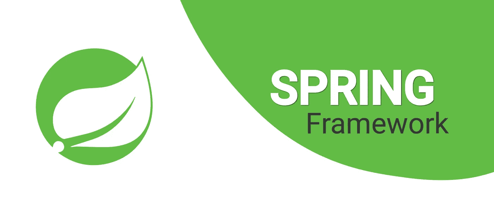
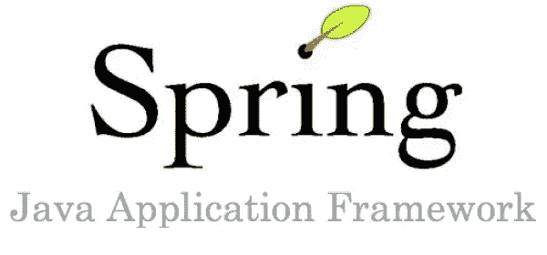
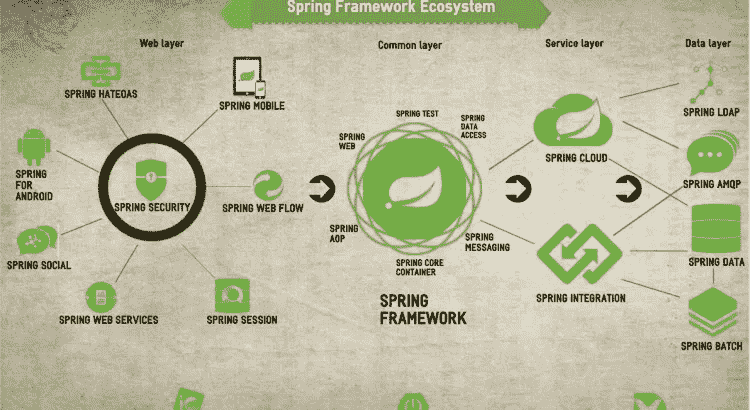

# 初学者的 15 个顶级 Spring 框架教程[2023 年 3 月]——在线学习 Spring

> 原文：<https://medium.com/quick-code/top-tutorials-to-learn-spring-framework-for-the-java-application-12db01d9c288?source=collection_archive---------0----------------------->

## 用 2023 年最好的 spring 初学者教程学习 web 应用开发的 spring 框架。

Spring 是一个企业 Java 框架。它旨在简化 Java EE 开发，并提高开发人员的工作效率。Spring 利用控制反转和依赖注入来促进良好的软件编码实践并加快开发时间。Spring 框架是 Java 平台的应用框架和控制容器的倒置。任何 Java 应用程序都可以使用该框架的核心特性。虽然框架没有强加任何特定的编程模型，但它已经在 Java 社区中流行起来，它包括几个提供一系列服务的模块，但如果你不掌握 Spring 框架，你会错过构建 web 应用程序的机会吗？

> 披露:如果你通过本页的链接购买课程，我们可能会得到一小笔代销商佣金。谢谢你。

## 1.[春天&初学冬眠(包括 Spring Boot)](https://coursesity.com/r/site/learn-hibernate-and-spring-as-a-total-beginner)

Spring 框架 5:学习 Spring 5 核心，AOP，Spring MVC，Spring 安全，Spring REST，Spring Boot 2，百里香叶，JPA & Hibernate。

本课程涵盖了 Spring 核心、注释、所有 Java Spring 配置、Spring AOP、Spring MVC 和 Spring 安全。

Hibernate 是一个对象到关系映射(ORM)框架。它简化了 Java 应用程序的数据库访问。通过使用该框架，您可以通过设置一些简单的配置映射来轻松地存储和检索 Java 对象。

本课程涵盖了基本的 Hibernate CRUD。此外，还包括一对一、一对多和多对多的高级 Hibernate 映射。

本课程将帮助您快速熟悉 Spring 和 Hibernate。我将揭开这项技术的神秘面纱，并帮助您理解从**开始构建一个真正的 Spring 和 Hibernate 应用程序的基本概念。**

在本课程中，您将学习如何:

*   弹簧芯
*   从头开始构建一个完整的 Spring MVC 和 Hibernate CRUD 项目
*   用 Tomcat 和 Eclipse 设置您的 Spring 和 Hibernate 开发环境
*   使用控制反转将 Spring 容器中的 beans 连接在一起
*   为依赖注入配置 Spring 容器
*   使用@Component 注释定义 Spring Beans
*   执行 Spring beans 的自动扫描以最小化配置
*   使用@Autowired 注释自动将 beans 连接在一起
*   将所有 Java 配置应用于 Spring Beans(无 xml)
*   Spring MVC
*   用配置和目录设置 Spring MVC 环境
*   使用@Controller 注释创建控制器
*   使用@RequestParam 读取 HTML 表单数据
*   利用 Spring MVC 模型在控制器和视图页面之间传输数据
*   为 GET 和 POST 请求定义请求映射
*   使用 Spring MVC 表单数据绑定最小化编码
*   对用户输入应用 Spring MVC 表单验证
*   创建自定义 Spring MVC 表单验证规则
*   冬眠
*   使用 Hibernate 执行对象/关系映射
*   利用 Hibernate API 开发 CRUD 应用程序
*   使用 Hibernate 查询语言(HQL)开发查询
*   将 Spring MVC 和 Hibernate 集成到一个应用程序项目中
*   应用高级 Hibernate 映射:一对一、一对多和多对多
*   春季 AOP
*   将面向方面编程 AOP 应用于横切关注点
*   研究 AOP 用例以及 AOP 如何解决代码混乱
*   创建 AOP 切入点表达式来匹配方法调用
*   利用 AOP 注释:@Before、@After、@AfterReturning、@AfterThrowing、@Around
*   在一个项目中使用 AOP 和 Spring MVC 创建一个实时应用程序
*   春天安全
*   使用 Spring Security 保护您的 web 应用程序
*   用兼容的 Spring 安全依赖项设置您的 Maven pom.xml 文件
*   用所有 Java 配置配置 Spring 安全性(无 xml)
*   用引导 CSS 创建定制的 Spring 安全登录页面
*   使用 Spring Security 的默认特性添加注销支持
*   利用 Spring 安全支持来防止跨站点请求伪造(CSRF)
*   为身份验证定义用户和角色
*   使用 Spring 安全标签显示用户登录信息和角色
*   基于用户角色限制对 URL 的访问
*   基于用户角色隐藏和显示内容
*   添加 JDBC 认证，在数据库中存储用户帐户和密码
*   使用 bcrypt 在数据库中存储加密的密码
*   使用 Java 代码注册新用户和加密密码
*   专家
*   使用 Maven 简化您的构建过程
*   创建 Maven POM 文件并添加依赖项
*   在中央 Maven 存储库中搜索依赖关系坐标
*   从 Eclipse IDE 运行 Maven 构建

在春季 5 号学习这些热门话题:

*   弹簧芯
*   弹簧注释
*   Spring Java 配置
*   春季 AOP
*   Spring MVC
*   休眠 CRUD
*   Spring MVC 和 Hibernate CRUD 应用程序
*   Spring Security(在数据库中使用密码加密)
*   专家

Top Java Spring Framework Tutorials

## [**2。用 Java Spring 框架构建云服务**](https://coursera.pxf.io/c/1137078/1213622/14726?u=https%3A%2F%2Fwww.coursera.org%2Flearn%2Fcloud-services-java-spring-framework&subId1=BotTutorials)

本课程通过示例描述了如何通过使用面向对象的设计技术、Java Servlets、Java Spring 框架和云计算平台(如 Amazon Web Services)来构建云服务。

在本课程中，您将学习:

*   理解超文本传输协议的细节
*   能够使用 Java Spring 框架开发云服务
*   了解扩展云服务的基本问题
*   能够使用 Java 持久性 API 将数据库集成到云服务中

鉴于构建安全、可扩展的移动/云平台的重要性，此次 MOOC 不仅将向您展示如何构建云服务，还将展示如何安全、可扩展且高效地构建云服务。安全性和可伸缩性主题将融入云服务创建的讨论中，以便学生从一开始就学习如何创建健壮的云服务。

## 3.[弹簧:深度框架](https://linkedin-learning.pxf.io/c/1137078/646189/8005?u=https%3A%2F%2Fwww.linkedin.com%2Flearning%2Fspring-framework-in-depth-2&subId1=quickcode)

在这个中级课程中全面了解 Spring。

该课程包括:

*   春季概览
*   配置应用程序上下文
*   组件扫描
*   Bean 生命周期
*   面向方面编程

该课程使用 Spring 开发应用程序和 web 服务，并分享其关于配置 ApplicationContext(用于访问组件、加载文件、发布事件等的接口)以及 bean(Spring IOC 容器中的对象)的知识。

它演示了一个现代的 Java 配置工作流，并深入探讨了 Spring 的生命周期，因此您可以扩展框架，更好地解决应用程序中的任何问题。

另外，学习如何使用面向方面的编程，以可重用的方式将行为添加到应用程序中。

## 4.[初学 Spring 框架](https://www.eduonix.com/spring-framework-for-beginners/UHJvZHVjdC0zMjMyMDA=)

本课程着重于 Spring 的系统方法，并将整个主题分解成系统的部分，以便于理解。该课程还包括实际工作(或家庭作业)，这将帮助你实际掌握如何在春季工作，而不仅仅是理论方法或跟随教师。

在本课程中，您将学习:

*   Spring 框架简介
*   看看核心的 Spring 框架
*   依赖注入的详细介绍
*   在 Spring 中使用 MVC(模型-视图控制器)
*   Spring Framework 如何帮助简化利用 web 的应用程序的构建
*   看看 JSP 的一些基础知识，应用程序的视觉效果
*   使用 REST 和 API 工作，它是什么，它是如何工作的，等等。
*   如何将记录器配置到应用程序中

## 5. [Spring 框架:Spring MVC 基础](https://pluralsight.pxf.io/c/1137078/424552/7490?u=https%3A%2F%2Fwww.pluralsight.com%2Fcourses%2Fspring-framework-spring-mvc-fundamentals&subId1=quickcode)

本课程旨在为您提供 Spring MVC 的坚实基础。本课程涵盖了使用包含和导出 WAR 部署的最新方法。所有的配置都是使用 Java 方法而不是 XML 来完成的。

该课程包括:

*   什么是 Spring MVC？
*   创建您的第一个 Spring MVC 应用程序
*   理解 Spring MVC 应用程序的结构
*   在 Spring MVC 中创建控制器
*   在 Spring MVC 应用程序中创建视图
*   在 Spring MVC 视图中使用 Java 服务器页面
*   在 Spring MVC 视图中使用百里香叶
*   在 Spring MVC 应用程序中验证对象
*   在 Spring MVC 应用程序中使用客户端 JavaScript

在本课程《Spring 框架:Spring MVC 基础》中，您将对使用 Spring MVC 创建 web 应用程序有一个坚实的理解。

首先，你将在春天学习建筑。接下来，您将发现控制器和导航。

最后，您将探索如何创建视图。完成本课程后，您将具备创建 web 应用程序所需的 Spring MVC 技能和知识。

## 6.[Java Spring 教程:学习 Java 流行的 Web 框架](https://click.linksynergy.com/deeplink?id=Fh5UMknfYAU&mid=39197&u1=quickcode&murl=https%3A%2F%2Fwww.udemy.com%2Fjavaspring%2F)

学习最热门、最抢手的 Java web 框架，包括用 Spring MVC 和 Hibernate 进行 web 编程。终身访问 Udemy，无需订阅。

广泛使用的 Java Spring 框架介绍。了解如何使用 Spring 和依赖注入将 Java 对象连接在一起。您将学习如何为 Spring 开发设置系统，如何使用 Maven，如何使用 Spring 和 Hibernate 处理数据库，以及如何使用 Spring MVC 创建 web 应用程序。我们还将了解使用 Spring Security、JDBC 管理用户帐户、使用 web 表单、用于构建模块化 web 页面的 Apache tiles、面向方面编程(AOP)以及使用 Log4J 和 JUnit。

# 7. [Spring 框架大师班:从初级到专业](https://click.linksynergy.com/deeplink?id=Fh5UMknfYAU&mid=39197&u1=quickcode&murl=https%3A%2F%2Fwww.udemy.com%2Fjava-spring-framework-masterclass%2F)

用 Core、MVC、JDBC、MySQL 学习 Spring 即将推出:春天 5，Spring Boot 2，百里香叶，安全，冬眠，JPA 及更多。

*   Java 是世界领先的编程语言，用于开发 Spring 应用程序。
*   Spring 框架是最流行和最广泛使用的 Java 企业版(JEE)框架。
*   Spring 是一个处理所有基础设施的开源轻量级框架。
*   Spring 让开发人员专注于业务逻辑，而它负责底层的“管道”，这让生活变得简单了。
*   Spring 是超级轻量级的，可以让您更快地部署。这是因为:
*   它提倡 POJO 编程模型，这意味着您不需要专门的服务器来进行部署。
*   是高度模块化的，这意味着您可以挑选您需要的模块。
*   因此，测试 Spring 框架应用程序很容易。

本课程假设您至少了解一点 Java 的基础知识。如果你不懂 Java 或者想复习一下，那么我建议你在这个春季框架课程之前先上我的完整 Java Masterclass。但那是可选的。即使只有一点 Java 知识，你仍然可以从这门课程中学到很多。

要发布的新内容包括:

*   Spring MVC 深度(表单和验证):进一步深入 Spring MVC——处理 Web 表单和验证。
*   Spring AOP——在这里您将了解 Spring 的面向方面编程(AOP)。AOP 有助于解决横切关注点，如日志、安全性等。
*   Spring 安全——这个主题涵盖了 Spring 的安全特性，它有助于使基于 Spring 的 web 应用更加安全和健壮。
*   Spring 与 Hibernate——您将学习 Spring 与 Hibernate 的集成，Hibernate 是最流行的对象关系框架(ORM)之一。
*   Spring with JPA——在这里您将学习 Spring 与 Java 持久性 API (JPA)的集成，这有助于使 Spring 应用程序与数据库和 ORM 无关。
*   Spring Data——Spring Data 统一并简化了对不同类型的持久性存储的访问，包括关系数据库系统和 NoSQL 数据存储。
*   带有 Apache Tiles 的 Spring——Apache Tiles 是一个用于 Java web 框架的免费开源模板引擎，您将了解到它与 Spring 的集成。
*   Spring Web Flow——Spring Web Flow 建立在 Spring MVC 之上，允许在 Web 应用程序中实现“流”。
*   Spring & Testing——在这一节中，您将学习如何使用测试框架(如 JUnit)对 Spring 应用程序进行单元测试。

## 8. [Spring 框架大师班——初学者到专家](https://click.linksynergy.com/deeplink?id=Fh5UMknfYAU&mid=39197&u1=quickcode&murl=https%3A%2F%2Fwww.udemy.com%2Fspring-tutorial-for-beginners%2F)

通过 Spring Boot、Spring JDBC、Spring AOP、JUnit、Mockito 和 JPA，用 100 步学会 Spring 框架的魔力。

这是对 Spring，SpringBoot & JPA 的一个极好的基础介绍。易于理解，似乎涵盖了所有的基本概念，并有一个很好的盆栽历史，以解释为什么某些技术已经演变为他们。

学习 Spring 框架的魔力。从 IOC(控制反转)、DI(依赖注入)、应用上下文到 Spring Boot、AOP、JDBC 和 JPA 的世界。开始一段不可思议的旅程。

在本课程中，您将通过实践逐步学习 Spring 和 Spring 模块的特性——JDBC、AOP、数据 JPA。

您将了解 Spring Boot，使用 JUnit 和 Mockito 进行单元测试，使用 Spring JDBC 和 JPA、Maven(依赖性管理)、Eclipse (IDE)和 Tomcat 嵌入式 Web 服务器与数据库对话。我们将帮助您设置其中的每一项。

你将一步一步地了解 Spring 超过 100 步。这门课将是介绍 Spring 的完美第一步。

您将了解到

*   Spring 框架的基础——依赖注入、IOC 容器、应用上下文和 Bean 工厂。
*   Spring Annotations — @Autowired、@Component、@Service、@Repository、@Configuration、@Primary…
*   Spring MVC 深度——dispatcher servlet、模型、控制器和视图解析器
*   Spring Boot 起动机-Spring Boot 起动机网站，起动机数据 Jpa，起动机测试
*   Spring Boot、春季 AOP、春季 JDBC 和 JPA 的基础知识
*   Eclipse、Maven、JUnit 和 Mockito 的基础知识
*   使用 JSP Servlets 和 Spring MVC 的 Web 应用程序的基本概念
*   JUnit 和 Mockito 使用 XML 和 Java Spring 应用程序上下文进行单元测试

级别 1:10 个步骤中的 Spring 框架

第二级:深度弹簧

第 3 级在 Java 和 XML 上下文的单元测试中有 3 个步骤

第四级:Spring Boot 十步

第 5 级:春季 AOP

第 6 级:春季 JDBC 和 JPA

Best Spring Courses — Java Application Framework

## 9. [Spring Core Advanced —超越基础](https://click.linksynergy.com/deeplink?id=Fh5UMknfYAU&mid=39197&u1=quickcode&murl=https%3A%2F%2Fwww.udemy.com%2Fspring-core-advanced-beyond-the-basics%2F)

企业级使用 Spring Framework 4 和 Spring Boot。

春季核心课程是本课程的前身。在 Spring Core 中，我为您提供了使用 Spring 框架的坚实基础。在本课程中，我将在此基础上用 Spring 框架扩展您的技能。本课程教授的技能是使用 Spring 框架开发企业应用程序所需的技能。

**话题包括:**

*   春季数据 JPA
*   Spring MVC 中的表单验证
*   外部化消息
*   使用 Spring 安全性
*   面向方面编程
*   春季应用程序事件
*   计划任务
*   高级弹簧配置

该课程首先向学生展示如何使用 Spring 数据 JPA 替换我们在 Spring 核心课程中创建的传统 JPA DAO 结构。它通过向学生展示如何在 Spring MVC 中使用命令对象以及如何执行服务器端属性验证，继续构建在 Spring 核心课程中学习的概念。

接下来，我们开始使用 Spring Security。Spring Security 是 Spring 框架中使用最广泛的模块之一。

它展示了如何将 Spring 安全性添加到我们现有的 Spring MVC web 应用程序中。我们配置 Spring Security 从我们的数据库中读取用户信息，然后保护经过身份验证的用户和具有特定安全角色的用户的 URL。

面向方面编程(AOP)是一个非常酷的编程范例，它受到 Spring 框架的支持。在关于 AOP 的模块中，我向您展示了如何使用 AOP 在 Spring Security 中记录登录活动。通过使用 AOP，我们不需要修改任何 Spring 安全代码。

Spring 框架有一个非常成熟的事件框架，我们可以将其用于应用程序事件。我将向您展示如何创建一个定制的应用程序事件，然后如何设置一个事件处理程序来处理特定的应用程序事件。

在 Spring Core 和本课程中，我们正在研究的项目以 Spring Boot 为基础。Spring Boot 为我们做了很多自动配置。

在本课程的最后一个模块中，我们将从项目中移除 Spring Boot。这将要求我们手动配置 Spring Boot 提供的所有对象和数据源。这样，学生将深入了解 Spring Boot 提供的所有自动化，以及如何管理更高级的 Spring 配置。

## 10.[采用 Spring Cloud 的微服务](https://click.linksynergy.com/deeplink?id=Fh5UMknfYAU&mid=39197&u1=quickcode&murl=https%3A%2F%2Fwww.udemy.com%2Fmicroservices-with-spring-cloud%2F)

深入探究微服务架构风格，以及如何使用 Spring 技术实现它。

Spring Cloud 微服务是一个在线研讨会，旨在帮助您学习微服务架构风格，以及如何使用 Spring 技术实现它

本课程对微服务架构风格这一主题进行了很好的、扎实的介绍，并结合了通过 Spring Cloud 练习获得的实践经验。

在此过程中，本课程将简要介绍 Spring Boot 和 Spring 数据(如果您还没有沉浸其中，这足以让您熟悉这些技术)。

本课程提供练习，为您提供使用 Spring Cloud 各种组件的实践经验。

本课程的目标是作为 Spring 云项目的实践指南，让您了解如何使用它们来实施基于微服务的架构。

当您完成本课程时，您将有能力阐明微服务架构风格是什么，包括它的优点和缺点。

您将熟悉 Spring Boot，并了解如何使用它来构建 web 接口、REST 接口，以及如何使用 Spring 数据和 Spring 数据 REST。

您将能够利用 Spring Cloud 技术构建基于微服务的应用程序。您将了解到

*   使用 Spring Cloud Config 进行集中的版本化配置管理
*   使用 Spring Cloud Bus 进行动态配置更新
*   使用 Spring Cloud Eureka 进行服务发现
*   使用 Ribbon 实现客户端负载平衡
*   用 Feign 声明 REST 客户端
*   带 Hystrix 的软件断路器。

## 11.[AWS 上的 Spring 框架 devo PS](https://click.linksynergy.com/deeplink?id=Fh5UMknfYAU&mid=39197&u1=quickcode&murl=https%3A%2F%2Fwww.udemy.com%2Fspring-core-devops-on-aws%2F)

在 AWS 上将 Spring Boot 应用程序部署到云中。

Spring 框架很受大公司的欢迎。事实上，Spring 是最流行的 Java 框架。

一个典型的公司会在至少 3 个不同的环境中部署它的 Spring Framework 应用程序。拥有一个开发、测试和生产环境是很常见的。

开发人员面临的问题是每个环境都是不同的。

*   不同的服务器名称。
*   不同的数据库。
*   不同的用户帐户。
*   不同的密码。

在本课程中，您将学习如何使用 Spring 的 IoC 容器在许多不同的环境中部署您的应用程序。通过控制反转，您的 Spring 应用程序可以根据每种环境的需要进行自我连接。

您将开始学习 Spring 框架的高级配置选项。

接下来，本课程采用 DevOps 方法。您将看到如何在不同的环境中部署 Spring Framework 应用程序。

在开发中，通常使用 H2 内存数据库。当然，这个数据库只是临时的。这不是您想要用于生产部署的东西。

你想看看如何切换开关和使用 MySQL 吗？翻转另一个开关，你的应用程序就可以使用 RDS 数据库管理的亚马逊。您无需更改代码就可以做到这一点。

该课程看起来也像是企业软件开发中使用的最佳实践。使用持续集成服务器是最佳实践。Jenkins 是最受欢迎的 CI 服务器。您将学习如何在 Linux 服务器上安装 Jenkins。您在 AWS 云中调配的服务器。一旦让 Jenkins 在 AWS 服务器上运行，最佳实践是在一个友好的 URL 上设置 Jenkins。Jenkins 是一个运行在端口 8080 上的 Java 应用程序。你不想在你的浏览器中输入一些 IP 冒号 8080 来联系 Jenkins。

Docker 是一项激动人心的技术。您将看到如何利用 Docker 来托管您自己的 Artifactory Maven 存储库。我们将使用 Artifactory 来管理由 Jenkins 生产的构建工件。

只是为了好玩，我们还将使用 Docker 来设置一个 MySQL 数据库服务器。我们将在 AWS 上提供一个 Linux 服务器，在上面安装 Docker，然后在 Docker 容器中部署 MySQL。

它还将提供一个应用服务器，我们可以使用它来运行我们的 Spring Boot 应用程序。您将直接从 Artifactory 中取出 Spring Boot jar，并告诉它连接到数据库服务器。

亚马逊 AWS 也管理 MySQL 数据库。这是他们的 RDS 服务。您将看到如何提供您自己的 RDS 数据库。然后，我们将重新配置我们的 Spring Boot 应用程序，以连接到 RDS 数据库。

这门课有很多有趣又有挑战性的内容。您将了解到:

*   如何管理 Spring 属性？
*   为什么要加密敏感属性，如密码。
*   如何使用弹簧轮廓。
*   使用 YAML 配置 Spring。
*   在 Amazon AWS 上提供服务器。
*   通过 SSH 登录到您的服务器。
*   如何使用 yum 包管理器在 Linux 上安装软件？
*   如何配置自己的 Linux 服务？
*   DNS 如何工作，以及如何使用 Route 53 来设置您自己的主机名。
*   如何在 GitHub 中使用 webhooks 来立即触发您的构建？
*   为什么你不想为你的应用程序使用根帐户。
*   配置 Jenkins 来执行 Maven 构建。
*   使用 Jenkins 将构建工件部署到 Artifactory。

这是一门实践性很强的课程。为了充分利用本课程，您需要一个 AWS 帐户。您应该能够使用 AWS 免费层来完成课程作业。

为了充分利用本课程，您需要一个域名。您将需要控制该域。否则，您将无法在 Route 53 中配置子域。

该课程确实将 AWS 用于其云服务。你在 AWS 平台上学到的技能将转移到大多数企业环境中。AWS 用于模拟典型的公司。

## 12.[学习 Spring Boot —快速 Spring 应用程序开发](https://click.linksynergy.com/deeplink?id=Fh5UMknfYAU&mid=39197&u1=quickcode&murl=https%3A%2F%2Fwww.udemy.com%2Fspring-boot-intro%2F)

Spring Boot 为您提供了 Spring 框架的所有功能，而没有任何复杂性。今天就开始写应用吧。

Spring Boot 和 Spring 框架使得创建强大的、生产级的应用程序和服务变得很容易，这些应用程序和服务可以独立运行，并且可以轻松维护。它还提供了生产就绪特性，如指标、健康检查，甚至外部化配置。它是一个设计成可以在任何地方运行的软件，这意味着你可以创建可执行的 jar，这是这类程序最有利的特性之一。

虽然学习这种类型的应用程序似乎是一项艰巨的任务，但本课程以一种易于理解的方式组织了 Spring Boot 和 Spring 框架学习。本课程的主题包括框架介绍以及创建第一个应用程序的分步指南，几乎适合所有用户。要想在这门课程的 Spring Boot 教学中出类拔萃，唯一的要求是熟悉 Java 和 Groovy 编程语言，有一些 web 开发经验，以及一台能够运行 Java + Intellij 或 Eclipse 的计算机。

除了本课程提供终身访问所有 80 个专题讲座和超过 10 个小时的教学内容，它还为您提供了创建 Spring MVC 应用程序的机会，以及如何使用 Spring 数据连接到各种数据库的教程。这门课程对刚接触 Spring Boot 的学生、不熟悉 Spring Framework 的学生或打算自己编写应用的学生非常有益。本课程适用于所有这些情况。

## 13. [Spring 框架，Hibernate & Java: Oracle，数据库& MySQL](https://click.linksynergy.com/deeplink?id=Fh5UMknfYAU&mid=39197&u1=quickcode&murl=https%3A%2F%2Fwww.udemy.com%2Fspring-framework-hibernate-java-oracle-database-mysql%2F)

Spring 框架，Hibernate & Java:编程，JPA，OCA Java SE，JDBC，Oracle，数据库 App，SQL & MySQL 适合初学者。

Spring Framework 课程将向您展示使用 Hibernate 开发完整的 CRUD 应用程序、使用 XML 编写单元测试、Java 应用程序上下文、构建 web 应用程序和进行编程所需的具体技术和策略。

在本次 Spring 框架培训中，您将了解到:

*   面向方面编程
*   设置 Spring 环境
*   Java 开发工具包(JDK)安装程序
*   Apache 通用日志 API 的安装
*   Eclipse IDE 设置
*   必要的 IOC、BeanFactory 和应用程序容器
*   应用程序上下文容器
*   单一 Bean 和原型 Bean 范围
*   Bean 和生命周期
*   初始化和销毁回调
*   默认初始化和销毁方法
*   依赖注入
*   注入内部 Beans 和引用
*   自动布线模式和构造器
*   JDBC 框架
*   配置数据源
*   数据访问对象
*   执行 SQL 和 DDL 语句
*   本地和全球交易
*   编程式和声明式事务管理
*   使用 LOG4J 记录日志
*   雅加达公共日志(JCL) API

## 14.[春季框架面试指南— 200+问题&回答](https://click.linksynergy.com/deeplink?id=Fh5UMknfYAU&mid=39197&u1=quickcode&murl=https%3A%2F%2Fwww.udemy.com%2Fspring-interview-questions-and-answers%2F)

用 Spring、Spring Boot、RESTful、SOAP Web 服务和 Spring MVC 为你的春季面试做好准备。

Spring 框架是有史以来最流行的 Java 框架。它随着架构的变化而不断发展。Spring Boot 是最受欢迎的春季项目之一。Spring Boot 是开发 RESTful 服务和微服务最常用的 Java 框架。

准备春季面试很棘手。您需要回忆各种各样的 Spring 模块和 Spring 项目，并准备好回答相关问题。您需要很好地理解 Spring 的新特性，并牢牢掌握您在项目中实现的概念。

本课程通过代码示例帮助您准备春季面试，代码示例涵盖了 200 多个关于 Spring、Spring Boot、Spring MVC、Spring JDBC、JPA、AOP、RESTful 服务和 SOAP Web 服务的春季面试问题和答案。

您将学习以下主题

1.  春天
2.  Spring MVC
3.  Spring Boot
4.  数据库连接— JDBC、斯普林 JDBC 和日本
5.  春季数据
6.  单元测试
7.  面向切面编程
8.  SOAP Web 服务
9.  RESTful Web 服务

## 15. [Spring Framework 5:初学者到大师](https://coursesity.com/course-detail/spring-framework-5-beginner-to-guru)

Spring 框架 5:学习 Spring 框架 5、Spring Boot 2、Spring MVC、Spring Data JPA、Spring Data MongoDB、Hibernate。

通过 Spring Framework 5 和 Spring Boot 2 可用的最现代和最全面的课程来学习 Spring。您将看到如何使用 Spring Framework 5 构建多个真实世界的应用程序。

您将用来构建 Spring Framework 应用程序的热门技术包括:

*   弹簧框架 5
*   Spring Boot 2
*   春季数据 JPA
*   Spring MVC
*   春季 MockMVC
*   弹簧网流量
*   Spring 数据 MongoDB
*   春天安全
*   冬眠
*   龙目岛项目
*   MapStruct
*   专家
*   格拉德勒

除了教您 Spring Framework 5，您还将了解企业应用程序开发中使用的现代最佳实践。当我们构建应用程序时，你会看到我将测试驱动开发(TDD)与 JUnit 和 Mockito 一起使用。使用 Mockito mocks 可以让你的 Spring 框架单元测试变得简单而快速。您还将看到如何将 Spring 上下文用于更复杂的集成测试。这些技术是世界各地的公司用来构建和管理大规模 Spring 框架应用程序的最佳实践。

Spring MVC 和 Hibernate 一直是 Spring 框架的基石。您将学习如何使用 Spring MVC、Spring Data JPA 和 Hibernate 来构建一个真实的 web 应用程序。您将了解 Hibernate 配置，以及 JPA 实体的映射。

Spring MVC 有很多健壮的功能。

我首先向您展示如何构建一个食谱应用程序(当然是使用 TDD)。

最初，都是快乐路径开发。我们回过头来添加自定义异常处理、表单验证和国际化。

在课程中，您还将学习如何使用 Spring MVC 来创建 RESTful APIs。

Spring Framework 5 的一大主题是反应式编程。

在课程中，我们使用百里香叶、Spring MVC、Spring Data MongoDB 和 MongoDB 构建了一个 web 应用程序。

然后，我们将我们构建的 MongoDB 应用程序转换成一个反应式应用程序。您将看到如何从数据层到 web 层利用 Spring 框架中的新反应类型。

您将逐步了解如何使用 WebFlux 框架将传统的 Spring MVC 应用程序转换为端到端的反应式应用程序——这是 Spring Framework 5 的全新功能。

即将参加 2018 年初的课程:

*   春天安全
*   用 RestDoc 记录您的 API
*   面向方面编程(AOP)
*   使用 Spring 事件
*   计划任务
*   使用 eHcache 缓存
*   春天的 JDBC (JDBC 模板)
*   JMS 消息传递
*   AMQP 与兔子
*   Logback 和 Log4J 2 的日志配置
*   以及更多真实世界的 Spring 框架应用。

## 16.[Spring Core——学习 Spring 框架 4 和 Spring Boot](https://click.linksynergy.com/deeplink?id=Fh5UMknfYAU&mid=39197&u1=quickcode&murl=https%3A%2F%2Fwww.udemy.com%2Fspring-core%2F)——【免费课程】

使用 Spring Framework 4 和 Spring Boot 构建一个 web 应用程序。

如果您是 Spring 框架的新手，这是您想要开始学习的课程。本课程涵盖了 Spring 框架的核心，它是所有其他 Spring 框架项目构建的基础。

在本课程中，您将学习一些重要的关键概念，例如依赖注入和控制反转，这些概念在 Spring 框架中被广泛使用。在 Spring 框架中，您可以选择使用传统的 XML 配置或新的基于 Java 的配置。我将逐步向您展示如何使用 XML 和 Java 中的最佳实践来配置 Spring Beans。我还将向您展示如何使用 Spring 将数据持久化到数据库中，以及如何使用 Spring MVC 将数据库中的内容显示在网页上。

在整个课程中，您将可以访问教程中提供的代码示例。这是您可以在计算机上构建和运行的代码。你将能够研究工作代码的例子。只要有可能，我将根据我多年作为 Spring Source 顾问的经验，深入到真实世界的用例与示例中去。这些年来，我见过很多好的代码，也见过很多不好的代码。通过我使用 Spring 的经验，我将向您展示好的代码和应该避免的糟糕的编程实践。

当我们结束本课程时，您将能够构建一个正常运行的 Spring Web 应用程序。

在本课程中，您将了解:

*   Spring 框架中的依赖注入和控制反转(IoC)。
*   Spring Boot
*   使用弹簧初始化
*   使用 Maven 构建 Spring 项目
*   如何使用 JUnit 和 Mockito 测试 Spring
*   Java 和 XML Spring 配置
*   Spring MVC 和带有引导 CSS 的百里香叶
*   春季 MVC 测试
*   JPA /休眠
*   Spring JPA 和使用 DAOs
*   弹簧轮廓

> 感谢您阅读本文。我们策划了更多主题的顶级教程，您可能想看看:

 [## 10+最佳新手 Android 开发教程——在线学习 Android 开发

### 从最好的在线 android 开发教程&初学者课程中学习如何创建 android 应用程序…

medium.com](/quick-code/top-online-tutorials-to-learn-android-oreo-app-development-bb0203163f14)  [## 15+最佳初学者 Java 教程——在线学习 Java

### 用 2022 年最好的初学者 Java 教程学习软件开发 Java

medium.com](/quick-code/top-tutorials-to-learn-java-programming-a06f828895d8)  [## 10+最佳围棋初学者编程教程—在线学习 Golang

### 2022 年，学习 Go 编程，寻找计算机编程方面的工作，并为初学者提供最佳 golang 教程

medium.com](/quick-code/top-online-courses-to-learn-go-programming-language-golang-for-beginners-c228c615946c) 

> 披露:如果你通过本页的链接购买课程，我们可能会得到一小笔代销商佣金。谢谢你。