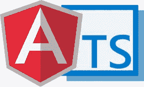
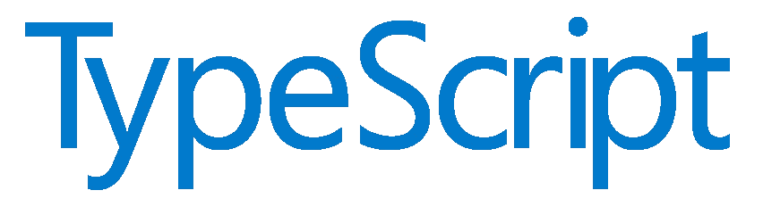

# 初学者的 10 个最佳打字教程[2023 年 3 月]——在线学习打字

> 原文：<https://medium.com/quick-code/top-tutorials-to-learn-typescript-c08834892e69?source=collection_archive---------0----------------------->

## 用 2023 年最好的新手 TypeScript 教程学习 app 开发的 TypeScript。

在 Angular 2 中引入 TypeScript 之前，它几乎是闻所未闻的，但是在 Angular 2 之后，TypeScript 已经获得了开发人员的支持，这些开发人员一直在寻找更快、更容易和更高效的语言。

TypeScript 已经成为一种独立的流行语言，用于行业内的应用程序开发。许多人倾向于使用 TypeScript，因为它是一种简单的语言，使开发变得容易。TypeScript 是 JavaScript 的超集，这意味着它可以被视为该语言的附加组件。所以，如果你已经熟悉了 JavaScript，那么你已经成功了一半。

TypeScript 不仅使编码变得容易，而且还提供了许多特性，例如 ES6 的所有优点以及出色的编译器。TypeScript 提供了静态类型检查，允许编译器在编译过程中发现错误，而不是在测试过程中，从而大大减少了编码时间。让我们从以下课程开始，从有史以来的顶级 TypeScript 课程中学习 TypeScript。

## 1.[带打字稿的 Angular 2 速成班](https://coursesity.com/r/site/angular-2-crash-course-with-typescript)

通过这个速成课程，深入了解 Angular 2 和 TypeScript，适合所有技能水平。

这是没有办法的。如果你想在 UI/UX 设计、网页开发或任何与移动和桌面网络应用相关的领域获得竞争优势，那么你需要了解 Angular JS。更好的是，你需要知道 Angular 2，最新版本。这个 Angular 2 速成班将刷新你的记忆，让你对最新版本的要点更新。如果你刚刚开始使用 Angular JS，不要担心=这也是一个完美的介绍。

使用 Angular 2 加快速度

*   理解 Angular 2，以及它如何帮助开发人员
*   用在线 IDE 编写 Angular 2 项目代码
*   了解 Angular 2 的许多强大功能
*   提高您的 UI/UX 设计和开发技能
*   了解 Angular 最新版本的新功能

本课程将首先介绍 TypeScript、Cloud9 IDE 和 Angular 2 模块的使用。然后，您将陷入 Angular 2 的组件，构建 UI 并绑定数据。之后，随着高级组件概念和组件组合的分解，事情变得更具挑战性。在从头开始设置 Angular 2 之前，您将从这里进入服务、web 服务和路由。

本课程结束时，你将能够快速、轻松、高效地建立并开始自己的 Angular 2 项目。

## 2.[学习打字稿](https://linkedin-learning.pxf.io/c/1137078/646189/8005?u=https%3A%2F%2Fwww.linkedin.com%2Flearning%2Flearning-typescript-2&subId1=quickcode)

本课程将带您了解基础知识，帮助您设置 TypeScript 并以简单的方式使用它来改进现有的 JavaScript 项目。

在本课程中，您将学习如何:

*   定义自定义类型。
*   将现有的 JavaScript 类转换为 TypeScript 类。
*   用访问修饰符封装逻辑和数据。
*   使用泛型重用代码

了解如何定义自定义类型，如何将现有的 JavaScript 类转换为 TypeScript 类，以及如何用访问修饰符封装逻辑和数据。

另外，了解如何使用泛型重用代码、类型检查文件以及添加对 API 的类型支持。使用这些技术，您可以成为一名更加高效的 JavaScript 开发人员。

## 3.[理解打字稿](https://www.eduonix.com/understanding-typescript/UHJvZHVjdC0zMjMyMDA=)

该课程将涵盖重要的基础知识，如类型、类、模块、接口等。从这里开始，您将了解更多高级功能，甚至如何使用 TypeScript 设置工作流。这包括仅使用 TypeScript 的工作流以及使用 Gulp 或 Webpack 的工作流。

每一节都有例子或示例项目，所以你不仅要依靠理论来完成，还要看到你实际上是如何使用 TypeScript 的，甚至会弄脏你的手！你将同时在项目上与教师一起工作，这将帮助你确切地了解你能用 TypeScript 做什么。

**你将在本课程中学到什么:**

*   类型以及如何使用它们
*   TypeScript 编译器如何工作
*   TypeScript 中的 ES6 功能
*   TypeScript 中的类
*   命名空间和模块
*   接口
*   无商标消费品
*   装修工
*   如何将第三方 JavaScript 库集成到您的 TypeScript 项目中
*   如何将 TypeScript 集成到 Gulp 或 Webpack 工作流中
*   或者如何建立一个简单的工作流
*   如何将 TypeScript 与 ReactJS 一起使用

## 4.[学习打字稿:初学者完全教程](https://www.educative.io/courses/learn-typescript-complete-course?affiliate_id=5088579051061248)

TypeScript 是一种基于 JavaScript 之上的按需语言。

该课程包括:

*   变量的基础
*   Typescript 的注释
*   列举型别
*   通用类型
*   功能
*   映射类型
*   目标
*   索引签名
*   高级变量
*   例外
*   别名
*   类型检查
*   迭代器
*   操纵对象和数组
*   共享代码

在本课程中，您将从头开始，逐步学习更高级的概念，如类型检查、迭代器以及操纵对象和数组。

在此过程中，通过大量的实际练习，你将有机会亲自动手。

## 5.[打字稿:入门](https://pluralsight.pxf.io/c/1137078/424552/7490?u=https%3A%2F%2Fwww.pluralsight.com%2Fcourses%2Fgetting-started-typescript&subId1=quickcode)

TypeScript 是一种强大、有趣且流行的编程语言，用于构建浏览器和 NodeJS 应用程序。本课程将教会你 TypeScript 的所有最重要的特性，并使你很快学会使用这种语言。

该课程包括:

*   安装 TypeScript 和配置项目
*   利用内置类型
*   用 TypeScript 编写更好的函数
*   创建和使用自定义类型
*   创建和使用模块
*   使用类型声明文件更有效率

在本课程《TypeScript 入门》中，您将学习如何使用一种强大而有趣的编程语言更快地创建浏览器应用程序，并且减少错误。

首先，您将学习如何配置 TypeScript 项目。接下来，您将探索如何创建和使用您自己的类型。

最后，您将发现如何为您能想到的任何 JavaScript 库获得强大的类型支持。

学完本课程后，您将对 TypeScript 最重要的功能有一个基本的了解，以及开始使用 TypeScript 构建客户端 web 应用程序和 NodeJS 应用程序所需的技能。

## 6.[Web 开发人员的完整打字稿编程指南](https://click.linksynergy.com/deeplink?id=Fh5UMknfYAU&mid=39197&u1=quickcode&murl=https%3A%2F%2Fwww.udemy.com%2Ftypescript-programming%2F)

主类型脚本开发和面向对象的 JavaScript。

这是你成为打字专家的机会。学习这种出色的语言，提高你的技能。学习如何用你能找到的最简单的语言编写强大的应用程序。本课程是专门为帮助您从打字初学者过渡到打字专家而设计的。你需要知道的只是 JavaScript 的基础知识，其余的你可以在本课程中找到。

在本课程中，您将从头开始详细介绍 TypeScript、它的基本命令以及它如何与 JavaScript 集成。您将学习如何设置环境，以及可以使用的不同数据类型，包括字符串、布尔值、数组、元组和 enoms。

从那以后，课程还将涵盖高级的 TypeScript 特性，如接口和泛型；了解如何集成 ES2015 并使用其功能，如箭头功能和模板文字。您还将学习在 TypeScript 中使用类和对象，如继承、修饰符、向类添加接口等。

最后但并非最不重要的一点是，你还将通过从头开始实际设计一个项目来获得实践培训。您将使用 Webpack 在 TypeScript 中构建 ToDo 应用程序。该项目将帮助您将在整个课程中学到的所有理论应用到实际应用中，包括设置环境、自动化 typescript 编译、添加带有接口的 todo 类、静态类型、带有 let 和 const 的块范围，以及用于持久化数据的本地存储实现。

还有很多要学的，你还在等什么？让我们让你成为打字高手吧！

## 7.[步入打字稿:基础](https://click.linksynergy.com/deeplink?id=Fh5UMknfYAU&mid=39197&u1=quickcode&murl=https%3A%2F%2Fwww.udemy.com%2Fstepping-up-to-typescript-fundamentals%2F)

通过学习 TypeScript 来升级和提高您的编码技能。

逐步升级到 TypeScript 的目的不仅仅是向您介绍使用 TypeScript 编写代码，而是全面提升您的编码技能。已经掌握 JavaScript 知识的人如果想在项目中做更多的事情，会发现 TypeScript 可以做的远不止普通的 JS。来自 Java 或 C#等静态类型语言的专业人士会发现这门课程是一种全新的过渡到 Web 或 NodeJS 开发的方式。

虽然新的框架似乎每天都在出现和消失，但 TypeScript 仍将继续存在。在未来的许多年里，TypeScript 可能仍然是开发任何 JavaScript 应用程序的可靠手段。

即使您是一名经验丰富的 JavaScript 开发人员，学习 TypeScript 不仅会为您将来的潜在项目做好准备，还会立即改进您的 JavaScript 架构。

这是一门高质量、基础优先、快节奏的课程，有大量免费内容和社区资源，你一定会喜欢。

## 8.[反应:使用打字稿](https://linkedin-learning.pxf.io/c/1137078/646189/8005?u=https%3A%2F%2Fwww.linkedin.com%2Flearning%2Freact-using-typescript&subId1=quickcode)

本课程解释并展示了如何在 React 中使用 TypeScript。

在本课程中，您将学习如何:

*   借助 TypeScript 接口改进您的 React 代码。
*   将 TypeScript 与 React 一起使用。

它首先回顾了基本和复杂类型以及功能性和有状态组件。然后展示了如何使用 TypeScript 接口来改进 React 代码。最后，学习如何实现高阶组件，以便在添加新功能的同时重用组件。

## 9.[打字稿开发简介](https://click.linksynergy.com/deeplink?id=Fh5UMknfYAU&mid=39197&u1=quickcode&murl=https%3A%2F%2Fwww.udemy.com%2Fintroduction-typescript-development%2F)

通过学习 TypeScript 编程语言，准备构建 Angular 2 web 和移动应用程序。

在这门课程中，我们将从基础开始，我将向你们展示构建打字稿程序是多么有趣。在您熟悉语法之后，我们将转向更高级的 TypeScript 开发技术，例如:使用闭包、面向对象编程、实时异步开发和装饰器。

本课程不是教你如何构建 TypeScript 控制台应用程序。相反，目标是教你构建真实世界 Angular 2 应用程序所需的技能。实际上，这门课程包括我们在 devCamp 编码训练营教授的确切材料，在学生参加我们的沉浸式 Angular 2 课程之前。

本课程没有技术先决条件。理想的学生是想学习如何构建 Angular 2 应用程序的人。我将向您展示如何在 Mac 和 PC 上安装和运行 TypeScript 程序。您可以使用任何一种操作系统来学习课程材料。

## 10.[打字稿大师班&免费电子书](https://click.linksynergy.com/deeplink?id=Fh5UMknfYAU&mid=39197&u1=quickcode&murl=https%3A%2F%2Fwww.udemy.com%2Fcomplete-typescript-2-course%2F)

学习 Typescript:在 Typescript 中构建一个节点 REST API，用 Angular 5(原 Angular 2)查询。

本课程还包括电子书:Typescript jump start——面向有经验的开发人员的快速入门。

您将深入学习 Typescript 2、它的 ES6 特性和它的高级类型系统。然后，您将使用 Typescript 在 Express 中构建一个节点 REST API，并使用 Sequelize ORM 在 Typescript 中查询一个 SQL 数据库。您将使用 Angular CLI 构建一个小型 Angular Typescript 客户端，并使用 Angular HTTP 模块查询 REST API。

本课程的主要目标是，你不仅要学习 Typescript 语言的特性，还要学习如何在实践中使用它们来构建具体的程序。我们将讨论类型安全的好处，以及它如何帮助我们编写更好的程序。

Angular 的搜索量是 Typescript 的两倍，更奇怪的是 Angular 趋势曲线的增长速度也比 Typescript 快。

我们将对 Typescript 2 及其类型系统做一个完整的介绍。然后，我们将立即将这些新概念应用到一个实际的例子中:我们将使用 Express 和 Typescript 在 Node 中构建一个 REST API，然后我们将使用 Sequelize ORM 查询一个 Postgresql 关系数据库。

我们将学习如何将 Typescript 与第三方 Javascript 库一起使用，并且仍然编写类型安全的程序。我们的目标是从理论上介绍这门语言，然后通过将这些概念应用到我们作为软件开发人员在日常生活中都会做的日常任务中，立即将这些概念带回家。

课程结构很简单:我们将一步一步地设置 Webstorm IDE，并开始简单地介绍 Typescript 作为一个更好的 Javascript，展示我们今天已经可以使用的 ES6 的主要特性。

然后我们将深入研究类型系统，特别是 Typescript 2 支持的特性。有了这些，我们将从头开始编写我们的 REST API，并逐步增强它。

我们将学习以函数方式构建后端的最佳实践，以及如何用 Express 构建 API。我们将讨论 API 安全性和错误处理等方面。Sequelize 是我们选择的表单。我们将展示如何查询 SQL 数据库表，以及如何将我们的程序组成可重用的小函数，并使用它们来组成承诺链以处理 API 请求。

构建好 API 后，我们将回到绘图板，现在只介绍面向对象编程、泛型和装饰器。有了这最后一个基本块，我们将回到我们的程序，我们将通过进一步增加类型安全来增强它。

构建一个小的 Angular 应用程序，在后端和前端之间共享代码。然后，我们将使用 Angular CLI 在 Angular 中构建一个小型前端来查询 API 并显示课程列表。我们将通过在后端和前端之间共享一些代码来做到这一点。

## 11.[理解打字稿](https://coursesity.com/course-detail/learn-typescript-ditch-javascript-)

不要把 TypeScript 的用法限制在 Angular 2！了解其基础知识、功能、工作流程和使用方法。

本课程将带您了解最基础和最重要的特性(类型！)到了可以在任何项目中使用 TypeScript 的程度。包括 ReactJS 项目。

由于 TypeScript 代码可以被编译成 ES5，您会惊讶于现在可以开始使用的许多下一代特性。无论是 ES6 的特性，如析构或箭头函数、装饰符、泛型和接口或模块——TypeScript 都有！

在本课程中，我们不会停留在基础知识上。您将了解更多高级功能，以及如何使用 TypeScript 设置工作流。这包括仅使用 TypeScript 的工作流以及使用 Gulp 或 Webpack 的工作流。

您还将了解到，您并不局限于 Angular 2 或普通的 JavaScript/ TypeScript 项目。一个完整的模块介绍了如何将 TypeScript 与 ReactJS 一起使用，以便从它的特性中获益。

在本课程中，您将深入了解:

*   类型以及如何使用它们
*   TypeScript 编译器如何工作
*   TypeScript 中的 ES6 功能
*   TypeScript 中的类
*   命名空间和模块
*   接口
*   无商标消费品
*   装修工
*   如何将第三方 JavaScript 库集成到您的 TypeScript 项目中
*   如何将 TypeScript 集成到 Gulp 或 Webpack 工作流中
*   或者如何建立一个简单的工作流
*   如何将 TypeScript 与 ReactJS 一起使用

## 12.[打字稿:以令人耳目一新的方式学习基础知识](https://click.linksynergy.com/deeplink?id=Fh5UMknfYAU&mid=39197&u1=quickcode&murl=https%3A%2F%2Fwww.udemy.com%2Ftypescript-hero%2F)

使用 TypeScript 解决常见的 JavaScript 问题并理解编译器的输出。

在本课程中，我们将以一种全新的方式学习 TypeScript。我们一起研究一系列常见的 JavaScript 挑战、问题和陷阱，并学习如何使用 TypeScript 优雅地解决它们。

在这个有趣的快节奏课程结束时，你将对 TypeScript 的基本特性有一个很好的理解，并且能够马上开始编码。

## 13. [Angular 2 &打字稿初学网页开发](https://click.linksynergy.com/deeplink?id=Fh5UMknfYAU&mid=39197&u1=quickcode&murl=https%3A%2F%2Fwww.udemy.com%2Fangular2%2F)

Angular 2 web 开发，面向使用 TypeScript 和 Firebase 的初学者。

本课程将教你所有的角度基础知识

这是网上关于 Angular 2 最全面的课程之一。我们每天都在自己的项目中使用 Angular 2，我们希望与世界分享这一强大的知识。这门课程将带你走上一条有指导的学习之路。您将学习 TypeScript 的基础知识，并继续创建简单和复杂的 web 应用程序。你不仅可以构建 web 应用程序，还可以学习如何像专业人士那样做。我们甚至会讨论从高级到中级的主题。

以下是*你将学到的一些东西:*

1.  工具作业
2.  自动化
3.  以打字打的文件
4.  成分
5.  形式
6.  确认
7.  服务
8.  超文本传送协议
9.  重火力点
10.  指令
11.  如此之多…

> 感谢您阅读本文。我们策划了更多主题的顶级教程，您可能想看看:

 [## 10+初学者最佳 Angular JS 教程—在线学习 Angular

### 2022 年学习 Angular 构建客户端应用程序，为初学者提供最佳 Angular 教程

medium.com](/quick-code/top-tutorials-to-learn-angular-js-for-beginners-2f401566d5f1)  [## 10+最佳 ECMAScript 初学者教程—在线学习 ES6

### 通过 2022 年面向初学者的最佳 ECMAScript 教程，在万维网上学习用于客户端脚本的 ES6

medium.com](/quick-code/the-best-tutorials-to-learn-ecmascript-es6-for-beginners-55fe602382cd)  [## 初学者的 7 个最佳 Gulp Js 教程——在线学习 Gulp Js

### 2022 年为初学者提供最佳 Gulp 教程，学习自动化开发任务的 Gulp

medium.com](/quick-code/top-tutorials-to-learn-gulp-js-11aeeb789f35) 

*披露:如果你通过本页的链接购买课程，我们可能会得到一小笔代销商佣金。谢谢你。*