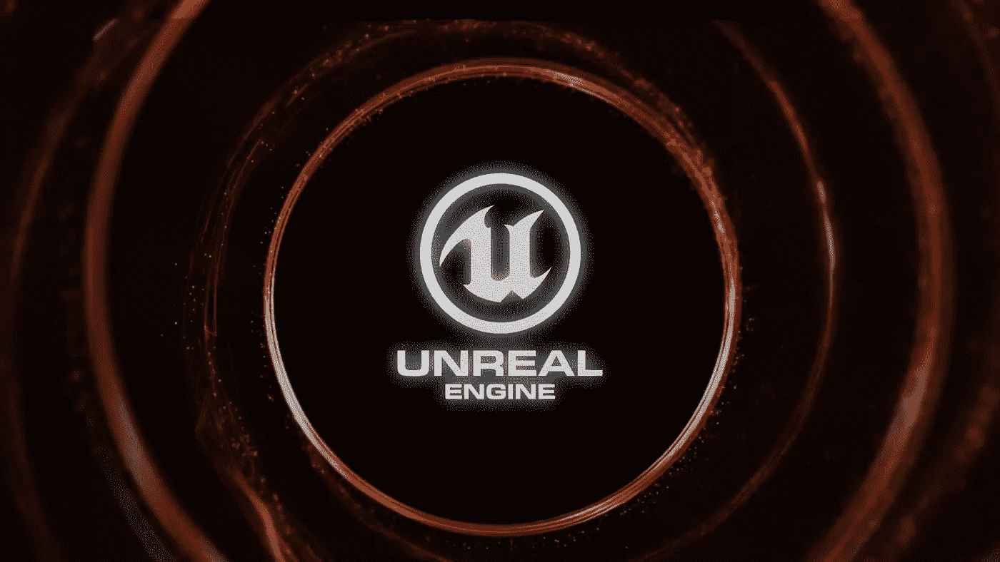
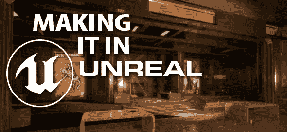
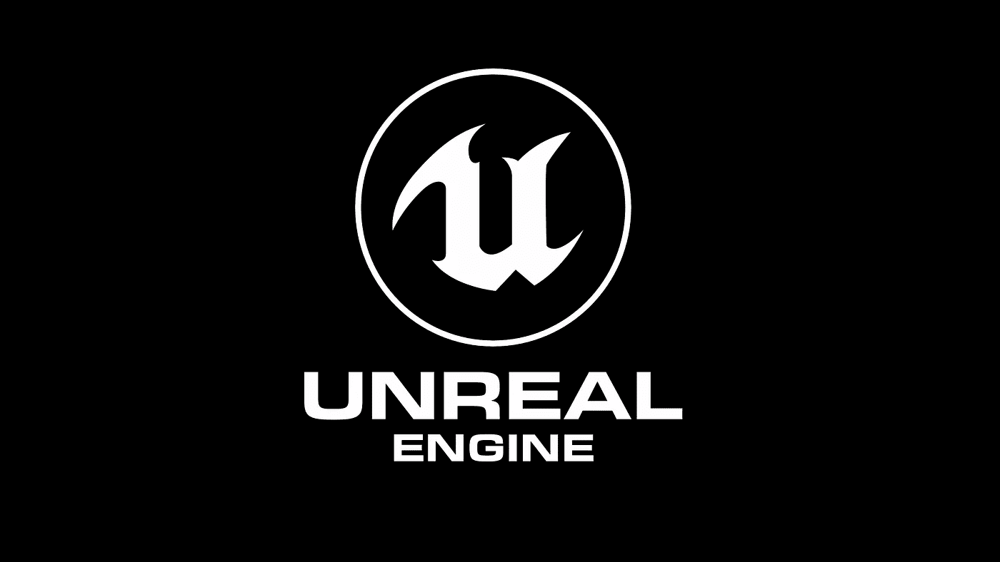

# 10+最佳虚幻引擎 4 初学者教程[2023 年 3 月]

> 原文：<https://medium.com/quick-code/top-tutorials-to-learn-unreal-engine-4-for-beginners-1a21c287c553?source=collection_archive---------0----------------------->

## 用 2023 年最好的虚幻引擎新手教程学习游戏开发的虚幻引擎 4。

虚幻引擎已经多次获得各种组织的“最佳游戏引擎”奖，包括开发行业优秀奖和游戏开发者杂志。

虚幻引擎已被用于开发许多轰动的游戏和游戏系列，包括边境，战争机器，生化奇兵，质量效应，以及数百个以上。

多年来，虚幻引擎只有大公司才能负担得起，但从 2015 年开始，虚幻引擎 4 现在完全免费使用，只要你同意向 Epic Games 支付你游戏销售额的 5%。

以下是由时代专家整理的顶级虚幻引擎教程列表中的一些课程，你应该参加这些课程来深入了解 X 开发。

## 1.[虚幻引擎 C++开发者——学习 C++制作游戏](https://coursesity.com/r/site/unreal-engine-5-c-developer-learn-c-make-video-games)

从零开始学 C++。如何在虚幻引擎中制作你的第一个电子游戏？获得编程的信心。

***课程评分:5.0 分中的 4.6 分(*37527*总评分)***

该课程现在有高质量的手写字幕，可以作为隐藏字幕使用，所以你可以在你方便的时候打开或关闭它们。

了解如何使用虚幻引擎 4 创建和修改视频游戏，虚幻引擎 4 是 AAA 工作室和全球独立开发者使用的免费游戏开发平台。

您将从头开始学习 C++，这种强大的行业标准语言。课程结束时，你将对编码和游戏开发的基础非常有信心，并渴望了解更多。

任何想学习制作游戏的人:虚幻引擎是一个神奇的平台，让你可以制作 AAA 级的游戏。此外，这些游戏可以从一个来源为 Windows、控制台、macOS、iOS、Android 和 Web 创建。

如果你是一个完全的初学者，我们会教你所有你需要的编码和游戏设计原则。如果你是一名艺术家，我们会教你如何让你的资产活起来。如果你是一名程序员，我们会教你游戏设计原则。

Top Unreal Engine Tutorials

# 2.[虚幻本质训练(2019)](https://linkedin-learning.pxf.io/c/1137078/646189/8005?u=https%3A%2F%2Fwww.linkedin.com%2Flearning%2Funreal-essential-training-2019&subId1=quickcode)

虚幻不再仅仅是游戏了。汽车设计、建筑、医疗保健和教育等行业正在采用实时开发工具来创建引人入胜的交互式视觉效果。虚幻引擎可以为这一切提供动力。

该课程包括:

*   发动机概述
*   开始一个新项目
*   网状物
*   照明设备
*   材料
*   交互性
*   看发展
*   电影艺术
*   打包生成

在本课程中，您将学习使用 Unreal Engine 4 构建各种沉浸式用户体验所需的基本技能，包括照明、效果和可视化脚本。

本课程包括创建您的第一个项目、构建基础景观、划分标高以及导入设计中使用的资产。

了解如何在 Unreal 中使用材质、后期处理效果和粒子系统。此外，了解如何优化项目的性能，以及如何打包项目进行分发。

# 3.[通过在虚幻引擎中构建 6 个游戏来学习编码](https://www.eduonix.com/learn-to-code-by-building-6-games-in-the-unreal-engine/UHJvZHVjdC0zMjMyMDA=)

在这个课程中，你将得到一个虚幻的速成班，随后你将学习在虚幻中编写不同的代码，如射手，平台切换器，第一人称射手，炮塔，跑步者切换器，等等！

***课程评分:4.6 满分 5.0 (* *442 分总评分)***

在本课程中，您将学到:

*   在虚幻中学习用 C++编码
*   学习制作简单的游戏
*   学习设计游戏
*   从头开始构建游戏

通过这个神奇的课程成为游戏设计大师

# 4.[虚幻引擎入门](https://www.awin1.com/cread.php?awinmid=6798&awinaffid=466009&clickref=quickcode&ued=https%3A%2F%2Fwww.edx.org%2Fcourse%2Fintro-to-unreal-engine-1)

了解由 Epic Games 制作的虚幻引擎，Epic Games 是 VR/AR 领域的世界领导者，也是国际热门游戏《堡垒之夜》的制作人。

在本课程中，您将学习如何:

*   构建互动环境。
*   从外部程序导入三维对象。
*   为建筑可视化设置基于位置的照明。
*   使用材质编辑器设置可自定义的材质。
*   应用后处理体积。

您将了解虚幻引擎 4，这是一个流行的平台，用于游戏开发和创建实时、视频游戏、VR/AR、培训、建筑可视化和许多其他增长领域的尖端 3D 环境。

通过以视频作为快速入门指南的逐步过程，您将熟悉核心界面，并学习如何在 unreal 引擎中导入和设置对象。

接下来，您将深入到照明、材质和物理模拟的关键技能领域。本课程将以后处理的讨论结束。

你将把这些技能应用到从色彩分级(下一代电影制作)、视觉特效(视觉效果)到界面设计(在 3D 物体周围创建线条)的所有事情上。

# 5.[虚幻多人游戏大师——c++在线游戏开发](https://click.linksynergy.com/deeplink?id=Fh5UMknfYAU&mid=39197&u1=quickcode&murl=https%3A%2F%2Fwww.udemy.com%2Funrealmultiplayer%2F)

用 Epic 的虚幻引擎用 C++进行网游开发。涵盖局域网，虚拟专用网，蒸汽，等等。

***课程评分:4.7 分满分 5.0 分(**1097 分总计)***

学习使用世界一流的虚幻引擎创建史诗般的多人游戏体验。本课程立即投入使用，让你可以和其他学生一起玩你自己的多人游戏。

作为支撑许多 AAA 游戏的引擎，Unreal 充满了非常快速地创建多人游戏的工具。然而，知道从哪里开始使用虚幻引擎可能会令人生畏。

有了大量的特性集和很少的文档，您就不知道从哪里开始了。这个课程让理解虚幻超级容易。我们不仅教你如何使用引擎，还教你基本概念。这些技能可以让你学会新的特性。

本课程的目标是对 C++有一定了解的初级到中级虚幻用户。不太自信？不要担心，这个课程将一步一步地带你经历所有的事情，并给你大量的练习来建立对编码的信心。

这个课程将*而不是*教你制作一个大型多人游戏。但它将教会你理解如何建造 MMO 所需的基础知识。

# 6.[虚幻引擎 4:如何开发你的前两款游戏](https://click.linksynergy.com/deeplink?id=Fh5UMknfYAU&mid=39197&u1=quickcode&murl=https%3A%2F%2Fwww.udemy.com%2Funreale4%2F)

epic Games-认可:学习虚幻编辑器，掌握游戏玩法框架，使用蓝图编程，无需编码。

***课程评分:5.0 分中的 4.5 分(* *共 7934 分)***

该课程由 Epic Games 批准，由虚幻引擎传道者 Chris Murphy 教授，面向任何希望在虚幻引擎中创建交互式体验和/或实时培训模拟、可视化和媒体/娱乐企业领域的开发人员。使用完整的游戏开发工具-虚幻引擎 4 创建逼真的游戏。从基础开始，这样你就有了一个坚实的理解基础。

知道如何操作电脑的基本知识吗？可能有点游戏设计或者编码的经验？视觉艺术设计师？你准备好了！通过创建 3 个独特的项目逐步学习。Chris 通过演示进行教学，因此您将在每堂课中应用真正的技能。

通过编辑器获得核心能力的完整介绍，了解引擎如何工作以及如何帮助您的项目高效运行，如何使用资源定制您的项目，设计和创建交互性，以及调试错误的工具和策略。

本课程结束时，你可以设计和创建工作项目，包括游戏、建筑可视化、模拟训练和媒体娱乐。此外，你会意识到专注于你感兴趣的领域所需的工具和技术。

Best Unreal Engine game development Courses List

## 7.[虚幻引擎 4——在 UE4 中学习制作游戏原型](https://coursesity.com/course-detail/unreal-engine-4---learn-to-make-a-game-prototype-in-ue4)

一个完整的指南，带你通过使用 UE4 建立一个专业和完善的 SHMUP 游戏的每一步。

***课程评分:4.5 分满分 5.0 (* *717 分总评分)***

这个课程教学生如何为一个侧滚射击游戏建立一个模板，然后在这个模板的基础上进一步完善。学生将学习使用虚幻引擎 4 的蓝图，以及一些被称为“游戏感觉”或“果汁”的重要概念。

如果你有兴趣使用 UE4 开发游戏，学习使用蓝图编程，看看经典的街机风格的游戏，学习一些重要的技术和理论，让你的游戏脱颖而出，那么这个课程就是为你准备的。

本课程将允许从未使用过 UE4 的人跟随并随着我们的进展学习导航界面，从而通过避免特定界面的讲座更好地利用您的时间，并允许知识通过实际使用您所学的一切更快地根深蒂固。

在介绍了一些初级内容和熟悉的界面后，课程将继续介绍蓝图和编程背后的一些更深入的概念，如继承可以提供的强大优势、随机化和简单的过程生成。

在本课程结束时，你将对开始原型化你自己的想法所需的整个开发流程有所了解。它从一个空项目开始，涵盖了一些方面，包括您可以导入和调整模型和纹理等资产的一些方法，从其他 UE4 项目中提取内容的技术，以及如何在您的游戏中实现音频和粒子效果。

# 8.[虚幻引擎 C++终极游戏开发者教程](https://click.linksynergy.com/deeplink?id=Fh5UMknfYAU&mid=39197&u1=quickcode&murl=https%3A%2F%2Fwww.udemy.com%2Fcourse%2Funreal-engine-the-ultimate-game-developer-course%2F)

了解如何在虚幻引擎中开发、编码和打包一个完整的视频游戏

***课程评分:5.0 分中的 4.6 分(* 555 *评分合计)***

在本课程中，您将:

*   如何用 C++在虚幻引擎中编程？
*   如何从头到尾打造一个完整的 UE4 游戏？
*   没有虚幻引擎经验的人会掌握虚幻。
*   战斗、冒险游戏机制、平台、游戏保存/加载和菜单设计。
*   已经有游戏开发经验的会进一步拓展技能。
*   那些已经在另一个引擎如 Unity 中发展的人将掌握虚幻。

在本系列中，您将学习虚幻引擎 C++编程，从基础一直到打包一个完整的视频游戏。您将了解以下所有内容以及更多内容:

*   对象、演员、棋子和角色创建，以及这些类别之间的差异
*   编码一个完整的角色类，包括动画和用户输入
*   寻找几乎无穷无尽的免费资源，以及如何下载并在游戏中使用它们
*   敌人的运动和行为
*   用近战武器战斗
*   挑选和装备物品
*   伤害、生命值和死亡
*   HUD 元素包括健康和耐力条以及图标
*   如何创建菜单，包括暂停菜单
*   即使在关闭电脑或退出游戏后，也可以保存和加载游戏数据
*   在游戏中切换关卡
*   使用插值的浮动平台
*   游戏逻辑延迟计时器
*   触发音量、压力开关和门
*   炸弹、爆炸物和危险
*   出于调试目的记录和绘制球体
*   将 C++概念应用于游戏开发

这是一门 C++课程，需要一些 C++(或类似语言)的基础知识。如果你没有 C++的基础知识，我的第一门课会教你这门课需要知道的一切。

# 9.[虚幻引擎 4:基于项目的虚拟现实课程](https://click.linksynergy.com/deeplink?id=Fh5UMknfYAU&mid=39197&u1=quickcode&murl=https%3A%2F%2Fwww.udemy.com%2Fcourse%2F3ds-max-unreal-engine-4-easy-real-time-for-arch-viz%2F)

使用虚幻引擎 4(免费)从零开始，在几个小时内将您的 3d 项目变成实时/ VR 项目。

***课程评分:4.2 满分 5.0 (* *708 分总评分)***

在本课程中，您将:

*   让您的 3d 模型在几分钟内从静态变为实时/VR 漫游。
*   轻松地将您的模型设置为虚拟现实体验，并在其中进行虚拟漫游。
*   使用 UE4 为您的模型生成照片般真实的即时渲染/动画。
*   将 SketchUp 项目从基本的 3d 模型转变为完整的 VR 漫游只需几分钟。
*   创建一个完整的虚拟现实项目(由教师提供),包括蓝图交互。
*   创建在场景中创建交互的基本蓝图，即拾取物品、开灯关灯、更改设计等。
*   从头开始学习蓝图/脚本，没有任何编码经验。
*   打包您的项目进行分发，以便其他人可以体验/探索您的项目。

这门课是为那些准备好进入 3d 项目下一步的人设计的。无论你是一个游戏创作者，一个建筑可视化专家，或者只是一个有抱负的艺术家，这个课程都适合你。

## 10.[虚幻引擎 4:人物技能系统](https://coursesity.com/r/site/unreal-engine-4-ue4-character-skill-system)

掌握用于构建“堡垒之夜”的工具，因为我们使用虚幻引擎 4 来制作我们自己的角色技能系统！

***课程评分:5.0 分中的 4.8 分(* *总评分 95 分)***

在本课程中，您将学习:

*   如何在虚幻引擎 4 中下载、安装和设置项目。
*   如何使用虚幻引擎 4 中的侧边滚动条项目模板创建 Metroidvania 风格的游戏？
*   如何将一个典范角色(来自虚幻引擎 4 的免费资产库存)实现为可玩角色？
*   如何给玩家角色增加可获得的移动，白魔法和黑魔法技能。
*   如何在项目中添加生命值和法力值系统？
*   如何使用虚幻引擎 4 的小部件蓝图创建支持 HUD 和交互式菜单。
*   如何利用虚幻引擎 4 的蓝图脚本工具编写交互式游戏元素。
*   如何连接玩家角色动画？

Best Unreal Engine Courses For Beginners

# 11.[虚幻引擎 4 中 3D 角色动画介绍](https://click.linksynergy.com/deeplink?id=Fh5UMknfYAU&mid=39197&u1=quickcode&murl=https%3A%2F%2Fwww.udemy.com%2Fcourse%2Fanimate-your-character-in-unreal-engine-4%2F)

在虚幻引擎 4 中赋予角色生命。包括场景文件—从头到尾构建您的 3D 动画！

***课程评分:5.0 分中的 4.6 分(* *共 241 分)***

在本课程中，您将学习:

*   如何在虚幻引擎 4 中创建一个令人惊叹的电影动画场景，从头到尾。
*   如何一步一步地创建“预览本课程”视频中的场景。
*   你会收到所有的场景文件，包括外星人角色，男女角色，飞船内部和音乐。
*   了解“实时渲染和动画”的优势，这是业界真正的变革者。
*   您将学习如何从 DAZ Studio 导出一个创世纪角色，并将其导入 Mixamo 以准备动画。
*   了解如何从 Mixamo 导出角色和动画，然后导入到虚幻引擎 4。
*   您将学习如何在场景中使用真实的 PBR(基于物理的渲染)材质来产生超真实感。
*   您将学习如何在虚幻引擎 4 中创建平滑的相机移动，为您的场景提供专业的电影外观和感觉。
*   你将学习如何用 HitFilm 3 Express(一个免费的视频编辑程序)对你的场景进行颜色分级，并将你完成的场景上传到 YouTube。
*   你会得到一个关于如何使用虚幻引擎 4 的“贴花”的教程，它会给你的场景一个新的真实感水平。

# 12.[虚幻引擎 4:照明初学者指南](https://click.linksynergy.com/deeplink?id=Fh5UMknfYAU&mid=39197&u1=quickcode&murl=https%3A%2F%2Fwww.udemy.com%2Funreal-engine-4-beginners-guide-to-lighting%2F)

理解虚幻引擎 4 中照明的实用指南。

***课程评分:5.0 分中的 4.7 分(* 328 *评分合计)***

虚幻引擎内部的照明很难。不仅有数百种控制灯光的选项，还有你可能不知道的多种控制灯光的菜单。这会让你感到不知所措。选什么灯，怎么用，什么时候用，好像都绕不过你的头。

真正有用的是一个系统的方法来解释不同的灯光以及如何在虚幻中使用它们。你会理解影响照明的不同菜单和选项。最后，你会把所有的知识用在真实的场景中，以一种实用的方式应用你刚刚学到的东西。

本课程就是为你设计的。本课程将涵盖虚幻引擎内部照明系统的原因。本课程将为你提供如何设置照明的实际理解和知识。然后，您将在案例研究场景中得到指导，这些场景将使用您刚刚获得的知识来阐明全部生产水平。最后，您将可以访问一个长长的常见问题和修复列表，这些问题和修复会在使用虚幻引擎内部的照明时出现。

本课程不仅会让你了解如何在虚幻引擎中照亮你的场景，还会让你有信心了解什么会为你的项目带来最好的质量和性能。本课程旨在帮助你停止在理解照明上的挣扎，最终掌握在虚幻引擎中创造出色照明的概念。

# 13.[完整游戏包:学习在 Unity 和 Unreal 中编码](https://click.linksynergy.com/deeplink?id=Fh5UMknfYAU&mid=39197&u1=quickcode&murl=https%3A%2F%2Fwww.udemy.com%2Fcomplete-gaming-package-learn-to-code-in-unity-and-unreal%2F)

通过在 Unity 和虚幻引擎中构建游戏来学习编码。这是开始学习技术的绝佳课程。

***课程评分:5.0 分中的 4.2 分(* 145 *评分合计)***

本课程是基于项目的，所以你不会学到一堆无用的编码实践。本课程结束时，您将拥有可在作品集中使用的真实应用。我们认为基于项目的培训内容是从 A 到 b 的最佳方式。参加本课程意味着您可以立即学到实用的就业技能。

您可以使用您在本课程中构建的项目添加到您的 LinkedIn 个人资料中。给你的投资组合加油，让你的职业生涯更上一层楼。

学习如何编码是进入一个新的职业或者提升你当前职业的好方法。编码是新的数学，学习如何编码将推动你在任何情况下前进。今天学习它，为明天做好准备。能掌握技术的人将统治未来。

# 14.[虚幻引擎 4:完全初学者教程](https://click.linksynergy.com/deeplink?id=Fh5UMknfYAU&mid=39197&u1=quickcode&murl=https%3A%2F%2Fwww.udemy.com%2Funreal-engine-4-the-complete-beginners-course%2F)

学习视频游戏开发&如何使用 UE4 从头开始设计游戏。

***课程评分:4.4 分满分 5.0 分(* *总评分 22560 分)***

使用专业人士使用的行业领先的 3D 游戏设计软件虚幻引擎 4 学习游戏开发。这个屡获殊荣的引擎被用于创建许多当今的顶级游戏。

使用最先进的游戏设计软件开发游戏，并在最先进的 3D 游戏引擎上运行。

在本课程中，您将通过 62 个讲座、15 个教程和 9 个测验(总计超过 10 个小时的内容)学习使用虚幻引擎 4 进行游戏开发的基础知识。本课程结束时，您将从头开始构建一个完整的演示游戏。

该课程将从零开始，不需要编程知识，因此任何具有基本计算机技能的人都可以加入并开始他们的虚幻引擎 4 培训！

课程的第一部分将帮助您启动和运行虚幻引擎 4，并向您介绍使用引擎开发游戏的基本概念。接下来，你将学习所有你需要的技巧来创造美丽的游戏环境。然后，您将学习如何为您的游戏编写逻辑脚本，以便您可以定义游戏规则和行为，跟踪健康和库存等数据，并创建可玩的角色。你将学习碰撞和伤害，任何动作游戏的关键概念。您将学习如何使用 UMG 编辑器创建用户界面，这样您就可以在游戏中添加菜单、加载屏幕和 hud 等内容。最后，你将学习引擎中音频的工作原理，这样你就可以在游戏中加入音乐、对话和音效。

完成本课程后，您将具备将游戏的*创意*转化为可玩游戏的必要技能，这些游戏使用您塑造的环境和您定义的逻辑，并且您将了解如何在虚幻引擎 4 中制作游戏。

> 感谢您阅读本文。我们策划了更多主题的顶级教程，您可能想看看:

 [## 10+游戏开发者最佳 Unity 教程

### 学习 Unity 从 2022 年最好的 Unity 新手教程开始学习游戏开发

medium.com](/quick-code/top-online-tutorials-to-learn-game-development-using-unity-55497ad51169)  [## 10+适合初学者的最佳 Python 教程—在线学习 Python

### 通过 2022 年面向初学者的最佳 Python 教程，学习 Python 以实现更轻松的 web 开发

medium.com](/quick-code/top-free-online-courses-to-learn-python-dcd22b03db62)  [## 面向初学者的 15+最佳 C++编程教程—在线学习 C++

### 学习 C++在 2022 年为初学者提供最好的 C++教程，创建跨多个领域和平台的高性能应用程序

medium.com](/quick-code/top-tutorials-to-learn-c-programming-d3dd13769a0c) 

*披露:如果你通过本页的链接购买课程，我们可能会得到一小笔会员佣金。谢谢你。*