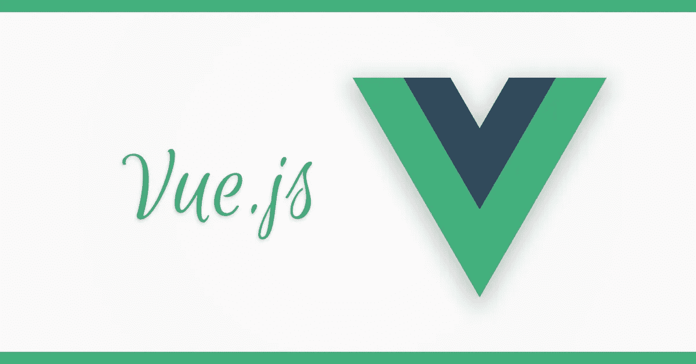
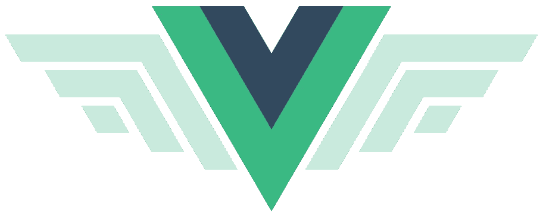

# 初学者的 10 个最佳 Vue JS 教程[2023 年 3 月]—在线学习 Vue JS

> 原文：<https://medium.com/quick-code/top-tutorials-to-learn-vue-js-for-beginners-6c693e41091d?source=collection_archive---------0----------------------->

## 学习 VueJS 从 2023 年最好的 VueJS 初学者教程开始学习前端应用开发。

无论你从哪个角度来看(Google Trends、Github Stars、Tweets …) VueJS 都是 JavaScript 框架世界中的流星——它简直令人惊叹。

前端框架非常受欢迎，因为它们给了我们这种从移动应用程序中了解到的反应式的、出色的用户体验——但现在是在浏览器中！难怪像 VueJS 这样需要前端框架技能的工作是业内收入最高的。

你可能知道 Angular 2 和 ReactJS，嗯，VueJS 结合了这两个框架的优点，使构建从小部件到大的企业级应用变得轻而易举，充满乐趣。

Vue JS 2 很快变得非常受欢迎，这既是因为 JavaScript 框架非常强大，也是因为它非常容易学习。Vue 比 Angular 和 React 等其他 JavaScript 框架更容易学习，这意味着您可以立即开始构建您的第一个 Vue 应用程序。我们挑选了最好的 Vue Js 教程和课程。

## 1. [Vue JS 2 —完整指南(包括 Vue 路由器& Vuex)](https://coursesity.com/r/site/develop-with-vue-js-2-complete-vue-router--vuex-course)

Vue JS 是一个非常棒的 JavaScript 框架，用于构建前端应用程序。VueJS 混合了最好的角度+反应。

***课程评分:4.7 满分 5.0(******31725 评分合计)***

它将从最基础的开始，什么是 Vue.js 以及它是如何工作的，然后我们将进入更复杂和更高级的主题。

*   什么是 VueJS，为什么要使用它？
*   设置开发环境和工作流
*   基础知识(包括基本语法、理解模板等等！)
*   与 DOM 交互(呈现列表、有条件地附加/分离元素……)
*   使用组件(首先，组件是什么)
*   绑定到表单输入
*   所有关于指令、过滤器和混合的内容
*   如何用动画和过渡让你的应用更漂亮
*   如何创建一个强大的带路由的单页面应用程序(SPA)
*   如何使用 Vuex 改进状态管理
*   如何部署应用程序

伴随着许多练习和多门课程项目——因为这不仅仅是看代码，而是使用和练习代码。

Top Vue JS Tutorials

## 2. [VueJS 2 完整指南](https://www.eduonix.com/vuejs-2-the-complete-guide/UHJvZHVjdC0zMjMyMDA=)

这个 VueJS 教程被设计成一个完整的指南，不仅可以帮助你开始使用 VueJS，也是对前端框架的一个很好的介绍。

***课程评分:4.4 满分 5.0 (*** ***451 评分合计)***

本课程从最开始开始，包括简单的基本概念，如什么是 VueJS，它是如何工作的，然后继续学习更复杂和高级的主题，如状态管理、应用程序部署等。

本课程结束时，您不仅会熟悉 VueJS，还将能够从头开始设计自己的应用。

在本课程中，您将学到:

*   设置开发环境和工作流
*   基础知识(包括基本语法、理解模板等等！)
*   与 DOM 交互(呈现列表、有条件地附加/分离元素……)
*   使用组件(以及从什么组件开始)
*   绑定到表单输入
*   关于指令、过滤器和混合的一切
*   如何用动画和过渡让你的应用更漂亮
*   如何创建一个强大的带路由的单页面应用程序(SPA)
*   如何使用 Vuex 改进状态管理
*   如何部署应用程序及更多
*   范例和多门课程项目帮助你实际练习

## 3.[学习 Vue.js](https://www.pjatr.com/t/TUJGR0lLR0JHR0pMSUtCR0ZISk1N?sid=quickcode&url=https%3A%2F%2Fwww.codecademy.com%2Flearn%2Flearn-vue-js)

Vue.js 使前端 web 开发比以往任何时候都更加容易和令人兴奋。跳进去看看这个前端工程趋势到底是怎么回事！

在本课程中，您将学习如何:

*   使用 Vue.js 轻松制作前端 web 应用程序，这是一个越来越受欢迎的 JavaScript 前端框架。

在本课程的帮助下，你将能够创建和设计处理真实动态数据的表单。

您将了解如何设置 Vue.js，以及如何利用 Vue 的基本功能来解决复杂的前端问题。

## 4. [Nuxt.js —服用类固醇的 vue . js](https://click.linksynergy.com/deeplink?id=Fh5UMknfYAU&mid=39197&u1=quickcode&murl=https%3A%2F%2Fwww.udemy.com%2Fcourse%2Fnuxtjs-vuejs-on-steroids%2F)

使用 Nuxt.js 构建极具吸引力的 Vue JS 应用程序。Nuxt 添加了简单的服务器端渲染和基于文件夹的配置方法。

***课程评分:4.7 分满分 5.0 (*** ***共 3109 分)***

在本课程中，您将:

*   构建服务器端呈现的单页面应用程序(spa)。
*   用最少的努力建立正常的，优化的水疗中心。
*   从 Vuejs 代码生成一个静态网页。

这是 Vue.js 的一个库(有点像“框架的框架”)，它给 Vue.js 增加了两个主要的东西:

*   开箱即用的 Vue 应用的服务器端渲染
*   通过文件夹和文件轻松配置 Vue 应用

在本课程中，您将了解到所有细节，但最重要的一点是，Nuxt.js 使创建更好、更优化、更强大的 Vue 应用程序变得更加容易——所有这些都不会增加太多开销。

在本课程中，它将教你如何从头开始创建 Nuxt/ Vue 应用程序！。您将构建一个项目并深入研究 Nuxt.js 提供的核心特性。

课程结束时，你将拥有一个完整的 Vue app，用 Nuxt.js 构建，可以在服务器上渲染(或者作为静态网站！)并且是高度优化的。

本课程将教会你:

*   Nuxt.js 到底是什么，它和 Vue.js 有什么联系
*   如何使用 Nuxt.js 构建更好的 Vue 应用
*   关于 Nuxt 采用的“通过文件夹和文件配置”方法，你需要知道的一切
*   不同的构建可能性，如 SSR 应用程序、spa 或静态网页
*   如何通过 Nuxt.js 构建整个项目，包括身份验证

## 5.[反应 JS，角度& Vue JS -快速启动&比较](https://click.linksynergy.com/deeplink?id=Fh5UMknfYAU&mid=39197&u1=quickcode&murl=https%3A%2F%2Fwww.udemy.com%2Fangular-reactjs-vuejs-quickstart-comparison%2F)

Angular (Angular 2 或 4)，React 或 Vue？获得关于它们的速成课程和详细的比较。

***课程评分:4.6 满分 5.0(******1816 分总评分)***

在学习了 JavaScript 的基础知识之后，JavaScript 的世界可能会非常令人生畏。有很多不同的框架，如 Angular、React 或 Vue、库和其他包(如 webpack)。

您将获得对三个最重要的 JavaScript 框架(Angular、React.js 和 Vue.js)的介绍，还将获得详细的比较！这将允许你选择其他资源或课程，在已经有坚实基础的情况下，深入你所选择的框架。

在整个课程中，我们将深入了解这些框架的基础知识，但首先我们也会了解一下为什么要使用它们。jQuery 的角色以及这些框架与 jQuery 的区别也将被阐明。

你不仅要深入三个最流行的 JavaScript 框架的基础知识，而且本课程还将进行详细的比较。我们将考虑几个不同的维度，以找出哪个框架可能是您手头工作的完美工具。,

您还将大致了解一下 Webpack 和“构建工作流”。您将了解这些(以及 Webpack 等相应的包)所扮演的角色，以及我们为什么需要它们。你也会明白 ES6 和 TypeScript 扮演的是什么角色。

## 6.[构建令人惊叹的 Web 应用:使用 Vue JS & Firebase](https://coursesity.com/course-detail/build-amazing-web-apps-develop-apps-with-vue-js-firebase) 开发应用

通过创建和部署动态 web 应用程序(包括身份验证)来学习 Vue JS 和 Firebase。

***课程评分:4.7 分满分 5.0(******2370 分总评分)***

在本课程中，您将:

*   从头开始深入了解 Vue JS 和 Firebase。
*   使用 Vue JS 和 Firebase 构建和部署 3 个真实世界的 web 应用程序。
*   了解并在 Vue JS web 应用程序中实现 Firebase 身份验证。
*   使用其他 Firebase 服务，如 Firestore 数据库、云功能和托管。

在本课程中，您将从 VueJS 的新手变成忍者，从 VueJS 的基础开始，然后继续创建成熟的 Vue JS 应用程序。

您将花整整一章的时间了解 Vue 路由器以及如何使用它创建 SPA(单页应用程序),并探索在创建 Vue 应用程序时如何使用 Vue CLI 快速启动和运行。

它还将教你如何使用 Firebase，这是一个免费的服务，它是我们应用程序的一个功能丰富、成熟的后端。您将学习如何使用 Firebase 在名为 Firestore 的 NoSQL 数据库中存储和检索数据，以及使用 Firebase Auth 服务对我们的应用程序用户进行身份验证，您还将了解 Firebase 云功能(允许我们在 Node.js 环境中运行服务器端 JavaScript 代码)，以及将我们的所有应用程序部署到 Firebase 主机。

## 7.[带 Vuex 和 Vue 路由器的 Vue JS Essentials】](https://click.linksynergy.com/deeplink?id=Fh5UMknfYAU&mid=39197&u1=quickcode&murl=https%3A%2F%2Fwww.udemy.com%2Fcourse%2Fvue-js-course%2F)

学习 Vue、Vuex 和 Vue 路由器的时间有限？参加这个课程，11 个小时学会 Vue！

***课程评分:4.6 分满分 5.0 (*** ***共 1154 分)***

在本课程中，您将:

*   了解如何创建有趣的 Vue 应用程序。
*   使用 Vuex 管理和更新存储在应用程序状态中的数据。
*   使用 Vue 路由器在页面间导航用户。
*   使用高级 OAuth2 流程对用户进行身份验证。
*   建立一个漂亮的拖放图片上传。
*   使用 CSS 网格智能地设计内容样式。

在本课程中，通过大量获取数据、存储数据，然后在 Vue 应用程序中检索数据的练习，您将对 Vuex 的工作方式以及它与 Vue 的协同工作有一个深入的了解。

通过本课程，您将获得以下方面的实践经验:

*   使用 Vue 开发动态响应应用
*   使用拖放图像上传将图像上传到远程服务器
*   使用 OAuth2 身份验证让用户登录您的应用
*   在 Vue CLI 中使用先进的项目样板文件
*   减少使用模板指令编写的代码量
*   使用道具和事件在组件之间进行通信
*   使用反应数据属性更新 Vue 组件
*   使用 Vue 路由器以编程方式在您的应用程序中导航用户
*   使用强大的 Vuex 框架对应用数据建模
*   使用本地存储保存应用程序中存储的信息
*   对命令式编程和声明式编程之间的差异有一个总体的理解
*   了解 Vue 如何为开发人员提供多种工具来完成任务，并了解哪种工具最适合您

## 8.[graph QL 全栈 Vue 终极指南](https://click.linksynergy.com/deeplink?id=Fh5UMknfYAU&mid=39197&u1=quickcode&murl=https%3A%2F%2Fwww.udemy.com%2Fcourse%2Ffull-stack-vue-with-graphql-the-ultimate-guide%2F)

使用 Vue、GraphQL、Apollo 2、Vuex 和 Vuetify 从头开始构建一个完整的受 Pinterest 启发的全栈应用

***课程评分:4.5 满分 5.0 (*** ***341 评分合计)***

在本课程中，您将:

*   深入了解如何使用 Apollo Server 2 和 Apollo Boost 创建强大的全栈应用。
*   了解如何使用 Apollo / GraphQL 处理客户机和服务器上的错误。
*   能够对 GraphQL 应用程序实现基于会话的 JWT 认证。
*   将 Apollo 与 Vuex 集成，实现更可靠、更可扩展的状态管理。
*   使用 Vue-Apollo 实现无限滚动功能。
*   使用 Heroku 和 Netlify 部署全栈 JavaScript / GraphQL 应用。
*   了解如何在客户机和服务器上用 GraphQL 语言编写查询和变体。
*   利用许多有用的 MongoDB 方法和特性。
*   使用 Vuetify 组件框架创建有吸引力的、复杂的 ui。
*   使用 ES6 中的最佳功能，如 async / await、destructuring、spread 运算符、arrow 函数等。

*包括 Apollo Server 2、Apollo Boost 和 Vue CLI 3！*

本课程是您学习的一站式指南…

*   使用 Vue 和 GraphQL / Apollo 2 完成 CRUD 功能(创建、读取、更新和删除)
*   最新最棒的阿波罗工具:阿波罗服务器 2，阿波罗 Boost 和 Vue 阿波罗
*   使用新的 Vue CLI 3 创建/搭建 Vue 应用程序，添加插件并部署到 web
*   GraphQL 语法，包括类型(标量/对象)，以及使用 typeDefs 创建模式
*   在客户机和服务器上编写和执行 GraphQL 查询和变异
*   Apollo 的基本特性，比如更新功能、乐观响应和重取查询
*   具有新的授权错误和格式错误功能的 Apollo Server 2 的错误处理
*   使用 JSON Web 令牌进行用户认证
*   Vuex 状态管理，与 ApolloClient 协同工作
*   使用 Vue 的材质设计组件库 Vuetify 惊艳用户界面
*   借助 Vuetify 进行表单验证
*   Vue 路由器(包括受保护的路由、页面转换、路由器道具和动态段)
*   使用许多 MongoDB 方法和操作符构建解析器
*   MongoDB 的搜索功能
*   高级 GraphQL 特性，如无限滚动
*   GraphQL 简化了我们的模式和查询，比如输入和片段
*   使用 Chrome/Firefox Vue 开发工具扩展调试 Vue / Vuex / Apollo 做了大量工作
*   立即使用服务部署 Vue / GraphQL 应用
*   高级 UI 技巧，包括通知和加载框架
*   使用 Heroku 和现在的 v2 进行应用部署

Best Vue Js Courses For Beginners

## 9. [Vue JS Essentials -3 课程包](https://click.linksynergy.com/deeplink?id=Fh5UMknfYAU&mid=39197&u1=quickcode&murl=https%3A%2F%2Fwww.udemy.com%2Fvuejs-2-essentials%2F)

通过使用 Vue 构建 3 个专业、真实的 web 应用程序来学习和掌握 VueJS。

***课程评分:4.4 满分 5.0(******1415 分总评分)***

Vue.js 2 是目前最热门的 Javascript 框架之一，雇主对 Vue 开发人员的需求正在迅速增长。

在本课程中，我们将在实践中学习！它将引导您完成构建三个真实世界的专业 Vue.js 应用程序的过程，这三个应用程序一起展示了 Vue 从基础到尖端的所有特性和功能:

1.  一个简单但功能强大的电子商务 UI，包括产品和购物车，将利用 Vue 的大部分基本功能。
2.  一个多页的电影会话时间应用程序，介绍了 Vue 的专业功能，如组件、Vue 路由器和 Webpack 构建流程，允许您创建复杂和更大的应用程序。
3.  谷歌日历的复制品。该项目使用了服务器端渲染和 Vuex 状态管理库等前沿功能。

除了编写代码之外，还需要花时间讨论基本的 Vue 概念，这样，除了具备技能和信心开始构建自己的 Vue 应用程序之外，您还可以对 Vue 有一个坚实的理解。

## 10. [Vue JS 3 使用 Vuex 的现代 Web 开发& Vue 路由器](https://click.linksynergy.com/deeplink?id=Fh5UMknfYAU&mid=39197&u1=quickcode&murl=https%3A%2F%2Fwww.udemy.com%2Fcourse%2Fvue-js-v3-super-fast-course-from-zero-to-advanced-web-development%2F)

从绝对开始快速学习 Vue3 Web 开发。包括快速学习的练习和挑战。

在本课程中，您将学习如何:

*   大师 Vue JS 3 从基础到进阶。
*   在 Vue JS
    Vuex & Vue Router 中开发复杂的单页和多页应用。
*   了解现代网络开发技术。
*   构建多屏幕和基于组件的 web 应用程序。

通过本课程，您将了解现代 web 开发中最强大的 Javascript 框架 Vue JS。了解如何构建自己的 Vue JS 应用程序。

您还将学习如何使用 Vuex 和 Vue Router 构建具有集中数据源的多页面应用程序。您还可以构建更复杂的应用程序，并利用外部库和 UI 框架的巨大生态系统，使您的应用程序实现高性能和高可用性。

## 11.[完整的 Vue JS 课程](https://click.linksynergy.com/deeplink?id=Fh5UMknfYAU&mid=39197&u1=quickcode&murl=https%3A%2F%2Fwww.udemy.com%2Fcourse%2Fthe-complete-vue-js-course%2F)

学习使用 VUE js 构建漂亮的 web 应用程序。包括三个实践项目。

在本课程中，您将学习如何:

*   使用 javascript 和 Vue js 框架创建应用程序。

在这里，您将了解 Vue 如何工作，以及如何让它与 Firebase 和 Node js 等其他技术进行通信。您将在不同的模块中学习 Vue 背后的所有逻辑和实践，随着课程的推进，难度也会增加。

此外，您将学习将 Vue 应用程序与 Firebase 等技术相连接，并将实践项目推向生产。

## 12.[Vue JS 2.0——掌握网络应用](https://click.linksynergy.com/deeplink?id=Fh5UMknfYAU&mid=39197&u1=quickcode&murl=https%3A%2F%2Fwww.udemy.com%2Fvue-web-apps%2F)

创建你一直想要的 VueJS 2.0 应用程序。构建 5 个应用程序，了解开发秘密，VueRouter，Vuex 等等。

***课程评分:4.3 分满分 5.0(******1775 分总评分)***

通过学习 Vue Js 教程，成为一名受欢迎的软件工程师。作为 web 开发发展最快的框架之一，学习 Vue 是必须的。简单来说，理解 Vue 会为你打开大门和工作。

这个基于项目的课程会让你马上学会编码。通过构建五个经过深思熟虑的示例应用程序，您将提高自己在现代 web 开发中的技能。

首先，通过浏览主要概念和语法来了解 Vue 2.0 的要点。然后，用 Vue 构建你的第一个单页应用。其次，创建一个在 Vue 中处理 HTTP Web 请求并使用公共 API 的应用程序。接下来扩展这个应用程序，学习用于多页面应用程序的 VueRouter。第四，构建一个与 Vuex 协同工作的应用程序来管理数据。最后，通过构建一个具有完全身份验证和实时数据库的应用程序来结束这一切。

你不仅会学到 Vue 2.0，还会学到像 VueRouter 和 Vuex 这样的基本库。Vuex 以复杂著称，但在本课程中，你会发现一个秘方，它将 Vuex 归结为三个简单的步骤。

## 13. [Vue JS 2:从初学者到专业(包括 Vuex)](https://click.linksynergy.com/deeplink?id=Fh5UMknfYAU&mid=39197&u1=quickcode&murl=https%3A%2F%2Fwww.udemy.com%2Fvuejs-from-beginner-to-professional%2F)

学习 VueJS，成为 Vue JS 专业人士。使用 Vue.js 构建复杂的 spa，这是一个简单而流行的 JavaScript 框架。

***课程评分:4.6 满分 5.0 (*** ***711 评分合计)***

在本课程中，您将学习如何使用 Vue 构建任何规模的反应式 web 应用程序。你将学到你需要了解的关于 Vue.js 的理论，我们将构建几个示例应用程序，在实践中演示所解释的概念。课程讲座包括浏览新材料时的例子，随后是你可以随意选择解答的练习——它将一起浏览答案。

不管你以前有没有使用 VueJS 的经验，这个课程都是你学习框架的一个简单方法。Vue.js 好学多了。快速启动和运行是 Vue 的核心，因此不再需要长时间的配置来显示“Hello World！”或者您没有使用反应式 JavaScript 框架的经验，而是直接使用 jQuery？没问题！对于你的第一个框架来说，Vue.js 是一个很好的选择，也是最容易开始的框架之一。

尽管 Vue JS 很容易学习，但它是一个非常强大的框架，可以用来构建大型和小型 web 应用程序。与许多其他框架不同，Vue.js 不试图控制您的应用程序，并允许您让框架只控制您的应用程序的一部分——这是将遗留应用程序迁移到更现代的框架的完美选择，而无需立即进行完全重写！除了学习如何构建单页面应用程序(spa ),您还将学习如何使用 Vuex 管理大型应用程序中的状态。

本课程从零开始，教你如何建立一个“Hello World！”Vue.js 中的应用程序，并逐步走向构建高级应用程序。本课程结束时，您将能够使用 Vue 构建复杂的大型 web 应用程序。

## 14.[边做边学:Vue JS 2.0 正确的方法](https://click.linksynergy.com/deeplink?id=Fh5UMknfYAU&mid=39197&u1=quickcode&murl=https%3A%2F%2Fwww.udemy.com%2Flearn-by-doing-vue-js-2-the-right-way%2F)

了解如何在 VueJS 2.0(单页应用程序)中构建具有路由和身份验证的独立客户端应用程序。

***课程评分:4.7 分满分 5.0 (*** ***372 分总评分)***

在本课程中，您将学习 VueJS —具体来说是 2.0 版，它很快在专业 web 开发人员中受到高度重视，因为它非常简单(不像其他一些 JS 框架的 2.0 版本……)，同时也非常强大！2.0 版本已经很成熟，已经被小型创业公司和现实世界中的许多公司用于企业应用程序中。

它将通过建立一个名为“Beeper”的小型微博社交网络来关注事情的实际方面。重点是中型和大型应用程序，因此您将通过示例学习如何构建代码以及真正的应用程序是如何工作的。

此外，您将收到一个专门为此课程构建的自定义 API，您可以在您的计算机上运行它，我们将使用 VueJS 构建与上述 API 交互的客户端应用程序。

> **更新**:我们创建了最新版本的 [top vue js 教程](http://blog.coursesity.com/best-vuejs-tutorials?utm_source=botsfloor&utm_medium=referral&utm_campaign=mediumPost&utm_term=vuejs)。请随意查看年度最佳 vue js 教程。

> 感谢您阅读本文。我们策划了更多主题的顶级教程，您可能想看看:

 [## 面向初学者的 15+最佳 Node.js 教程—在线学习 Node.js

### 学习 Node.js 从 2022 年最好的 Node.js 初学者教程开始学习 web 开发

medium.com](/quick-code/the-best-tutorials-to-learn-node-js-34818d757013)  [## 10+最佳 ECMAScript 初学者教程—在线学习 ES6

### 通过 2022 年面向初学者的最佳 ECMAScript 教程，在万维网上学习用于客户端脚本的 ES6

medium.com](/quick-code/the-best-tutorials-to-learn-ecmascript-es6-for-beginners-55fe602382cd)  [## 15+初学者最佳 React Js 教程—在线学习 React Js

### 学习 React Js，用 2022 年最好的 React Js 初学者教程创建快速 web 应用

medium.com](/quick-code/top-tutorials-to-learn-react-development-online-ca95164d9617) 

*披露:如果你通过本页的链接购买课程，我们可能会得到一小笔会员佣金。谢谢你。*