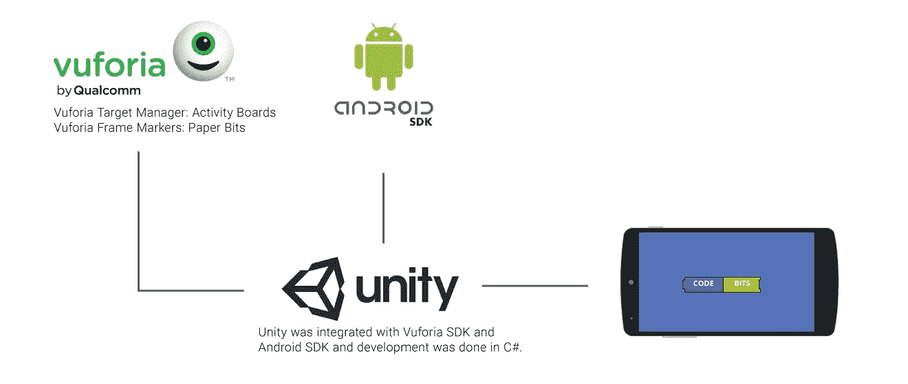

# 初学者的 10 个最佳 Vuforia 教程[2023 年 3 月]——在线学习 Vuforia

> 原文：<https://medium.com/quick-code/top-tutorials-to-learn-vuforia-to-develop-ar-applications-274eedc2b18f?source=collection_archive---------0----------------------->

## 学习 Vuforia，用 2023 年最好的 Vuforia 初学者教程创建增强现实应用

增强现实(AR)是以 3D 模型、文本、图形、音频和其他与现实世界对象集成的虚拟增强形式实时使用信息。正是这种“真实世界”的元素将 AR 与虚拟现实区分开来。与模拟相比，AR 集成并增加了用户与真实世界的交互的价值。

增强现实始于装有摄像头的设备，如智能手机、平板电脑或智能眼镜，装有增强现实软件。当用户指向设备并看着一个物体时，该软件通过计算机视觉技术识别它，该技术分析视频流。

包括 GE、梅奥诊所和美国海军在内的先驱组织正在使用 AR 来提高生产率、质量和培训。通过结合人类和机器的优势，AR 将大幅增加价值创造。

增强现实(AR)是以 3D 模型、文本、图形、音频和其他与现实世界对象集成的虚拟增强形式实时使用信息。正是这种“真实世界”的元素将 AR 与虚拟现实区分开来。与模拟相比，AR 集成并增加了用户与真实世界的交互的价值。

增强现实始于装有摄像头的设备，如智能手机、平板电脑或智能眼镜，装有增强现实软件。当用户指向设备并看着一个物体时，该软件通过计算机视觉技术识别它，该技术分析视频流。

包括 GE、梅奥诊所和美国海军在内的先驱组织正在使用 AR 来提高生产率、质量和培训。通过结合人类和机器的优势，AR 将大幅增加价值创造。

## 1.[用 Unity 打造 11 款增强现实(AR)应用& Vuforia](https://coursesity.com/r/site/build-15-augmented-reality-(ar)-apps-with-unity---vuforia)

开发 11 个增强现实(AR)应用程序，包括使用 Unity 和 Vuforia。

学习构建全功能增强现实应用程序所需的基础知识和编程技术。对于本课程，您需要一部 Android 智能手机或 iPhone。

增强现实(AR)是物理现实环境的实时直接或间接视图，其元素通过计算机生成或提取的现实世界感官输入(如声音、视频、图形或 GPS 数据)进行“增强”。

在增强现实中，真实视图是由计算机(在这种情况下是智能手机)修改的。增强现实增强了一个人当前对现实的感知，而相反，虚拟现实用模拟世界取代了现实世界。增强技术基本上是实时执行的，例如在体育赛事的直播视频中显示直播得分和统计数据

Vuforia 的平台看起来非常有前途，因为全世界的开发者都在使用 Vuforia 开发增强现实应用。口袋妖怪 Go 游戏就是增强现实最好的例子。除此之外，增强现实应用还扩展到了教育、商业、建筑、健康产业、家居装饰等广泛的领域，当然还有手机游戏。

这门课程是为对创建增强现实应用感兴趣的学生设计的。不需要编码经验；你只需要一台 Android 或 iOS 设备来测试你的增强现实应用。我们将从 C#平台 Unity 的基础开始，然后转向更高的主题

在第一节中，你将首先了解什么是增强现实。接下来，我们将看看四种不同的增强现实技术及其应用。在这之后，我会给你解释什么是虚拟现实，以及增强现实(AR) &虚拟现实(VR)的区别。

在理解了增强现实之后，接下来我们将看看 Unity 的基础知识，因为 Unity 是我们将用于构建增强现实应用的主要软件。

ARONE 是您将要创建的第一个增强现实应用程序。在此应用程序中，您将

*   创建 Vuforia 帐户
*   为 AR 应用程序创建许可证密钥
*   上传图像作为图像目标
*   了解 Vuforia 图像识别系统
*   Vuforia 版本 6.2.10 中白色图像目标问题的解决方案
*   从 Unity 资产商店下载 3D 模型
*   将 3D 模型放在图像目标的顶部
*   从 Vuforia 下载 ARONE 应用程序数据库，并在 Unity 中激活它
*   为 Android 和 Ios 构建此应用程序

虚拟按钮&增强现实名片(AR 名片)部分您将了解 Vuforia 中虚拟按钮的概念，以及使用虚拟按钮时应该考虑的六个重要因素。

接下来，您将创建一个名为增强现实虚拟按钮的简单虚拟按钮应用程序，在其中您将了解使用虚拟按钮所需的重要功能和界面。

在 AR 虚拟按钮应用之后，我们将创建一个 AR 名片。在 AR 名片应用程序中，首先将多个虚拟按钮放在一个图像目标的顶部。接下来，它将向您展示如何在 Unity 中播放视频文件，之后，我们将编写一个 C#脚本，在特定视频的虚拟按钮被按下时播放特定视频。

## 2.[增强现实入门](https://coursera.pxf.io/c/1137078/1213622/14726?u=BuGceriufQM&subId1=BotTutorials)

本课程将教授您使用混合和增强现实(MAR)技术开发移动应用程序的基础知识。通过动手项目，您将学习到快速、轻松地为 Android 智能手机和平板电脑构建三种不同应用原型的实用技术——即使之前没有任何编码经验。如果你是一名创意企业家，这是你对新兴增强现实市场产品和技术当今趋势的理想介绍。如果您是一名记者、媒体/内容制作人或教师，您将发现如何用声音、图像和视频增强基于印刷的媒体，并了解如何为您的观众创建增强的城市地图和地理定位增强现实游戏。如果你是一名网页设计师或应用程序开发人员，你将获得一系列的技术构建模块，可以集成到你的服务组合中。无论你的背景如何，你都将学会如何设计前沿的视觉体验来提升你的工作前景。

你会学到什么

*   关于当今市场上主要的 MAR 产品和技术
*   如何使用增强现实浏览器和创作工具构建三个不同的增强现实应用程序
*   如何包含图像识别和对象跟踪
*   如何将地理定位功能用于户外增强现实
*   ISO-ARAF 标准的详细信息，这是一种用于表示增强现实内容先决条件的创新语言

## 3. [Unity 和 Vuforia:在增强现实中试戴手表](https://linkedin-learning.pxf.io/c/1137078/646189/8005?u=https%3A%2F%2Fwww.linkedin.com%2Flearning%2Funity-and-vuforia-trying-on-watches-in-augmented-reality&subId1=quickcode)

该课程将指导您创建一个增强现实应用程序的步骤，该应用程序允许购物者使用手机预览手腕上的虚拟 3D 手表模型，并在颜色、面部和表带之间快速切换。

在本课程中，您将学习如何:

*   添加反射、金属效果和遮挡，使手表更加逼真。
*   让表带可以互换。
*   导入手表型号并设置目标。

探索如何添加反射、金属效果和遮挡，使手表更加逼真，以及如何使表带可以互换。

了解如何导入手表型号和设置目标，创建一个购物者可以放在手腕上的纸标记，应用程序将跟踪放置位置。还介绍了如何为应用程序用户界面创建按钮和组件。

## 4. [Vuforia 增强现实:在 2 小时内创建一个 AR 应用](https://www.eduonix.com/vuforia-augmented-reality-create-an-ar-app-in-under-2-hrs/UHJvZHVjdC0zMjMyMDA=)

在 Unity 中创建一个 Vuforia 增强现实舞蹈角色应用程序。逐步说明。一路上玩得开心！

该课程包括:

*   介绍
*   软件下载、获取 Unity、Vuforia 和创建您的帐户
*   配置 Unity & Vuforia 以开发原型应用程序
*   设置 AR 阶段&配置 Unity 中的角色
*   动画角色 7 添加音频

在本课程中，您将学习如何在不到 2 小时的时间内创建一个出色的 vuforia AR 应用程序。从完全的初学者到感觉舒适地创建 AR 体验。

您将学习如何导入 3D 角色并制作动画，添加音乐，并在 Android 或 IOS 设备上构建应用程序，以查看 AR 魔法的实现。

该课程首先向您介绍 Unity 网站和 Vuforia 的增强现实软件开发套件。

安装后，您将被引导完成基本配置，并导入所提供的资产以完成您的第一次 AR 体验。

## 5.[在 Unity 和 Vuforia 中构建 AR 体验](https://pluralsight.pxf.io/c/1137078/424552/7490?u=https%3A%2F%2Fwww.pluralsight.com%2Fcourses%2Funity-vuforia-building-ar-experience&subId1=quickcode)

增强现实(AR)预计将在几年内成为价值数十亿美元的产业。本课程将教你创建自己的 AR 应用程序所需的一切，这些应用程序可以在任何 Android 设备上启动。所需软件:Unity、Vuforia 和 3DS Max。

该课程包括:

*   简介和项目概述
*   2D AR 跟踪
*   3D AR 跟踪
*   大规模 AR 场景

在本课程中，使用 Unity 和 Vuforia 构建 AR 体验，您将学习如何创建三个独特的 AR 项目，每个项目都使您能够获得独立制作 AR 应用程序所需的知识和信心。

首先，您将学习 Vuforia AR 软件的基础知识，以及如何创建一个以动画鬼屋和讨厌的鬼魂为特色的 Android 应用程序。

接下来，您将学习如何创建一个 Android 应用程序，该应用程序创建将围绕真实 3D 对象跳舞的骨骼。

如果您的角色走在这个对象后面，您将学习如何遮挡增强角色穿过真实对象后面的部分。

您还将编写一个非常简单的 C#脚本来将阴影锁定到骨架上，以将它们可视化地锚定到场景中。

最后，您将创建一个由粒子制成的 12 英尺怪物的大规模 AR 场景。

当你完成这门课程时，你不仅会对创建增强现实应用充满信心，还会为即将到来的增强现实行业和商业机会做好准备。所需软件:Unity、Vuforia 和 3DS Max。

## 6.[快速构建 12 款 iPhone/Android 增强现实(AR)应用](https://click.linksynergy.com/deeplink?id=Fh5UMknfYAU&mid=39197&u1=quickcode&murl=https%3A%2F%2Fwww.udemy.com%2Frapidly-build-12-iphoneandroid-augmented-reality-ar-apps%2F)

构建 12 个 AR 应用程序(包括动画过场动画)并开始自己的应用程序构建业务！无编码—最新的 Unity/Vuforia。

*   为 iOS/Android 创建 12 个下一代增强现实应用程序——编程或编码知识不是必需的，需要的只是学习的意愿
*   通过学习如何构建实用的增强现实应用程序，包括增强现实名片(带多个视频播放器)、拖放增强现实对象应用程序(例如家具)、增强现实书籍、增强现实动画场景、增强现实贺卡、用户定义的目标增强现实应用程序(无标记)、增强现实跳跃惊吓恐怖应用程序等等，来创建自己的增强现实应用程序业务！
*   了解如何使用最新稳定版本的 Unity(2017.2-集成了 Vuforia 编辑器)和 Vuforia (6.5)来构建这个世界的 AR 应用程序。
*   高质量的演示，包含超过 3 小时的高清视频教程，介绍与增强现实应用相关的关键方面。

## 7.[1 小时打造一款增强现实安卓应用！](https://click.linksynergy.com/deeplink?id=Fh5UMknfYAU&mid=39197&u1=quickcode&murl=https%3A%2F%2Fwww.udemy.com%2Fbuild-an-augmented-reality-android-app-in-1-hour%2F)

了解如何使用 Unity 和 Vuforia 为 Android 创建基于 AR(增强现实)的应用程序。

在本课程中，我们将涵盖对构建增强现实 android 应用和应用非常重要的每个概念。我们将使用最著名的 AR 应用程序框架 Vuforia，并将其与一个名为 Unity 3D 的游戏构建引擎集成，以制作出令人惊叹的应用程序。我们将详细介绍每一步，并解释为什么这一步很重要。本课程结束时，创建增强现实应用对你来说将是小菜一碟。

## 8.[Unity IoT AR 中使用增强现实的物联网](https://click.linksynergy.com/deeplink?id=Fh5UMknfYAU&mid=39197&u1=quickcode&murl=https%3A%2F%2Fwww.udemy.com%2Finternet-of-things-using-augmented-reality-and-unity-iotar%2F)

了解最先进的实用增强现实物联网物联网 AR 使用 Vuforia 和 Unity on Particle Photon。

随着训练的进行，你将通过实践学到所有的基础知识。我们将一起在 Unity SDK 中为任何人的 IoT-AR 建立一个坚实的基础。本课程将使您能够:

*   开始使用粒子光子开发工具包。
*   Unity 入门以及如何下载 Vuforia SDK。
*   创建一个简单的 AR 仪表板，连接到您的粒子光子。
*   一旦您掌握了基础知识，我们将继续通过物联网与传感器进行交互，并将它们引入 AR。
*   在 AR 里看到一株植物的水位，几乎就像拥有 x 光视力一样。
*   用光电池减弱虚火的强度。
*   用多目标探测在三维空间测量距离(真的很酷！).
*   透过一个人的身体，在实时增强现实中看到他们的心脏跳动(真的很酷！).
*   在 AR 仪表上测量力和气体以及气体排放。
*   使用 JSON 在 AR 中几乎任何城市的增强现实中查看天气。

物联网和增强现实的应用:

1.  AR 名片
2.  AR 游戏
3.  娱乐
4.  医学的
5.  军队
6.  工业和家庭维护
7.  航行
8.  广告和促销内容

## 9.[在 Unity 中使用 Vuforia 7 创建增强现实应用](https://click.linksynergy.com/deeplink?id=Fh5UMknfYAU&mid=39197&u1=quickcode&murl=https%3A%2F%2Fwww.udemy.com%2Fcreate-augmented-reality-apps-using-vuforia-in-unity-sdk%2F)

从头开始学习如何使用 Vuforia 7 和 Unity SDK 创建增强现实应用程序。

本课程旨在通过实用且易于理解的实验，帮助您了解使用 Unity 中的 Vuforia 资产进行增强现实的基础知识。本课程涵盖这些功能，包括入门、简单和多目标检测、智能地形以及 leap motion 集成。随着训练的进行，你将通过实践学到所有的基础知识。我们将通过这次面向初学者的培训，在 Unity SDK 中共同建立一个强大的 AR 基础。本课程将使您能够:

*   Unity 入门以及如何下载 Vuforia SDK
*   用浮动立方体创建一个简单的 AR 应用程序
*   一旦你掌握了基础知识，我们继续在增强现实中创建多个目标
*   创建虚拟按钮，为您的 AR 应用程序添加交互性。
*   在实体墙上显示视频。
*   利用 Leap Motion 控制器在 AR 中创建捏画应用程序。(真爽！)
*   实现 Vuforia 的智能地形算法，实时检测物体！
*   检测圆柱形目标对象并激活标记

增强现实的应用:

1.  AR 名片
2.  AR 游戏
3.  娱乐
4.  医学的
5.  军队
6.  工业和家庭维护
7.  航行
8.  广告和促销内容

## 10.[用 Unity 打造 15 款增强现实(AR)应用& Vuforia](https://www.udemy.com/course/develop-augmented-reality-book-ar-business-card-with-unity/)

关于无标记跟踪、云 AR、3D 对象检测的增强现实(AR)教程，以及 Unity & Vuforia 的更多内容。

在本课程中，您将学习如何:

*   了解不同形式的增强现实及其应用。
*   为 Android 和 iOS 从头开始构建 15 个增强现实应用。
*   开发一个 ARBook 应用程序，可以检测多个图像目标。
*   使用 AR 虚拟按钮创建交互式名片。
*   搭建 AR 贺卡 app，一打开就播放声音，动画。
*   使用 3D 对象跟踪和在真实汽车上叠加数字汽车来检测真实的玩具汽车。
*   跟踪圆柱形物体并在圆柱周围放置数字模型
*   使用无标记跟踪将一辆真人大小的兰博基尼汽车放在现实世界中。
*   通过用 C#编程语言编写代码来创建 AR 应用。

在第一节中，你将首先了解增强现实。接下来，您将了解四种不同的增强现实技术及其应用。在这之后，课程会向你解释什么是虚拟现实，以及增强现实(AR) &虚拟现实(VR)的区别。

理解了增强现实之后，你会看到 Unity 的基础，因为 Unity 是用于构建增强现实应用的主要软件。

> 感谢您阅读本文。我们策划了更多主题的顶级教程，您可能想看看:

 [## 初学者的 9 个最佳 ARKit 教程——在线学习 ARKit

### 2021 年，学习 ARKit 的增强现实应用程序开发，为初学者提供最佳 ARKit 教程

medium.com](/quick-code/top-6-tutorials-to-learn-and-build-app-with-arkit-on-apple-94a3ad0bb0f9)  [## 10+最佳虚幻引擎 4 初学者教程

### 用 2021 年最好的虚幻引擎新手教程学习游戏开发的虚幻引擎 4

medium.com](/quick-code/top-tutorials-to-learn-unreal-engine-4-for-beginners-1a21c287c553)  [## 10+游戏开发者最佳 Unity 教程

### 学习 Unity 从 2021 年最好的 Unity 新手教程开始学习游戏开发

medium.com](/quick-code/top-online-tutorials-to-learn-game-development-using-unity-55497ad51169) 

披露:我们与本文中提到的一些资源有关联。如果你通过本页的链接购买课程，我们可能会得到一小笔佣金。谢谢你。