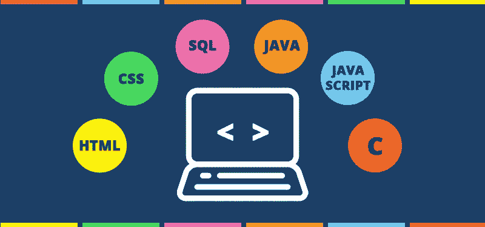

# 初学者的 15 个最佳 Web 开发教程[2023 年 3 月]——在线学习 Web 开发

> 原文：<https://medium.com/quick-code/top-tutorials-to-learn-web-development-for-beginners-4023595ebaa0?source=collection_archive---------0----------------------->

## 用 2023 年最好的新手网页开发教程学习网页开发。

## 1.[完整的 Web 开发者课程 2.0](https://coursesity.com/r/site/building-websites-ultimate-beginner-web-development-course)

通过使用 HTML、CSS、Javascript、PHP、Python、MySQL 等构建 25 个网站和移动应用程序来学习 Web 开发。

这门课程从基础开始。我将向您展示快速有效地使用 HTML5、CSS3 和 Python 等 web 技术的内部技巧。

*   一旦你锁定了它，它将向你展示如何使用更先进的技术，如 iQuery PHP 7、MySQL 5 和 Twitter Bootstrap，来构建你自己的响应网站。
*   到那时，你将会用 Wordpress 开发博客和电子商务网站，并学会添加动态内容的聪明方法，使用 APls 连接到谷歌地图和脸书等网站。
*   众所周知，最好的学习方法就是去做，这样你就可以随时完成有趣的网站挑战。此外，在您完成课程的过程中，您将使用您的技能来创建一个网站。最后的挑战是一个完整的 Twitter 克隆。

## 2.[Web 开发入门](https://coursera.pxf.io/c/1137078/1213622/14726?u=https%3A%2F%2Fwww.coursera.org%2Flearn%2Fweb-development&subId1=BotTutorials)

这门课程旨在让你踏上未来学习网页开发和设计的道路，不管你目前的经验和技术知识有多少。

在本课程中，您将学习如何:

*   能够描述万维网的结构和功能，使用 HTML、CSS 和 JavaScript 的组合创建动态网页。
*   创建 HTML 表单时应用基本的编程语言概念。*
*   选择一个合适的虚拟主机服务，将你的网页发布给全世界。
*   能够为将来创建自己的个人或商业网站开发一个工作模型。
*   寻找和选择一个虚拟主机公司；选择一个有效的域名。
*   使用主机来管理您的网站
*   网络和互联网在高水平上运行。
*   识别和使用常见的 HTML 标签；将图像添加到网页。
*   创建 HTML 格式的表格；使用超链接连接一系列网页。
*   将完成的 HTML 页面上传到网络主机。
*   讨论什么是动态内容；执行基本的编程语言任务。
*   创建简单的 JavaScript 程序；使用 JavaScript 设置警报和响应事件，读取输入，以及更改 HTML。
*   进行基本的 JavaScript 测试。
*   讨论网站设计中的常见错误。
*   识别和应用 CSS 基础知识，如目的和语法。
*   使用 CSS 属性控制字体、颜色、布局和其他常见属性。
*   区分内嵌、内部和外部 CSS 练习和测试您的级联样式表。
*   创建基本的 HTML 表单；识别并恰当地使用不同类型的 HTML 输入。
*   验证用户输入，提交 HTML 表单，测试表单的工作方式并排除错误。
*   区分客户端和服务器端开发。
*   应用高级 JavaScript 编程技能，通过选择和迭代创建逻辑。
*   为应用程序创建新功能；创建更高级的 HTML 表单。
*   了解其他故障排除和问题解决技巧。

你将有一个网站如何运作的概述，他们的结构，以及选择网站名称和选择一个在线主机来容纳你的网站的来龙去脉。

你将通过探索所有网站所使用的基本语言:HTML，开始探索如何设计和创建网站。

最后，您将探索设计 web 应用程序的基础——编写有用的动态网页，让我们的用户可以与之交互。

## 3.[全栈 Web 开发](https://www.eduonix.com/courses/Web-Development/the-full-stack-web-development/UHJvZHVjdC0zMjMyMDA=)

这个 40 多个小时的大规模课程涵盖了开发人员必须学习的所有不同部分，并将它们无缝地缝合在一起，以给学习者一个健康的体验。开发人员将一步一步地完成整个五个部分，学习如何将拼图视为一幅大图而不是碎片。

本全栈课程详细介绍了成为全栈开发者所需的每项技术的基础知识。整个课程分为五个独立的部分:

*   前端，
*   后端，
*   数据库，
*   其他关键技术
*   调试/版本控制。

每个部分都包括多种技术，帮助您获得更多开发经验。

## 4.[网络开发:初级读本](https://www.educative.io/collection/10370001/5668847440887808?affiliate_id=5088579051061248)

如果你对网页开发感兴趣，这个课程是一个完美的起点——无论你是一个想学习新技能的高中生，还是一个想建立自己网站的企业家。该课程涵盖了从网络基础到 HTML、CSS 和 JavaScript 前端 web 开发原理的所有内容。

学完这门课程后，你不仅可以轻松地学习任何 web 技术，还可以更好地了解有哪些不同的技术，以及你想学什么。您还将熟悉版本控制系统，这是一种全球行业标准。

## 5.[学网页开发](https://www.pjatr.com/t/TUJGR0lLR0JHR0pMSUtCR0ZISk1N?sid=quickcode&url=https%3A%2F%2Fwww.codecademy.com%2Flearn%2Fpaths%2Fweb-development)

从前端开始，学习 HTML，CSS，JavaScript。然后，掌握后端和 API 来完善您的全栈技能。

在本课程中，您将学习如何:

*   掌握前端开发人员日常使用的工具，从 HTML 到 React，再加上服务器端的后端 JavaScript 库用 Express.js。
*   构建 web 应用程序的后端，甚至创建自己的 API。
*   边学边做有价值的项目，这样你就可以向招聘人员展示你的技能，开启你的网页开发职业生涯。
*   使用基于组件的前端框架 React.js 构建动态的强大的 web 应用。
*   使用流行的 Express.js 框架用 JavaScript 创建后端服务器和 API。
*   了解成为一名成功的全栈 web 开发人员所需的 SQL 基础知识。
*   了解 Node-SQLite 在 web 应用中连接 JS 和 SQL，构建你的第一个完全集成的后端应用。
*   掌握测试驱动开发的基础知识，创建可靠的全栈 JavaScript web 应用程序。

通过学习 HTML(网络的基本语言)的基础知识，开始成为一名网络开发人员。学习和练习 CSS 的基本原理，为你的网页添加漂亮的样式。

学习 JavaScript 的基础:语法、变量、条件和函数。学习更多有趣网站的 CSS 技术:显示和定位、颜色、排版、响应设计和 flexbox。

探索更多 JavaScript 技术和特性，包括数组、循环和对象。学习文档对象模型，JavaScript 和 HTML 元素之间的接口，将 HTML、CSS 和 JavaScript 结合成令人兴奋的交互站点！

学习更多的技术来扩展您的 JavaScript 知识，包括可重用的类、将代码分割成模块以及发出 HTTP 请求。

发现这个简单而重要的基于文本的工具的强大功能，并提高开发人员的工作效率。学习使用这个重要的工具保存和管理不同版本的代码项目。

## 6.[网络开发者训练营](https://coursesity.com/r/site/the-web-developer-bootcamp-2022)

学习 web 开发唯一需要的课程——HTML、CSS、JS、Node 等等。

嗨！欢迎来到 web 开发者训练营，这是学习 Web 开发的唯一课程。在线开发人员培训有很多选择，但这个课程无疑是市场上最全面、最有效的。原因如下:

*   它涵盖的所有内容都是最新的，并且与当今的开发人员行业相关。没有 PHP 或其他过时的技术。这门课程不走捷径。
*   这是唯一一个涵盖 NodeJS 的完整的初学者全栈开发者课程。
*   我们构建了 13 个以上的项目，包括一个名为 YelpCamp 的大型生产应用程序。没有其他的课程可以引导你创建这样一个实际的应用程序。
*   本课程不断更新新的内容、项目和模块。可以把它看作是对永无止境的开发人员培训的订阅。

## 7.[从零开始成为一名网页开发者](https://click.linksynergy.com/deeplink?id=Fh5UMknfYAU&mid=39197&u1=quickcode&murl=https%3A%2F%2Fwww.udemy.com%2Fhow-to-become-a-web-developer-from-scratch%2F)

本课程涵盖了你成为一名顶级熟练的 web 开发人员所需要知道的一切，即使你以前从未编程过。

**前端开发:** JavaScript，jQuery，HTML5，CSS3，Bootstrap

**后端开发:** PHP，MySQL (MySQLi)

本课程将为您提供关于互联网如何运作的所有见解，在您完成本课程后，您将拥有广泛的知识，能够利用最新技术创建自己的网站和应用程序。

它将提供一个讲座，教你如何获得一个免费的托管帐户来上传你的项目，并展示给你的朋友和客户。一个美丽的投资组合网站，你可以使用自己的。它将帮助你创建你的第一个投资组合网站，你将能够使用自己的网站，并作为一个专业的自由职业者呈现给你的客户。2016 年科技市场职业生涯完整指南。一整节致力于如何开始你的职业生涯，无论是作为自由职业者还是全职员工，都有顶级专家的建议。

## 8.[完整的 Fullstack Web 开发人员课程](https://click.linksynergy.com/deeplink?id=Fh5UMknfYAU&mid=39197&u1=quickcode&murl=https%3A%2F%2Fwww.udemy.com%2Fthecompletewebdeveloper%2F)

从头开始学习 HTML，HTML5，CSS，CSS3，JavaScript，PHP，jQuery，Ajax & MySQL！最后搭建一个登录系统。

参加本课程后，您将获得以下收获:

学习 HTML、CSS 和 JavaSript。这就是成为一名前端 web 开发人员所需要知道的一切。

学习 jQuery 和 Ajax 来创建跨浏览器和页面内响应网站。

学习 PHP 和 MySQL，这是一个后端堆栈，让马克·扎克伯格创建了脸书。

最后把它们放在一起，创建一个会员专用页面的完整登录/注册系统(就像脸书做的那样！)

## 9.[终极网页设计师&开发者课程:构建 23 个项目！](https://click.linksynergy.com/deeplink?id=Fh5UMknfYAU&mid=39197&u1=quickcode&murl=https%3A%2F%2Fwww.udemy.com%2Fweb-developer-course%2F)

成为全栈开发人员—学习从设计到前端和后端编程的一切。

它将从学习视觉和网页设计开始，如何使用 Adobe Photoshop，以及如何绘制专业的线框。然后你将学习用 HTML5、CSS3、Javascript 和 jQuery 编码。此时，你将能够自己编写定制网站、动画和网络应用程序。

一旦你熟练掌握了前端语言，你就可以将你的大脑和高级技能融为一体，比如响应网站、PHP、MySQL、WordPress 和定制 WordPress 插件开发。然后你将有能力建立反应灵敏的动态网站和博客，基本的电子商务网站和网上商店，并对网页设计和开发的各个方面有专业的理解。

在你学习了从设计到开发的所有知识后，你将被带到一个充满有价值的提示、资源和现实世界指导的实践职业部分，以帮助你开始你的职业生涯——无论你是想作为一名自由职业者在家工作，还是在一家设计机构获得一份全职工作室工作。

## 10. [Python 和 Django 全栈 Web 开发者训练营](https://click.linksynergy.com/deeplink?id=Fh5UMknfYAU&mid=39197&u1=quickcode&murl=https%3A%2F%2Fwww.udemy.com%2Fpython-and-django-full-stack-web-developer-bootcamp%2F)

学习用 HTML，CSS，Bootstrap，Javascript，jQuery，Python 3，Django 1.11 来搭建网站。

这门课程旨在让任何人都可以学习如何成为一名网站开发人员。我们通过高清视频讲座、演练代码项目、练习、概念演示幻灯片、可下载的代码笔记、阅读作业等等来教你如何编程。

## 11.[高级网络开发者训练营](https://click.linksynergy.com/deeplink?id=Fh5UMknfYAU&mid=39197&u1=quickcode&murl=https%3A%2F%2Fwww.udemy.com%2Fthe-advanced-web-developer-bootcamp%2F)

学习 React 16、Redux、D3、ES2015、测试、CSS Flexbox、动画、SVG、AJAX 等等。

完整的课程将帮助您学习最新的技术、工具和库，成为一名熟练的 web 开发人员。请将本课程视为将开发人员技能提升到更高水平所需的所有知识的百科全书。

这是唯一一门涵盖高级 CSS、高级 JavaScript、NodeJS、D3、React 和 Redux 的全栈开发者课程。我们构建了超过 10 个项目，有几十个代码挑战和解决方案，以确保您理解材料，而不只是看我们说话。

## 12.[网络开发人员基础课程——建立 12 个网站](https://click.linksynergy.com/deeplink?id=Fh5UMknfYAU&mid=39197&u1=quickcode&murl=https%3A%2F%2Fwww.udemy.com%2Fthe-essential-web-developer-course%2F)

从一个完全的初学者，到一个认证的网站开发人员，这个课程将教你网站开发的基础知识。

您可以立即访问经过深思熟虑的全面章节，这些章节包含详细的讲座，带您一步一步地学习。你将从一个拥有数十本技术和在线营销领域畅销书的经验丰富的 Web 开发人员学习成为一名专业的程序员。

以下是您从基础 Web 开发人员课程中获得的内容:

*   即时和不受约束的终身访问超过 30 小时的清晰和高度引人入胜的视频教程，这些教程将引导您逐步建立对 HTML、CSS 和 JavaScript 等技术的基本理解。
*   在学习了基础知识之后，我将向您深入展示如何使用 PHP、MySQL、jQuery 和 Bootstrap 等技术开发响应性强、交互式的数据库驱动网站。
*   访问在线论坛，在这里您可以提出和提出问题，并获得帮助，帮助您解决刚入门的首次开发人员所面临的一些更常见的问题。
*   一旦你掌握了这一切，你将学习如何营销你的服务，这样你就可以作为一名经验丰富的网络开发人员，在自己舒适的家中每月赚取数千美元的额外收入。

## 13.[完整的 Web 开发人员训练营——从初学者到专家](https://click.linksynergy.com/deeplink?id=Fh5UMknfYAU&mid=39197&u1=quickcode&murl=https%3A%2F%2Fwww.udemy.com%2Fjob-ready-web-developer%2F)

完成 web 开发培训。在这个沉浸式课程中，通过使用 HTML、CSS、JS、Rails 构建真正的应用程序来获得工作。

你还将建立和启动一个真正的创业公司，你可以为自己的商业想法或网上商店定制。本课程包括一本可下载的电子书，详细介绍了成为自由职业者或全职网络开发人员的步骤。

本课程结束时，你将学习 HTML、CSS、Javascript、jQuery、Ruby on Rails、电子商务等等。你将从零开始建立并启动一家创业公司，并拥有自己的网站组合，与雇主分享并被雇佣。

**学习:** HTML，CSS，Javascript，jQuery，Ruby，Rails，Git，电子商务与 Stripe，服务器，Heroku，Bootstrap，数据库等等。

**创建:**你将创建你自己的 14 个站点的组合(从练习中获得)，你创建并启动一家初创公司，它可以注册用户并通过收取高级会员费来赚钱。你可以自定义这个来启动你自己的生意，网上商店，或启动和赚钱。

## 14.[成为专业的 Web 开发人员| 3.0 版](https://click.linksynergy.com/deeplink?id=Fh5UMknfYAU&mid=39197&u1=quickcode&murl=https%3A%2F%2Fwww.udemy.com%2Fweb-development-tutorials%2F)

从零开始成为专业 web 开发人员所需了解的一切，针对现代开发进行更新。

我们称之为“成为一名专业的 web 开发人员”,并不是因为我们认为自己很棒，而是因为这无疑是镇上最深入的 Web 开发课程。

本课程的设计和结构遵循精英大学课程。您将从学习 web 开发人员使用的每种编程语言和技术的基础开始，并且您将使用您学习的每项新技能来创建现实生活中的项目，因此您将获得完整的拼图，而不仅仅是您必须自己组装的碎片。

Web 开发在不断变化，这门课也是如此。你不仅会学到成为一名 web 开发人员的基础知识，我们还会不断添加新的开发工具，比如 Angular 2、Bootstrap、Ruby on Rails 等等。购买本课程一次，让你的技能永远保持锋利！

大多数关于 web 开发的课程会带你了解初学者需要的技能，但之后会要求你学习使你成为一名合格的 web 开发人员的技能。这个课程不一样。在你学习了基础知识并为你的投资组合构建了真实的项目之后，你可以继续为你所学的每一项 web 开发技能进行大量的中级和高级培训。

当你刚刚开始擅长这个的时候，不要停下来，继续学习和增强你的 web 开发组合。本课程会经常添加新内容，因此即使您完成了整个课程，下次登录时，您还会学到更多技能。

## 15.[包含 14 个项目的完整前端 web 开发人员训练营](https://click.linksynergy.com/deeplink?id=Fh5UMknfYAU&mid=39197&u1=quickcode&murl=https%3A%2F%2Fwww.udemy.com%2Fcomplete-front-end-web-developer-bootcamp%2F)

学习 HTML、HTML5、CSS、CSS3、Bootstrap、JavaScript、Jquery 以及动画 CSS & TypeAhead 等几十个插件的用法。

本课程给你一个独特的体验，并且只关注前端 web 开发。首先你会得到专业和免费的网络开发工具，然后你会从 **HTML** 开始。一旦你走过这片土地，你将接受你的第一个挑战。此外，你将学习 **HTML 5** 并开始你的第一个项目。

继续前进，您将乘坐 **CSS 和 CSS3。在那之后，你将有一个关于项目的完整和专门的部分。之后，您将学习引导和优化您的网站移动视图。之后，你将学习 Javascript 和 jQuery，并在其中做一些项目。**

本课程的结构是经过研究设计的，你不会对这门课程感到厌烦。完成本课程后，你将能够设计一个与你脑海中或你可能在某个主题网站上看到的设计完全相同的网页。

> 感谢您阅读本文。我们策划了更多主题的顶级教程，您可能想看看:

 [## 面向初学者的 10+最佳 TypeScript 教程—在线学习 TypeScript

### 用 2022 年最好的初学者 TypeScript 教程学习应用程序开发的 TypeScript

medium.com](/quick-code/top-tutorials-to-learn-typescript-c08834892e69)  [## 10+适合初学者的最佳 Python 教程—在线学习 Python

### 通过 2022 年面向初学者的最佳 Python 教程，学习 Python 以实现更轻松的 web 开发

medium.com](/quick-code/top-free-online-courses-to-learn-python-dcd22b03db62)  [## 10+最佳新手萨斯教程——在线学习萨斯和 SCSS

### 学习萨斯和 SCSS，在 2022 年为初学者创建最好的萨斯教程的专业网站

medium.com](/quick-code/top-tutorials-to-learn-sass-and-scss-33e4dcd63e9b) 

*披露:如果你通过本页的链接购买课程，我们可能会得到一小笔会员佣金。谢谢你。*