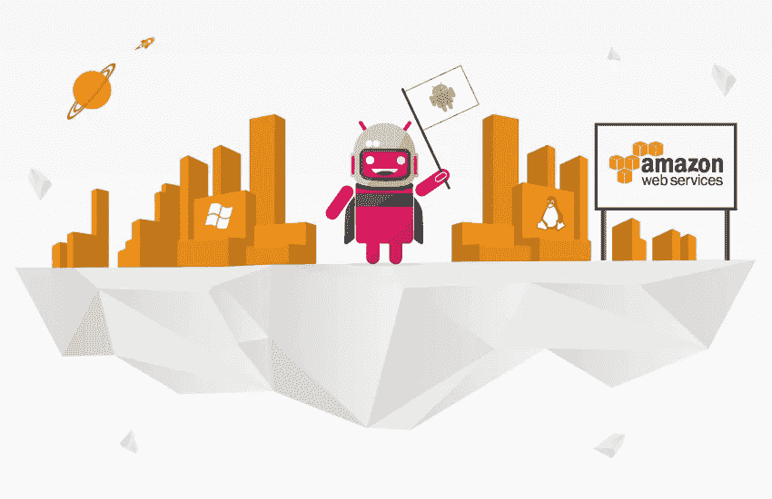
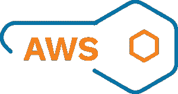
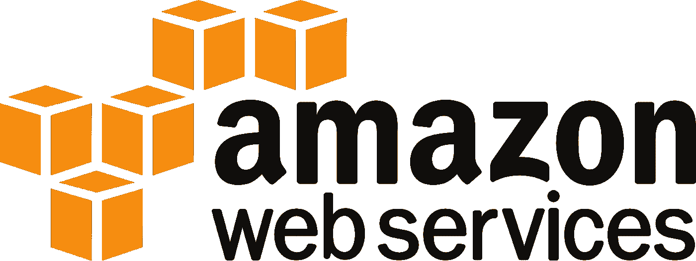
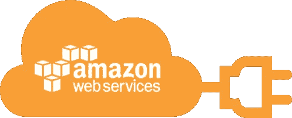

# 10+最佳 AWS 培训在线课程[2023 年 3 月]—为 AWS 认证做准备

> 原文：<https://medium.com/quick-code/top-tutorials-to-prepare-for-aws-certification-exams-e991c55b54b0?source=collection_archive---------4----------------------->

## 用 2023 年最好的新手 AWS 培训课程为开发者准备 AWS 认证。

AWS 认证考试近年来备受关注。亚马逊网络服务为 70%的互联网提供动力。学习 AWS 对开发者来说非常有用。对 aws 开发者的需求巨大。这些是从*最佳 aws 认证课程*开始学习 aws 认证准备的在线课程。

让我们从以下课程开始学习 aws 认证。让我们从以下课程开始，从有史以来顶尖的 aws 课程中学习 aws。

## 1.【2021 年终极 AWS 认证开发者助理—全新！

成为 AWS 认证开发者！了解所有 Amazon Web Services 开发者主题。通过 AWS 认证开发者考试。

在本课程中，您将学习如何:

*   为您未来的实际 AWS 项目应用正确的 AWS 服务。
*   使用完全自动化的弹性 Beanstalk 和 AWS CICD 工具部署应用程序。
*   使用 AWS Lambda、API Gateway、DynamoDB & Cognito 了解无服务器 API。
*   使用 AWS CloudFormation 将基础架构编写为代码。
*   使用 AWS SQS、SNS 和 Kinesis 实现消息传递和集成模式。
*   掌握 EC2 中的 CLI、SDK 和 IAM 安全最佳实践。
*   使用 CloudWatch、X-Ray 和 CloudTrail 监控、跟踪和审计您的微服务。
*   使用 KMS、加密 SDK、IAM 策略和 SSM 保护您的整个 AWS 云。

本课程深入涵盖了 AWS 认证开发人员助理 DVA-C01 考试的所有新主题，并包含了作为开发人员如何从内到外使用 AWS 的实用知识

了解如何准备 AWS 考试，以及如何为现实世界做准备。此外，您将学习如何在大多数时间使用 AWS 免费层，并超越它。

# 2. [AWS 认证解决方案架构师助理(SAA-C01): 1 云服务概述(2020 年)](https://linkedin-learning.pxf.io/c/1137078/646189/8005?u=https%3A%2F%2Fwww.linkedin.com%2Flearning%2Faws-certified-solutions-architect-associate-saa-c01-1-cloud-services-overview-2019&subId1=quickcode)

了解云计算和 Amazon Web Services (AWS)平台的基础知识。本课程旨在帮助您准备并通过 AWS 认证解决方案架构师助理(SAA-C01)考试。

在本课程中，您将学习:

*   如何准备 AWS 认证解决方案架构师助理(SAA-C01)考试？
*   云计算的好处。

探索云计算的优势、AWS 服务的范围、AWS 内置的安全解决方案以及 AWS 区域和可用性区域。

该课程为任何开始成为 AWS 架构师之旅的人以及准备参加 AWS 认证解决方案架构师助理考试的人提供了基础指导。它还涵盖了考试认证主题。

市场上有很多现有的 AWS 练习测试，但是，其中大多数都包含技术和语法错误，可能会导致您在实际考试中失败。AWS 也提供官方认证练习考试，但这些考试只有 20 或 40 个问题，价格为 20 或 30 美元，与 390 个独特且定时的亚马逊网络服务练习问题相当！

# 3.[从零开始用 AWS 学习云计算](https://www.eduonix.com/courses/Software-Development/Learn-Cloud-Computing-With-AWS-From-Scratch/UHJvZHVjdC0zMjMyMDA=)

本课程将为您提供入门各种亚马逊服务的基本培训。你将了解亚马逊提供的所有流行的云和基础设施服务，并将研究实际例子。本课程将涵盖以下概念:

*   AWS 概念
*   AWS 基础设施概述
*   AWS 系统管理
*   将 EC2 用于 Web 基础设施
*   使用迪纳摩数据库作为 NoSQL 数据库
*   将 S3 用于存储基础架构
*   为您的网站使用云前端和负载平衡器
*   亚马逊短信和电子邮件简单服务

本课程涉及到该技术的理论概念和实际应用。重要的是，学生使用 AWS 的概念来构建真实世界的基础设施，因为它们涵盖了每一章。

# 4.[全面了解亚马逊网络服务(AWS)](https://www.educative.io/collection/5081119082938368/5748755743637504?affiliate_id=5088579051061248)

了解计算、存储、网络服务等核心 AWS 服务，以及它们如何与身份、移动、路由和安全等其他服务协同工作。本课程将帮助您很好地掌握 AWS 服务的所有知识。

本课程由三位拥有 17 年行业经验的 AWS 解决方案认证架构师设计。我们的目标是为您提供您需要的正确深度的知识。

# 5.[亚马逊网络服务认证(AWS) 2018 —全部 4 项认证！](https://click.linksynergy.com/deeplink?id=Fh5UMknfYAU&mid=39197&u1=quickcode&murl=https%3A%2F%2Fwww.udemy.com%2Faws-certified-associate-architect-developer-sysops-admin%2F)

视频、实验室和实践考试— AWS 认证(解决方案架构师、开发人员、系统管理员、云从业人员)。

Udemy 上最全面的 AWS 认证预备课程。当心那些只提供通过认证考试所需部分内容的劣质课程。在把钱浪费在其他地方之前，先检查一下这门课的课程表。

我们经验丰富的讲师不仅拥有所有的助理资格，他还是 AWS 认证的解决方案架构师专家和 AWS 认证的 DevOps 工程师专家。自 2014 年以来，BackSpace Academy 一直在提供市场上最超值的 AWS 课程。

本课程为您参加 AWS 认证解决方案架构师助理、AWS 认证开发人员助理、AWS 认证系统管理员助理和 AWS 认证云从业人员做好了充分的准备。

本课程以 4 个模拟考试结束，让你接触到考试中可能出现的问题类型:

1.  AWS 认证解决方案架构师助理，
2.  AWS 认证开发人员助理，
3.  AWS 认证系统操作管理员助理，以及
4.  AWS 认证云从业者

## 6.【2021 年终极 AWS 认证解决方案架构师助理

通过 AWS 认证解决方案架构师助理认证 SAA-C02。完成亚马逊网络服务云培训！

在本课程中，您将学习如何:

*   在 AWS 上执行真实世界的解决方案架构。
*   了解 AWS 基础知识(EC2、ELB、ASG、RDS、ElastiCache、S3)。
*   了解无服务器基础知识(Lambda、DynamoDB、Cognito、API Gateway)。
*   分析 10 多种解决方案架构(传统和无服务器)。
*   理解架构良好的框架，灾难恢复。
*   掌握 AWS 上所有数据库的差异。
*   使用 KMS、IAM 策略和 SSM 保护您的整个 AWS 云。

首先，您将深入学习 AWS 上的解决方案架构，并学习 AWS 认证解决方案架构师助理 SAA-C02 考试的所有新主题。

本课程包含了作为解决方案架构师如何从内到外使用 AWS 的实用知识。你将学习如何准备 AWS 考试，以及如何为现实世界做准备。

# 7.[第 1 部分:AWS 认证助理(SA、CD、SO)指南&问题](https://click.linksynergy.com/deeplink?id=Fh5UMknfYAU&mid=39197&u1=quickcode&murl=https%3A%2F%2Fwww.udemy.com%2Faws-certified-solutions-architect-guide-question-bank-i%2F)

解决方案架构师、系统运行管理员、开发人员实践认证、450 多个考试准备问题。

AWS 认证解决方案架构师指南和题库— I 提供了对 AWS 的结构化介绍，并为您获得助理级别的认证做好准备。

本课程涵盖构成 AWS 基础的服务—网络、计算、负载平衡、弹性扩展、存储、监控、安全性和成本估算。

每个主题都包含概念、实践活动和练习考试。题库包含 300 多种考试，如模拟测验。

# 8.[第 2 部分:AWS 认证助理(SA、CD、SO)指南&问题](https://click.linksynergy.com/deeplink?id=Fh5UMknfYAU&mid=39197&u1=quickcode&murl=https%3A%2F%2Fwww.udemy.com%2F2-aws-certified-solutions-architect-guide-question-bank%2F)

解决方案架构师、系统运行管理员、开发人员实践认证、450 多个考试准备问题。

AWS 认证解决方案架构师指南和题库提供了对 AWS 的结构化介绍，并为您获得助理级别(架构师、系统管理员、开发人员)的认证做好准备。

在本课程的第 1 部分，我们了解了构成 AWS 云平台基础的核心服务。这包括网络、存储、计算、自动扩展、安全性、监控和用于估算解决方案成本的工具。

在本课程中，我们将从提供排队、通知和电子邮件功能的服务开始。然后我们将关注由 AWS 和 API Gateway 提供 Lambda 无服务器计算能力，为您的 Lambda 函数提供 RESTful 前端。AWS 还提供一系列云数据库产品，包括 RDS、NoSQL、内存、柱状、弹性搜索，我们将探讨它们的优缺点。了解如何使用 Amazon Kinesis 管理流数据(Stream、Firehose、Analytics)。了解亚马逊 ECS、集装箱和码头工人。CloudFormation 讲座教授如何将基础设施作为代码进行管理。Elastic Beanstalk 概述了如何快速部署应用程序和自动管理基础设施。本课程还介绍了应用程序中 AWS 服务的编程集成。

当我们学习这些主题时，我们将研究构建经济高效且高度可伸缩的解决方案的架构最佳实践和模式。我们还将了解 AWS 支持的灾难恢复选项。

# 9. [AWS 开发者基础培训](https://linkedin-learning.pxf.io/c/1137078/646189/8005?u=https%3A%2F%2Fwww.linkedin.com%2Flearning%2Faws-essential-training-for-developers&subId1=quickcode)

本课程对关键的 AWS 服务进行了细分，让开发人员从较高的层面了解他们在 AWS 中托管应用的不同方式，以及如何决定哪些服务适合他们的用例。

在本课程中，您将了解:

*   关键 AWS 服务。
*   在 AWS 中托管应用程序的不同方式。
*   云计算通过将概念与现实世界的硬件联系起来。

他通过将概念与现实世界的硬件(如硬盘和网络交换机)联系起来，向您介绍了云计算。

## 10.[【新】终极 AWS 认证云从业者— 2021 年](https://click.linksynergy.com/deeplink?id=Fh5UMknfYAU&mid=39197&u1=quickcode&murl=https%3A%2F%2Fwww.udemy.com%2Fcourse%2Faws-certified-cloud-practitioner-new%2F)

通过亚马逊网络服务认证云从业者 CLF-C01 考试，实践考试包括解释！

在本课程中，您将学习:

*   AWS 基础(EC2、ELB、ASG、RDS、ElastiCache、S3)。

通过本课程，您将深入了解 AWS 认证云从业者 CLF-C01 考试的所有新主题。您将学习如何从里到外使用 AWS。

该课程更侧重于实践方法，而不是理论。它教你如何有效地准备 AWS 考试。

## 11. [AWS 云形成大师班 v2【2021】](https://click.linksynergy.com/deeplink?id=Fh5UMknfYAU&mid=39197&u1=quickcode&murl=https%3A%2F%2Fwww.udemy.com%2Fcourse%2Faws-cloudformation-master-class%2F)

使用 YAML 编写完整的 AWS 云形成模板。了解所有最近的云形成特征。

该课程包括:

*   YAML 和参数
*   SSM 参数类型
*   高级资源(DependsOn、DeletionPolicy、UpdateReplacePolicy、CreationPolicy、UpdatePolicy)
*   映射和伪参数
*   输出和交叉堆栈参考
*   部署选项(变更集、堆栈策略、回滚、终止、服务角色)
*   CDK(云开发套件)简介

在本课程 AWS CloudFormation Master Class 中，您将了解 CloudFormation 的所有功能并掌握其所有概念。您将通过动手示例来实践您所学到的内容。

接下来，您将学习如何使用 YAML 编写 CloudFormation 模板，并将您的基础设施编写为代码。此外，您将深入了解每个 CloudFormation 构建块:参数、映射、资源、输出、条件和元数据。

此外，您将了解 CloudFormation Init，这是引导 EC2 实例的最强大的方法，以及高级 CloudFormation 特性漂移、嵌套堆栈。

# 12. [AWS 认证解决方案架构师专业考试指南](https://www.eduonix.com/courses/certification-courses/aws-certified-solutions-architect-professional-exam-guide/UHJvZHVjdC0zMjMyMDA=)

本 AWS 专业认证课程将帮助您为专业水平认证考试做好充分准备。它将涵盖考试大纲中的重要概念，包括虚拟专用云(VPC)、Kinesis 服务、简单队列服务、数据管道、直接连接、CloudTrail 服务、CloudFront 服务、CloudSearch、AMR 服务、弹性负载平衡器和其他对考试很重要的理论概念。

本教程结束时，您将:

*   舒适到不仅能参加认证考试，还能通过考试
*   能够设计满足系统要求的最佳系统
*   最大限度地提高可扩展性、安全性、可靠性、耐用性和成本效益等特性。
*   评估项目需求，并为 AWS 上的实施、部署和供应应用程序提出建议。
*   你将理解考试中的所有主要概念，包括理论概念。

> 感谢您阅读本文。我们策划了更多主题的顶级教程，您可能想看看:

 [## 给初学者的 8 个最好的 Alexa 技能(亚马逊)课程——在线学习 Alexa 技能

### 学习如何使用 Alexa 工具包创建 Alexa 技能，为初学者提供 2021 年最好的 Alexa 课程。

medium.com](/quick-code/top-online-courses-to-learn-skills-development-for-amazon-alexa-google-home-3048b0a7bcca)  [## 10+最佳微软 Azure 初学者教程—在线学习微软 Azure

### 2021 年用最好的 Azure 初学者教程学习 Azure for cloud 开发

medium.com](/quick-code/top-tutorials-to-learn-microsoft-azure-for-cloud-computing-258affcd2c5d)  [## 15+最佳 Docker 初学者教程——在线学习 Docker

### 用 2021 年面向初学者的最佳 Docker 教程学习面向开发者的 Docker 容器开发

tutorials.botsfloor.com](https://tutorials.botsfloor.com/top-tutorials-to-learn-docker-to-run-distributed-applications-bce896e260ec) 

披露:我们与本文中提到的一些资源有关联。如果你通过本页的链接购买课程，我们可能会得到一小笔佣金。谢谢你。