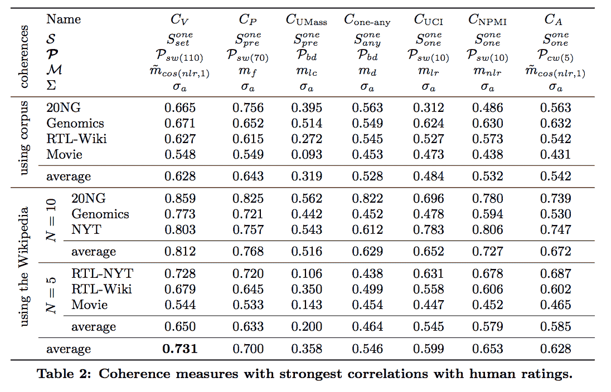
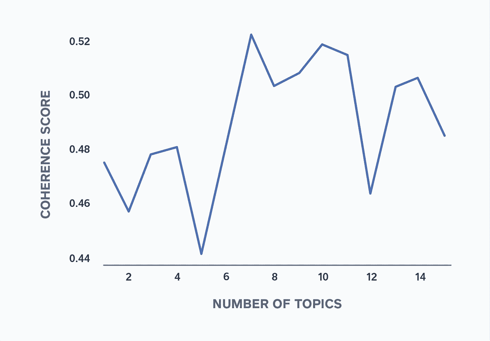
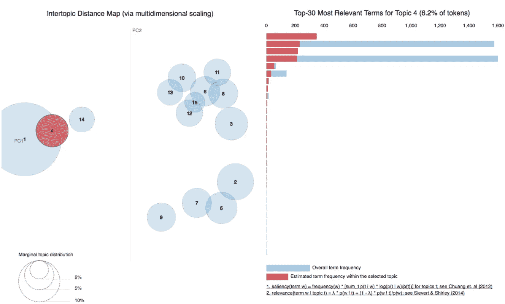
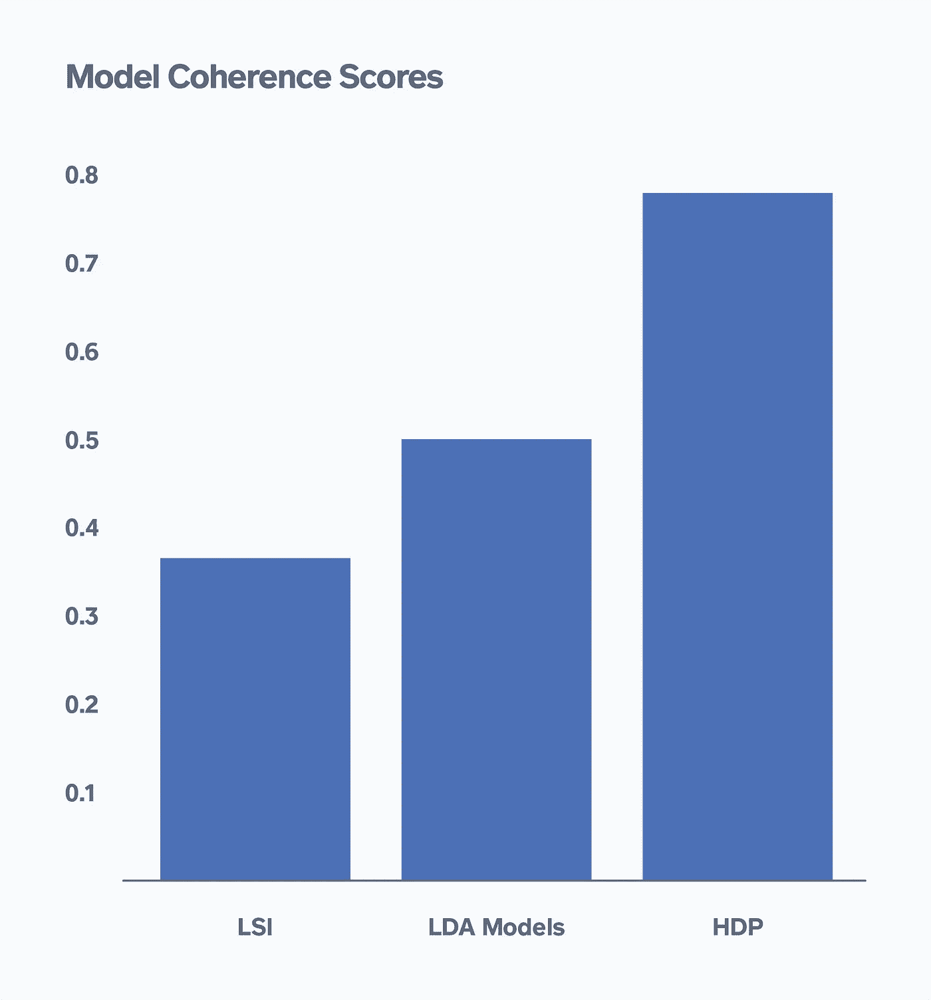

# 主题建模

> 原文：<https://medium.com/square-corner-blog/topic-modeling-optimizing-for-human-interpretability-48a81f6ce0ed?source=collection_archive---------0----------------------->

## 优化人类的可解释性

> 注意，我们已经行动了！如果您想继续了解 Square 的最新技术内容，请访问我们的新家[https://developer.squareup.com/blog](https://developer.squareup.com/blog)

**问题**

你是否曾经浏览过大量的文本，并希望快速理解其中包含的一般趋势、主题或主题？这包括从你从未为读书俱乐部完成的那本书到通过用户反馈和工作中的评论进行解析。好吧，请放心，你并不孤单，有工具可以帮助你完成这一壮举，如*主题建模*。

[主题建模](https://en.wikipedia.org/wiki/Topic_model)是一种无监督的机器学习，它利用聚类来发现数据中的潜在变量或隐藏结构。换句话说，这是一种在大量文本中寻找主题的方法。主题建模对于文档聚类、非结构化文本的信息检索和特征选择非常有用。

在 Square，我们使用主题建模来解析卖家在自由格式文本字段中提供的反馈。下面是一个例子——一个评论区，供卖家留下反馈，说明他们为什么决定离开该产品，以及我们如何在未来更好地为他们和其他像他们一样的客户服务。

Figure 1: Comment box asking for seller feedback when they unsubscribe

尽管主题建模是一种强大的统计方法，但它可能很难评估主题模型的有效性或解释结果。数据从业者在使用主题建模时会问的两个主要问题是:

1.)确定主题模型中主题数量(𝜅)的最佳方法是什么？

2.)如何评估和提高模型结果的可解释性？

在本文中，我将介绍一些可以帮助您回答上述问题的技术。

**数据&方法**

在实现主题模型时，清理文本数据以确保获得最精确和最有意义的结果是很重要的。这包括常见的[数据预处理](https://en.wikipedia.org/wiki/Data_pre-processing)技术，如标记化、移除停用词和词干化/词条化。这些是[方法](http://www.cs.cornell.edu/~xanda/winlp2017.pdf)将文档分割成单词的原子元素，删除几乎没有意义的单词，并确保意义相似的词根在模型中获得适当的重要性权重。

充分清理和准备语料库后的下一步是构建一个文档术语矩阵，并在此基础上训练模型。这是选择主题数量(𝜅)的第一个问题，因为𝜅是主题模型的通用模型参数。

**话题数量(𝜅)**

在决定使用多少主题时，考虑定性和定量因素都很重要。定性地说，您应该对您正在分析的数据有领域知识，并且能够估计出您的数据将分成的聚类的大致范围。应该有足够的主题来区分文本中的主要主题，但不要有太多的主题以至于失去可解释性。从定性的角度来看，在评估我们的卖家的文本回复的情况下，10 个主题似乎是一个合理的起点，因为它提供了足够的空间来捕捉可操作的主题，如功能和成本，而不必进行细化。

从定量的角度来看，一些数据从业者使用*困惑*或*预测可能性*来帮助确定主题的最佳数量，然后评估模型的拟合度。在给定由主题模型定义的主题的情况下，通过取未看见的文本文档的对数似然来计算困惑度。一个好的模型将有很高的可能性和很低的复杂度。通常，您会在一系列主题上绘制这些度量，并选择最适合您的度量的主题。但是有时这些度量与模型的人类可解释性不相关，这在商业环境中是不切实际的。

另一个可以用来评估具有更好人类可解释性的主题模型的定量解决方案叫做*主题连贯性*。主题一致性查看生成的主题中的一组单词，并对主题的可解释性进行评级。有许多以不同方式计算连贯性的方法，但是 Cv 被证明是最符合人类可解释性的方法(见下面的图 2)。

Figure 2: [Coherence measures and their correlations to human ratings](https://svn.aksw.org/papers/2015/WSDM_Topic_Evaluation/public.pdf)

因为 Cv 通常是最具可解释性的，所以我使用潜在狄利克雷分配(LDA)来改进我对卖家文本回复的 10 个主题的定性选择。

[LDA](http://www.jmlr.org/papers/volume3/blei03a/blei03a.pdf) 是一个生成统计主题模型，用于在给定的文档集中找到精确的主题集。该模型假设文本文档由混合的主题组成，每个主题由混合的单词组成。由此，使用概率分布，该模型可以基于跨主题的单词流行度和跨文档的主题流行度来确定哪些主题在给定文档中以及哪些单词在给定主题中。查看从 0 到 15 的多个主题的主题一致性，7 是用于该模型的最佳主题数量，以最大化主题一致性。

Figure 3: Coherence Score Across Number of Topics

**评估&提高可解释性**

一旦你选择了主题的最佳数量，接下来要解决的问题是如何最好地评估和提高这些主题的可解释性。一种方法是可视化主题模型的结果，以确保它们对您的用例有意义。您可以使用 pyLDAvis 工具来可视化您的 LDA 模型对主题及其热门词汇的拟合程度。如果每个主题的顶部单词不够连贯，无法通过单词入侵测试(即，如果您无法识别插入主题的虚假或伪造单词)，那么您的主题模型仍然可以从可解释性改进中受益。

Figure 4: Visualization of topics and relevant terms using pyLDAvis

另一种方法是查看不同模型之间的主题一致性。在我的分析中，我将 LDA 的表现与其他主题模型进行了比较，如潜在语义索引(LSI ),它使用奇异值分解为您提供主题的排序，以及分层狄利克雷过程(HDP ),它使用后验推理为您确定主题的数量。总的来说，LDA 在主题连贯得分上表现好于 LSI，但低于 HDP。然而，在进一步检查 HDP 模型选择的 20 个主题时，一些主题虽然连贯，但是太细了，不能从手边的用例中得出概括的意义。

Figure 5: Model Coherence Scores Across Various Topic Models

**结论**

总的来说，在选择主题数量和评估主题模型的可解释性时，考虑定性和定量因素是很重要的。平衡可解释性和其他量化指标也很重要，比如准确性和困惑度，它们有助于衡量模型的性能。

这也适用于你如何评估模型的结果。在我们评估卖家文本回复的用例中，主题类别对于了解卖家需求增长的总体趋势以及我们作为一家公司如何发展才能满足这些需求非常有用。深入这些主题并理解我们每个卖家的个人要求的细微差别，在质量上也很有用。

无论您选择如何使用主题建模，记住这些提示将帮助您最好地优化您的模型，并获得有效、有用且适用于您的任何业务需求的结果。