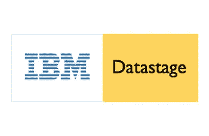
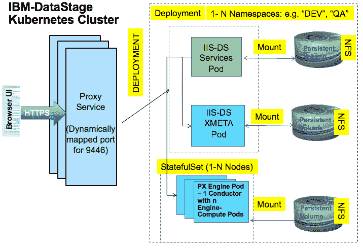
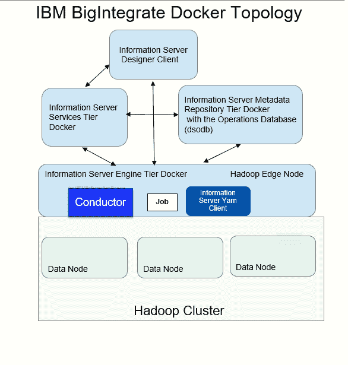

# 使用 Kubernetes 的 DataStage 拓扑

> 原文：<https://medium.com/quick-code/topology-of-datastage-with-kubernetes-b10cb78efeae?source=collection_archive---------0----------------------->



安装在容器化环境中的 IBM InfoSphere Information Server 产品提供了一种更简单的体验，具有更好的性能和可伸缩性，并且在诸如就地升级之类的过程中不容易出错。

在容器化环境中部署 InfoSphere DataStage 利用了两个组件:Docker 和 Kubernetes。IBM BigIntegrate 的部署只使用 Docker。

Docker 通过使用 Docker 映像和容器为应用程序部署提供平台，而 Kubernetes 则自动化部署、扩展和操作应用程序容器。引擎/服务/存储库层作为容器部署在各自的 pod 中更多信息请访问 [**DataStage 在线培训**](https://onlineitguru.com/datastage-online-training-placement.html)

# 基本概念:Docker

Docker 容器提供了一个轻量级的虚拟平台，它带有 CentOS 等基本操作系统。与传统的基于主机的应用程序环境相比，容器更小、更快。Docker 容器提供了操作系统级别的虚拟化。在 Docker 映像中，InfoSphere DataStage 或 IBM BigIntegrate 的工件(例如，Hadoop 上 IBM BigIntegrate 服务的 Kerberos 票证)已经包含在内并配置为立即工作。通过使用标准的 Docker 命令，可以启动或关闭 InfoSphere DataStage 或 IBM BigIntegrate 的 Docker 容器。

# 基本概念:Kubernetes

Kubernetes 是一个管理容器化服务的开源平台。Kubernetes 可以轻松地编排和部署容器。Kubernetes 平台的支持工具，包括监控工具，可以广泛使用。

# 使用 Kubernetes 的 DataStage 拓扑

InfoSphere DataStage 包括数据流设计器 UI(客户机层)、API(服务器层)和支持它的执行引擎(引擎层)，它运行在支持 Kubernetes 的 Docker 容器环境中。Kubernetes 是一个充当“容器协调器”或“集群管理器”的系统，它提供了部署、维护和扩展应用程序的机制。Kubernetes 将容器放置在节点上，使 pod 能够找到彼此。Kubernetes 具有基本的监控、日志记录、健康检查和故障自动恢复功能。

下图说明了拓扑结构。

*图一。InfoSphere DataStage 容器化拓扑*



# InfoSphere DataStage 的安装工件

InfoSphere DataStage 的部署包括以下构件:

NamespaceNamespace 提供了一个范围，使名称在其中是唯一的。代表几个专用环境的 IBM infosphereinformationserver suites 的多个实例可以在它们自己的名称空间中运行，例如 DEV / TEST / PROD。持久卷持久卷充当存储的一部分，供容器使用。文件系统类型可以是 NFS、glusterfs 或其他。永久卷声明永久卷声明是对永久卷存储的请求。您可以从一个永久卷申请一个或多个存储空间，直到永久卷空间用尽。以下示例显示了命名空间 test-1 的永久卷声明:

> 使用 DataStage 将您的职业生涯推向新的成功高度，注册参加 [**DataStage 培训**](https://onlineitguru.com/datastage-online-training-placement.html) 的现场免费演示

```
[root@propeller1 YAML_Scripts]# kubectl get pvc -n test-1xmeta-pv-volume-claim    Boundxmeta-pv-volume    10Gi       RWO
```

# IBM 大集成的拓扑结构

下图说明了 IBM BigIntegrate 的拓扑结构。

*图二。IBM BigIntegrate 容器化拓扑*



InfoSphere Information Server 引擎层 Docker (Conductor)安装在带有 YARN 客户端的 Hadoop Edge 节点上。所有其他的 infosphereinformationserver Docker 层可以在边缘节点上，也可以在集群之外。没有 Kubernetes 集群，因为已经存在一个 Hadoop 集群。InfoSphere Information Server 二进制文件位于所有将运行 InfoSphere DataStage 作业的数据节点上。如果二进制文件不存在，那么在作业运行时使用 HDFS 将 InfoSphere Information Server 二进制文件复制到数据节点