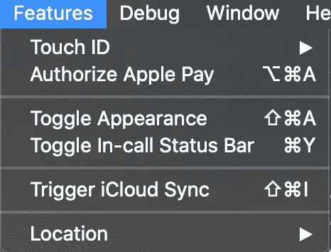
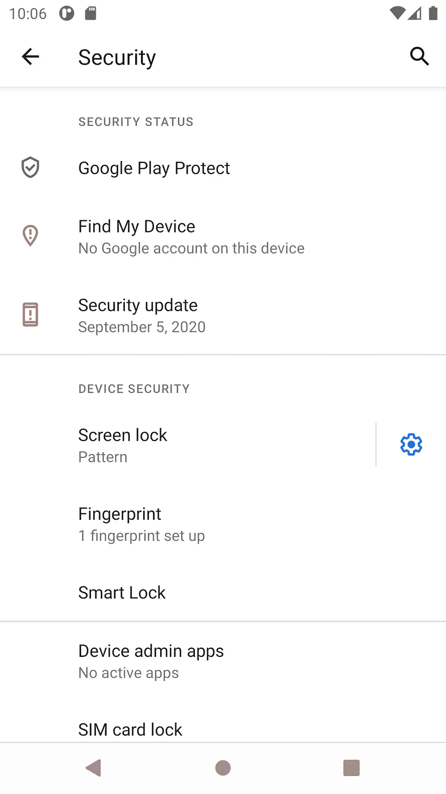
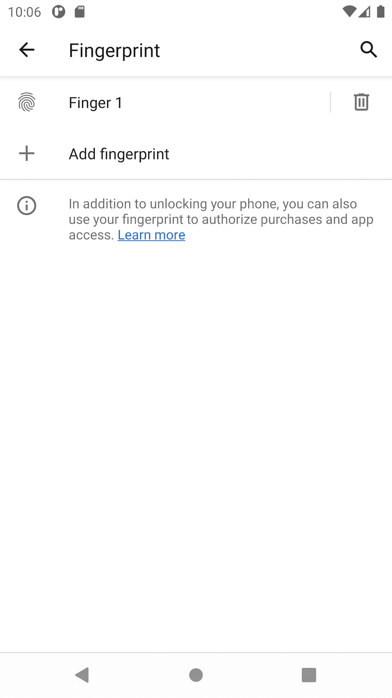

# 使用 Flutter 的触控 ID 和 Face ID 认证

> 原文：<https://medium.com/globant/touch-id-and-face-id-authentication-using-flutter-382b85509548?source=collection_archive---------0----------------------->


Photo by [Paul Hanaoka](https://unsplash.com/@plhnk?utm_source=medium&utm_medium=referral) on [Unsplash](https://unsplash.com?utm_source=medium&utm_medium=referral)

为什么我们需要 touchID 或 FaceID 认证？

如果您不采取必要的预防措施来防止您的信息受到威胁，黑客可以很容易地访问您手机上的信息。预防措施，如在手机上保留密码或触控 ID/Face ID。

在这个 flutter 教程中，我将解释如何使用 **local_auth** 插件添加触控 ID 和 Face ID 认证功能来创建安全的 flutter 应用程序。

他的 flutter 插件提供了简单的方法来认证使用触控 ID 或 Face ID 的用户。

首先，我们需要在 pubspec.yaml 文件中添加最新版本的 [*local_auth*](https://pub.dev/packages/local_auth) 插件，如下所示，并获取 flutter 项目中的依赖项。

在你的 flutter 项目*中创建*biometric _ authentic ation . dart*文件。*现在将 local_auth 框架导入到您的文件中，如下所示:

```
import 'package:flutter/material.dart';
import 'package:local_auth/local_auth.dart';
import 'package:flutter/services.dart';
import 'package:local_auth/error_codes.dart' as local_auth_error;
```

这里的 *services.dart* 用于平台服务在认证时捕获平台异常。这用于指示平台插件中的平台交互失败。

Llocal _ auth 插件中的 ocalAuthenticationError 类提供了 PlatformException 抛出的各种异常代码。比如，

1.  PasscodeNotSet
2.  未注册
3.  不可用
4.  其他操作系统
5.  LockedOut
6.  PermanentlyLockedOut。

现在创建**biometric authentic ation**作为有状态小部件，并添加如下方法:

```
Future<void> authenticateUser() async {
  bool isAuthorized = false;
  try {
    isAuthorized = await _localAuthentication.authenticate(
      localizedReason: "Please authenticate to see account balance",
      useErrorDialogs: true,
      stickyAuth: false,
    );
  } on PlatformException catch (exception) {
    if (exception.code == local_auth_error.notAvailable ||
        exception.code == local_auth_error.passcodeNotSet ||
        exception.code == local_auth_error.notEnrolled) {
      // Handle this exception here.
    }
  }

  if (!mounted) return;

  setState(() {
    _isUserAuthorized = isAuthorized;
  });
}
```

让我们了解一下上述方法中使用的各种参数。

**authenticate()** 根据设备上可用的生物特征对用户进行身份验证的方法。此方法返回一个【未来】持有*真*，如果用户成功认证，则*假*否则。

**localizedReason** 用于向用户显示消息，而*则提示*进行验证并说明原因。因为这是方法中的一个必需参数，所以在调用 authenticate()方法时必须传递这个参数。

**useErrorDialogs** 如果通过为*‘真’*表示系统将尝试处理用户在认证时遇到的可修复问题。对于本教程，我使用系统提供的提示消息进行身份验证。

对于自定义提示消息，您需要使用*' useErrorDialogs = false '*调用此 API，并在对话框中使用*【AndroidAuthStrings】*和*【ioauthstrings】*提供您自己的消息。例如，要显示特定于 iOS 的自定义提示信息，您可以使用 IOSAuthMessages，如下所示:

```
**import** 'package:local_auth/auth_strings.dart';

**const** iosStrings = **const** IOSAuthMessages(
    cancelButton: 'cancel',
    goToSettingsButton: 'settings',
    goToSettingsDescription: 'Please enable Touch ID.',
    lockOut: 'Please reenable your Touch ID');
**await** localAuth.authenticate(
    localizedReason: 'Please authenticate to show account balance',
    useErrorDialogs: **false**,
    iOSAuthStrings: iosStrings);
```

**stickyAuth** 在应用程序因为任何原因进入后台时使用，比如用户在认证过程中接到电话。出于安全原因，身份验证必须在此时停止。如果 stickyAuth 设置为*真*，当应用恢复时，认证恢复。如果设置为 false(默认值)，则一旦应用程序暂停，就会向 Dart 发回一条失败消息，由客户端应用程序决定是重新启动身份验证还是执行其他操作。这里，我们使用了 stickyAuth 的默认值，即本教程中的 false。

现在在*biometric _ authentic ation . dart*中添加以下代码:

现在，让我们了解 iOS 和 Android 平台的集成步骤。

> iOS 的集成步骤:

为了同时支持 TouchId 和 FaceId，将以下项目添加到 *info.plist* 文件中:

要启用触控 ID/Face ID -点击您的模拟器，然后点击顶部菜单栏中的功能- >触控 ID/Face ID - >注册，如下所示:



在触控 ID 的子菜单中，有以下 3 个选项:


1.  **已注册** —启用触控 ID 或 Face ID 功能
2.  **匹配触摸** —认证成功
3.  **触摸不匹配** —认证失败

> Android 的集成步骤:

**步骤 1** :我们需要在 Android manifest 文件中添加以下权限。

**步骤 2:** local_auth 插件需要使用 FragmentActivity。这可以通过切换到使用`FlutterFragmentActivity`而不是`FlutterActivity`来实现。为此，我们需要如下更新 *MainActivity.kt* 文件。

为了运行这段代码，你需要将你的项目转换成 AndroidX。

在仿真器中启用*指纹*:

运行你的 Android 模拟器，进入设置-> **安全&** 位置- >指纹。如果您已经设置了 PIN，请在模拟器上输入它。如果你还没有设置你的 PIN，Android 模拟器会提示你添加它。单击添加指纹。



## 这就是本教程的内容，如果对你有帮助，请**👏或者和别人分享这个故事。感谢您的阅读。编码快乐！🚀**