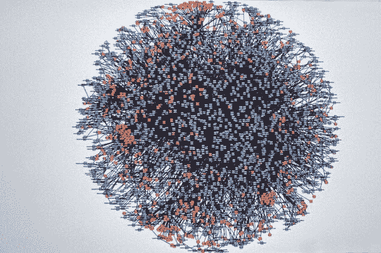
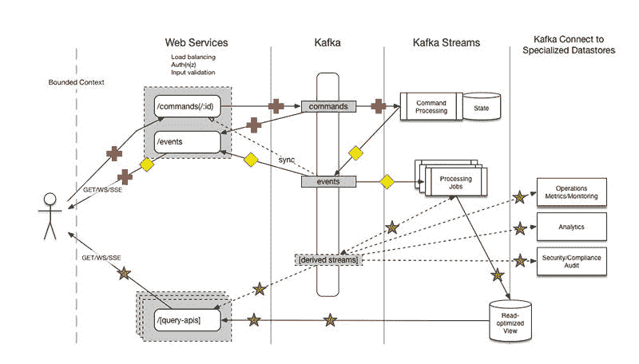
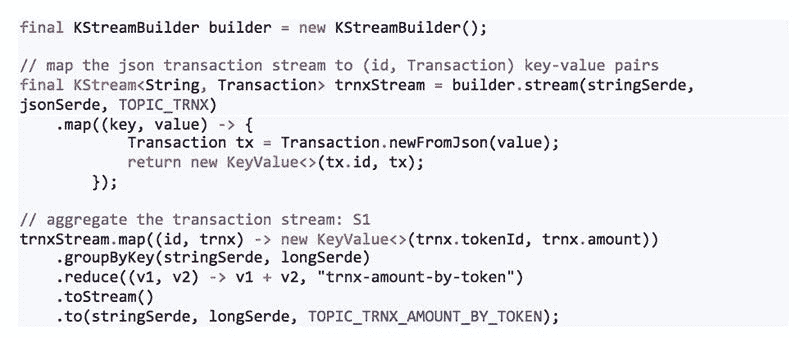
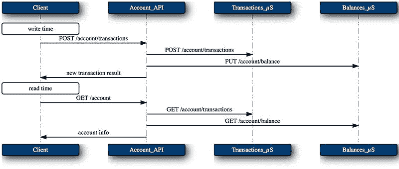
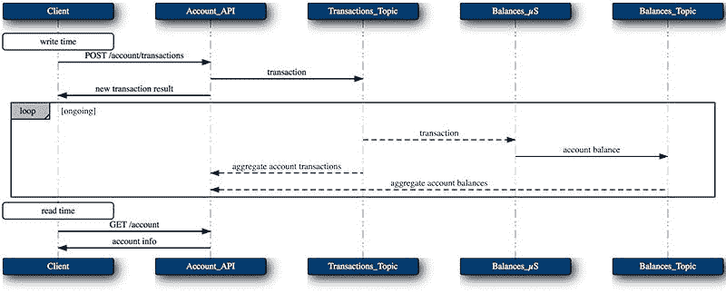

# 微服务的函数式编程模拟

> 原文：<https://medium.com/capital-one-tech/toward-a-functional-programming-analogy-for-microservices-ba6f49b94ad?source=collection_archive---------0----------------------->

微服务如今风靡一时。热情的、有思想的拥护者和反对者提出了支持和反对这种建筑风格的令人信服的论点。通常，这些争论归结为组织是否应该基于对这些组织的规模和技术文化成熟度的成本和收益的评估来采用、避免或放弃微服务架构。

然而，这种采纳或放弃的前提忽略了微服务对话的一个重要方面:哪种风格的微服务最符合组织的需求？或许从这个角度考虑，阻止某些组织的成本可能会降低，而更好的微服务风格可以保留优势。

# (至少)两种风格的微服务

也许对微服务最常见的共同理解是由死星图来表示的，它描述了一个服务网络以及它们对其他服务的同步、运行时依赖性。许多微服务 mind share——编写、绘图和设计、库和工具——都采用这种小型服务同步调用彼此的模型，通常通过 HTTP。通常这种模型是上述采纳或放弃评估的主题。不幸的是，这种将微服务的基本价值和目标与其实现的特定模型混为一谈的做法。

*AWS Death Star diagram, circa 2008 as per Werner Vogel’s‏ tweet*

微服务的这种观点与面向对象编程有许多共同之处:封装的数据访问和可变的状态改变都是通过同步调用实现的，服务之间的这种调用网络形成了依赖图。程序员可以也应该享受一场关于面向对象在单个内存和进程空间中组织代码的优缺点的激烈辩论。然而，当面向对象的类比扩展到分布式系统时，出现了许多问题:随着依赖图的深度而增长的延迟、时间活性耦合、级联故障、复杂和不一致的读取时间编排、数据存储激增和碎片，以及在任何时间点推理系统状态的极端困难。

幸运的是，另一种编程风格更适合分布式情况:函数式编程。函数式编程不是根据对象的就地突变来描述行为，而是根据纯函数的不可变输入和输出值来描述行为。这样的函数可以被组织以创建数据流图，使得当计算流水线接收新的输入值时，所有下游中间值和最终值被反应性地计算。将这种输入值引入到这种反应性数据流管道中形成了逻辑时钟，我们可以使用该逻辑时钟来一致地推理特定输入事件时的系统状态，尤其是如果输入值、中间值和输出值的序列存储在持久的、不可变的日志上。

(当然，将这些单内存空间编程风格作为分布式体系结构的类比并不是对扩展其底层正式模型的严格尝试，而是对其基本直觉和原则的非正式扩展。)

# 作为微服务类比的功能性(和反应性)编程

遵循这种函数式编程类比的微服务架构会是什么样子？一种可能性是 Commander 模式，Capital One 已经提供了这种模式的开源参考实现:

在这个模型中，一个动作(以来自外部的命令或来自有界上下文内部的事件的形式)以其原始的、非规范化的、业务领域的形式被写到一个不可变的日志中。各种功能拓扑(数据流)对处理这一新事件做出反应，最终将其各种数据域结果合并到表示当前状态的聚合中。服务的客户端(以及各种处理器本身)通过这些聚合感知/查询当前的系统状态。尽管如上所述，很多微服务都致力于面向对象的类比同步风格，但也有一些久经沙场的工具和技术可以实现面向对象的类比风格。

## **CQRS 和活动采购**

在上面的模型中，动作(改变状态的写操作)通过独立于感知(不改变状态的读操作)的系统路径流动，这是命令查询责任分离(CQRS)的一个例子。
系统状态源自这些操作的日志，这是事件源的一个例子。
这两种来自领域驱动设计(DDD)的架构技术经常携手并进，并且恰好适合微服务的这种功能编程观点。

## **单(逻辑)写入器**

在这种 FP 架构中，许多服务感知日志上的新值并对其作出反应，因为日志消费无处不在且廉价。然而，正如 Ben Stopford 在基于主干事件构建服务的“单编写器原则”一节中所观察到的那样，写入日志的操作必须更加小心。我工作过的其他以日志为中心的 CQRS 系统，比如数据库 Datomic 也遵循这个原则。

## **三类微服务**

在这个架构中，就像功能程序中的功能一样，拓扑中不同的微服务将服务于不同的目的。拓扑中的大多数处理节点将充当“纯”功能转换，即接受来自某组输入日志的新输入，根据业务规则进行一些数学运算(可能涉及有状态计算的本地聚合，如连接、窗口聚合等)。)，并在一些输出日志集上发出新的值。这些构成了系统的“功能核心”。

其他两种类型的微服务充当系统的“命令外壳”，执行某些副作用。第一类是有界上下文中的共享聚合。这些服务构建了系统当前状态的有用“物化视图”，例如全文索引、面向实体的 REST 服务、面向属性的 BI/分析服务、分析仪表板视图等。

这些“命令式外壳”服务的第二种类型在有界上下文之外执行副作用，例如向用户发送电子邮件、SMS 或移动推送通知，或者调用一些其他外部服务。必须小心管理这些副作用，考虑目标服务停机时间、重试次数、等幂以及此类调用结果的存储(如果适用)。外部动作和相应结果的记录可用于实现 Sagas 或分布式回滚/反转。

## **卡夫卡，卡夫卡溪流，卡夫卡连接**

Kafka 恰好具有形成这种 FP 模拟微服务架构的主干所需的特征。它持久地存储和反应性地传递不可变的值，使它成为记录功能数据流管道的输入、中间和输出值的理想场所。

Kafka 的 Streams API 为精确实现这种分布式计算管道提供了强大的原语。Kafka Streams 提供了一个高级 API，用于构建转换拓扑(例如映射和过滤)、本地和共享聚合(例如全局表和存储 API，以及副作用处理器，如 foreach、peek，甚至用于存储结果的 map)。通过上述聚合，Kafka Streams 还将流处理与交互式查询无缝地统一起来，潜在地使每个处理微服务也通过 REST 或 RPC 等方式成为其当前状态的只读视图。

Kafka 的 Connect framework 还提供了一种简单而强大的方法来在外部系统中构建共享聚合，如 RDBMSes、全文索引、面向文档的存储、键值存储、图形数据库、面向列或星型模式分析数据库，或者任何与您的服务所需的数据访问模式最匹配的东西。

# 现实世界的例子

让我们用一个真实的(尽管有些简化的)例子来探讨上面的想法，这个例子来自我们的同事薛强在 Capital One 创建的一个银行用例(本节大部分内容改编自他的摘要，得到了他的允许和我们的感谢)。

我们的客户希望能够为他们的账户设置特定借记卡或信用卡号码的支出限额(例如，为了控制大学期间的支出)。为了授权该卡号上的金融交易(例如，借记卡或信用卡刷卡)，授权过程必须维护该卡号上的支出的流动余额。

*注意:下面的代码示例针对的是 Kafka 的 Streams API 0.11 版本。自从本文首次撰写以来，Streams API 在最新的 1.0 版本中略有变化。*

为了便于说明，我们假设可以通过 Kafka 主题访问事务。我们可以用 Java 编写我们的主流处理代码:

事实上，这个例子的实际实现要复杂得多:

*   必须考虑(来自一个数据源的)已结算交易和(来自另一个数据源的)未决授权…
*   …在授权有效的跳跃时间窗口内。
*   与已结算交易匹配的授权不得重复计算。
*   等等。

但是即使增加了这些复杂性，服务边界、主题和代码仍然相对简单(完整的代码清单甚至包含在本文的草稿中！).
在上面的例子中，转换和聚合服务类型都很明显，但我们也可以很容易地想象一个副作用服务，它观察计算的支出余额，并在达到预设的支出限额时通过移动推送或短信通知客户。根据避免协调的微服务价值，这样的通知服务可以在实现业务逻辑的团队不了解或不参与的情况下添加。

Kafka 及其 Streams API 支持的微服务的功能风格帮助该服务实现了其生产目标:

*   **驯服复杂性。** Kafka Streams 以清晰、简洁的小代码实现了非常复杂的流处理和聚合。与直接使用 Kafka 消费者/生产者 API 或者调用面向对象风格的微服务来获取所需数据相比，Kafka Streams 还提供了更容易的开发体验。在 FP 风格的微服务中使用 Kafka 流时，相关的故障模式也简单得多。
*   **实时汇总结果。** Kafka Streams 提供亚秒级流媒体聚合性能。此外，当新事件到达时，会预先计算聚合，并在需要的地方进行缓存，以便非常快速地读取余额(用于处理决策或显示给最终用户)。
*   **易于部署。**与其他流数据处理环境如 Hadoop/Spark/Storm/Samza 和 friends 相比。不需要集群，只是照常运行 Java 应用程序。

来自不同产品线的其他几个应用程序正在迁移到这种功能流风格。

# 比较 FP 模拟和 OO 模拟微服务

最后，让我们从几个重要的方面比较上述微服务的 FP 风格和无处不在的 OO 风格:数据访问模式、编排模式、处理故障、写时和读时延迟、状态随时间的推理以及处理副作用。

## **数据访问模式**

在面向对象风格的微服务中，服务边界通常是这样划分的，每个服务封装一个相对较小的数据域(有时只是单一类型的实体)。这种分裂有一些负面后果:

*   服务规定了数据访问模式，通过这种模式它将使其数据可用，并且通过不同模式的访问需要协调(例如，从数据库的 ETL，团队为服务实现新的查询接口…6 个月后)
*   主要业务数据的存储分散在许多不同的数据存储中，这使得连接和其他聚合变得很麻烦，并且可能不一致(有点像在单个流程空间中缺乏引用透明性)
*   用于访问数据的接口随着服务数量的增加而增加，就像面向对象编程增加了类/接口一样，每个类/接口只有很少的操作/方法

另一方面，我们展示的 FP 风格:

*   通过共享日志 Kafka 提供统一的、无处不在的数据访问，很像函数式编程的概念，即很少的数据结构参与许多操作/功能。
*   这种对包含所有事实的日志的统一、无处不在的数据访问允许所有消费者以最适合每个消费者的数据访问模式构建他们自己的本地状态视图。
*   主要业务数据存储在 Kafka 中，所有状态的本地视图都是派生的聚合(如果需要，可以丢弃并从源中重新构建)。

## **编排模式**

封装数据的面向对象风格的微服务需要大量的读取时间编排，以便将跨服务的聚合查询放在一起。

客户端向 *Accounts_API* 提出了一个问题，因此 *Accounts_API* 转过身来询问 *Transactions_ S* 和 *Balances_ S* 。

反应式 FP 风格在写入时完成所有这些编排。随着新的事实在卡夫卡中被记录，各种拓扑急切地做着各自的处理。

## **处理失败**

上述编排模式还有另一个缺点:面对故障时的可用性。同步通信的服务在时间上耦合到彼此的运行时活跃度，即 *Balances_ S* 在 *Accounts_API* 调用它时必须是活动的，以便 *Accounts_API* 完全可用。随着调用图的加深，这个问题会成倍增加。断路器等技术。可能被用来掩盖这种依赖性，但是潜在的问题仍然存在。

这一缺点在写入时更加严重，因为写入协调服务的动作序列可能不是原子的，即 *Accounts_API* 可能会在对其各种依赖关系进行复杂的写入协调的过程中死亡或遇到不可用的目标服务，从而使系统处于不一致的状态或受制于复杂且容易出错的回滚逻辑。
在 FP 风格中，尤其是自从 Kafka 0.11 中引入事务性写入以来，写入是简单的、原子的(要么全部失败，要么全部成功)，并且被仔细管理(上面描述的单个写入者原则)。对 Kafka 的写入可以针对所需的一致性级别进行调整，并且确实取决于 Kafka 的可用性，这可能比任何给定微服务的可用性都好得多。

读取与上游写入程序的可用性无关，甚至与 Kafka 的可用性无关，因为读取是从本地管理的、读取优化的物化视图提供的。对任何给定服务的读取可以无限期地进行，并且在某个时间点上总是一致的，客户端知道该时间点可能落后于最近的上游事件(并且客户端可以决定这是否足够好)。如果这个 AP 折衷对于一个服务的用例来说是不可接受的，那么当它落后时，该服务可以选择返回错误或者变得不可用。聚合微服务控制自己的可用性和一致性权衡。

## **延迟**

在上面的序列图中，与 FP 示例相比，OO 风格在读取时显然更加隐蔽，因为它必须调用两层深度的延迟图:*Client->Accounts _ API+max(Accounts _ API->Transactions _ S，Accounts _ API->Balances _ S)*。为什么要等到客户提问后才计算答案呢？为什么会招致这么多跳的 HTTP 延迟？

在 FP 风格中，写入非常快(因为它只是将命令/事件写入 Kafka)，然后在将这一新事实纳入系统时会有一些介入处理延迟，然后读取非常快，因为它们是在专门构建的只读物化视图中提供的。

## **状态随时间变化**

上面描述的 OO 风格的编排模型也给维护一致性和推理系统随时间的状态带来了很大的困难。
在写入时，命令不断地进入各种服务，并被本地记录，而没有这些命令的任何全系统排序。这使得在写入时间协调期间验证一致性成为一项繁重且容易出错的任务(例如，独立服务之间的两阶段提交、正确的排序和错误恢复、面对中间过程服务故障时未知的原子性等)。)

在读取时，在调用*Accounts _ API->Transactions _ S 和 Accounts _ API->Balances _ S*之间可能会到达一个新的交易，因此该交易会出现在 *Transactions_ Sresponse* 中，但对 balance 的影响不会出现在 *Balances_ S* 中。来自 *Accounts_API* 的响应将会不一致。

然而，在 FP-style 中，在日志中事件的排序中有一个明确的逻辑时间概念，这创建了追溯到源事实的派生事实的清晰出处，以及对任何特定源事件的系统状态进行推理的能力。从 0.11 版本开始，Kafka 及其 Streams API 支持恰好一次处理语义，确保处理管道在故障情况下正常工作。

这种 FP 风格的读取在逻辑时间的某个有效点总是一致的，但是任何给定的视图可能还没有包含每个可用的事件。

## **副作用**

在 OO 风格中，从一个服务到另一个服务的每个调用都可能是副作用，这取决于特定调用的安全语义。服务编排是用本地业务规则处理将这些副作用排序以产生期望的最终状态的过程。这种本地处理与对其他服务的副作用调用的无处不在的混合，使得在故障期间回滚和防止重复调用变得非常困难。

在 FP 风格中，如上面在“微服务的三个类别”中所讨论的，构成系统的“功能核心”的纯功能转换和本地聚合没有副作用(即，除了写入本地存储和写入 Kafka 之外，这些由 Kafka 流仔细管理以具有适当的“功能”语义)。当被添加到日志中的上游不可变值触发时，在系统的“命令性外壳”中专门构建的服务小心地执行对有界上下文之外的目标的副作用(如上面引用的通知服务调用)。

# 结论

在拒绝过于复杂的微服务架构，或者根据早期采用者和流行的工具堆栈盲目实现它之前，请考虑哪种类型的系统将满足您的需求，以及 Kafka 和 Kafka Streams 支持的反应式、不可变的功能性微服务风格是否更适合。

## **相关链接:**

*   二法则和微服务架构
*   微服务—何时应对，何时协调
*   消息总线上的无状态和无智能微服务

*声明:这些观点仅代表作者个人观点。除非本帖中另有说明，否则 Capital One 不属于所提及的任何公司，也不被其认可。使用或展示的所有商标和其他知识产权都是其各自所有者的所有权。本文为 2018 首都一。*