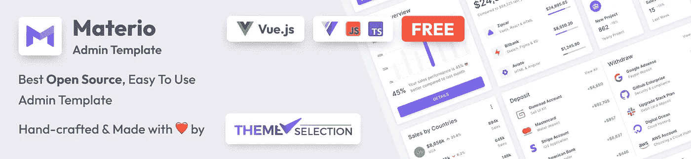

# 网站开发者的十大 Tools🛠👨‍💻在 2023 年保持检查🤘🏻

> 原文：<https://medium.com/quick-code/tp-10-tools-for-web-developers-to-keep-in-check-in-2021-425d01a8bda7?source=collection_archive---------1----------------------->

Credit: [Freepik](https://www.freepik.com/free-vector/engineer-developer-with-laptop-tablet-code-cross-platform-development-cross-platform-operating-systems-software-environments-concept-bright-vibrant-violet-isolated-illustration_10780377.htm#page=1&query=illustrations%20web%20development&position=4)

你正在寻找最好的网络开发工具吗？嗯，在这篇文章中，我们将与您分享 2023 年 web 开发人员的一些有用工具。这些工具会使你的工作更容易。

使用 web 开发工具总是能让你的工作变得更加轻松和流畅。Web 开发是一个你经常需要它们的领域，这就是为什么我们列出了这个列表，这样你就可以把这个列表加入书签，并检查你正在寻找的任何工具。

好吧，有很多工具可用，所以我们不能说这个列表是完整的。你可以在下面的评论区分享你最喜欢的工具。

现在，不扩展，让我们继续工具。

# 1. [Devhints.io](https://devhints.io/)

在这里，您可以找到一些现成的代码片段，包括流行的代码片段、配置和命令。如果你需要快速更新你的知识，或者如果你想避免在栈溢出时搜索线程，那么 Deviants 可以派上用场。

如果您没有找到您需要的片段，您可以请求作者添加它。

# 2.[自举备忘单](https://bootstrap-cheatsheet.themeselection.com/)

bootstrap 备忘单是 Bootstrap 5 类、变量和混合的交互式列表。它可以帮助您轻松找到引导程序 4 和引导程序 5 之间的差异。

此外，它的目标是一个大型的引导用户社区，这些用户很难搜索引导类、变量和混合。

主要特点是:

*   搜索你的[类](https://bootstrap-cheatsheet.themeselection.com/)、[变量](https://bootstrap-cheatsheet.themeselection.com/variables.html)，或者 [mixin](https://bootstrap-cheatsheet.themeselection.com/mixins.html)
*   强调 Bootstrap 4 和 5 类的区别
*   HTML 和代码片段的实时预览
*   随时更新代码片段
*   轻松复制代码片段并使用它

# [Sneat 免费 Bootstrap 5 HTML 管理模板](https://themeselection.com/products/sneat-free-bootstrap-html-admin-template/)

[**Sneat 免费 bootstrap 5 HTML 管理模板**](https://themeselection.com/products/sneat-free-bootstrap-html-admin-template/) —是最新的开源 Bootstrap 5 HTML 管理模板。它是对开发人员最友好的🤘🏻高度 customizable✨自由[引导 5](https://getbootstrap.com/) HTML 管理仪表板。此外，最高的行业标准被认为是给你带来最好的引导管理模板，不只是快🚀易于使用，但高度可扩展。

此外，Sneat Bootstrap 5 Admin Template Free 功能强大，还允许您构建任何类型的 web 应用程序。例如，您可以创建:

*   SaaS 平台
*   项目管理应用程序
*   电子商务后端
*   CRM 系统
*   分析应用
*   银行应用
*   教育应用
*   健身应用程序和更多…

此外，您可以使用这个最好的创新 [**引导管理模板**](https://themeselection.com/products/category/bootstrap-admin-templates/) 来创建引人注目的、高质量的、高性能的 Web 应用程序。此外，您的应用将完全响应，确保它们在桌面、平板电脑和移动设备上看起来令人惊叹，功能完美。

**功能:**

*   基于**引导程序 5**
*   **垂直**布局
*   仪表盘
*   1 个图表库
*   SASS 供电
*   认证页面
*   完全响应的布局
*   有组织的文件夹结构
*   清理和注释代码
*   有据可查

[演示](https://www.themeselection.com/demo/sneat-bootstrap-html-admin-template-free/html/) [下载](https://themeselection.com/products/sneat-free-bootstrap-html-admin-template/)

对于高级功能，请查看 [**Sneat Bootstrap 5 HTML 管理模板**](https://themeselection.com/products/sneat-bootstrap-html-admin-template/) **Pro 版本**。

另外，检查 [**React 仪表盘**](https://themeselection.com/item/category/react-admin-templates/) 版本。

# 3.[碳](http://carbon.now.sh/)

如果你需要以图像的形式创建一段代码，Carbon 是实现这一目的的完美工具。该应用程序支持多种语言和一套现成的不同主题，因此我们可以修改我们的代码片段。

# 4.[谷歌灯塔](https://developers.google.com/web/tools/lighthouse)

它是一个开源的自动化工具，用于测量网页的质量。它审计网页的性能、可访问性和搜索引擎优化。

# 5.[元标签](https://metatags.io/)

[元标签](https://metatags.io/)是一个简单的在线工具，你可以用它来快速检查你网站的元标签。

# 6. [frontendchecklist.io](http://frontendchecklist.io/)

创建一个网站的过程通常是漫长、乏味和非常复杂的。这样做的后果是，我们可以忘记一些事情。前端核对表可以提供帮助。

这个列表包括了创建网站时需要牢记的 88 点——很多，对吧？此外，每个点都标有优先级。另一个优势是能够创建自己的清单并生成报告。

除此之外，我们还建议您在处理 Vue 项目时使用前端的 Vue 管理模板，以帮助您构建现代的、引人注目的、响应迅速的 web 应用程序。

For instance, check our [**Materio — Free Vuetify Vuejs 3 Admin Template**](https://themeselection.com/item/materio-free-vuetify-vuejs-admin-template/)

# 7. [Gitignore.io](https://www.gitignore.io/)

我知道创建一个. gitignore 文件并不需要更高的数学知识，但是已经为此创建了一个现成的工具。你提供的唯一东西就是操作系统或开发环境之类的信息，过一会儿，我们就可以享受完了。gitignore 文件。

# 8. [Regex101](https://regex101.com/)

该应用程序既提供了创建正则表达式的指导，又提供了编写和测试表达式的现成环境。此外，在创建一个表达式之后，我们会得到它的详细解释。

# 9. [Ngrok](https://ngrok.com/)

如果你在本地服务器上创建一个网站，并向某人炫耀你的工作成果，你可以使用 Ngrok。该工具允许您将您的本地应用程序“带到世界各地”。

安装和配置确实需要一段时间，而且相对简单。然而，付费的变种提供了更多的可能性，比如创建一个带有 IP 地址的白名单或者创建子域名。

# 10.[尼卜乐](https://nibbler.silktide.com/)

尼卜乐是一款免费的在线工具，你可以用它来浏览你的网站。它会给你一份报告，对网站的关键领域进行评分，包括可访问性、搜索引擎优化、社交媒体和技术。

# 11.[网络今天能做什么](https://whatwebcando.today/)

此工具允许您检查您当前使用的浏览器中有哪些可用的 API。此外，在选择一个给定的 API 之后，您将会收到一组关于如何使用它们的说明。此外，您还可以访问显示浏览器如何支持 API 数据的数据和图表。

# 12.[网站漏洞扫描器](https://pentest-tools.com/website-vulnerability-scanning/website-scanner)

网站漏洞扫描器是由 Pentest Tools 开发的免费在线工具。你只需输入你的网址，它就会生成一份详细的安全报告。

# 13. [CSSreference.io](http://cssreference.io/)

可访问的，简短的，简洁的 CSS 文档。我个人比较喜欢用 MDN，但是肯定会有人喜欢的！对于每个 CSS 属性，您会得到一个带有示例的图像或动画。

# 14. [Tinypng](https://tinypng.com/)

TinyPNG 使用智能有损压缩技术来减少 PNG 文件的大小。通过有选择地减少图像中的颜色数量，存储数据所需的字节更少。这种效果几乎看不见，但它对文件大小有很大的影响！

# 15.[修剪路径生成器](http://bennettfeely.com/clippy)

这个简单的工具允许我们使用 clip-path 自动生成 CSS 代码，即一个使用 CSS 创建自定义形状的工具。当然，我们已经有现成的形状，但我们也有机会修改它们，创造我们自己的形状。

# 结论:

这是 2021 年网络开发者有用工具的集合。在这里，我们收集了 10+有用的工具，将使您的工作顺利和容易。

列出你需要的工具，并根据列表中的要求进行挑选。我们希望这个系列能帮助你找到适合你下一个项目的作品。

请在下面的评论部分告诉我们您使用的是列表中的还是列表外的。此外，不要忘记与你的同事分享这份清单，因为分享是关怀。🤩

# 关于我们:

我们在 [ThemeSelection](https://themeselection.com/) 提供精选的高质量、现代设计、专业且易于使用的高级和[免费引导管理模板](https://themeselection.com/)、 [VueJS 管理模板](https://themeselection.com/products/category/vuejs-admin-templates/)和 UI 套件。

你可以查看一些使用了上述资源的管理模板。 [**Materio Vuetify Vuejs 管理模板**](https://themeselection.com/products/materio-vuetify-vuejs-admin-template/) 和 [**Sneat Bootstrap 5 HTML 管理模板**](https://themeselection.com/products/sneat-bootstrap-html-admin-template/) 是如何使用这些资源让项目变得更棒的最好例子。

*原载于 2021 年 5 月 20 日*[*https://dev . to*](https://dev.to/theme_selection/10-useful-tools-for-web-developers-in-2021-42d1)*。*