# 使用 Azure DevOps 环境跟踪资源

> 原文：<https://medium.com/globant/tracing-resources-using-environment-of-azure-devops-c8802c0668de?source=collection_archive---------0----------------------->

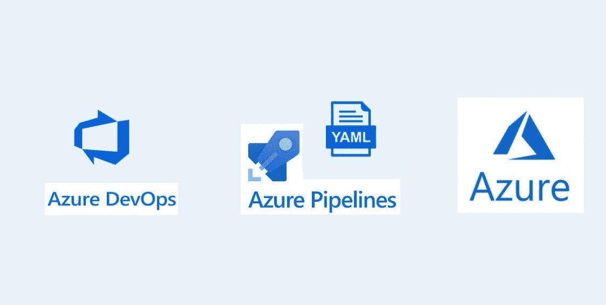

本文将展示 Azure DevOps 管道的 ***环境*** 特性如何为复杂的 **K8S 集群**启用资源跟踪。

# 简介:

***环境*** 代表每个管道的一组资源，这允许我们在 Azure Devops 中映射物理或虚拟环境，如开发、QA、暂存、生产等。Kubernetes 是一个容器编排和管理工具。当处理 Kubernetes 时，我们必须注意 pod、服务、名称空间、部署日志。 **Azure DevOps** 提供了从工作项到部署的完全可追溯性。

Azure Kubernetes 服务(AKS)是 Azure Devops 环境中支持的第一种资源类型，以下是一些关键功能:

*   提交和工作项目的可追溯性
*   部署历史
*   认证和检查的诊断
*   通过为用户和管道指定权限来确保安全

建立可追溯性的高级过程是在满足先决条件后创建环境和创建构建和发布管道。一旦遵循上述步骤，就可以查看资源的可追溯性。

# 1.先决条件

*   确保您拥有存储库和管道的 **Azure DevOps** 帐户
*   确保你的 Azure 订阅拥有构建 AKS 集群的权限

# 2.在 Azure Devops 管道中创建环境

本节描述了创建 Azure DevOps 管道的步骤

*   在 Azure DevOps 中，在 pipelines 选项卡中查找环境。点击环境标签&你会看到下面的图片。你可以创造一个空的环境。您可以在创建时或以后添加资源。

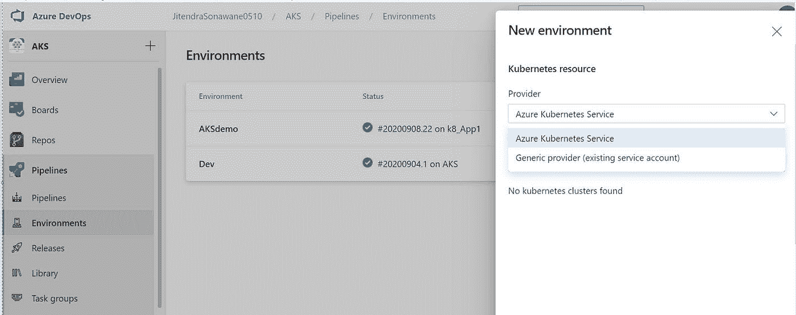

Fig: Creation of Environment

*   下图显示了一个名为“Dev”的环境

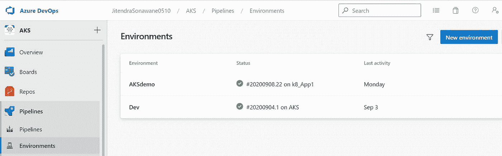

Fig: Sample Eenviroment

**注意**:如果指定的环境不存在，会用你的 azure-pipeline.yaml 中提供的名称创建一个环境

*   您可以在创建环境时配置资源。在这种情况下，当从管道定位环境时，不必为资源指定服务连接，因为管道会自动使用环境中定义的服务连接。

# 3.用简单的构建和发布管道测试可追溯性

**用简单管道测试变化:**

*   现在，在这一步中，我在配置环境变量后运行现有的 azure-pipelines.yaml 文件。您可以为“环境:<env-name>”更新您的 azure-pipeline.yaml 文件并运行管道。</env-name>

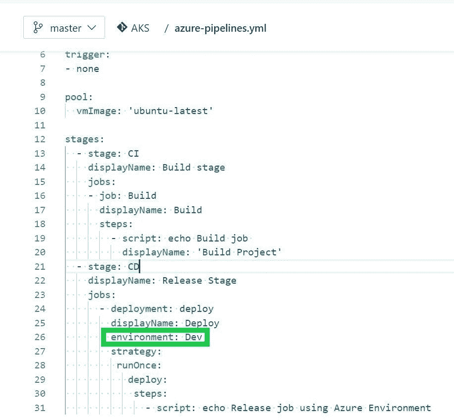

Fig: azure-pipelines.yaml

*   运行管道后，我可以看到执行被标记在 environments 下(在 Yaml 文件中提到的是“Dev”)。正如您在开发环境下看到的，有最近的部署，这使我们能够跟踪作业、变更和工作项。

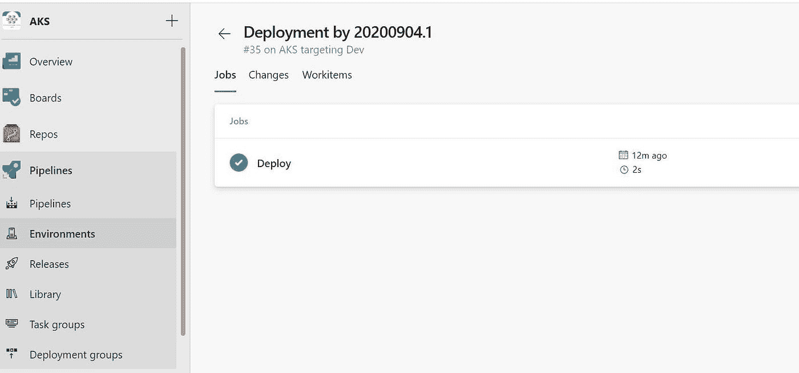

# 4.Kubernetes 的可追溯性

现在，我们将看到 Azure DevOps 如何与 Kubernetes 集成。

*   为库伯内特集群创造环境。创建环境时，您可以选择 AKS 或通用提供程序(您必须指定所有细节，如集群名称、命名空间等。)

Fig: Adding cluster in environment

*   在这里，我有一个如下所示的环境(AKSdemo ),单击它会向您显示选项卡——资源和部署。部署选项卡提供诸如正在部署的内容和时间范围等信息。当你点击它，你会看到标签，如工作，改变，工作项目。

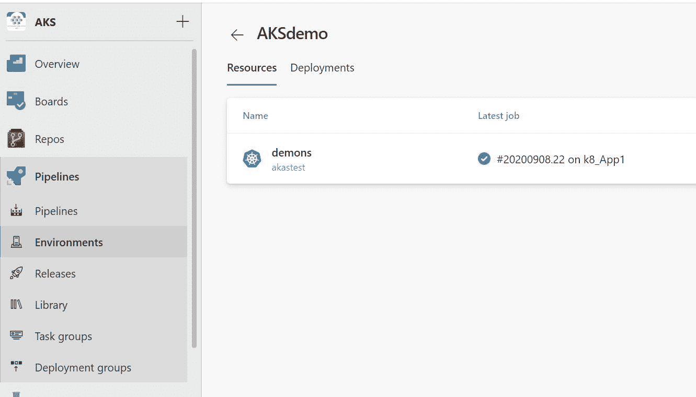

Fig: Demo environment

*   在文件中，我添加了环境部分，如**" environment:AKSdemo . demons "**，其中 aks demo 表示环境的名称，demons 表示我的 kubernetes 集群中的名称空间的名称。

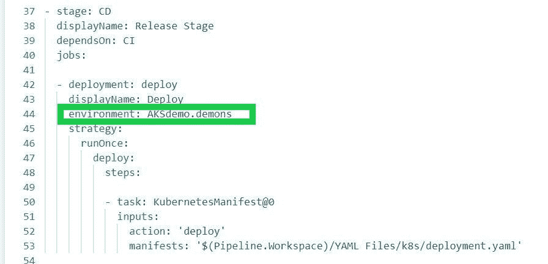

Fig: azure-pipeline.yaml

# 5.查看 K8 集群中的可追溯性

*   在参考资料中，我有名称空间“demons ”,其中有如下的**工作负载**和**服务**。

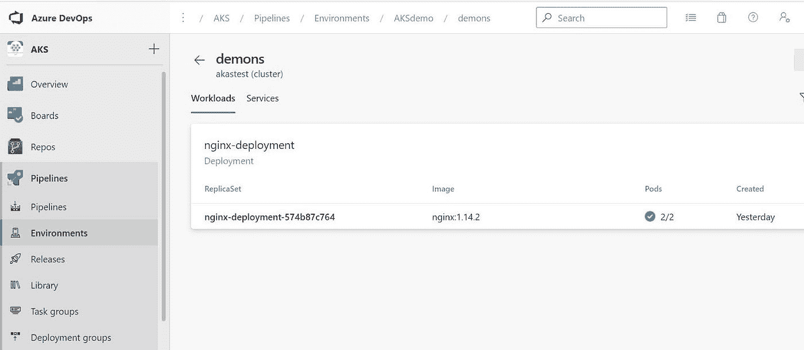

*   我的名称空间包含 kubernetes 对象，如**副本集**，与 **Pod** 相关联的图像，当前运行 2 个 Pod。

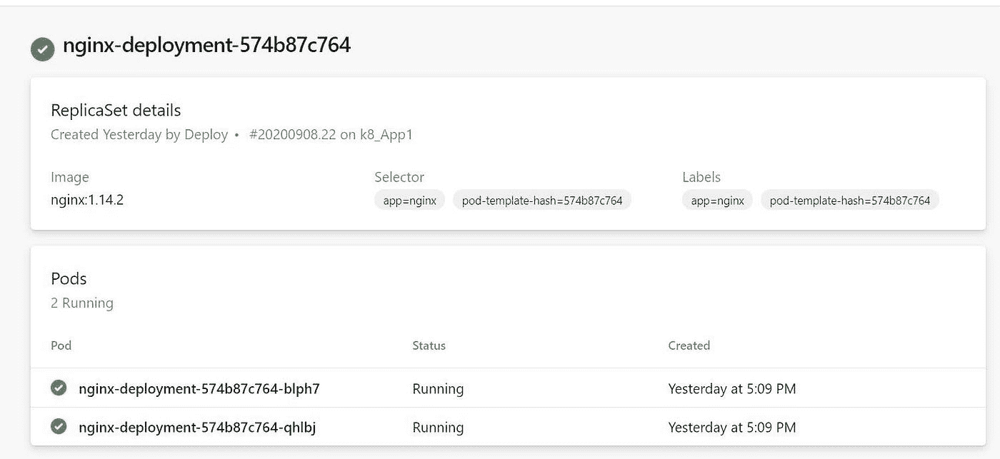

*   深入到单个 pod 会在 overview 选项卡中显示更多详细信息，如节点池、pod 的条件、状态等。

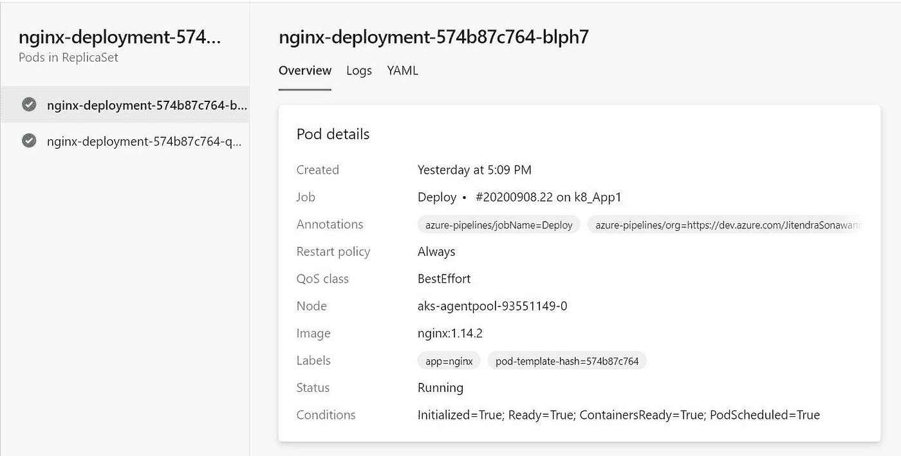

*   我们还可以看到 pod 内部生成的日志以及与 pod 相关联的清单文件，如下所示

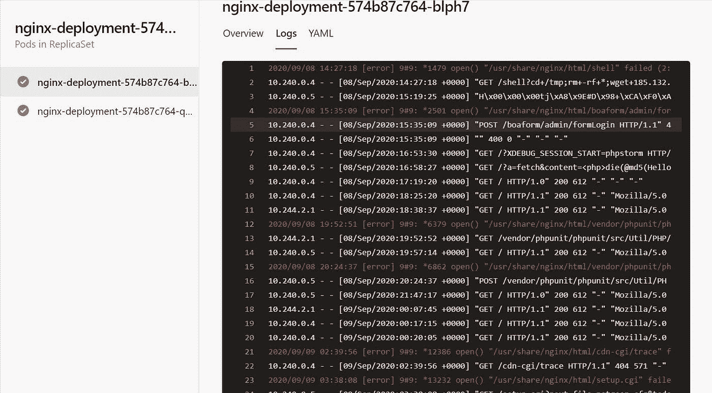

Fig: pod Logs

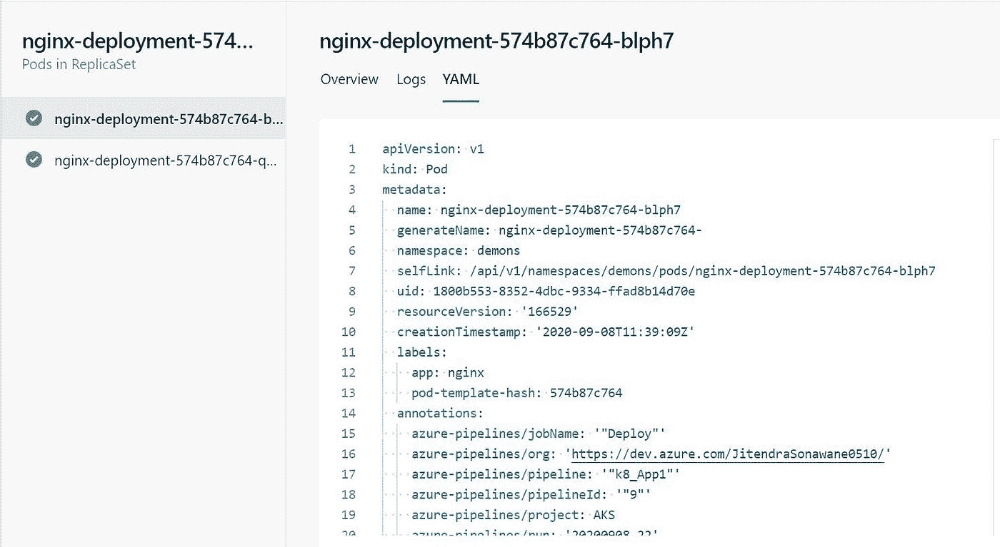

Fig: Pod Yaml file

*   在 services 选项卡中，我已经部署了一个 web 服务，使用**类型**作为**负载平衡器**。您可以使用下面显示的 IP 地址和端口连接到此服务。

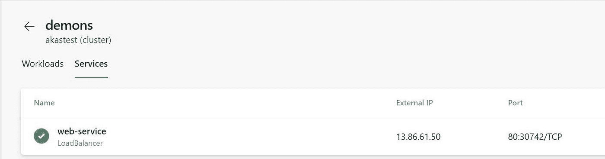

Fig: Service detail

# 总结:

*   使用 Azure DevOps 的环境跟踪功能管理和部署应用程序代码，无需登录 Azure portal 即可查看 AKS 集群资源。这对于 VM 来说也是一样的，但是我没有在我的文章中涉及到。
*   请留意微软在该环境下提供的资源数量。这将减少登录 Azure portal(通过 GUI 或 CLI)的时间和负担，除非绝对必要。
*   到目前为止，微软只发布了 Kubernetes 集群、虚拟机(VM)等资源的环境，在不久的将来，微软计划发布更多资源，如 Azure web app 等。

参考链接:

*   [https://docs . Microsoft . com/en-us/azure/devo PS/pipelines/process/environments-kubernetes？view=azure-devops](https://docs.microsoft.com/en-us/azure/devops/pipelines/process/environments-kubernetes?view=azure-devops)
*   [https://docs . Microsoft . com/en-us/azure/devo PS/pipelines/process/environments？view=azure-devops](https://docs.microsoft.com/en-us/azure/devops/pipelines/process/environments?view=azure-devops) 先决条件