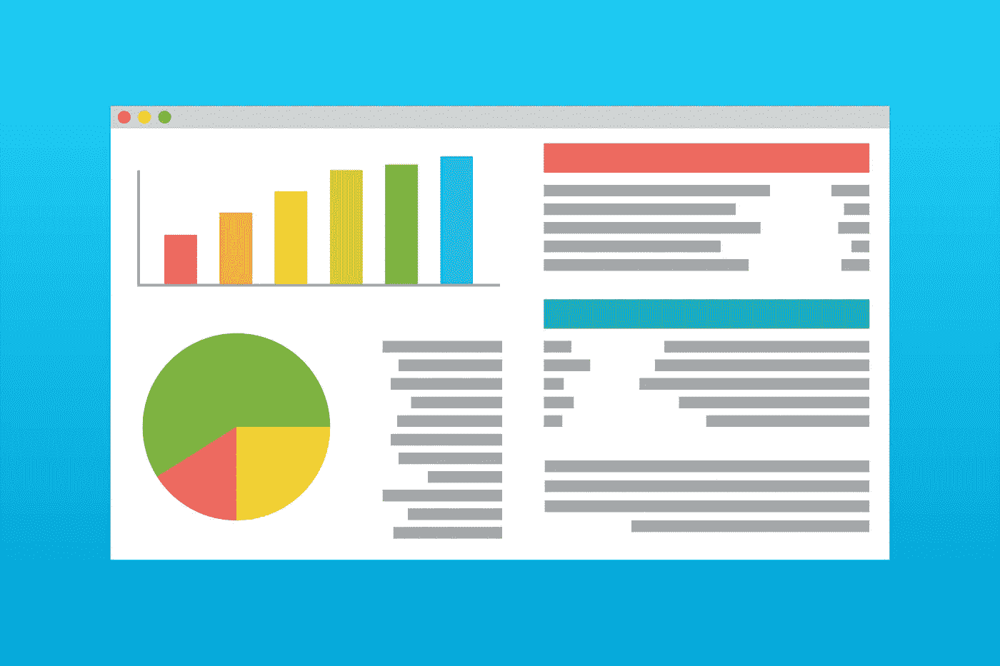

# 像专家一样跟踪你的网站或应用程序

> 原文：<https://medium.com/walmartglobaltech/track-your-website-or-app-like-a-pro-grammer-802870611728?source=collection_archive---------8----------------------->

Image by Mudassar Iqbal from Pixabay

跟踪网站或原生应用是开发过程中至关重要但经常被忽视的部分。作为一个企业，了解特性的金钱影响是很重要的。作为程序员，尽快找到 bug 的来源很重要。

在沃尔玛实验室，影响客户的问题往往会首先提交给前端工程师，我们的工作就是找出原因。无论是来自上游依赖项的坏数据、导致超时的高延迟，还是导致内存泄漏的有缺陷的正则表达式，总会有地方着火。在每一分钟都非常宝贵的公司，学习有效地跟踪你的网站或应用程序是最好的实践技能之一。首先，将您的跟踪方法分为两种类型是有帮助的:业务和调试。

# 商业

商业指标关注新功能的货币价值和网站总收入。它通常涉及跟踪事件，如页面交互、交易、用户保留和 GMV(商品总价值)。还有一些性能指标，如 TTFB(到达第一个字节的时间)、速度指数(显示文件夹上方内容的时间)、TTI(交互时间)，以及更多围绕网站速度的指标(查看[https://medium . com/@ viki green/impact-of-slow-page-load-time-on-website-performance-40 D5 C9 ce 568 a](/@vikigreen/impact-of-slow-page-load-time-on-website-performance-40d5c9ce568a)了解更多关于网站速度如何影响业务指标的信息)。通过收集这种类型的数据，我们可以更好地评估像架构重构或新特性这样的变化如何影响公司，这在利用 AB 测试时尤其如此。这种类型的跟踪和分析实际上保证了收入增长。但是当网站存在问题的时候呢？让我们继续调试。

# 排除故障

从调试跟踪开始，首先理解每个服务调用的依赖关系是很重要的。收集关于服务调用的依赖关系、这些依赖关系的依赖关系等等的调试信息也很有帮助。是的，这可以变成兔子洞的情况，但是知识越多越好。这确实有助于你的团队理解网站或应用的端到端流程。一旦建立起来，记录关于这些服务请求和响应的统计信息是很有帮助的，比如请求头、响应状态、错误堆栈和延迟。

除了服务电话，收集用户环境和个人体验的信息也很有用。浏览器类型和版本、请求 cookies 和请求的 URL 已经是请求头的一部分。然而，还有其他一些事情值得考虑。例如，如果根据 AB 测试或设备类型提供不同的捆绑包(例如网站在移动和桌面用户之间提供不同的内容)，记录提供了哪些代码捆绑包是很重要的。当调试只发生在用户子集上的错误时，客户端的网络速度、响应设计的视口大小以及其他信息也可能是有价值的。这些帮助开发人员找到问题发生的确切条件。

# 监视

一旦你了解了你的基本情况，确保这些数据可以通过 Splunk 或 Elasticsearch 这样的平台方便地查询是很重要的。无论你使用什么样的日志平台，*总是*确保你的日志是标准化的。当被赋予查询一些日志的任务时，最糟糕的事情莫过于由于草率的格式而不知道如何开始搜索。

最后，如果您的公司在紧急情况下依赖于 24/7 的快速响应时间，那么您最好设置一个自动警报系统，比如 PagerDuty 或 xMatters，它会在某些日志中寻找峰值；很多都必须在你的服务器上配置，而不是在应用程序级别。只需知道您应该寻找非 200 中的峰值、CPU 和内存使用等资源跟踪、服务延迟、bot 跟踪等等。

用 Grafana 等度量分析工具套件绘制这些数据也非常有用。毕竟，日志只有在团队能够理解的情况下才有用。一个好的经验法则是可视化任何重要的数据，以防止不必要的手动日志挖掘。

采纳这个建议，我向你保证，随着你的网站或原生应用的发展，你会过得更好！