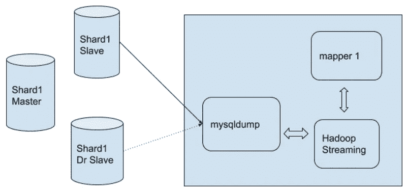
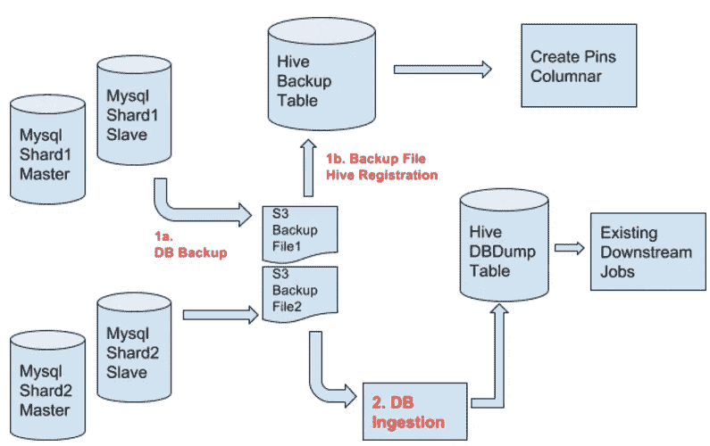

# 追踪器:大规模获取 MySQL 数据—第 1 部分

> 原文：<https://medium.com/pinterest-engineering/tracker-ingesting-mysql-data-at-scale-part-1-424cf43fa7c3?source=collection_archive---------1----------------------->

Henry Cai | Pinterest 基础设施工程师

在 Pinterest，我们正在构建世界上最全面的发现引擎，实现高度个性化、相关和快速服务的一部分是在我们的 Hadoop/Spark 集群上运行数千个作业。为了给计算提供数据，我们需要从 MySQL、Kafka 和 Redis 等在线数据源获取大量原始数据。我们之前[讨论过](https://engineering.pinterest.com/blog/introducing-pinterest-secor)我们的测井管道和将 Kafka 数据转移到 S3。在这里，我们将分享从 MySQL 到 S3 大规模移动数据的经验教训，以及我们实现 Tracker 的旅程，这是一个大规模移动内容的数据库接收系统。

## 历史

为了对挑战有一个概念，让我们首先看看我们从哪里来。MySQL 是 Pinterest 中存储最重要对象的主要数据源:图钉、图钉和图板。每天，我们从 MySQL 数据库收集超过 100 的数据到 S3，以驱动我们的离线计算工作流。为了处理这种规模的数据移动，设计和实现进行了多次迭代。

最初的数据库接收框架(称为“dbdump”)受到了 Apache Sqoop 的影响，这是一个将数据从数据库拉入 HDFS 的开源解决方案。我们基于我们的工作流管理器[弹球](https://engineering.pinterest.com/blog/open-sourcing-pinball)和我们的 DataJob 工作流系统构建了一个集群解决方案，以并行拉动 MySQL 数据库。每个 Hadoop mapper 进程产生一个 Python 流作业和一个 mysqldump 进程，通过进程管道从 MySQL 主机中提取数据。

该系统在最初几年表现良好，但随着时间的推移，我们面临着越来越多的性能和操作问题，包括:

*   在转储期间，现有的框架不处理故障转移(从主设备转储会影响 Pinners)，或者从生产中添加或删除从设备。
*   大桌子需要几个小时。例如，我们将花费超过 12 个小时的时间将 pin 引入 Hadoop 领域。
*   MySQL servers 模式的所有知识都被检查到代码中，因此只要有模式变化而没有伴随的代码变化，提取过程就会失败。
*   系统不能很好地处理二进制数据，所以我们通常通过十六进制编码数据来回避各种问题。
*   这里有一个组织上的挑战，不同的团队拥有不同版本的框架，所有权很少清晰。
*   现有的框架只知道如何从单个从设备读取，而多个从设备可以用于并行化工作。

## 输入跟踪器

为了解决限制我们的问题，我们设计并实现了跟踪器。当我们开始构建 Tracker 时，我们认为需要将摄取管道分成两个阶段:

1.  数据库主机上运行的脚本会将其内容备份到 S3。此脚本基于本地实例作为从属实例，并且复制已应用了 00:00UTC 之前创建的所有事件。如果发生故障转移，脚本将自动停止在新的主服务器上执行，并在新的从服务器上开始执行，无需人工干预。
2.  可以使用 Hadoop 集群启动数据库接收，以读取和转换第一步中生成的 S3 备份文件(即，将数据文件转换为预先存在的 dbdump 格式或转换为列格式)。注意，在这一步中，我们是在一个纯 Hadoop 的世界中，所以我们可以使用多少 mappers 没有限制。

在 Hadoop 端，我们启动了更多的映射器，并打开了推测执行，以消除偶尔卡住的 S3 上传器(之前我们无法进行优化，因为 MySQL 端有负载)。我们还更改了一些关键作业，直接从数据库备份文件中读取，以缩短周转时间。

## 进一步的工作

通往当前架构的旅程并不完全顺利。请继续关注第 2 部分，了解我们学到的经验以及 MySQL 和 Hadoop 的实现细节。

*鸣谢:感谢罗布·伍尔奇、克里希纳·盖德、瓦姆西·彭内坎蒂、叶茂和厄尼·苏赫拉达对追踪器项目做出的宝贵贡献*

*获取 Pinterest 工程新闻和更新，关注我们的工程*[*Pinterest*](https://www.pinterest.com/malorie/pinterest-engineering-news/)*[*脸书*](https://www.facebook.com/pinterestengineering) *和*[*Twitter*](https://twitter.com/PinterestEng)*。有兴趣加入团队吗？查看我们的* [*招聘*](https://careers.pinterest.com/careers) *网站。**