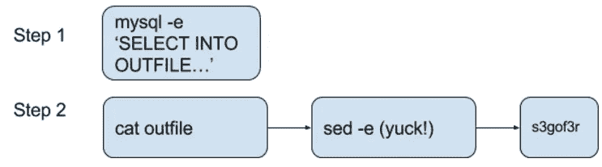
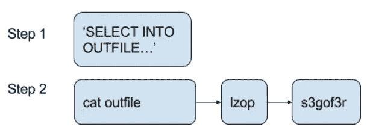
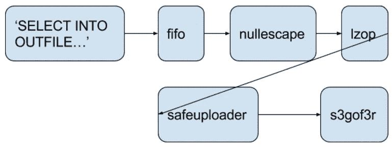

# 追踪器:大规模获取 MySQL 数据—第 2 部分

> 原文：<https://medium.com/pinterest-engineering/tracker-ingesting-mysql-data-at-scale-part-2-9c5249e9332a?source=collection_archive---------3----------------------->

Robert Wultsch | Pinterest 工程师

在[第 1 部分](https://engineering.pinterest.com/blog/tracker-ingesting-mysql-data-scale-part-1)中，我们讨论了吸收 MySQL 的现有架构 Tracker，包括它的优势、挑战和新架构的概要，重点是 Hadoop 方面。这里我们将关注 MySQL 端的实现细节。上传到 S3 的数据已经作为 [Pinterest MySQL Utils](https://github.com/pinterest/mysql_utils) 的一部分被开源。

## 跟踪器 V-0

作为概念验证，我们编写了一个 96 行的 Bash 脚本来解除对新数据集的备份的阻塞。这个脚本产生了一群工人，每个工人一次处理一个数据库。对于数据库中的每个表，它将 SELECT 运行到 OUTFILE，然后将数据上传到 S3。它起作用了，但是 BASH……而且那不是一个长期的解决方案。

## 跟踪器 V-1

为了我们的可维护实现，我们将 Bash 脚本重写为一个名为 [mysql_backup_csv.py](https://github.com/pinterest/mysql_utils/blob/master/mysql_backup_csv.py) 的 Python 脚本。唯一显著的区别(除了让我们不要自我感觉不好)是我们添加了 lzop 压缩，以减少 S3 中的数据量。为什么是 lzop？我们认为这将是最轻的压缩工具，带有命令行界面，可以从 apt-get 安装。

我们在我们庞大的分片 MySQL 车队上测试了这个，它很慢。非常慢，慢了 8 个小时。

## 加快速度

我们现在有了一个可维护的工具，可以将我们的 MySQL 数据上传到 S3。问题是该工具处理所有数据的速度不够快，我们的团队无法满足他们的 SLA。我们需要显著提高整体吞吐量，因此我们着手进行了以下工作:

*   实现锁定，以便多个从模块可以协作地并行转储。锁是通过主服务器上的一个简单的表来维护的。这使我们能够在大约 3.5 小时内转储所有数据。太慢了！
*   跳过写入磁盘。MySQL 的 Percona 发行版有一个非常有趣的特性，即 [SELECT INTO OUTFILE 可以写入 FIFO](https://www.percona.com/doc/percona-server/5.5/flexibility/extended_select_into_outfile.html#extended-select-into-outfile) 。实际上，我们必须转储所有的数据，然后从文件系统中读回这些数据。使用一个 [fifo](https://en.wikipedia.org/wiki/Named_pipe) ，我们可以构建一个根本不需要写入本地文件系统的管道！这使我们大约 1 小时，这远远低于我们的要求。

## 慢下来

根据[精细手册](http://dev.mysql.com/doc/refman/5.7/en/select-into.html)(这是在超老的手册里):
“ASCII NUL 被转义，以便更容易用一些寻呼机查看。”

！@#()U@！#!！！

我们不得不编写一个名为 [nullescape](http://github.com/pinterest/mysql_utils/blob/master/NullEscape.c) 的 C 程序来对数据进行转义。& *(@！#!

将这一点添加到我们的管道中，导致我们的服务器燃烧了四个内核，只是为了避免 NUL 字节。这使我们转储所有数据的时间减少到 1.5 小时。这仍然在我们的要求之内，给我们留下了一点喘息的空间。

## 赢得与 EOF 的比赛

该系统的一个问题是必须阻止部分上传。如果管道中有任何东西失败，就可能发生部分上传。当一个 Linux 程序终止时(不管如何或为什么)，它打开的文件句柄将关闭。如果文件句柄指向一个 FIFO，FIFO 的读取器将接收到一个 [EOF](https://en.wikipedia.org/wiki/End-of-file) ，而没有任何将数据送入 FIFO 的过程成功或失败的指示。

那么，这有什么关系呢？嗯，转储查询有时会被终止，nullescape 的早期版本偶尔会出现 segfault。当任何一种情况发生时，管道的其余部分将认为不再有数据到来。捕捉非零返回状态并删除上传的数据是可能的，但这有点太过了，最终比赛会失败。

我们讨论了很多次，我们得出的最佳解决方案是一个位于管道中 s3gof3r 之前的程序。这个程序将从 stdin 到 stdout 重复它的输入，但是只有当管道中的所有程序都成功时才传输一个 EOF。这个程序叫做 [safe_uploader](https://github.com/pinterest/mysql_utils/blob/master/safe_uploader.py) ，最终非常轻便。

起初，safe_uploader 中有一些微妙的错误，导致了[僵尸](https://en.wikipedia.org/wiki/Zombie_process)和[孤儿](https://en.wikipedia.org/wiki/Orphan_process)进程，但是一旦我们修复了这些错误，它们就不再出现在数据库服务器上了。

## 系统性改进

与之前的系统相比，该项目显著提高了所得数据的可用性，并减少了操作问题:

1.  我们增加了对 MySQL 二进制类型的支持。在备份过程中，我们没有对二进制列使用十六进制编码(这会使备份文件的大小加倍)，而是选择对一些特殊字符使用转义(例如，\n，\t，\ r)；

*   Hadoop 内置的 TextInputFormat 无法读取换行符转义的备份，所以我们为 Hadoop/HIVE 编写了自己的 EscapedTextInputFormat
*   我们在 Hadoop 流端为这个特殊的 TextInputFormat 做了一个修复
*   我们为 Python 客户机重写了 CSV 解析器，以读取新的备份文件

1.  我们为所有备份文件添加了一致的数据保留策略，并对 HIVE 表进行了自动调整，以确保其模式始终与 MySQL 模式保持同步。
2.  由于所有的数据都被导入到 MySQL 中而没有进行重大修改，我们现在有了一个辅助备份系统。这对于少量的数据丢失很有用。恢复 xtrabackup 需要几个小时，但是从 Hive 中提取一行或一个小表非常快，而且更好的是，不需要 DBA 的帮助！
3.  当发生故障转移时，cron 运行的一个[小脚本](https://github.com/pinterest/mysql_utils/blob/master/kill_backups.py)会终止正在运行的备份。在过去，这需要为 dumper 框架删除 MySQL 用户。通常，这也会导致 DBA 团队和 Data-Eng 在凌晨时分互相呼叫。
4.  我们的备份现在在模式级别上完全一致，并且通常在几秒钟内在副本集上一致。对于跨片数据一致性检查来说，这是一个很大的改进。
5.  tracker 将从属服务器推得非常非常紧的一个意想不到的好处是，我们每天晚上都在有效地运行一个基准测试，这对我们的从属服务器造成了很大的压力。我们会不时地从生产中移除速度较慢的服务器。

Tracker 现已全面投产，能够在两小时内将我们所有的 MySQL 数据转移到 S3。

## 未来的工作

我们不会停在这里。我们意识到，对于某些表，每日变化实际上不足以保证完整的快照拉取，因此我们正在构建一个增量拉取管道，将 MySQL 二进制日志转换为 Kafka 流。然后，这将被增量推送至 S3，并随后与之前的快照进行压缩，以获得持续更新的快照。敬请期待！

*鸣谢:感谢 Henry Cai、Krishna Gade、Vamsi Ponnekanti、叶茂和 Ernie Souhrada 对 Tracker 项目做出的宝贵贡献。*

有关 Pinterest 工程新闻和更新，请关注我们的工程 [Pinterest](https://www.pinterest.com/malorie/pinterest-engineering-news/) 、[脸书](https://www.facebook.com/pinterestengineering)和 [Twitter](https://twitter.com/PinterestEng) 。有兴趣加入团队吗？查看我们的[职业网站](https://careers.pinterest.com/careers)。