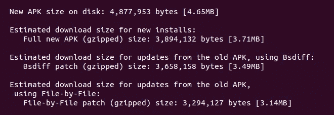
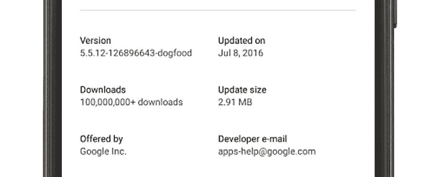
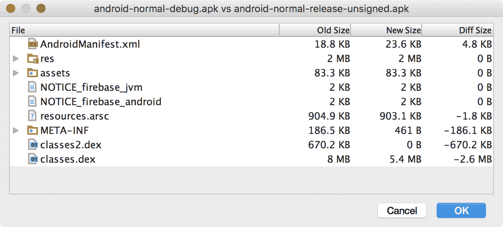

# 跟踪应用更新大小

> 原文：<https://medium.com/androiddevelopers/tracking-app-update-sizes-1a1f57634f7b?source=collection_archive---------1----------------------->



**新增:** [**支持 APK 补丁大小估算器中的逐文件更新**](#d851)

在过去的一年里，减小 APK 的大小一直是一个热门话题。原因有很多:无论你是为了在昂贵和不可靠的网络上用功能较弱的设备接触用户而[构建数十亿个](https://developer.android.com/distribute/essentials/quality/billions/index.html)，还是你只是试图优化你的应用，每个人都受益于较小的 APK 大小、更快的下载和更短的安装时间。

应用程序的大小会带来不同的成本:

*   您上传到 Google Play 的文件大小(原始 APK 大小)
*   初始下载大小
*   设备上安装大小
*   更新下载大小

我们发布了许多指南来解释如何减少初始和设备上的 APK 大小，包括新的 [**文档页面**](https://developer.android.com/topic/performance/reduce-apk-size.html) 、 [**我的 I/O talk**](https://www.youtube.com/watch?v=xctGIB81D2w) 和 [**文章**](/google-developers/smallerapk-part-1-anatomy-of-an-apk-da83c25e7003#.eoelcetv3) ，它们解释了如何使用多 APK 等技术来优化资源、缩减代码和定制您的 apk 到用户设备的交付。

这一切都很好，但用户通常会在每台设备上安装一次你的应用程序，然后通过 Play Store 下载定期更新，这就是为什么优化应用程序更新大小同样重要。

# 针对应用更新大小进行优化

让应用程序更新变得更小的最大好处是，大部分更新都是自动进行的。感谢 [**对 Android Studio 打包 apk**](https://android-developers.googleblog.com/2016/11/understanding-apk-packaging-in-android-studio-2-2.html)的方式进行了改进，以使后续版本尽可能彼此相似，Play Store 可以计算更小的增量更新。此外，Play Store 中引入的新算法，如 [**最近的逐文件修补**](https://android-developers.googleblog.com/2016/12/saving-data-reducing-the-size-of-app-updates-by-65-percent.html) ，有助于将应用更新大小平均减少 65%。

> 要记住的重要一点是不要干扰我们在 Android Studio 和 Play 中已有的机制。
> 
> 如果你使用最新的(至少 2.2+版本)Android Studio/Android Gradle 插件来构建你的发布版 APK，并且之后不做修改，你应该可以使用了。
> 
> 不要使用自定义的 ZIP 编码器设置来压缩 APK，也不要使用 Zopfli 来再压缩你的 APK，否则你会错过逐文件更新带来的巨大节省。

# 跟踪 APK 和更新大小

现在你知道为什么和如何做正确的事情，有没有一个简单的方法来跟踪你的 APK 大小？在这个过程中，你会对你的应用程序进行修改，修复错误，引入新功能，添加资源和库，这是很正常的。如何预测你的用户下一次更新会有多大？



Google Play showing update size

我们用几种方式来表达这些信息。首先，这也是用户会看到的，Play Store [**在 Android 上的应用程序列表页面上显示下载大小**](https://android-developers.googleblog.com/2016/07/improvements-for-smaller-app-downloads.html) ，这成为已经安装了你的应用程序的用户的更新大小。

## APK 斑块大小估计量

对于开发者来说，能够在发布之前看到这个数字会更理想，这就是为什么我们开源了一个叫做 [**APK 补丁大小估计器**](https://github.com/googlesamples/apk-patch-size-estimator) 的工具。

它是一个命令行工具，因此您可以将它集成到您的持续集成服务器中并解析输出以包含在您的报告中，或者通过给它两个 apk 来手动调用它，如下所示:

```
python apk_patch_size_estimator.py --old-file old.apk --new-file new.apk
```

下面是一个输出示例:

```
New APK size on disk: 18,271,850 bytes [17.4MB]Estimated download size for new installs:
   Full new APK (gzipped) size: 16,339,603 bytes [15.6MB]Estimated download size for updates from the old APK, using Bsdiff:
   Bsdiff patch (gzipped) size: 2,989,691 bytes [2.85MB]Estimated download size for updates from the old APK,
 using File-by-File:
   File-by-File patch (gzipped) size: 1,912,751 bytes [1.82MB]
```

APK 补丁大小估算器实现了 Play Store 使用的当前压缩和增量算法，并将为您提供新安装的初始 APK 下载大小(它不同于原始 APK 大小，因为 Play Store 可能会应用额外的压缩)和增量补丁下载大小的估算。**我们最近更新了工具，以支持新的逐文件更新**，因此您也可以获得一个估计值。

为什么是估计而不是确切的数字？Play Store 一直在发展，我们经常测试新的压缩方法，这些方法可能会为我们的用户节省数据。我们的目标是让 APK 补丁大小估计器与任何新方法保持同步。

顺便说一下，值得一提的是，对于想要了解应用程序的哪些部分在版本之间变大(或变小)的开发人员来说，Android Studio 中的 APK 分析器中还有一个交互式的[**【比较】工具**](https://developer.android.com/studio/build/apk-analyzer.html#compare_apk_files) 。



在 Android Studio 3.0 中，我们已经更新了该工具，可以选择显示逐文件的更新大小。