# 在 Oracle 云中跟踪 JUnit 测试结果

> 原文：<https://medium.com/oracledevs/tracking-junit-test-results-in-oracle-developer-cloud-service-78fd7a84a036?source=collection_archive---------0----------------------->

就 JUnit 而言，开发者云服务为您提供了以下功能

*   查看所有已执行测试的列表和**累积测试指标**
*   测试结果历史以**图形**的形式跟踪所有测试的**历史**

我们将学习如何

*   **设置**开发者云服务实例 Git 存储库中的源代码
*   **配置**构建过程以及与 JUnit 测试相关的动作
*   **执行**构建和**跟踪**测试结果

# 单元测试

让我们看一下单元测试——这个项目在这里[可用](https://github.com/abhirockzz/junit-sample-project),它展示了一个简单的基于 JPA 的应用程序及其单元测试

# 设置

## 项目和代码库创建

[在您的 Oracle 开发人员云实例中创建一个项目](http://docs.oracle.com/cloud/latest/devcs_common/CSDCS/GUID-3317B279-A9C0-4566-A289-BD651A89D7B5.htm#GUID-7B30C8EC-6CDA-4F14-9791-8AE3BB3E8343)

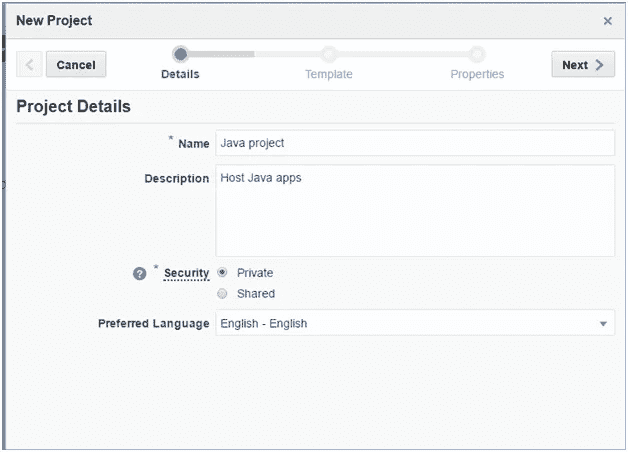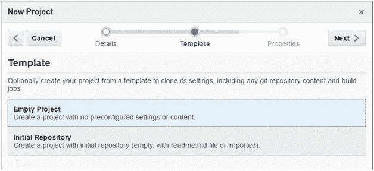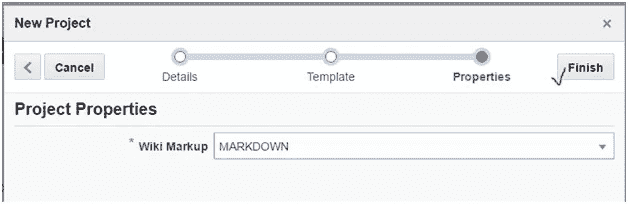

[创建一个 Git 存储库](http://docs.oracle.com/cloud/latest/devcs_common/CSDCS/GUID-37938DB0-544E-4A94-B8A1-2B7E8ED8A972.htm#CSDCS3240) —浏览到**主页**选项卡，点击**新建存储库**并按照步骤操作

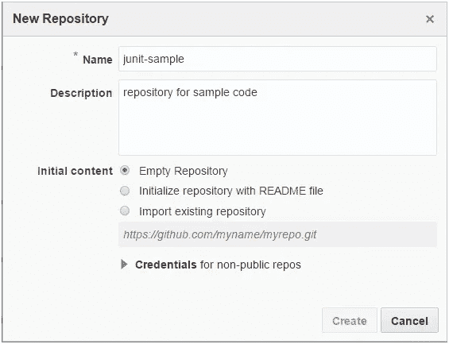

您应该看到您的新存储库已经创建

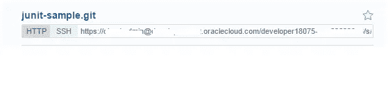

## 填充 Git repo

[将项目](http://docs.oracle.com/cloud/latest/devcs_common/CSDCS/GUID-B4C03296-8497-4356-8C74-2031D1FB96FC.htm#CSDCS-GUID-A33E83CE-845C-4393-8C93-936527033715)从您的本地系统推送到您刚刚创建的开发者云 **Git** repo。我们将通过*命令行*来完成这项工作，您所需要的就是在您的本地机器上安装 *Git 客户端*。你可以使用[这个](https://git-scm.com/downloads)或者你选择的任何其他工具

```
cd <project_folder> git init git remote add origin <developer_cloud_git_repo> 
//e.g. [https://john.doe@developer.us.oraclecloud.com/developer007-foodomain/s/developer007-foodomain-project_2009/scm/junit-sample-app-repo.git](https://john.doe@developer.us.oraclecloud.com/developer007-foodomain/s/developer007-foodomain-project_2009/scm/junit-sample-app-repo.git) git add . git commit -m "first commit" git push -u origin master  
//Please enter the password for your Oracle Developer Cloud account when prompted
```

您应该能够在您的开发人员云控制台中看到代码


## 配置生成作业

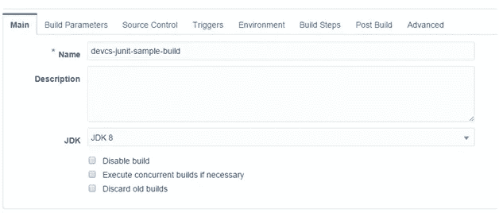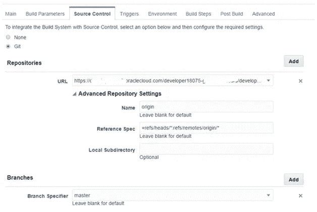

激活以下生成后操作

*   发布 JUnit 测试结果报告
*   测试报告的存档(如果需要)


## 触发构建


# 检查测试结果

构建过程结束后(在这种情况下会失败)，检查构建页面的右上角，然后单击**测试**


**总体指标**


**失败测试快照**

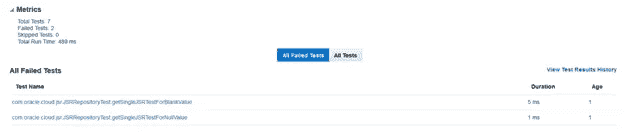

**失败测试详情**

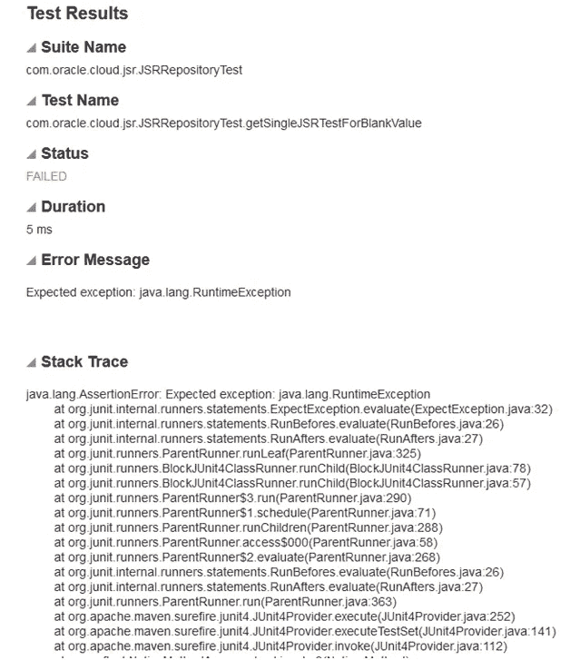

**通过测试的示例**

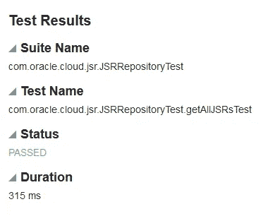

**成绩历史**

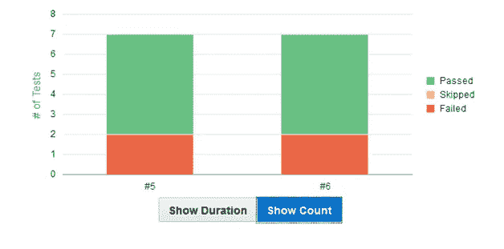

> 本文表达的观点是我个人的观点，不一定代表甲骨文的观点