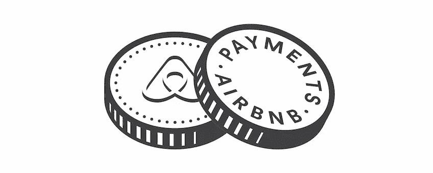
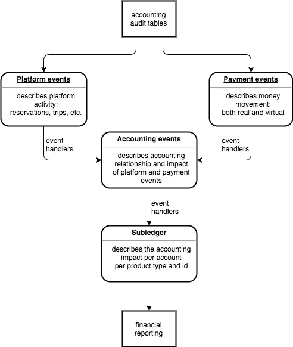

# 追踪金钱——在 Airbnb 扩展财务报告

> 原文：<https://medium.com/airbnb-engineering/tracking-the-money-scaling-financial-reporting-at-airbnb-6d742b80f040?source=collection_archive---------0----------------------->

在 Airbnb，支付团队负责在 Airbnb 的全球市场上转移资金的一切相关事务。我们开发了技术，为 Airbnb 巨大的每日交易量提供动力，从客人那里收取费用，并向主人分发支出。我们的目标是让 Airbnb 上的支付体验愉快、神奇、直观。

[从历史上看，支付团队的重点是实施新的功能、货币和支付方式，以便在全球业务中实现本地支付](/airbnb-engineering/scaling-airbnbs-payment-platform-43ebfc99b324#.3gu3yi77b)。我们的业务范围已经扩大到包括合规性(销售税、所得税、许可证等)以及根据公认会计原则进行的对账和财务会计。

目前，Airbnb 的支付和财务会计系统是一个复杂的生态系统，在 191 个国家进行交易，有 70+种货币和 20+个处理器。不仅 Airbnb 的交易量每年都呈指数级增长，我们还在我们的平台上快速增加了功能和产品。Airbnb 希望成为一流的端到端旅游服务，不仅帮助人们住宿，还帮助人们体验 T2 之旅。

维护现有财务会计系统以支持新产品以及不断增长的数据量的挑战已经成为一项“不可能完成的任务”。

Airbnb 的金融基础设施工程团队负责向我们的利益相关方提供准确、可靠和全面的商业/金融数据。在这篇博客文章中，我们将谈论我们如何设法跟踪我们所有的钱在哪里，如何在面对爆炸式增长的数据规模和复杂性时以可扩展的方式移动，以及支持新的 Airbnb 计划和支付产品。我们将分享我们废弃的财务系统的工作流程，说明其挑战和问题，然后描述我们构建的新系统来取代它。

# 以前的金融系统:基于 MySQL 的数据管道

我们之前的财务系统是 MySQL 数据管道，建于 2012 年初，于 2016 年底退役。它是一个参数化的 MySQL ETL，每晚运行以提供财务报告，并在过去几年忠实地为我们服务。工作流程如下:

*   我们为所有主表启用了 [MySQL 数据库触发器](http://dev.mysql.com/doc/refman/5.7/en/triggers.html),以便能够在每行的基础上实时捕获 Airbnb 预订和支付记录的每次更改。这样，我们加强了不变性，并确保所有与财务相关的事件都将被捕获。这本来是处理生产数据固有可变性的临时解决方案。我们承认这不是一个很好的模式，但在当时是必要的。
*   通过能够用数据库触发器重放事件的历史，我们构建了一组中间帮助器表来帮助计算不同的报告。例如，我们跟踪已确认的收入、客人应收账款、未来的主人支出(负债)以及财务报告的其他重要组成部分。
*   基于这些帮助表，我们构建了所有的财务报告。

# 扩展挑战

这种方法有一些优点。由于我们只依赖于 MySQL 数据库触发器，并且 MySQL 保证数据的准确性，工程师们有很大的灵活性来改变业务逻辑并快速行动。当逻辑简单时，基于 SQL 的报告可以编写得非常快。

然而，基于 SQL 的 ETL 方法扩展性不好:

## *这不是编程模型的正确语言*

*   SQL 适合轻量级数据转换。它不是为处理复杂的业务数据流而设计的。现代软件设计原则不能简单地应用于分解复杂性。
*   原始逻辑与我们的核心预订逻辑紧密耦合。随着 Airbnb 的发展，该公司需要支持产品逻辑，而不是最初的预订流程，例如，我们需要支付专业摄影师、翻译等费用。每一个产品变化都有独特的资金流动，因此会对财务和会计产生影响。因此，我们必须构建许多额外的报告来满足每个业务需求。因为 MySQL 逻辑是围绕预订逻辑构建的，所以很难修改，并且在为其他产品添加新逻辑时极易出错。
*   验证和测试变得不可能。为了获得全面的结果，我们分别提取了所有不同报告的数据，我们的财务团队根据他们的判断将它们组合起来。因为我们分别构建了所有的报告，所以如果有数字不匹配的话，很难判断哪个报告中的哪个变更导致了问题。当公司想要更频繁地改变产品或添加新产品时，这是不可伸缩的。
*   随着我们添加越来越多的报告逻辑，以及随着我们事务量的增长，使用 SQL 脚本开发报告变得越来越复杂，甚至令人望而却步。测试逻辑的准确性变得极其困难和耗时。

## *夜间跑步花费了太多时间*

随着我们的交易量增加，我们的转换逻辑变得更加复杂，夜间管道需要更多的时间。关系数据库很难纵向扩展。很难分割数据，也很难利用分布式系统来处理大量数据。在它生命的末期，由于它的运行时间超过 24 小时，我们只能每隔一天运行一次。

# 我们的目标:

随着我们的发展，我们需要能够应对急剧增长的数据量以及 Airbnb 新产品和支付渠道的频繁增加。因此，我们的新系统有两个目标:

*   新系统应该给我们足够的灵活性来支持更多的产品，以及处理产品变化或会计逻辑的变化。为此， ***我们需要将财务逻辑与产品逻辑解耦。*** 这些产品行为的表现在我们的财务系统中可以是非常通用的，例如如何记录应收/应付/收入/税收等。因此，我们可以基于高度规范化的数据构建非常可持续的财务报告。
*   新系统应该可以横向扩展。随着容量的增长，我们应该能够通过添加机器来扩展我们的系统。

# 介绍我们新的财务报告渠道

我们基于事件的财务报告旨在:

*   支持我们平台中所有当前和未来的产品类型
*   全面了解对我们平台有财务影响的所有事件
*   随着交易量的增长进行横向扩展

它由 [Apache Spark](http://spark.apache.org/) 驱动，存储在我们的 [HDFS](http://hortonworks.com/apache/hdfs/) 集群上，用 [Scala](https://www.scala-lang.org/what-is-scala.html) 编写。Spark 是用于大规模数据处理的快速通用引擎，具有隐式并行性和容错性。我们选择 Scala 作为语言，因为我们想要 Spark 的最新特性，以及该语言的其他好处，如类型、闭包、不变性、惰性求值等。

考虑到我们以前的语言是 SQL，这是一个巨大的进步。

# 它如何工作的简要概述

我们新的财务报告系统有一个不同产品类型的概念，预订只是其中之一。每种产品类型都有自己的一组平台和支付事件，以及相应的一组金融事件。因此，我们可以单独处理每种产品类型，并系统地构建一份整体报告。

该系统可以被认为是许多事件处理器，它们计算不同产品在其生命周期的不同点上的会计影响。因为 Scala 拥有强大的静态类型系统，同时提供对函数式编程的全面支持，所以很容易设计和编写关于不同产品以及如何处理它们的处理程序。

下图显示了数据如何在系统中流动。别担心，我们会解释一切的。

***平台事件是提供*** 产品相关变更信息的事件，如预订、预订变更、拍照、取消等。这些通常有一些财务预期，但并不总是如此。每次创建或更新产品时，我们都会为该产品派生一个事件。例如，当预订时，我们为预订产品类型发出一个预订事件。预订开始一天后，我们认为预订已经“提供了服务”。当服务交付给客户(本例中为客人)时，我们就可以确认收入。这些事件很重要，因为它们具有财务会计的含义，我们将在下面详细讨论。

***付款事件形容资金的运动。它们可以是真实资金进出 Airbnb 银行账户的事件。支付事件也描述储值，比如当某人购买和使用礼品卡时。还有其他类型的支付事件，在这些支付事件中，货币可能实际上没有移动，但我们仍然必须考虑现金流动的缺乏。这可能是当某人送给别人一张礼品卡，而那个人要求得到它。我们认为这些是平衡转移，或虚拟运动。无现金流动的一个例子是当客人使用优惠券时。优惠券的钱来自营销预算，但实际上没有钱移动账户——我们只需要在某个地方说明它。 ***钱进来一定等于钱出去。******

这些事件当前是通过检查上述会计审计行的更改而生成的。如果变更具有会计影响，则生成平台或支付事件。这个系统被设计成一个所有数据从不同系统传递的中心。财务报告系统使用事件处理程序处理这些平台和支付事件，并生成描述这些事件的会计影响的会计事件。

***会计事件由事件处理程序生成，事件处理程序从支付和平台事件*** *中构建。*我们引入了这一抽象层来表示每个产品的不同平台和支付事件之间的关系，以及会计逻辑。有时，正如您将在下面看到的，单个平台事件可以生成多个会计事件，因为它在不同的时间有多个会计影响。这些事件通过为一组活动分配一个惟一的标识符、产品类型和产品 id 来跟踪所发生的事情。对我们来说，我们认为产品类型和 id 是我们操作的最小会计单位。

根据会计事件，我们生成子分类账，这是我们所有财务会计的基础。 ***每个条目都是一个详细的会计记录，包括交易发生的时间*** (付款或预订)、金额、货币、货币影响的方向(贷记或借记)及其影响的账户。

使用[复式记账法](https://en.wikipedia.org/wiki/Double-entry_bookkeeping_system)生成子分类账。复式记账法使我们能够确保所有的东西都在系统中得到了合理的解释。这意味着没有钱会凭空出现或消失。

尽管每种产品类型可能表现不同，但我们发现所有产品类型都有一个通用的生命周期。让我们看一下在这个框架中预订是什么样子的。

发生了一个引入一些会计责任的事件，并创建了一个合同。在这一点上没有资金流动，但是对未来资金流动的预期建立在这里。此时的会计事件描述了已经创建的合同。

*   这里，一位客人确认了一个 100 美元的两晚预订。我们将此时间称为预订日期，并将其视为合同开始日期。在 100 美元中，90 美元是住宿的价格，10 美元是费用。(此价格细目表仅作为示例，并不反映任何实际预订。为了简化解释，我们还将主机费排除在外。)
*   客人和主人已经相互订立了合同，由 Airbnb 作为平台和收款代理。作为在这家房源住两晚的交换，客人将向 Airbnb 支付 100 美元，入住后一段时间，主人将收到 90 美元。在预订确认之日，我们有一笔 100 美元的应收客人款和一笔 90 美元的应付未来主人款，当我们认为预订已经完成时，应付给主人。一旦预订被确认，这些期望就建立起来了。

一个事件的资金流发生了。这可能在合同创建后的任何时候发生。此处的会计事件描述了该金额履行的方向和责任。

*   在这里，客人成功地为预订支付了 100 美元。我们会认为客人的应收账款已经兑现。

事件发生了，因此约定的服务完成了。

*   这是在入住时间之后。这是我们确认收入和损失的时候，如果有的话。在这个例子中，我们没有任何。这也是应该向主持人交付为主持人安排的$90 支付的时间。这意味着未来应付外派国费用现在是应付外派国费用，因为它现在已经到期。

可能会出现更多的资金流动。

*   这是我们成功地向主人支付 90 美元的时候。现在 Airbnb 的主机应付款是这个特定主机的 0 美元。

有时，产品或付款会有变动。例如，客人在预订中添加日期，导致预订价格发生变化。为了正确说明变更的价格差异，我们在变更时完全“取消预订”和“重新预订”。

*   例如，如果之前预订的价格为 100 美元，现在由于客人在稍后的日期延长了他们的逗留时间，价格为 150 美元，我们可以在稍后的日期预订额外的 50 美元，或者取消预订 100 美元，并在当天重新预订 150 美元。你认为我们为什么选择后者？这是因为当修改增加时，取消预订和重新预订要容易得多，而不是每次都计算增量。这是我们处理产品变更和数据回填的最干净的方式。想象一下，在我们的系统中，对长期预订的更改会是什么样子！

现在，我们已经从平台和支付事件构建了子分类帐，以及它们的处理程序，我们可以轻松地查询任何事件对不同帐户产生的财务影响。

如何从子分类帐中查询收入的示例如下:

# 关键要点

## *在保持质量和性能的同时进行扩展*

我们的财务报告渠道在产品和运行时间的基础上进行扩展。我们可以轻松地支持金融工程方面的新产品，因为我们已经围绕正确的抽象建立了一个框架，而不是将其与某个特定产品的生命周期过于紧密地联系在一起。我们也可以水平扩展。这比被 Amazon RDS 实例限制要好得多，不管它有多强大。我们的夜间运行时间为 4-5 小时，截至 2017 年 3 月，并没有增长太多。

## *它使故障排除变得更加简单*

以前，当我们的财务团队需要全面的报告时，我们为所有不同的报告分别提取数据，然后我们的财务团队根据他们的判断组合这些数据。因为我们分别构建了所有的报告，所以很难判断哪个报告中的哪个变更导致了意外的偏差。当公司想要更频繁地改变产品或添加新产品时，这是不可伸缩的。现在，当出现问题时，我们会调查来自单一真实来源的数据，这大大简化了故障排除流程。

## *它使编码变得更加简单*

从声明式编程到函数式编程是我们思考财务处理和会计的一个强大的范式转变。我们现在可以把这个系统看作一个简单的参与者/处理程序系统，而不是陷入复杂的 SQL-join 逻辑。

## *夜间运行是及时的，并且得到了很好的监控*

最初，MySQL ETL 是通过 crontab 调度的，并且依赖于通过不同管道到达的数据。夜间跑步不需要花费一天以上的时间来完成，而是需要大约 4-5 个小时来完成。我们不再需要照看一个遗留系统，该系统经常会遇到由上游变更引起的障碍，每周都要花费开发人员数小时的时间来解决。

## *我们建立了一个全面的测试框架*

这也许是这幅画的重要部分。因为我们的财务处理和报告不再在 SQL 中，所以我们现在也能够针对特定的处理程序编写大量的单元测试套件。结合集成测试和冒烟测试，我们可以很容易地识别回归和其他错误。冒烟测试是我们希望我们的数据遵循的规则，当违反规则时，它们会被记录下来并得到解决。这给了我们对数据质量的高度信心，让我们能够快速审查新的变化并推出它们。我们已经建立了一个广泛的(并且不断扩展的)真实交易测试套件，在其中我们检查我们期望它们在系统中单独地以及整体地看起来如何。当我们的各种财务和法律合作伙伴以及审计合作伙伴提出对时间敏感的请求，并且需要对我们的报告充满信心时，这个测试框架非常重要。

# 展望未来

在未来，我们将转向一个完全基于事件的系统。财务报告系统将使用从其他系统发出的事件。请在以后的博客文章中继续关注。这将有助于我们获得更大的财务完整性和更丰富的词汇，我们可以用它们来表达不同的产品和支付流程。

最后，我们在 Airbnb 最想要的是为我们在 Airbnb 的所有当前和未来产品提供完整、准确和可扩展的财务报告。我们相信，我们设计的财务报告系统是 Airbnb 所有财务处理的坚实基础。由于业务逻辑和会计逻辑的完全分离，这个系统是产品不可知的、可扩展的和面向未来的，这使我们相信它将在未来的许多年里很好地为我们服务。这只是我们 Airbnb 后台财务系统的开始。

如果你喜欢阅读这篇文章，并认为这是一个有趣的挑战，支付团队一直在寻找有才华的人加入团队，无论你是[软件工程师](https://www.airbnb.com/careers/departments/engineering)还是[数据科学家](https://www.airbnb.com/careers/departments/data-science-analytics)。

请继续关注 Airbnb 支付生态系统的更多信息！

*非常感谢莎拉·哈格斯特伦、卢·科萨克、肖恩·严、布莱恩·韦、·杨和伊恩·洛根通读了许多草稿，并帮助我写了这篇文章。*