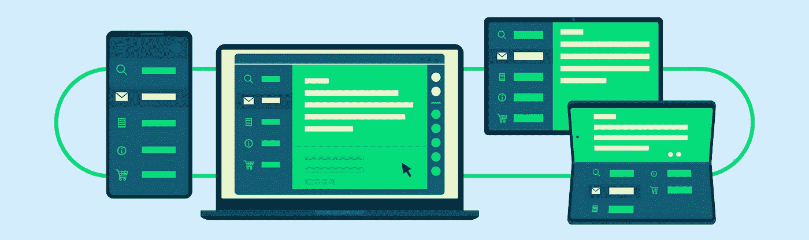
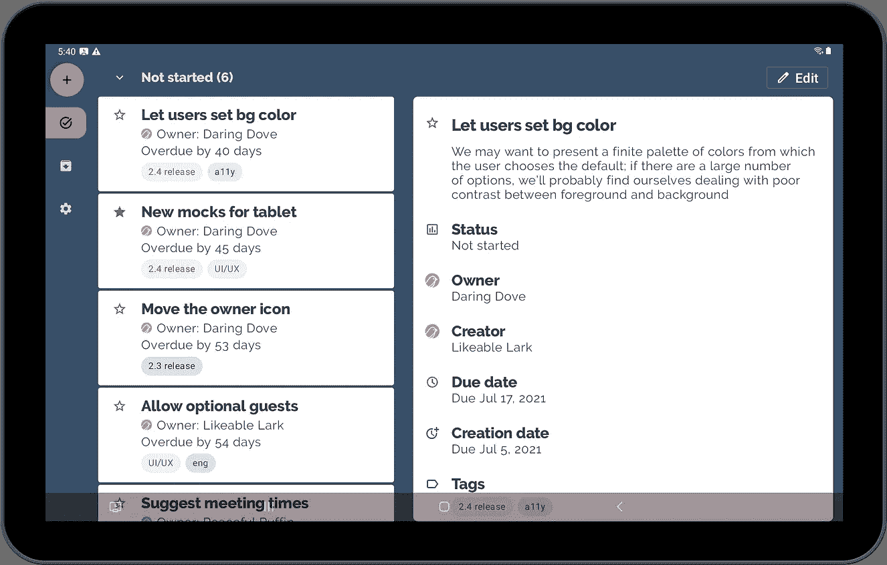

# Trackr 出现在大屏幕上

> 原文：<https://medium.com/androiddevelopers/trackr-comes-to-the-big-screen-9f13c6f927bf?source=collection_archive---------5----------------------->

Trackr 是一个简单的任务管理应用程序。虽然 Trackr 主要用于从支持可访问性的角度探索常见的 UI 模式，但它也是我们展示现代 Android 开发最佳实践的示例之一。我们最近针对大屏幕调整了应用程序，所以让我们来看看应用材料设计和响应模式如何在大屏幕设备上产生更精致和直观的用户体验。

# 航行

**在**之前:在任务屏幕中，你可以从底部应用程序栏的菜单中访问存档和设置。在大屏幕上，菜单控件是一个不方便的地方的微小触摸目标，底部的应用程序栏被过度拉伸。

*Left: Phone navigation. Right: Tablet navigation.*

**后**:当屏幕变宽时，我们显示一个[导航条](https://material.io/components/navigation-rail)代替。我们还将浮动操作按钮(打开新任务屏幕)放置在导航栏中，并完全移除底部的应用程序栏。

*Navigation rail on large screens.*

虽然这种改变是针对更大的设备而言的，但它也有利于横向模式下的手机，因为有更多的垂直空间来查看任务列表。

*Navigation rail on phone in landscape orientation.*

# 双窗格布局

**在**之前:任务屏幕和存档屏幕占据了整个显示宽度，点击一个项目会用该项目的详细信息替换列表。在大屏幕上，UI 元素要么被拉伸，要么被分组到一边，屏幕感觉非常不平衡。

*Looks natural on phones, but large screens have suboptimal space usage.*

**在**之后:任务屏幕和存档屏幕都显示使用`[SlidingPaneLayout](https://developer.android.com/reference/kotlin/androidx/slidingpanelayout/widget/SlidingPaneLayout)`的[列表/详细 UI](https://developer.android.com/guide/topics/ui/layout/twopane) 。我们在关于我们对 Google I/O 应用程序所做的改变的[上一篇文章](/androiddevelopers/large-screen-ui-in-the-google-i-o-app-c4d3ddd98bd0)中写了如何做到这一点，所以如果你对技术细节感兴趣，可以去看看。

Task Detail 屏幕也有一个浮动的操作按钮(打开编辑任务屏幕)，但是如果导航条可见，就会产生两个浮动的操作按钮，这并不理想。相反，我们隐藏了第二个浮动动作按钮，并在右上方的工具栏中添加了一个编辑按钮

*Two panes make better use of the screen space.*

# 编辑任务和新任务

之前的**:当你编辑任务时，编辑任务界面取代了任务详情，占据了整个屏幕。像任务细节一样，这个屏幕感觉很不平衡。新的任务 UI 也有同样的问题(事实上，新任务和编辑任务在我们的导航图中实际上是同一个目的地)。**

*Left: Edit Task on phones. Right: Edit Task on tablets.*

**After** :在大屏幕上，我们使用一个`DialogFragment`来让编辑任务 UI 浮动在其余内容之上。

*Floating UI provides focus on the user’s current objective.*

最初，我们试图通过替换任务细节来在细节窗格中显示这个 UI。虽然这很简单，但我们很快发现我们对这种方法不满意，原因如下:

*   这对于创建一个新任务来说没有意义，这个功能现在已经可以在导航栏中普遍使用了。我们可以让新任务成为一个独立的目的地，并赋予它不同的行为，但这似乎不是一个好的解决方案。
*   编辑任务看起来非常类似于任务详细信息，只是字段处于可编辑状态。在双窗格布局中，当我们用细节窗格中的编辑任务替换任务细节时，几乎看起来什么也没发生——只是在需要的地方没有足够的视觉强调。相比之下，`DialogFragment`吸引用户，将焦点放在前面和中间。
*   我们不想离开编辑任务(或新任务)，直到用户保存他们的更改或我们确认更改可以被放弃。当唯一的出路是使用后退按钮时，这很容易被拦截，但在新的应用程序设计中，我们有额外的情况要担心:用户可能会在导航栏中点击某个东西，或者在列表窗格中点击不同的任务。暂时禁用所有这些元素会很麻烦。有了`DialogFragment`，所有这些都在对话框后面，用户无法与之交互，这正是我们想要的。

*New Task UI uses the same pattern as Task Edit.*

这里的要点是，当你在设备上尝试时，最简单的设计可能在功能上有差距。当这种情况发生时，后退一步关注用户体验，并寻找一种设计模式来促进这一点。

# I̶n̶ ̶p̶r̶o̶g̶r̶e̶s̶s̶完成

随着平板电脑和可折叠设备的日益流行，创建一个响应迅速的用户界面比以往任何时候都更加重要。我们展示了如何添加导航轨道和使用`SlidingPaneLayout`不仅使 Trackr 应用程序看起来更好，还极大地提高了可用性，并创造了手机上无法存在的体验。我们还展示了有时你必须围绕可用性重新思考你的设计，而不仅仅是屏幕空间，以便最好地满足用户的需求。

我们希望你喜欢新的和改进的跟踪器！查看[github.com/android/trackr](https://github.com/android/trackr)上的代码。