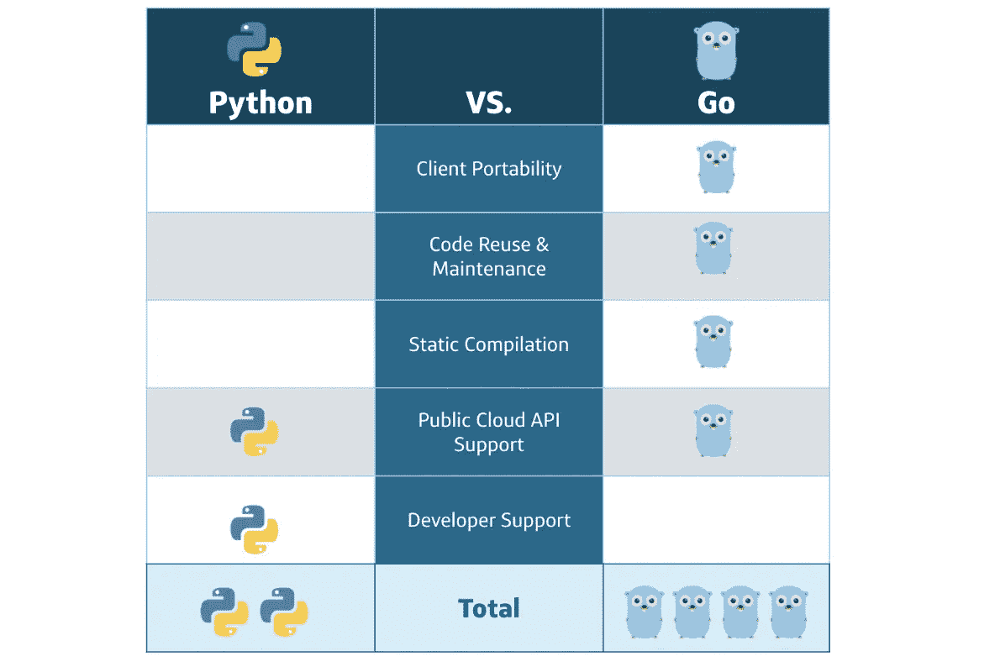

# 用蛇换地鼠:一个移民案例研究

> 原文：<https://medium.com/capital-one-tech/trading-snakes-for-gophers-a-migration-case-study-747aa19275f3?source=collection_archive---------2----------------------->

## One Capital One 团队将平台从 Python 转换为 Go 的旅程

vi 与 emacs。单回购与多回购。Python 对围棋？如果你是来寻找技术圣战的，那你来错地方了。本文不打算讨论一种语言比另一种更好，而是我们团队重塑平台的历程，以及中途改变语言的决定如何改变了产品的结果。

我是 Capital One 一个平台的产品负责人，该平台用于在公共云上提供和管理资源。在过去的一年半时间里，我一直在与一个才华横溢的软件工程师团队合作，从 Python 到 Go 重写我们的平台(客户机+服务器)。在开始开发之前，我开始了解其他人对产品的看法，包括好的和坏的。结果非常明显，用户需要一个可靠、透明且支持一系列客户端架构的自助服务平台。

Capital One 鼓励开发者社区内部的自治，允许他们根据什么对他们的产品和平台最有利来做出这些决定。从一开始，我们用例的规划和设计就围绕着 Python 和 Go 之间的选择。Python 和 Go 都在 Capital One 的整个企业中广泛使用——你可以在这里阅读[，在这里](https://www.capitalone.com/tech/open-source/lessons-from-adopting-python-as-a-team/)阅读[，在这里](https://www.capitalone.com/tech/open-source/building-python-user-community-among-capital-ones-data-analysts/)阅读[，在这里](https://www.capitalone.com/tech/cloud/a-serverless-and-go-journey/)[阅读](https://www.capitalone.com/tech/software-engineering/closures-are-the-generics-for-go/)。当我们打算认真检查平台时，我们希望确保如果我们要做，我们会做得正确。在选择语言时，我们考虑了 Python 和 Go 之间的几个因素:

*   客户端可移植性
*   代码重用/维护
*   静态编译
*   公共云 API 支持
*   开发者支持

让我们深入思考这些因素，以及它们如何影响我们的项目。

# Python 与 Go——客户端可移植性

在与我们的平台交互时，Capital One 的开发人员在一系列操作系统(Windows、Linux 和 MacOS)上工作。能够轻松可靠地支持所有这些是绝对必要的。为了确保 Python 满足运行时依赖性(并避免[源代码分发](https://packaging.python.org/guides/distributing-packages-using-setuptools/#source-distributions)构建、遗漏 [linux 包](https://packaging.python.org/guides/installing-using-linux-tools/#installing-pip-setuptools-wheel-with-linux-package-managers)或必需的[二进制扩展](https://packaging.python.org/guides/packaging-binary-extensions/))，我们确实需要将客户端工件放在 Docker 映像中。Docker 解决了这个问题，只是现在您在用户和平台之间增加了另一层——如果用户需要传递文件输入、凭证等，这可能会在未来产生一些意想不到的挑战。是的，在 Python 中还有其他实现可移植性的方法——请看我下面的下一个观点。但是 Go 使为特定操作系统或架构构建二进制文件变得轻而易举——只需设置您的环境变量并开始！

**优势:Go**

# Python 与 Go——代码重用/维护

我在公共云工作的经历中了解到的一件事是*有时候少即是多*。我的意思是，从长远来看，更简单的解决方案(需要维护的部分更少)通常更可取，因为维护一个包含许多部分的系统需要认知负荷和努力。您可以将此应用于代码库、基础设施，以及软件开发团队可能负责维护的任何其他类型的软件工件或配置。Python 通过一系列用于依赖管理、打包和安装的[工具](https://packaging.python.org/guides/tool-recommendations/)使这变得更具挑战性，而 Go 在其发行版中包含了很好集成的工具来本地完成这一任务，提供了一种简单的机制来导入代码并与 [git](https://git-scm.com/) 共享代码。

**优势:Go**

# Python 与 Go——静态编译

更好的表述方式可能是— *您想在什么时候发现您的应用程序中有 bug？*如果你开发软件超过 10 分钟，你就已经意识到没有什么*无 bug*软件。这个话题并不新鲜，对于什么是正确的答案，技术社区可能并不缺乏意见。你可以在[栈溢出](https://stackoverflow.com/questions/3265357/compiled-vs-interpreted-languages)、[中](/young-coder/the-difference-between-compiled-and-interpreted-languages-d54f66aa71f0)和 [Coursera](https://www.coursera.org/lecture/python-operating-system/interpreted-vs-compiled-languages-PxGjb) 上找到关于编译语言和解释语言的精彩讨论。静态编译允许我们在编译时识别错误，并生成可移植的快速二进制可执行文件。解释语言并不总是能够利用这一特性，并且通常执行时间较慢，因为有一个中间人将语言解释成机器可读的指令。

**优势:Go**

# Python 与 Go —公共云 API 支持

我们的平台非常依赖公共云 API 的可用性。为了在这一重构中取得成功，我们需要选择一种既有成熟的 API 又有健壮的特性集的语言来与公共云服务交互。这个决定有点困难，Python 和 Go 都为所有主要的公共云提供商提供了维护良好的 SDK 和 API。

Python:

*   [AWS SDK](https://boto3.amazonaws.com/v1/documentation/api/latest/reference/services/index.html)
*   [GCP SDK](https://cloud.google.com/python/docs/reference)
*   [Azure SDK](https://docs.microsoft.com/en-us/python/api/?view=azure-python)

去吧:

*   AWS SDK
*   [GCP SDK](https://cloud.google.com/go/docs/reference)
*   [Azure SDK](https://pkg.go.dev/github.com/Azure/azure-sdk-for-go)

**优点:平局！**

# Python 与 Go——开发者支持

有点笼统——我们希望确保我们选择的语言有良好的社区支持。这包括语言的新特性，错误的修复，以及新的软件工程师被培训进入劳动力市场。开发者支持更多的是一种前瞻性的度量，是对一种语言可用的支持的一般度量。在过去几年里，你可以在几乎所有热门编程语言的列表中找到 Python 的身影(这里是，这里是，这里是)。它是通用的，容易学习，可以在所有主要平台和操作系统上运行。

**优势:Python**

Comparison of our considerations between Python and Go

# 我们项目的获胜者是…

Gopher Mascot Generated with [Gopherize.me](https://urldefense.com/v3/__http:/Gopherize.me__;!!EFVe01R3CjU!IjyWo8esadqQE5IsseqfbP2yWKgMKU8lCZoOhpj0nl-yzB3uhLAv9mB6h-_tcY8113-k$)

# 我们走吧！

上面的因素确实没有做到这种比较公正，但最终，我们以 go 结束了 *go* -ing。静态编译、交叉编译和代码重用的便利性是我们决策中非常重要的因素。一旦选择了语言，团队就立即投入工作，开始关注命令行界面(CLI)的重构，以快速增加对 MacOS 和 Windows 客户端的支持。这个决定提供了一些喘息的空间，允许我们扩展对新客户的支持，并允许一些时间来思考我们的设计和重构后端的方法。

此时，后端是通过基于服务的工作流粘合在一起的一系列 Python 函数，该工作流基于原始请求向客户端返回通过/失败响应。我们希望将这种基于序列的分层工作流(通过物理服务和资源实现)转变为更扁平、更离散的高级功能集，类似于现代的微服务和 API。当我们开始重构时，我们开始注意到消除基础设施层的机会，并开始更多地依赖 Go 的内在特性。一个接一个，我们从 Python 到 Go 重构了那些后端功能，没有影响我们的客户。

在这个重构过程中，Capital One 的团队开始寻找潜在的机会来扩展我们的 CLI，以支持其他接口，特别是在基础设施和系统自动化领域流行的接口。这确实是灯泡开始熄灭的地方。我们不仅看到后端的物理基础架构和服务在快速减少，而且我们开始看到客户端对扩展对新环境和生态系统的支持越来越感兴趣。这正是我们需要的反馈，以重申我们最初的决定，移动平台去。

我们沿着这条路走了几个月，在 9 个月的时间里完全完成了后端的重构。此时，团队已经从其管理职责中消除了大量的基础设施，整合并改进了代码重用，并增加了开发人员对整个公司平台的兴趣和贡献。

# 他们建造它，你拥有它

Capital One 采用了*你建造它，你拥有它* (YBYO)的模式，给予开发者创新的自由，并鼓励他们做出对……技术最有利的技术决策。 [GitHub](https://github.blog/2020-03-11-why-organizations-should-commit-to-innersource-in-2020/) 、 [O'Reilly](https://www.oreilly.com/library/view/adopting-innersource/9781492041863/ch01.html) 和 [Salesforce](https://engineering.salesforce.com/inner-sourcing-whats-this-ef2220ae59ec) 都展示了内包的好处，以及它如何能够积极地影响公司——但是，如果你发现自己*正好处于内包狂潮之中*呢？决定谁拥有哪个组件比刚刚收到的三个拉请求更容易让人迷惑。

为了帮助管理对平台的传入贡献，我们基于以下因素对其进行了衡量:

*   客户需求
*   整体公司价值
*   无论它是否增加了平台的采用

如果贡献满足上面的任何标准，我们将批准它们，只要代码变更满足基本的样式、林挺和持续集成检查。满足一个以上标准(以及所有前面提到的检查)的贡献被合并并放入即将到来的发布的发布周期中。我们选择的内包模式虽然微妙而平衡，却为我们提供了改善平台并同时为公司提供价值的最佳机会。有很多贡献没有达到这些期望——在这种情况下，我们与请求团队一起修改它们或礼貌地拒绝。

# 我们今天的平台

随着重构的完成，团队正专注于扩展平台内的功能，[构建更多的 API](https://developer.capitalone.com/)，并更容易将平台集成到 [Capital One 的 CICD 管道中](https://www.capitalone.com/tech/software-engineering/realigning-devops-practices-to-support-microservices/)。尽管工作量很大，但我们*会继续用衡量所有贡献的方式来衡量我们的成功——一次一个拉动请求。*

请关注我们团队的未来文章，详细介绍我们在 Go、API、微服务和所有 DevOps 方面的工作。

*披露声明:2021 资本一。观点是作者个人的观点。除非本帖中另有说明，否则 Capital One 不隶属于所提及的任何公司，也不被这些公司认可。使用或展示的所有商标和其他知识产权是其各自所有者的财产。*

*最初发表于*[*https://www.capitalone.com*](https://www.capitalone.com/tech/software-engineering/trading-snakes-for-gophers/)*。*