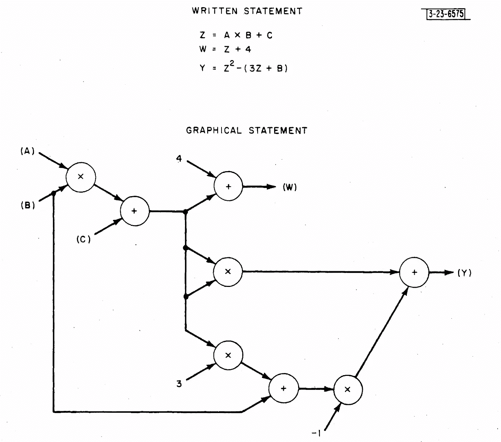
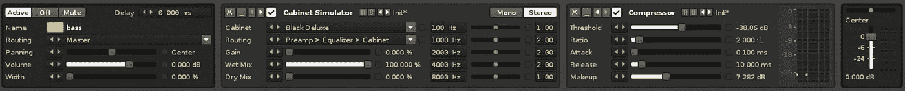

# 转换器:JavaScript 中高效的数据处理管道

> 原文：<https://medium.com/javascript-scene/transducers-efficient-data-processing-pipelines-in-javascript-7985330fe73d?source=collection_archive---------2----------------------->


Smoke Art Cubes to Smoke — MattysFlicks — (CC BY 2.0)

> **注:**这是《作曲软件》系列的一部分**s**[(现在一本书！)](https://leanpub.com/composingsoftware) 从基础开始学习 JavaScript ES6+中的函数式编程和组合软件技术。敬请关注。还会有更多这样的事情发生！
> [<上一个](/javascript-scene/curry-and-function-composition-2c208d774983) | [< <从第 1 部分](/javascript-scene/composing-software-an-introduction-27b72500d6ea)重新开始

在使用传感器之前，你应该首先对 [**功能组成**](/javascript-scene/composing-software-an-introduction-27b72500d6ea) 和 [**减速器**](/javascript-scene/reduce-composing-software-fe22f0c39a1d) **有很好的理解。**

> Transduce:源自 17 世纪的科学拉丁语，“transductionem”的意思是“改变、转化”。它进一步衍生自“transducere/traducere”，意思是“沿着或穿过，转移”。

传感器是一种可组合的高阶减速器。它接受一个缩减器作为输入，并返回另一个缩减器。

传感器包括:

*   可使用简单的函数组合进行组合
*   对于具有多个操作的大型集合非常有效:只对集合进行一次枚举，而不考虑管道中的操作数量
*   能够转换任何可枚举的源(例如，数组、树、流、图形等)
*   可用于懒惰或急切评估，无需更改传感器管道

减速器*将*多个输入折叠成单个输出，其中“折叠”可以替换为产生单个输出的几乎任何二元运算，例如:

```
// Sums: (1, 2) = 3
const add = (a, c) => a + c;// Products: (2, 4) = 8
const multiply = (a, c) => a * c;// String concatenation: ('abc', '123') = 'abc123'
const concatString = (a, c) => a + c;// Array concatenation: ([1,2], [3,4]) = [1, 2, 3, 4]
const concatArray = (a, c) => [...a, ...c];
```

传感器也做同样的事情，但是和普通的减速器不同，传感器可以用普通的函数组合来组装。换句话说，您可以将任意数量的传感器组合成一个新的传感器，将每个组件传感器串联在一起。

正常的 reducer 不能组合，因为它们期望两个参数，并且只返回一个输出值，所以你不能简单地将输出连接到系列中下一个 reducer 的输入。类型不一致:

```
f: (a, c) => a
g:          (a, c) => a
h: ???
```

传感器具有不同的特征:

```
f: reducer => reducer
g:            reducer => reducer
h: reducer    =>         reducer
```

# 为什么是传感器？

通常，当我们处理数据时，将处理分成多个独立的、可组合的阶段是很有用的。例如，从较大的数据集中选择一些数据，然后处理这些数据是很常见的。您可能会尝试这样做:

```
const friends = [
  { id: 1, name: 'Sting', nearMe: true },
  { id: 2, name: 'Radiohead', nearMe: true },
  { id: 3, name: 'NIN', nearMe: false },
  { id: 4, name: 'Echo', nearMe: true },
  { id: 5, name: 'Zeppelin', nearMe: false }
];const isNearMe = ({ nearMe }) => nearMe;const getName = ({ name }) => name;const results = friends
  .filter(isNearMe)
  .map(getName);console.log(results);
// => ["Sting", "Radiohead", "Echo"]
```

这对于像这样的小列表来说很好，但是有一些潜在的问题:

1.  这只适用于数组。来自网络订阅或朋友的朋友的社交图的潜在无限数据流怎么办？
2.  每次在数组上使用点链接语法时，JavaScript 都会在移动到链中的下一个操作之前构建一个全新的中间数组。如果你有一个 200 万个“朋友”的列表，那会让事情慢一两个数量级。使用转换器，您可以通过完整的管道传输每个朋友，而无需在他们之间建立中间集合，从而节省大量时间和内存。
3.  使用点链接，您必须构建标准操作的不同实现，比如`.filter()`、`.map()`、`.reduce()`、`.concat()`等等。数组方法内置在 JavaScript 中，但是如果您想要构建一个自定义数据类型并支持一系列标准操作，而不需要从头开始编写它们，该怎么办呢？转换器可以处理任何传输数据类型:编写一次操作符，在任何支持转换器的地方使用它。

让我们看看传感器是什么样子的。这段代码还不能工作，但是继续学习，您将能够自己构建这个传感器管道的每一部分:

```
const friends = [
  { id: 1, name: 'Sting', nearMe: true },
  { id: 2, name: 'Radiohead', nearMe: true },
  { id: 3, name: 'NIN', nearMe: false },
  { id: 4, name: 'Echo', nearMe: true },
  { id: 5, name: 'Zeppelin', nearMe: false }
];const isNearMe = ({ nearMe }) => nearMe;const getName = ({ name }) => name;const getFriendsNearMe = compose(
  filter(isNearMe),
  map(getName)
);const results2 = toArray(getFriendsNearMe, friends);
```

传感器不会做任何事情，直到你告诉他们开始并给他们一些数据来处理，这就是为什么我们需要`toArray()`。它提供可转换的进程，并告诉转换器将结果转换到一个新的数组中。你可以告诉它转换到一个流，或一个可观察的，或任何你喜欢的东西，而不是调用`toArray()`。

一个传感器可以将数字映射到字符串，或者将对象映射到数组，或者将数组映射到更小的数组，或者根本不改变任何东西，映射`{ x, y, z } -> { x, y, z }`。传感器也可以从信号流`{ x, y, z } -> { x, y }`中滤除部分信号，或者甚至生成新值插入输出信号流`{ x, y, z } -> { x, xx, y, yy, z, zz }`。

在本节中，我将交替使用“信号”和“流”这两个词。请记住，当我说“流”时，我指的不是任何特定的数据类型:简单的零个或多个值的序列，或者一个随时间变化的值列表。

# 背景和词源

在硬件信号处理系统中，换能器是将一种形式的能量转换成另一种形式的装置，例如，将声波转换成电信号，如在麦克风换能器中。换句话说，它将一种信号转换成另一种信号。同样，代码转换器将一种信号转换为另一种信号。

“转换器”一词的使用和软件中数据转换的可组合管道的一般概念至少可以追溯到 20 世纪 60 年代，但是我们关于它们应该如何工作的想法已经从一种语言和上下文改变到下一种语言和上下文。计算机科学早期的许多软件工程师也是电气工程师。在那些日子里，计算机科学的一般研究经常涉及硬件和软件设计。因此，将计算过程视为“转换器”并不特别新奇。在早期的计算机科学文献中可能会遇到这个术语——特别是在数字信号处理(DSP)和**数据流编程的上下文中。**

20 世纪 60 年代，麻省理工学院林肯实验室使用 TX-2 计算机系统进行图形计算的开创性工作，TX-2 计算机系统是美国空军 SAGE 防御系统的前身。伊凡·苏泽兰著名的[画板](https://dspace.mit.edu/handle/1721.1/14979)，开发于 1961-1962 年，是使用光笔进行对象原型委托和图形化编程的早期例子。

Ivan 的哥哥 William Robert“Bert”Sutherland 是数据流编程的几位先驱之一。他在 Sketchpad 上构建了一个数据流编程环境，将软件“过程”描述为操作节点的有向图，其输出链接到其他节点的输入。他在 1966 年的论文[“计算机程序的在线图形化说明”](https://dspace.mit.edu/handle/1721.1/13474)中写下了他的经历。与数组和数组处理不同，一切都被表示为一个连续运行的交互式程序循环中的值流。每个值在到达参数输入时由每个节点处理。今天，你可以在[虚幻引擎的蓝图可视化脚本环境](https://docs.unrealengine.com/en-us/Engine/Blueprints)或[原生乐器的 breaktor](https://www.native-instruments.com/en/products/komplete/synths/reaktor-6/)中找到类似的系统，这是一个音乐家用来构建定制音频合成器的可视化编程环境。



Composed graph of operators from Bert Sutherland’s paper

据我所知，第一本在基于通用软件的流处理的上下文中普及术语“转换器”的书是 1985 年麻省理工学院计算机科学课程的教科书，名为[“计算机程序的结构和解释”](https://www.amazon.com/Structure-Interpretation-Computer-Programs-Engineering/dp/0262510871/ref=as_li_ss_tl?ie=UTF8&qid=1507159222&sr=8-1&keywords=sicp&linkCode=ll1&tag=eejs-20&linkId=44b40411506b45f32abf1b70b44574d2) (SICP)，作者是哈罗德·艾贝尔森和杰拉德·让伊·萨斯曼，作者是朱莉·苏斯曼。然而，术语“传感器”在数字信号处理中的使用要早于 SICP。

> **注意:**《SICP》仍然是从函数式编程的角度对计算机科学的极好介绍。这仍然是我最喜欢的关于这个话题的书。

最近，换能器已经被独立地重新发现，并且由 **Rich Hickey** (大约 2014 年)为 Clojure 开发了一个*不同的协议*，他以基于词源仔细选择概念的单词而闻名。在这种情况下，我会说他抓住了它，因为 Clojure 传感器几乎完全符合 SICP 传感器的要求，并且它们有许多共同的特征。然而，它们从严格意义上讲并不是一回事。

传感器作为一个一般概念(并非特指 Hickey 的协议规范)已经对计算机科学的重要分支产生了相当大的影响，包括数据流编程、科学和媒体应用的信号处理、网络、人工智能等。随着我们开发更好的工具和技术来表达应用代码中的转换器，它们开始帮助我们更好地理解每种软件组成，包括 web 和移动应用程序中的用户界面行为，并且在未来，还可以很好地帮助我们管理增强现实、自主设备和车辆等的复杂性。

出于讨论的目的，当我说“传感器”时，我不是指 SICP 传感器，尽管如果你已经熟悉 SICP 的传感器，听起来好像我在描述它们。我也不是特指 Clojure 的转换器，或者已经成为 JavaScript 中事实上的标准的转换器协议(由 Ramda、Transducers-JS、RxJS 等支持)。我指的是*高阶减速器的一般概念—* 变换的变换。

在我看来，转换器协议的具体细节远不如转换器的一般原理和基本数学属性重要，但是，如果您想在生产中使用转换器，出于互操作性的原因，我目前的建议是使用实现转换器协议的现有库。

我将在这里描述的传感器应该被认为是伪代码来表达概念。它们*与传感器协议*不兼容，*不应用于生产。*如果你想了解如何使用特定库的传感器，请参考库文档。我这样写它们是为了揭开盖子，让您看到它们是如何工作的，同时又不强迫您学习协议。

完成后，您应该对转换器有了更好的总体理解，以及如何在任何上下文中、任何库、任何支持闭包和高阶函数的语言中应用它们。

# 换能器的音乐类比

如果您是众多软件开发人员中的一员，同时也是音乐家，音乐类比可能会很有用:您可以将传感器想象成信号处理装置(例如，吉他失真踏板、均衡器、音量旋钮、回声、混响和混音器)。

为了使用乐器录制歌曲，我们需要某种物理转换器(例如麦克风)来将空气中的声波转换为电线上的电流。然后，我们需要将那根电线连接到我们想要使用的任何信号处理单元。例如，给电吉他添加失真，或者给音轨添加混响。最终，不同声音的集合必须聚集在一起并混合，以形成代表最终录音的单个信号(或声道集合)。

换句话说，信号流可能是这样的。假设箭头是传感器之间的电线:

```
[ Source ] -> [ Mic ] -> [ Filter ] -> [ Mixer ] -> [ Recording ]
```

用更一般的术语来说，你可以这样表达:

```
[ Enumerator ]->[ Transducer ]->[ Transducer ]->[ Accumulator ]
```

如果你曾经使用过音乐制作软件，这可能会让你想起一连串的音效。当您考虑传感器时，这是一个很好的直觉，但它们可以更广泛地应用于数字、对象、动画帧、3d 模型或任何其他可以在软件中表示的东西。



Screenshot: Renoise audio effects channel

如果您曾经在数组上使用过 map 方法，您可能会体验到一些行为有点像传感器的东西。例如，要将一系列数字加倍:

```
const double = x => x * 2;
const arr = [1, 2, 3];const result = arr.map(double);
```

在本例中，数组是一个可枚举的对象。map 方法枚举原始数组，并将其元素传递给处理阶段`double`，该阶段将每个元素乘以 2，然后将结果累积到一个新数组中。

您甚至可以像这样创作效果:

```
const double = x => x * 2;
const isEven = x => x % 2 === 0;const arr = [1, 2, 3, 4, 5, 6];const result = arr
  .filter(isEven)
  .map(double)
;console.log(result);
// [4, 8, 12]
```

但是，如果您想要过滤并加倍潜在的无限数字流，例如无人机的遥测数据，该怎么办呢？

数组不能是无限的，数组处理中的每个阶段都要求您处理整个数组，然后单个值才能通过管道中的下一个阶段。同样的限制意味着使用数组方法的合成将会降低性能，因为需要创建一个新的数组，并且需要为合成中的每个阶段迭代一个新的集合。

假设您有两段管道，每一段都表示要应用于数据流的转换，还有一个表示数据流的字符串。第一个转换表示`isEven`滤镜，下一个表示`double`贴图。为了从一个数组中产生一个完全转换的值，你必须首先通过第一个管道运行整个字符串，从而产生一个全新的、经过过滤的数组*，在*之前，你甚至可以通过`double`管道处理单个值。当你最终到达`double`你的第一个值时，你必须等待整个数组被加倍，然后才能读取一个结果。

所以，上面的代码相当于:

```
const double = x => x * 2;
const isEven = x => x % 2 === 0;const arr = [1, 2, 3, 4, 5, 6];const tempResult = arr.filter(isEven);
const result = tempResult.map(double);console.log(result);
// [4, 8, 12]
```

另一种方法是将一个值直接从过滤后的输出传递到映射转换，而不需要在中间创建和迭代一个新的临时数组。一次流过一个值消除了在转换过程的每个阶段迭代相同集合的需要，并且转换器可以在任何时候发出停止信号，这意味着您不需要枚举集合中比产生所需值更深的每个阶段。

有两种方法可以做到:

*   拉:懒评，还是
*   推送:热切评价

pull API 会一直等待，直到消费者要求下一个值。JavaScript 中一个很好的例子是`Iterable`，比如由生成器函数生成的对象。在您通过调用迭代器对象返回的`.next()`来请求下一个值之前，生成器函数中不会发生任何事情。

push API 枚举源值，并尽可能快地将它们推过管道。对`array.reduce()`的调用是推送 API 的一个很好的例子。`array.reduce()`一次从数组中取出一个值，并将其推过缩减器，在另一端产生一个新值。对于像 array reduce 这样的急切进程，会立即对数组中的每个元素重复该过程，直到整个数组都被处理完，同时会阻止进一步的程序执行。

传感器不关心你是拉还是推。传感器不知道它们所作用的数据结构。它们只是调用您传递给它们的缩减器来累积新值。

转换器是更高阶的减速器:减速器函数接受一个减速器并返回一个新的减速器。Rich Hickey 将传感器描述为过程转换，这意味着与简单地改变流经传感器的值相反，传感器改变作用于这些值的过程。

签名看起来像这样:

```
reducer = (accumulator, current) => accumulatortransducer = reducer => reducer
```

或者，说清楚一点:

```
transducer = ((accumulator, current) => accumulator) => ((accumulator, current) => accumulator)
```

不过一般来说，大多数转换器都需要部分地应用于一些论点，以使它们专门化。例如，map 传感器可能如下所示:

```
map = transform => reducer => reducer
```

或者更具体地说:

```
map = (a => b) => step => reducer
```

换句话说，map 转换器接受一个映射函数(称为转换)和一个缩减器(称为`step`函数)，并返回一个新的缩减器。`step`函数是一个缩减器，当我们在下一步中生成一个新值添加到累加器中时调用。

让我们看一些天真的例子:

```
const compose = (...fns) => x => fns.reduceRight((y, f) => f(y), x);const map = f => step =>
  (a, c) => step(a, f(c));const filter = predicate => step =>
  (a, c) => predicate(c) ? step(a, c) : a;const isEven = n => n % 2 === 0;
const double = n => n * 2;const doubleEvens = compose(
  filter(isEven),
  map(double)
);const arrayConcat = (a, c) => a.concat([c]);const xform = doubleEvens(arrayConcat);const result = [1,2,3,4,5,6].reduce(xform, []); // [4, 8, 12]console.log(result);
```

那要吸收很多。我们来分解一下。`map`将函数应用于某些上下文中的值。在这种情况下，上下文是传感器管道。大致是这样的:

```
const map = f => step =>
  (a, c) => step(a, f(c));
```

你可以这样使用它:

```
const double = x => x * 2;const doubleMap = map(double);const step = (a, c) => console.log(c);doubleMap(step)(0, 4);  // 8
doubleMap(step)(0, 21); // 42
```

函数调用末尾的零表示归约器的初始值。注意，step 函数应该是一个 reducer，但是出于演示的目的，我们可以劫持它并记录到控制台。如果需要断言如何使用 step 函数，可以在单元测试中使用相同的技巧。

当我们把传感器组合在一起时，它们变得有趣了。让我们实现一个简化的滤波器传感器:

```
const filter = predicate => step =>
  (a, c) => predicate(c) ? step(a, c) : a;
```

Filter 采用谓词函数，只传递与谓词匹配的值。否则，返回的归约器返回累加器，不变。

因为这两个函数都接受一个缩减器并返回一个缩减器，所以我们可以用简单的函数组合来组合它们:

```
const compose = (...fns) => x => fns.reduceRight((y, f) => f(y), x);const isEven = n => n % 2 === 0;
const double = n => n * 2;const doubleEvens = compose(
  filter(isEven),
  map(double)
);
```

这也将返回一个转换器，这意味着我们必须提供一个最终的步骤函数来告诉转换器如何累积结果:

```
const arrayConcat = (a, c) => a.concat([c]);const xform = doubleEvens(arrayConcat);
```

这个调用的结果是一个标准的缩减器，我们可以将它直接传递给任何兼容的 reduce API。第二个参数表示缩减的初始值。在本例中，一个空数组:

```
const result = [1,2,3,4,5,6].reduce(xform, []); // [4, 8, 12]
```

如果这看起来工作量很大，请记住已经有函数编程库提供了通用的转换器和实用程序，如处理函数组合的`compose`和将值转换为给定空值的`into`，例如:

```
const xform = compose(
  map(inc),
  filter(isEven)
);into([], xform, [1, 2, 3, 4]); // [2, 4]
```

工具带中已经有了大部分所需的工具，用传感器编程是非常直观的。

一些支持转换器的流行库包括 Ramda、RxJS 和 Mori。

# 传感器由上至下组成

标准功能组合(`f(g(x))`)下的传感器应用从上到下/从左到右，而不是从下到上/从右到左。换句话说，使用正常的函数构图，`compose(f, g)`表示“在 `g`之后构图`f`”。换能器在合成下环绕其他换能器。换句话说，一个转换器说“我要做我的事情，然后*调用管道中的下一个转换器”，这具有将执行堆栈翻过来的效果。*

想象你有一叠文件，上面标着`f`，下面标着`g`，再下面标着`h`。对于每张纸，将纸从纸堆顶部取下，放在新的相邻纸堆的顶部。当你完成后，你会有一堆标签为`h`，然后`g`，然后`f`的纸张。

# 传感器规则

上面的例子很幼稚，因为它们忽略了传感器必须遵循的互操作性规则。

与软件中的大多数东西一样，转换器和转换过程需要遵守一些规则:

1.  初始化:在没有初始累加器值的情况下，传感器必须调用阶跃函数来产生一个有效的初始值。该值应该表示空状态。例如，累加数组的累加器应该在不带参数调用其 step 函数时提供一个空数组。
2.  提前终止:使用传感器的进程必须检查并在收到减少的累加器值时停止。此外，使用嵌套 reduce 的传感器阶跃函数必须在遇到缩减值时检查并传送缩减值。
3.  完成(可选):一些转换过程永远不会完成，但那些完成的过程应该调用完成函数来产生最终值和/或刷新状态，有状态转换器应该提供完成操作来清除任何累积的资源，并可能产生一个最终值。

# 初始化

让我们回到`map`操作，确保它遵守初始化(空)法则。当然，我们不需要做任何特殊的事情，只需使用 step 函数创建一个默认值，将请求传递到管道中:

```
const map = f => step => (a = step(), c) => (
  step(a, f(c))
);
```

我们关心的部分是函数签名中的`a = step()`。如果`a`(累加器)没有值，我们将通过要求链中的下一个减速器产生值来创建一个值。最终，它将到达管道的末端，并(希望)为我们创建一个有效的初始值。

记住这条规则:当不带参数调用时，归约器应该总是返回一个有效的归约初始值(空值)。对于任何 reducer 函数，包括 React 或 Redux 的 reducer，遵守这个规则通常是一个好主意。

# 提前终止

有可能向管道中的其他传感器发出信号，表明我们已经完成了减少，并且它们不应该期望处理更多的值。在看到一个`reduced`值时，其他换能器可以决定停止添加到集合中，并且转换过程(由最终的`step()`函数控制)可以决定停止枚举值。作为接收到一个`reduced`值的结果，转换过程可以再进行一次调用:上面提到的完成调用。我们可以用一个特殊的减少的累加器值来表示这个意图。

什么是减少的价值？它可以简单到将累加器值包装在一个叫做`reduced`的特殊类型中。把它想象成在盒子里包装一个包裹，并在盒子上贴上“快递”或“易碎品”的标签。像这样的元数据包装器在计算中很常见。例如:http 消息被包装在称为“请求”或“响应”的容器中，这些容器类型具有提供诸如状态代码、预期消息长度、授权参数等信息的头...

基本上，这是一种发送多条消息的方式，只需要一个值。一个`reduced()`型升降机的最小(非标准)例子可能是这样的:

```
const reduced = v => ({
  get isReduced () {
    return true;
  },
  valueOf: () => v,
  toString: () => `Reduced(${ JSON.stringify(v) })`
});
```

唯一严格要求的零件是:

*   类型提升:获取类型内部值的一种方式(例如，本例中的`reduced`函数)
*   类型标识:一种测试值的方法，以查看它是否是`reduced`的值(例如，`isReduced` getter)
*   值提取:从类型中获取值的一种方法(例如`valueOf()`)

`toString()`此处包含严格是为了调试方便。它允许您在控制台中同时自省类型和值。

# 完成

> 在完成步骤中，处于缩减状态的传感器应在调用嵌套转换器的完成功能之前刷新状态，除非它之前已从嵌套步骤中看到缩减值，在这种情况下，应丢弃挂起状态~ Clojure 传感器文档

换句话说，如果在前一个函数发出完成缩减的信号后，您有更多的状态要刷新，那么完成步骤就是处理它的时候了。在此阶段，您可以选择:

*   再发送一个值(刷新挂起状态)
*   放弃您的挂起状态
*   执行任何所需的状态清理

# 转换

可以转换许多不同类型的数据，但这个过程可以概括为:

```
// import a standard curry, or use this magic spell:
const curry = (
  f, arr = []
) => (...args) => (
  a => a.length === f.length ?
    f(...a) :
    curry(f, a)
)([...arr, ...args]);const transduce = curry((step, initial, xform, foldable) =>
  foldable.reduce(xform(step), initial)
);
```

`transduce()`函数采用阶跃函数(传感器流水线中的最后一步)、累加器的初始值、传感器和可折叠。可折叠对象是提供了一个`.reduce()`方法的任何对象。

定义了`transduce()`,我们可以很容易地创建一个转换到数组的函数。首先，我们需要一个缩减器来缩减一个数组:

```
const concatArray = (a, c) => a.concat([c]);
```

现在我们可以使用 curried `transduce()`创建一个转换到数组的部分应用程序:

```
const toArray = transduce(concatArray, []);
```

有了`toArray()`,我们可以用一行代码替换两行代码，并在许多其他情况下重用它，除了:

```
// Manual transduce:
const xform = doubleEvens(arrayConcat);
const result = [1,2,3,4,5,6].reduce(xform, []);
// => [4, 8, 12]// Automatic transduce:
const result2 = toArray(doubleEvens, [1,2,3,4,5,6]);
console.log(result2); // [4, 8, 12]
```

# 传感器协议

到目前为止，我一直将一些细节隐藏在幕后，但现在是时候来看看它们了。传感器并不是真正的单一功能。它们由三种不同的功能组成。Clojure 使用函数 arity 上的模式匹配在它们之间切换。

在计算机科学中，函数的 arity 是函数接受的参数的数量。在传感器的情况下，减速器功能有两个参数，累加器和电流值。在 Clojure 中，两者都是可选的，并且行为根据参数是否被传递而改变。如果一个参数没有被传递，那么该参数在函数中的类型是`undefined`。

JavaScript 转换器协议处理事情的方式略有不同。JavaScript 转换器不是使用函数 arity，而是使用一个转换器并返回一个转换器的函数。传感器是具有三种方法的对象:

*   `init`为累加器返回一个有效的初始值(通常，只需调用下一个`step()`)。
*   `step`应用变换，例如`map(f)` : `step(accumulator, f(current))`。
*   `result`如果调用转换器时没有新值，它应该处理其完成步骤(通常是`step(a)`，除非转换器是有状态的)。

> **注意:**JavaScript 中的换能器协议分别使用`@@transducer/init`、`*@@transducer/step*`、、`*@@transducer/result*`、*。*

有些库提供了一个`transducer()`工具，它会自动为你包装你的传感器。

下面是 map 转换器的一个不太简单的实现:

```
const map = f => next => transducer({
  init: () => next.init(),
  result: a => next.result(a),
  step: (a, c) => next.step(a, f(c))
});
```

默认情况下，大多数传感器应该将`init()`调用传递给管道中的下一个传感器，因为我们不知道传输数据类型，所以我们不能为它产生一个有效的初始值。

此外，特殊的`reduced`对象使用这些属性(在传感器协议中也有命名空间`@@transducer/<name>`:

*   `reduced`一个布尔值，对于减少的值总是`true`。
*   `value`减小的值。

# 结论

**转换器**是可组合的高阶缩减器，可以缩减任何底层数据类型。

传感器产生的代码比数组的点链接效率高几个数量级，并且可以处理潜在的无限数据集，而无需创建中间聚合。

> **注意:**传感器并不总是比内置阵列方法快。当数据集非常大(几十万个项目)或者管道非常大(使用方法链会显著增加所需的迭代次数)时，性能优势就会显现。如果您追求性能优势，请记住进行分析。

再看一下引言中的例子。您应该能够使用示例代码作为参考来构建`filter()`、`map()`和`toArray()`，并使这些代码工作:

```
const friends = [
  { id: 1, name: 'Sting', nearMe: true },
  { id: 2, name: 'Radiohead', nearMe: true },
  { id: 3, name: 'NIN', nearMe: false },
  { id: 4, name: 'Echo', nearMe: true },
  { id: 5, name: 'Zeppelin', nearMe: false }
];const isNearMe = ({ nearMe }) => nearMe;const getName = ({ name }) => name;const getFriendsNearMe = compose(
  filter(isNearMe),
  map(getName)
);const results2 = toArray(getFriendsNearMe, friends);
```

在生产中，您可以使用来自 [RxJS](https://github.com/ReactiveX/rxjs) 或 [Ramda](http://ramdajs.com/) 的传感器。在实际代码中，当我需要订阅数据流，并且希望在应用程序代码中使用数据流之前处理流中的数据时，我通常会使用转换器。在这种情况下，我使用 RxJS 中的管道操作符。RxJS 可管道操作符的行为就像常规传感器一样，但是它们不是从缩减器映射到缩减器，而是从可观测映射到可观测。

这是拉姆达的一个例子:

```
import {
  compose,
  filter,
  map,
  into
} from 'ramda';const isEven = n => n % 2 === 0;
const double = n => n * 2;const doubleEvens = compose(
  filter(isEven),
  map(double)
);const arr = [1, 2, 3, 4, 5, 6];// into = (structure, transducer, data) => result
// into transduces the data using the supplied
// transducer into the structure passed as the
// first argument.
const result = into([], doubleEvens, arr);console.log(result); // [4, 8, 12]
```

每当我需要组合一些操作时，比如`map`、`filter`、`chunk`、`take`等等，我都会使用转换器来优化过程，并保持代码的可读性和整洁性。给他们一个机会。

# 在 EricElliottJS.com 了解更多信息

EricElliottJS.com 的会员可以上函数式编程的视频课。如果你不是会员，[今天就注册吧](https://ericelliottjs.com/)。

***埃里克·艾略特*** *是* [*【编程 JavaScript 应用】*](http://pjabook.com) *(O'Reilly)的作者，也是软件导师平台*[*devanywhere . io*](https://devanywhere.io/)*的联合创始人。他为 Adobe Systems******尊巴健身*******华尔街日报*******【ESPN*******BBC****等顶级录音师贡献了软件经验******

**他在远离任何地方的地方和世界上最美丽的女人一起工作。**