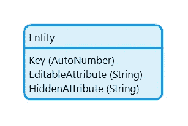
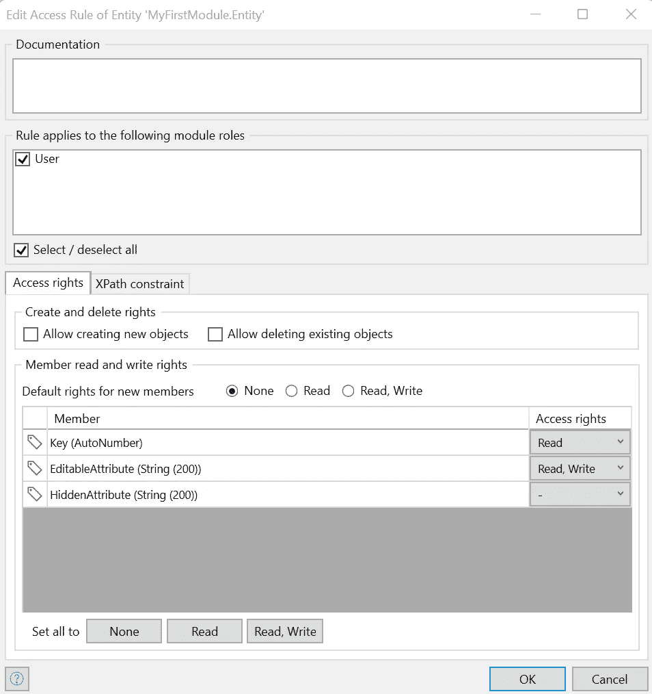
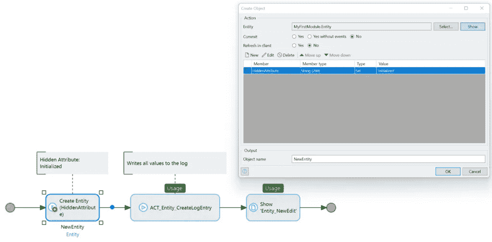
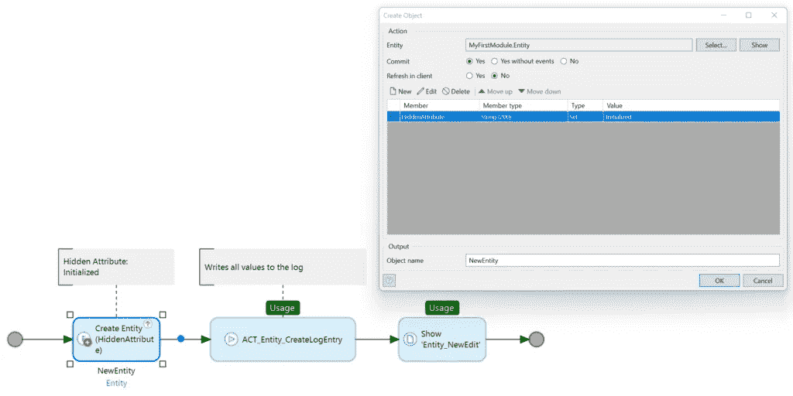
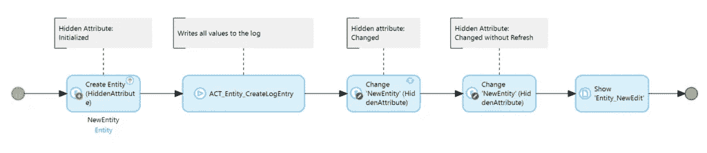

# 瞬态属性和访问权限——小心——Mendix 和我

> 原文：<https://medium.com/mendix/transient-attributes-and-access-rights-be-careful-mendix-and-me-57cf0aa1c98e?source=collection_archive---------2----------------------->

Transient attributes and access rights -be careful — Mendix and Me

# 我最近无意中发现了一些乍一看似乎很奇怪的东西，但是仔细一看就完全合乎逻辑了。如果没有注意到它，它会导致非常恼人的错误，其原因是非常难以找到的。诚然，这不是一个经常发生的问题。但是最好是以前读过。

# 发生了什么事？

原则上，这是一个标准流程。点击一个按钮会触发一个微流。这个微流创建一个对象并用值初始化属性。这个尚未保存的对象现在被转移到一个页面，用户可以在该页面上更改或设置某些属性。之后，用户再次按下按钮，这触发了一个微流，其中对象被存储在数据库中。

到目前为止，还算标准。但是，出现了意外错误。在调试器中仔细观察可以发现，一个特定的属性在第一个微流中被初始化，但是在第二个微流中，它又有了来自域模型的默认值。该属性在系统中没有被更改或覆盖的地方。用户也不可能看到或改变页面上的属性。那么回滚从何而来呢？

# 安全性和无状态服务器

要理解发生了什么，您需要熟悉无状态服务器的概念(这是在 Mendix 7 中引入的)。简而言之，这意味着服务器不会在用户执行的微流级联结束时保存对象的状态。所用对象的当前状态驻留在客户机(用户的浏览器)中，并随着每次新的用户交互被传送到服务器。然后，服务器处理客户端传输的状态。这具有优势，尤其是在水平可伸缩性方面，我不想在此详述。

通过在客户端 t 中保存当前的**状态，访问权限发挥了重要作用。**只有允许用户查看的内容才能存储在客户端**。如果用户**没有属性**的读取权限，则该属性不会被传输到客户端。然而，由于无状态服务器不保存状态，出于安全原因，它也不被传送到客户端，**它丢失了**。**

在上面的例子中，这正是所发生的事情。用户没有该属性的读取权限。但是，为了进一步处理，必须初始化该属性。由于客户端-服务器的交互，这种方法不起作用。

# 一个例子

让我们看看这个非常简单的领域模型

访问权限定义如下

如您所见，用户无权访问 HiddenAttribute。

现在我们在微流中创建一个对象，并用值初始化它。HiddenAttribute 是用字符串“Initialized”创建的。在没有提交的情况下，我们现在将创建的对象传递给页面。

如您所见，这个微流将属性值写入日志。如果您现在在页面上执行一个微流，该微流再次将值写入日志，您可以看到不同之处。结果是，在创建微流中，初始化的值被写入日志。在从页面调用的微流中，属性再次未初始化。所以信息丢失了。

相比之下，我们现在考虑这个微流

这里，对象是在创建过程中提交的。现在系统的行为不同了。从页面执行的微流中也可以找到初始化的值。认为这是一个“解决方案”有点太短了。此时您可能不想提交对象。如果这样做，您可能需要一个适当的回滚策略(如果用户单击 Cancel)。这也提出了新的问题。例如，提交了一个对象，然后又对其进行了更改，该怎么办？让我们考虑这个微流

在这个微流中，对象被创建、初始化和提交。然后，使用页面刷新修改一次，不使用页面刷新修改一次。结果是预期的。提交后发生的所有更改都将丢失。

# 结论

这种问题不常发生。然而，意识到这种行为的存在是有益的。这个问题没有真正的“解决方案”。这完全取决于具体的用例是什么。在某些情况下，简单地给用户读权限可能是有意义的。如果这是不可能的，对象必须被提交或者值必须在之后被初始化。

我希望能帮到他们中的一个。祝你试用愉快。一如既往，我期待着反馈。

## 阅读更多

 [## Mendix 客户端- Studio Pro 9 指南| Mendix 文档

### 对运行时的 Mendix 客户端部分及其功能的描述

docs.mendix.com](https://docs.mendix.com/refguide/mendix-client#2-13-runtime-server)  [## 运行时服务器- Studio Pro 9 指南| Mendix 文档

### 运行时服务器是 Mendix 运行时的一部分，它执行微流并连接到文件、关系…

docs.mendix.com](https://docs.mendix.com/refguide/runtime-server)  [## 提交对象- Studio Pro 9 指南| Mendix 文档

### 这种活性可用于微流和纳流。提交活动作用于一个或多个对象。对于…

docs.mendix.com](https://docs.mendix.com/refguide/committing-objects) 

*原文于 2021 年 12 月 1 日在* [*用德语发表 https://mendixamme . de*](https://mendixandme.de/index.php/2021/12/01/transiente-attribute-und-zugriffsrechte-be-careful/)*。*

*来自发布者-*

如果你喜欢这篇文章，你可以在我们的 [*中页*](https://medium.com/mendix) *找到更多喜欢的。对于精彩的视频和直播会话，您可以前往*[*MxLive*](https://www.mendix.com/live/)*或我们的社区*[*Youtube PAG*](https://www.youtube.com/c/MendixCommunity/community)*e .*

*希望入门的创客，可以注册一个* [*免费账号*](https://signup.mendix.com/link/signup/?source=direct) *，通过我们的* [*学苑*](https://academy.mendix.com/link/home) *即时获取学习。*

有兴趣更多地参与我们的社区吗？你可以加入我们的 [*Slack 社区频道*](https://join.slack.com/t/mendixcommunity/shared_invite/zt-hwhwkcxu-~59ywyjqHlUHXmrw5heqpQ) *或者想更多参与的人，看看加入我们的*[*Meet ups*](https://developers.mendix.com/meetups/#meetupsNearYou)*。*