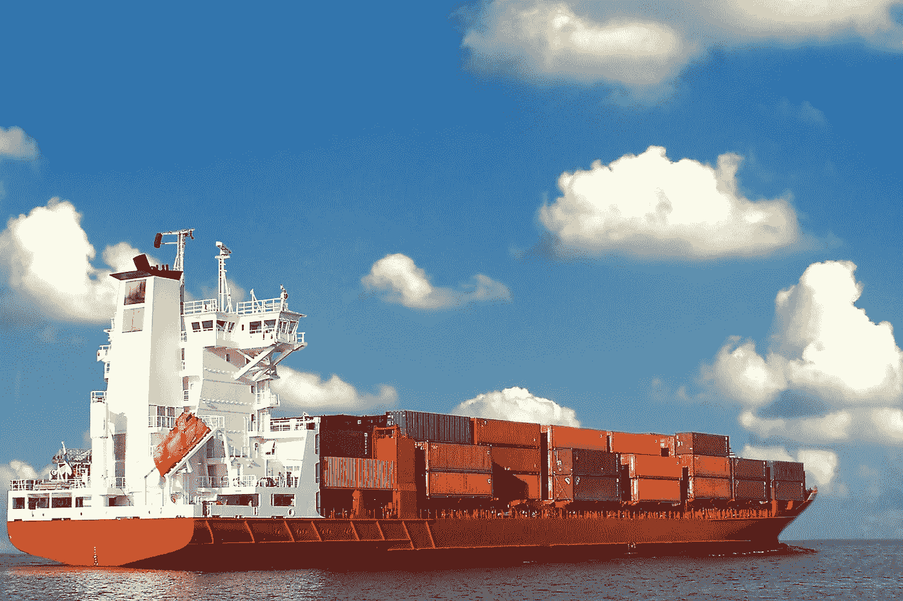
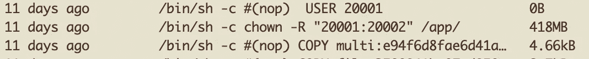
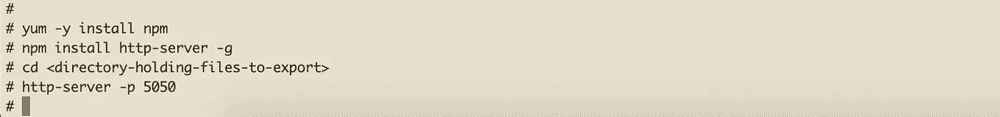
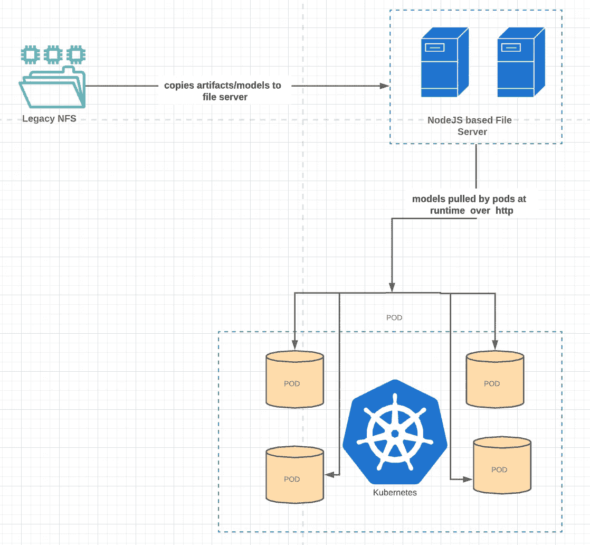

# 将具有存储需求的传统应用程序转移到容器中

> 原文：<https://medium.com/walmartglobaltech/transitioning-legacy-applications-with-storage-requirements-into-containers-6d2bd333e88f?source=collection_archive---------5----------------------->

将遗留应用程序转移到容器中

photo credit: [https://pixabay.com/images/id-449784/](https://pixabay.com/images/id-449784/)

B **背景**
给个背景，我们现在的基础设施和应用程序设置都是在传统平台上。我们通常在 tomcat 或 jetty 中部署 java 应用程序，并在虚拟机上运行。然后，我们也有这些配置文件或我们称之为模型文件，它们驻留在 NFS 服务器上

第一步是创建一个 docker 图像。我们已经创建了基本的 java 和 jetty 映像。现在，它只是添加部署我们的应用程序的指令，包括将代码工件和数据模型复制到 jetty“web apps”目录中的步骤。

这里的一个重要目标是利用自动扩展功能。主要关注点是保持容器启动时间最短，以减少容器转换到就绪状态所需的时间。
尽管不推荐，我们仍然决定在构建期间复制代码和数据模型，并让容器在启动时将它们加载到内存中。

# **结果**

创建了一个大小为 9.8GB 的 docker 映像。
开机时间为**8 分钟**。

图像的巨大尺寸是任何标准都无法接受的，这直接导致我们的应用程序无法被封装和部署到 k8s 中。

# 分析

我们后退一步，分析我们是否还能让这一切发生。
我们知道的一件事是，占据空间的是数据模型。

让我们首先分析一下数据文件有多大。
我们有大约 8 个，总计 7.8G，然后我们还有大约 180MB 的代码工件。
很明显，如果我们能对图像中的数据(代码和数据文件)做些什么，我们就能节省一些空间。
另一件需要注意的事情是，当我们复制传统设计时，我们也在构建阶段对压缩配置进行解压缩

# O 优化

180MB 的代码工件被移到了容器启动阶段，我们还将模型的解压缩步骤也移到了运行时。
现在的图像尺寸是， **8.63G** ！集装箱的正常运行时间现在是 9 分钟。差不多有 1.4 克的空间被释放出来。
但这还不够，我们已经被管理 nexus repo 中 docker 映像的存储团队拉了上来。

目标是将映像的大小至少缩减到 5G，这是存储团队设置的最大阈值。

# **下一个目标**

如前所述，数据模型大约为 **7.8G** ，所以我们必须对它们做些什么。
已经将代码工件转移到运行时，一个固定的想法是对数据模型进行排序，并尝试将较小的模型转移到运行时，而不会对启动时间产生负面影响。
在这个练习中，我们了解到有 2 个型号分别为 3.8G 和 2.2G，其余 6 个型号的最大容量约为 200MB。非常高兴的是，所有这 6 个较小的模型都转移到运行时。这很有帮助，图像现在是**7.43 克**。

# **接下来是什么**

我们的焦点一直是数据模型。让我们来看看拉模型时发生了什么。
1。压缩后的 tar 从我们当地的 NFS 配置商店中取出
2。在启动阶段解压缩它们

数据文件是 gzip 压缩的，在移动较小的数据文件后，我们现在只有其中的 2 个文件处于构建阶段。

**改变压缩格式**

虽然 XZ 是新的，但如果你使用它的最大能力，它在压缩方面是很棒的。
现在，我们对 gz 归档文件进行解压缩，然后使用 xz 重新压缩它，使用压缩选项来提供最大压缩，以时间换取压缩。

 [## xz(1) - Linux 手册页

### xz，unxz，xzcat，lzma，unlzma，lzcat -压缩或解压缩。xz 和。lzma 文件 unxz 相当于 xz…

linux.die.net](https://linux.die.net/man/1/xz) 

图像大小从 7.4 大幅减少到 5.8G！！。然而建造时间增加到了一个多小时。XZ 的压缩速度很慢，但是做得很好。
这对启动时也有影响，因为我们在部署时进行了 untar。启动时间现在是 11 分钟，考虑到当前部署到虚拟机中大约需要 9 分钟，这有点偏高。

**一看 Docker 图像**

检查我们的 docker 文件和映像时，我们注意到的一件事是，为了使映像安全，我们使用切换到非 root 用户，然后在 jetty 主目录上对该用户执行 chown 操作，因为基本映像是以 root 用户身份运行的。
这一步是添加一个额外的 418MB 的层覆盖。

我们进入基本映像，将基本映像的用户更改为非根用户。这有助于将图像尺寸缩小到 5.38 克。

持续的努力已经将图像尺寸从巨大的 9.8G 降低到 5.3G。尽管仍然比阈值高了 **340M** ，但在这个阶段，它看起来已经是我们能做到的最大值了。

# T何改变游戏规则

在我们追求进一步改进的过程中，我们试图找到将完整数据模型移出映像的瓶颈。这里的主要障碍是访问存储在我们私人数据中心的文件。这涉及到跨 DC 的传输，增加了延迟。因此，下一个问题是，如果我们可以在云端有类似的东西，情况会如何改善。

如前所述，这是一个遗留系统。因此，大多数最新的云功能并不总是存在。此外，该集群由另一个团队管理，我们无法在规定的时间内添加任何类型的卷支持来将我们的应用程序转移到生产环境。这里的想法是尝试从传统的角度解决这个问题，并能够将其过渡到基于云的方法。
回到考虑中的解决方案，我们想要一种文件服务器设置，模拟我们当前基于 NFS 的存储。由于管理原因，我们无法将 NFS 存储安装在云端机器上。

**NodeJS 来救援**

Node.js 允许按照下面的步骤启动 http 服务器，该服务器可以通过 http 托管静态文件。

installing node file server

就这样，你都准备好了。这些文件现在应该可以通过 http 在*http://<server _ hostname>:5050>/filename*获得

现在，我们将较大的模型移到这个存储中，并添加了一个在运行时下载它们的步骤。现在，所有的模型都驻留在文件服务器上，需要时可以调出。这是它现在的样子

# **冲击**

1.  图像大小现在是 **670MB** ，我们从 **9.8GB** 开始
2.  启动时间现在不到**5 分钟**，这比虚拟机中超过**8 分钟**的启动时间要好得多

我已经介绍了为遗留应用程序优化容器映像大小的思考过程。希望这能帮助那些正在将遗留应用程序迁移到云并寻找某种卷支持的人。

> 我们现在在 k8s 集群中提供了卷支持，并提出了访问请求。这样，模型将被移动到卷中，而不必在运行时下载。从而进一步缩短启动时间