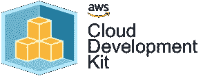

# 过渡到 AWS CDK

> 原文：<https://medium.com/version-1/transitioning-to-aws-cdk-305a5a27f59a?source=collection_archive---------1----------------------->

人们常说

> 重要的是旅程，而不是目的地

但在我看来，这种表达忽略了旅程从哪里开始的问题。当我们谈到类似的转换时，焦点通常是在端点上。开始在谷歌搜索中输入“过渡”，类似“…到白发”或“…婴儿到自己的房间”的匹配出现在建议的顶部附近——起点是假设的，不言而喻的，或者可能是不相关的。因此，当我们谈到过渡到 CDK，我们可能会认为我们的旅程从哪里开始？

我自己的 DevOps 之路已经从伯恩 Shell 脚本和 Solaris 上的 JumpStart 部署的阴暗森林中走出来，进入了 RedHat Enterprise Linux 及其开源 stablemates 的阳光高地。

RedHat 目前正在积极推广 Ansible，作为自动化和脚本编写的狂热爱好者，我开始尝试看看它能做些什么。我逐渐喜欢上了 Ansible 的简单、强大和灵活，并将其应用到我工作的托管提供商越来越多的基础设施组件中，由于大量特定于技术的扩展的可用性，这项任务变得更加容易，这些扩展可以在核心模块或社区贡献的内容中找到。

> 想要三个不同供应商的网络设备的端口利用率摘要吗？*安斯比尔和金贾会看着你的。*
> 
> 想要在 VMWare 上运行群集应用程序的概念验证，然后以完全相同的方式在物理硬件上部署应用程序及其先决条件*？可替代的角色会帮你做到。*

直到我把 Ansible 的注意力转向公有云(这里是 AWS)的方向，我才开始看到它的能力可能存在差距。它擅长制作和管理单个组件，但随着管理资产的规模和复杂性开始上升，它难以应对。清单是 Ansible 的一个关键方面——它告诉 Ansible 它正在管理什么，如何登录它以及它内部存在哪些子组。当你进入一个可以一键启动一千个虚拟实例的世界时，控制库存变得至关重要，但 Ansible 并没有顺利做到这一点。运行一个剧本来启动十个 EC2 实例，它会很乐意这样做。在实例计数设置为 15 的情况下重新运行相同的剧本，您将得到*另外* 15 个实例。这是因为没有状态管理，也没有被部署的组件的单个唯一标识符(ARNs、UUIDs 等等)的记录。

当我站在不可思议的公共云的边界上，齐踝深的沼泽地里时，我看到了近处欢迎我的陆地景观。这是我的下一个停留点，在我停留的 12 个月中，我真正体会到了在部署公共云基础架构(又是 AWS)时，配置工具相对于配置管理工具的优势。使用 Ansible，你可以指定一组你希望存在的状态，并以指定的顺序创建、销毁或改变*事物。*

正如我之前提到的，Terraform 做*供应*，在这方面与 CloudFormation 和 OpenStack 等工具并驾齐驱。您可以使用 Terraform 自己的声明性语言来指定希望基础设施达到的状态。然后，Terraform 会计算出要实现这种状态需要做出哪些改变。它查询并存储基础设施的状态，将其与代码库中定义的状态进行比较，形成任何所需更改的计划，然后应用它们。如果没有解决方案，或者出现了错误，它就固执己见，没有制定计划。没有计划，没有变化。

Terraform 与 Ansible 共享使用参数或变量来定义重要的循环值的功能。正是这种方法使我们能够保证同一个入站 TCP 端口在网络访问控制列表、安全组、主机防火墙和 web 服务器侦听器上持续打开。Terraform 非常注重可重用性和保持代码“干燥”的概念(“T4”Don t**R**EPE at**Y**yourself)，参数在这里也很重要。代码被写成模块，一般形成一个 repo 存储在独立“实时”回购协议中的不同参数集可以输入到相同的模块中，以产生独立但相似的基础设施——例如开发/质量保证/生产，或客户 A、B&C——全部来自一个代码库。可以从 Terraform Registry 的中央存储库调用模块，从而控制大多数当前的云提供商。存储在版本控制存储库中的定制模块允许基于 Git 标签或语义版本化将不同的版本部署到特定的环境中。Terraform 可以与 Terragrunt 配对，帮助管理配置或“实时”代码树，并帮助在一个地方组装和运行所有需要的模块。

如果您想进行较低级别的配置，比如设置 EC2 用户数据，那么有一种机制是可用的，但是它本质上仅限于为您的参数创建一个带有占位符的多行字符串变量，并将其注入到 EC2 部署配置中。这与 Ansible 形成了鲜明的对比，ansi ble 拥有一整套操作系统和应用程序配置选项。

现在，在地平线上闪闪发光，我看到了 CDK，一个充满新奇和希望的地方。CDK 使用多种语言，但它们都是世界各地开发人员熟悉的日常语言。如果你足够幸运，精通这些语言中的一种，那将是一个很大的帮助。我在任何程度上都没有它们，并一头扎进了 TypeScript，一种对 JavaScript 的强类型改造。使用编程语言作为基础的乐趣在于它非常强大，但反过来也意味着您会受到对该语言缺乏了解的限制。许多 ide 都提供了 TypeScript——仅举两个例子，Atom 和 VS 代码都有很好的纠错和自动完成功能。

CDK 的方法类似于 Terraform，但你可以用自己选择的语言描述你想要的基础设施，使用预定义的构建块，称为构造，所有的配置和控制都必须通过 AWS CloudFormation 来完成。包清单(package.json)定义了开发和部署需要哪些包，并且有自动从存储库中获取包的机制。CDK 位于 Node.js 之上，Node . js 使用 Node Package Manager (npm)进行所有的包管理，因此了解该技术和 JavaScript 通常是有用的。在幕后，你的代码被*转换*成 JavaScript，一个计划被构建出来，产生你想要的配置。有一些方便的子命令，可以让你看到你想要的状态与现实有什么不同，以及云结构变化集将会是什么样子。与 Terraform 一样，用户数据配置是一个概念，但机制也同样简单。

所有关于状态管理的繁重工作都在 CloudFormation 内部完成，所以作为一名开发人员，你只需要访问代码回购和 NPM 库。一旦你的代码被部署，比如在管道中，NPM 可以去获取所需的依赖项，所以你不需要像 Terraform 那样在你的工作空间中积累大量的代码块，特别是当它有它的朋友 Terragrunt 时。与 Terraform 不同，CDK 似乎没有记录其部署的资源的唯一标识符。例如，如果您在代码中更改资源的名称，它不会重命名现有资源，而是弹出一个具有新名称的新资源，原始资源将被分离。

开始为 CDK 编码非常简单。运行 **cdk init** 将为您选择的语言设计一个目录结构，甚至会安装一个示例应用程序来显示真正的路径。应用程序定义一个或多个堆栈；每个堆栈引用一个或多个构造，这些构造将资源展开。内置的类和构造可以被扩展和修改，以生成你自己的、可重用的组件，帮助你保持代码的正确性。

而你可以在一个*中创造一切。ts* 文件，典型的布局，如 CDK 的示例应用程序所示，鼓励模块化设计，一个 *lib* 目录包含您的资源定义和一个顶级堆栈定义文件，该文件导入您需要的 CDK 结构( *aws-s3、aws-lambda* 等)以及您自己的任何子组件。诸如 blobs of Lambda 或文件资产之类的自包含组件可以隐藏在 *resources* 或 *lambda* 目录中，以便在代码库中的其他地方引用。您的应用程序是从 *bin* 目录中的“可执行文件”启动的，该文件汇集了来自环境的应用程序输入、命令行参数和配置文件，并通过顶层堆栈文件以 transpiled JavaScript 的形式启动应用程序。

CDK 的一个有趣的特性是它能够自我测试代码是否满足概要，也就是合成的栈是否包含所需的组件。该功能利用了 *jest* JavaScript 测试工具，因此如果需要的话，可能会非常复杂。它是通过 *test* 目录设置的，通常用于测试，比如验证将部署正确数量的 DynamoDB 表，或者将特定的配置参数传递到您的堆栈。运行测试不需要安装任何外部工具，例如 Terraform 和 Terratest，只需运行 **npm 运行测试即可。**

那么，CDK 值得我们付出提升技能的努力吗？如果你能胜任它的一种配置语言，那当然值得探索。即使你不是，AWS 也在非常努力地推动 CDK，因为它出现在 re:Invent 2020 上，TypeScript 现在开始在流行排行榜上攀升[ [PYPL 编程语言流行指数](https://pypl.github.io/PYPL.html) ]。

如果你想试试 CDK，在 cdkworkshop.com 有一个很好的入门资源。这可能是你想要的东西，所以顺便来看看，四处逛逛。正如老子所说:

> 千里之行始于足下

[https://quoteinvestigator.com/2012/08/31/life-journey/](https://quoteinvestigator.com/2012/08/31/life-journey/)

**关于作者:** Alex 是这里版本 1 的 AWS DevOps 工程师。