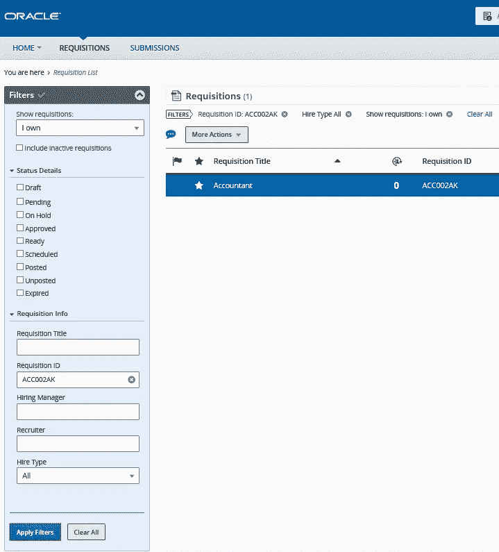

# 过渡到新的 Oracle Taleo Fluid UI

> 原文：<https://medium.com/version-1/transitioning-to-the-new-oracle-taleo-fluid-ui-ac7f8406e511?source=collection_archive---------1----------------------->

Photo by [Christina @ wocintechchat.com](https://unsplash.com/@wocintechchat?utm_source=medium&utm_medium=referral) on [Unsplash](https://unsplash.com?utm_source=medium&utm_medium=referral)

“Fluid Recruiting”是 Oracle 从现有的基于 Adobe Flash 的 Taleo 版本迁移到 html5 *，因为 Flash 的*将于 2020 年 12 月 31 日退役。在 20B 升级版中，默认情况下提供 Fluid Recruiting，但是当前基于 Flash 的 Taleo 在 2020 年 12 月底之前仍然可用，客户可以在过渡到 Fluid 的过程中继续使用传统的 Recruiting。

我们的许多客户现在已经从传统的招聘转向流畅的用户界面，这使得用户体验更加简洁、易用。在他们适应流体变化的过程中，我们通过测试流体 UI 中的功能来帮助客户，并在此过程中确定了我们努力解决的一些关键优势和问题。

所以让我们从积极的方面开始吧！

# **主要优势**

**易于配置**:流体配置简单。一旦激活，用户将在其欢迎中心的快速访问链接上看到一个新的链接，“流动招聘”。

**移动支持:**该应用程序在手机或平板电脑上的易用性让招聘过程变得更加简单快捷。招聘经理可以通过移动设备随时随地访问候选人信息、预览简历并提供反馈。

**Mobile View**

**直观的显示:**招聘团队可以随时获得关于候选人的关键信息，如简历审核和箭头下一步按钮、当前步骤/状态、招聘人员和招聘经理，并减少点击次数。

**搜索过滤器:**高级搜索过滤器为申请、提交和候选人提供更快、更好的结果。

Requisition Search Filters

现在是一些我们已经发现并与客户合作解决的配置问题。

**几个问题:**

**品牌:** Fluid UI 为 Oracle Taleo 提供默认的蓝色背景，与客户在传统招聘中使用的徽标无关。我们发现，客户必须再次上传徽标，使其在 Fluid UI 中可见，但是，背景颜色不能改变。

**布局:** Fluid 针对申请、候选人和提交表单中的 3 列布局进行了优化。因此，任何在这些表单中使用 2 列布局的客户都会看到字段将自动调整为 3 列。

**自定义标签更改**:默认情况下，流体使用传统标签。要在 Fluid UI 中应用定制标签，需要向 Oracle 提交服务请求，并提供定制资源列表。

# **总结……**

尽管存在这些问题，但新的 Taleo Fluid UI 无疑提高了流程效率，为招聘人员、招聘经理和其他关键利益相关者提供了现代化的后端用户体验，也是一份好工作，因为它会一直存在下去！

# 【2020 年甲骨文应用日

要了解更多关于 Oracle Taleo Fluid 的信息，为什么不参加我们即将举办的虚拟活动呢？面向 Oracle 云应用和 Oracle 应用无限的客户和用户的第 1 版最大活动将于今年举行。该活动将涵盖 Oracle HCM 云、Oracle ERP 云、Taleo、Oracle 电子商务套件、JD Edwards 和 PeopleSoft。

在这里报名:[https://www . version 1 . com/virtual-event-ERP-Oracle-applications-day-2020/](https://www.version1.com/virtual-event-erp-oracle-applications-day-2020/)