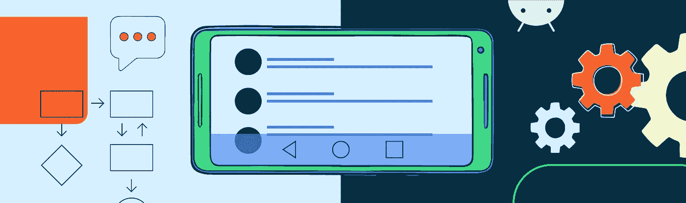
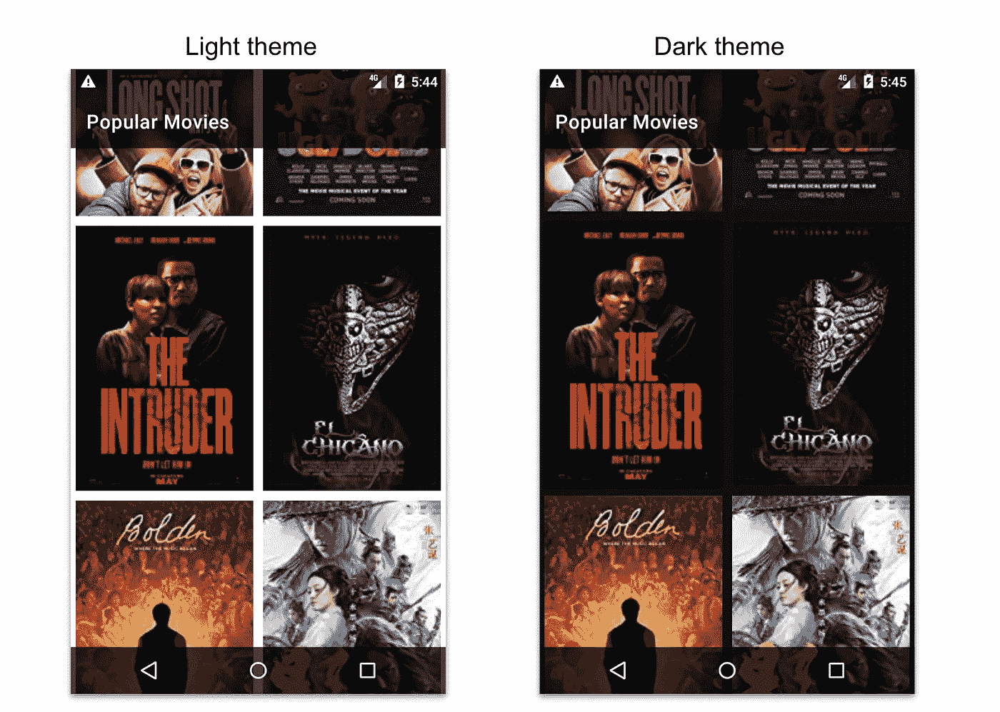
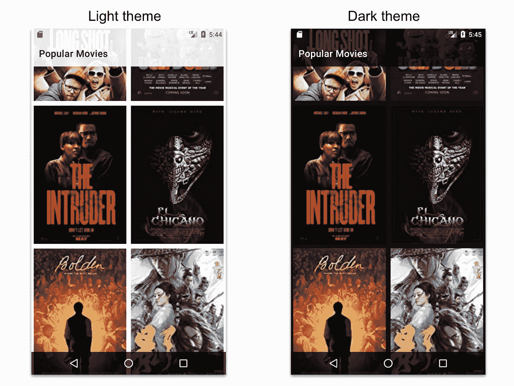
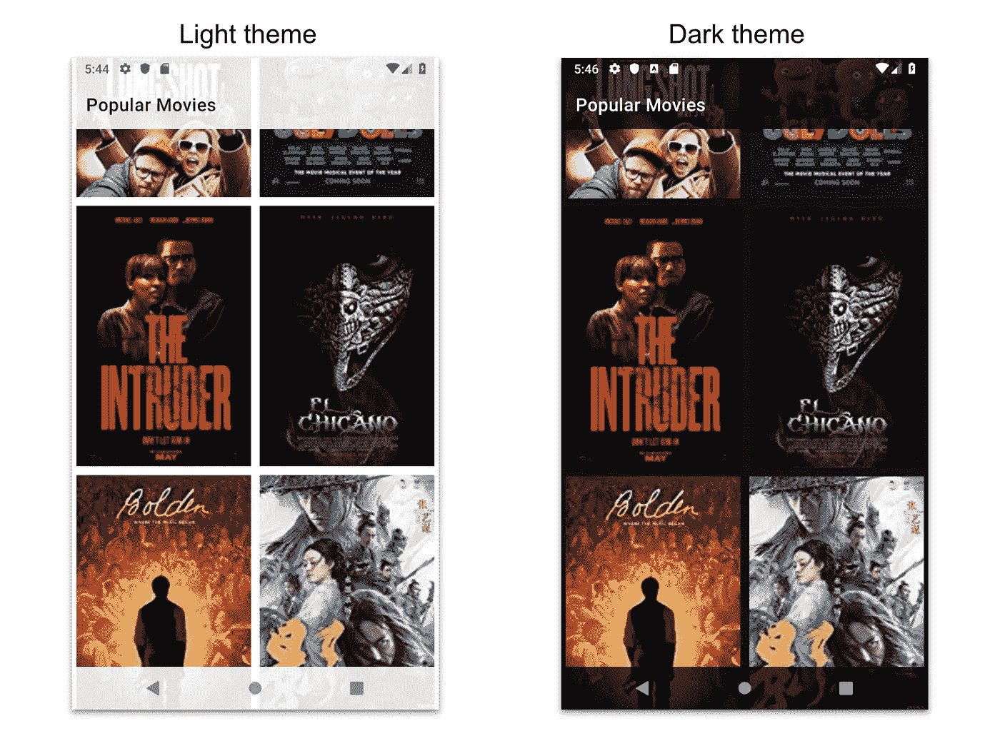

# 半透明系统阻碍了正确的方式——跨 API 级别和主题

> 原文：<https://medium.com/androiddevelopers/translucent-systembars-the-right-way-across-api-levels-and-themes-6d7ddda21396?source=collection_archive---------0----------------------->



# 目标:

在 v21+上用半透明状态和导航栏边对边绘制深色和浅色主题。

本文假设你已经完成了[手势导航——边到边(I)](/androiddevelopers/gesture-navigation-going-edge-to-edge-812f62e4e83e)

因为我们希望内容被绘制在系统栏的后面，这意味着

1.  我们需要半透明
2.  我们需要根据当前主题的导航栏和状态栏的深色或浅色 scrims。

# 能力

## v21+离子

*   完全可配置的*状态栏颜色*
    但是我们被限制使用深色，因为状态栏图标仍然是白色的。
*   *window translucent status*true 将覆盖 *statusBarColor* 并应用一个**不可更改的固定深色稀松布**。
*   完全可配置的*navigationbar color*
    但是我们仅限于使用深色，因为导航按钮仍然是白色的。
*   *window translucent navigation*true 将覆盖导航 *BarColor* 并应用不能更改的**固定深色稀松布**。
*   状态栏图标和导航栏按钮始终保持亮着。

## v23+

*   *windowLightStatusBar*
    使状态栏图标变暗

## v27+

*   *windowLightNavigationBar* 使导航条按钮变暗。

# 解决办法

> 注意:我们将使用透明的状态栏颜色。因为我们将使用 AppBar 来给状态栏着色。由于 AppBar 覆盖了 statusBar 的区域，所以直接给 AppBar 设置相关背景应该就够了。
> 
> 在您的实现中，这可以是顶部的任何视图。如果屏幕上方没有视图，可以改为使用***statusubarcolor****属性。它会给出相同的结果。*

# 基本值:

## AppBarLayout:

```
<com.google.android.material.appbar.AppBarLayout
    android:id="@+id/moviesAppBar"
    android:layout_width="match_parent"
    android:layout_height="wrap_content"
    android:background="@color/status_bar_scrim"
    android:theme="@style/**Widget.AppTheme.AppBar**"
    app:elevation="2dp"
    app:layout_constraintTop_toTopOf="parent"> <androidx.appcompat.widget.Toolbar
        android:id="@+id/moviesToolbar"
        android:layout_width="match_parent"
        android:layout_height="?actionBarSize"
        app:title="Popular Movies" />
</com.google.android.material.appbar.AppBarLayout>
```

# v21 — v22:

*   我们放弃了*window translucent status*和*window translucent navigation*，因为如果我们使用它们的话，系统会应用深色的网布。
*   状态栏和导航栏图标保持白色。
*   意味着，我们只能使用**深色背景/稀松布**。

我们有两个选择:

## 1.深色和浅色主题使用不同的背景。

在深色主题的情况下，颜色表面将是深色/黑色。我们也可以对系统栏使用类似的颜色。
如果是浅色主题，色彩表面将是浅色/白色。我们不能在系统栏上使用相似的颜色，因为图标是白色的。

基本上，我们不能很好地处理 v21–22 上的轻主题系统栏。所以我们只能使用深色背景。

## 2.[选择]深色和浅色主题使用相同的背景。



我们可以用深色背景来设计深色和浅色主题。

因此，黑暗主题将大放异彩。

在浅色主题的情况下:
因为这种深色的稀松布也将应用于 AppBar(如果我们在它后面绘图，我们就是这样！)，我们将不得不使用主题叠加。AppBar 的黑暗。否则，我们将在深色背景上显示深色文本。

## 价值观-夜晚

# v23 — v26:



我们可以完全灵活地使用状态栏，因为我们有能力使状态栏图标变暗。

*   对于浅色主题，我们将有一个浅色的*状态栏和深色的导航栏(因为导航图标不能是深色的)。*
*   对于深色主题，values-night 将覆盖 *status_bar_scrim* 为深色，nav_bar_scrim 也将跟随 status_bar_scrim 为深色。
*   此外，我们需要防止我们的**部件。AppTheme.AppBar** 永远是深色主题。

## 值-v23

# v27+:



我们可以完全灵活地使用导航栏，因为我们现在有能力让导航栏图标变暗。
因为 values-v23 为 light 主题使用了不同的 status_bar_scrim 和 nav_bar_scrim。我们必须确保两者是相同的(两者都是浅色主题，两者都是深色主题)。

我们只需要让 nav_bar_scrim 再次跟随 status_bar_scrim，我们就完成了。

## 值-v27

完整的代码可以在这里找到:[https://github.com/gaurav414u/MoviesInsetsDemo](https://github.com/gaurav414u/MoviesInsetsDemo)