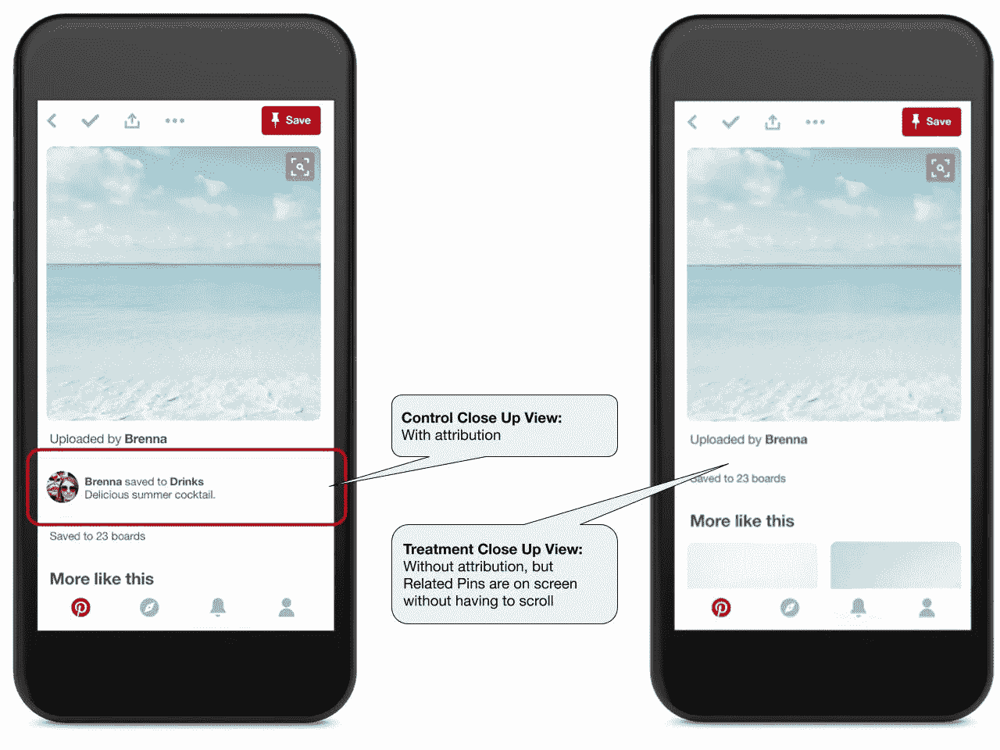
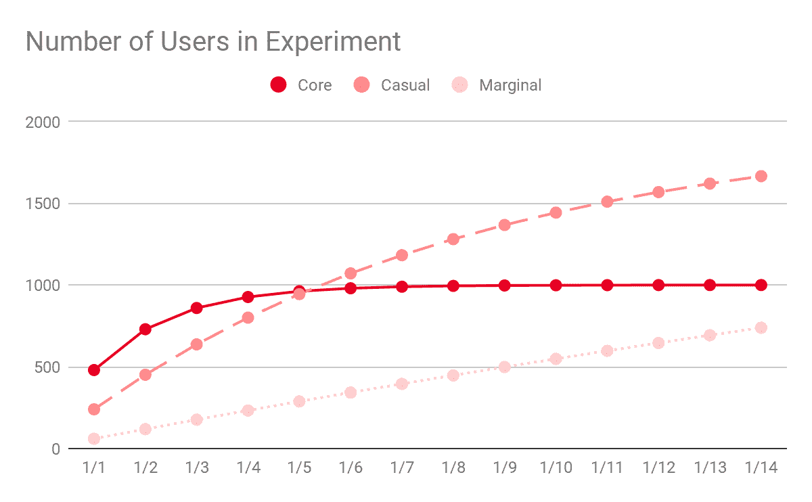
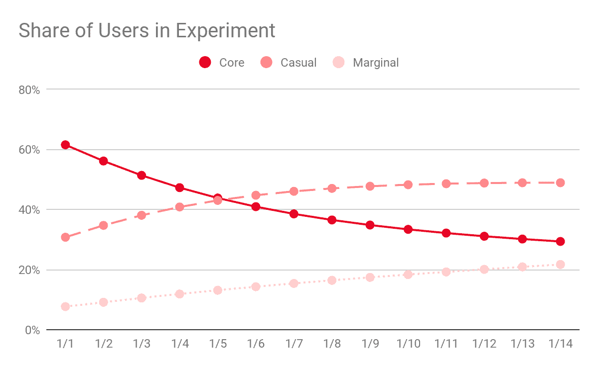

# 困在当下:短期实验中的参与偏差如何让你看不到长期见解

> 原文：<https://medium.com/pinterest-engineering/trapped-in-the-present-how-engagement-bias-in-short-run-experiments-can-blind-you-to-long-run-58b55ad3bda0?source=collection_archive---------2----------------------->

Brian Karfunkel |数据科学家，实验和度量科学

祝贺您，您已经完成了新功能的构建！但是*好*吗？为了找到答案，你启动了一个实验:向一半的用户展示你的新功能，看看他们与另一半相比表现如何。你运行这个 A/B 测试几天(直到你得到你预定的样本量),这个特性表现很好！你决定发布它，但只是为了确保你进行了长期跟踪:你将一小部分用户(比如说，5%)放入一个不会接受治疗的抵制小组，并跟踪他们一个月。当坚持测试结束时，你会惊讶地发现，这个提升比你在最初的实验中测得的要小得多。发生了什么事？

通常，这种模式表明*参与偏差*:你的待遇对非参与用户的影响与对参与用户的影响不同，但参与用户是最先出现的，因此主导了早期的实验结果。如果你相信短期结果，而不考虑并试图减轻这种偏见，你就有被困在现在的风险:为你已经激活的用户而不是你想在未来激活的用户开发产品。

没有对未参与用户给予足够的关注可能会产生负面后果:首先，即使这些用户只占日常活跃用户的一小部分，随着时间的推移，他们在总体上也会产生很大的影响。其次，通过增加现有用户对产品的理解来吸引他们往往比获得新的高意向用户容易得多，因此未吸引的用户是一个巨大的增长机会。也许最重要的是，这些用户——正是因为他们有空间成为更活跃的用户——最能教会你如何让你的产品对更多人更有用。

像许多公司一样，Pinterest 每天多次使用实验来做出产品决策。但正如杰德·巴特利特在《T4》的《白宫群英传》中所说，“决策是由出现的人做出的”:我们基于实际参与我们实验的用户做出决策，这意味着如果我们既想让 Pinterest 更好地为现有 Pinners 服务，又想激励下一代 Pinners 创造他们热爱的生活，我们就必须理解参与偏差。

# 示例:特写镜头上的 Pinner 属性

当一个 Pinner 碰到一个引起他们兴趣的大头针时，他们可能会点击它以获得更多信息；这被称为*特写*。通常，在特写视图上的图像下方是一个部分(我们称之为*属性*),指示谁保存了该 Pin 以及他们保存到哪个电路板，以及他们给出的任何描述。如果用户向下滚动，他们会看到*相关的大头针*:他们可能感兴趣的类似想法。

当一个 Pinner 保存一个 Pin 时，它通常意味着他们发现了一些有趣的东西，并希望能够在现实生活中使用这个想法；也许他们在保存下一个假期想去的地方，或者一周想尝试的晚餐食谱，或者下一个约会之夜想做的发型。我们知道，我们向 Pinner 展示的创意越多，他们就越有可能找到他们想留到以后用的东西，所以如果我们能够让用户在每个特写镜头都能看到相关的大头针，我们就可能帮助他们发现真正鼓舞人心的东西。

我们可以设置一个实验来测试这个假设:通过删除特写视图上的属性，我们可以将相关的 pin 移动到屏幕上，从而让更多的用户保存 pin。以下是治疗和控制体验的大概情况:

运行实验几天后，假设我们看到近 1.6%左右的升力，决定出货。为了更精确地量化提升的幅度，我们运行了一个长时间的抵制。每一天，来自坚守者的提升估计变得越来越小。

# 参与偏见是如何蔓延的

为了了解敬业度偏见在这里是如何发挥作用的，让我们假设用户都属于三种敬业度级别之一:

*   *核心*用户每周至少活跃几次，并定期保存 pin
*   *临时*用户在大多数周都很活跃，偶尔会保存 pin
*   *边际*用户周期性活跃，没有很好的产品理解力，也不经常保存 pin

为简单起见，我们假设参与级别中的所有用户都是相同的，大多数注册用户处于边缘级别，大多数在给定日期执行特写的用户是核心用户:

*【假设示例】*

我们使用所谓的*暴露触发*:被分配到治疗组或对照组的用户仅在他们第一次*暴露*到治疗体验或其相应的控制体验之后加入实验样本(“触发进入”实验)。对于我们的特写实验，这意味着*当用户执行特写*时，我们检查他们是否被分配到治疗组或对照组(从而查看治疗或对照体验),如果他们还没有*成为实验样本的*部分，我们就将他们记录为已触发实验。这确保了我们只比较实际看到了治疗特写视图的 Pinners 和如果他们被随机分配到治疗组中就会看到治疗特写视图的用户。

让我们模拟用户将如何进入我们的实验，假设上表中的访问率和特写率可以建模为伯努利试验:每天，对于每个用户，我们抛一枚(有偏差的)硬币，以查看该用户是否访问 Pinterest 并执行特写，并且每次抛硬币在几天内和整个 users⁴.都是独立的

例如，如果我们在 1 月 1 日增加我们的实验，50%的用户被分配到每个变体，那么在第一天之后，我们期望(使用上表)480 个核心用户加入实验，240 个临时用户，和 60 个边缘用户:一半被触发到控制组，一半被触发到治疗组，但是每个执行特写的用户被触发到一个组或另一个组。然而，在 1 月 2 日，只有 520 名核心用户没有*已经*触发——将近一半的核心用户已经暴露于治疗(或控制)变体，他们只能在*触发一次。*假设用户在某一天的行为独立于他们前一天的行为，这意味着我们预计只有大约 250 名核心用户会在实验的第二天登录。因此，随着时间的推移，我们样本中的用户数量如下所示:

仅仅一周之后，几乎所有的核心用户都加入了实验，但是到那时，只有一小部分边缘用户加入了。一周后，很明显，每天加入的临时用户数量也越来越少。然而，即使在实验开始两周后，边缘用户的触发曲线看起来仍然接近线性。

如果我们看一下随着时间的推移，我们的实验样本在三个参与度级别中的份额，这一点的含义就更清楚了:

一天后，核心用户占样本的 62%,但是如果我们进行两周的实验，他们将只是样本的三分之一。我们的核心用户加入得很快，所以在我们的样本中，他们在早期被*过度代表*，而临时用户和边缘用户被*过度代表*——这是敬业度偏差的核心。

# 为什么敬业度偏差很重要？

假设我们的实验对不同参与度的用户有不同的影响。也许对于经常使用相关 pin 的核心用户来说，这种归属并不是真正需要的。也许对于*边缘*用户来说，然而，属性块帮助他们理解什么是 Pin*:他们能够看到用户可以将 Pin 保存到他们*自己的*板上，并且在这样做的时候创建他们自己的 Pin 副本，也许带有他们自己的描述。因此，对于这些用户来说，去除归因障碍可能会大大降低他们的储蓄倾向(特别是因为他们已经比核心用户储蓄得更少)，因为理解力的下降抵消了接触更多相关 p in 中的想法的积极影响。*

*让我们建立一个模型，如果这是真的，我们会看到什么，其中治疗效果对核心用户是积极的，对临时用户是平的，对边缘用户是消极的(如上所述，我们假设同一参与度级别的所有用户都是 identical⁵):*

**

*每天我们运行我们的实验，样本越来越接近代表我们的整个用户群:核心用户的份额下降，边缘用户的份额上升。这也意味着对治疗效果的估计也变得越来越能代表所有用户的效果:*

**

*起初，这种处理看起来是积极的，因为我们主要关注核心用户，我们正在为他们消除找到他们想要保存的 pin 的障碍。但是随着我们慢慢增加边缘用户，我们正在伤害他们的理解力，因此也伤害了他们的储蓄倾向，这个事实越来越重要。如果我们一直进行实验，直到几乎所有人都被触发，会怎么样？*

**

*在短期内，实验显示了积极的提升，但这只是因为我们的早期样本偏向于我们更积极参与的用户。从长远来看，这种提升最终会变成负面的，因为我们现在观察到了对参与度较低的用户的负面影响。换句话说，如果我们关心我们的未参与 users⁶，那么只看最初的实验结果将导致做出错误的决定，并将阻碍将今天处于边缘的用户转变为未来更加参与的用户的努力。*

# *如何减轻敬业度偏差*

*限制参与偏差的最简单的方法就是延长实验时间:如果你进行一个月的实验，它们会比你进行一周的实验偏差小。但是，考虑到对实验速度的不利影响，你能承受多长时间的实验呢？这取决于你关心的人群。如果你试图构建一些特性来加深已经参与的用户的参与度，你可能不够关心边缘用户，以至于不值得进行较慢的迭代。另一方面，如果你专注于增长并试图吸引更多的用户，那么你可能愿意牺牲速度来更好地理解你试图接触的用户。*

*另一种方法是，每当你有理由相信治疗效果将与敬业度相关时，对每个敬业度水平进行单独的实验。你可以做出一系列更加细致入微的决定，而不是试图做出一个对所有人都适用的决定，这样你就可以为每个群体提供最好的选择。对于快速进入实验的核心用户，您可以很快收集足够的样本，从而快速迭代。针对边缘用户的实验可能需要更长的时间才能达到合理的功率，但等待这些用户的信号不再会阻碍为更多参与用户开发新功能。*

*如果你的产品足够稳定，能够合理地预测不同参与度用户的治疗效果，你也许可以使用[贝叶斯](http://varianceexplained.org/r/bayesian_ab_baseball/) [方法](https://blog.dominodatalab.com/ab-testing-with-hierarchical-models-in-python/)通过分别对每个参与度建模，对参与偏差做出合理的修正。或者，你可以使用像[赫克曼校正](https://www.jstor.org/stable/1912352)这样的方法来解释实验样本中的偏差。然而，对于大多数进行实验的团队来说，最重要的事情不是试图消除参与偏差，而是理解它是什么以及它如何影响决策。*

# *结论*

*当一种处理对参与度较高的用户和参与度较低的用户产生不同的影响时，以及当用户根据他们的参与度以不同的速率输入实验样本时，就会出现参与偏差。这意味着早期的实验结果通常反映了治疗对最活跃用户的影响，随着时间的推移，治疗引起的提升估计将接近您在发货后预期看到的整体效果。虽然进行足够长时间的实验以真正消除参与偏差通常是不可行的，但仅仅意识到这一点就可以帮助团队更明智地考虑对未参与用户的影响，并理解为什么看似具有巨大治疗效果的实验，在经过长期运输和评估后，并没有产生预期的影响。*

**鸣谢:*感谢赵波对开发该方法的帮助，并感谢帕梅拉·克莱文格、阿希姆·达塔、菲比·刘、艾丹·克鲁克、萨尔萨克·沙阿、米娅·桑德勒和马洛里·卢奇的反馈和编辑协助。*

*[1]这通常只有在您检查每用户的*指标时才会出现问题，例如执行某项操作的用户份额(例如转化率)或一组用户的平均值(例如每个月活跃用户在网站上花费的平均时间)。对于总量指标，如总收入或转化数量，参与偏差通常不是问题，至少在预测实验发布后的影响时是这样，因为该指标是可替代的:如果七个未参与用户每周创造的收入减少 1 美元，但一个参与用户每天创造的收入增加 1 美元，即使有更多未参与用户受到影响，每周收入的变化也会抵消。**

*[2]即使你通常不进行长期的抵制实验来确认结果，如果你在运行实验的时候偷看实验结果，你也可能会经历一种类似的令人困惑的上升模式，它开始很高，然后随着时间的推移而下降。在达到预定的采样尺寸之前查看升力，虽然[常见](https://papers.ssrn.com/sol3/papers.cfm?abstract_id=3204791)，当然，如果你使用这些结果来决定提前结束实验(或者运行更长时间)，这是一个大禁忌*。如果你想让早期结果影响你的决策，你可以使用类似于[顺序](https://www.ncbi.nlm.nih.gov/pmc/articles/PMC2975406/)测试或各种[贝叶斯](https://arxiv.org/pdf/1602.05549.pdf) [方法](/convoy-tech/the-power-of-bayesian-a-b-testing-f859d2219d5)的技术来减轻(虽然不是[消除](http://varianceexplained.org/r/bayesian-ab-testing/))窥视问题。**

*[3]另一种方法可以叫做*意向性治疗触发*:每个用户一旦被分配到一个组或另一个组，就会被触发，即使他们从未真正看到实验特征的变化。意向性治疗触发使得在运送治疗药物时更容易推断出对整个人群的影响，但是在进行分析时需要更多的[小心](https://exp-platform.com/Documents/wsdm2015-dilution.pdf)；否则，治疗效果的信号会被所有用户稀释，这些用户的体验是相同的，而不管他们的组分配，这使得很难检测到任何效果。*

*[4]换句话说，例如，如果一个核心用户*没有*在星期二访问，这并不会使他们更有可能在星期三访问，反之亦然。*

*[5]当然，这一假设在实践中并不成立:敬业度是一个光谱，而不是一组离散的层次。因此，即使我们有一个专门针对边缘用户的实验*,在最初几天，我们也会得到一个样本，其中最活跃的边缘用户过多，最不活跃的边缘用户过少。**

*[6]虽然增长——接触新用户并帮助他们在你的产品中发现价值——通常是产品驱动型公司的一个关键目标，但并不清楚所有公司是否都应该像重视让少数核心用户更加投入一样重视让大量边缘用户更加投入。在实践中，你不可能开发出一款适合所有人的产品，所以你必须将产品开发植根于你的使命和一套连贯的优先级和价值观中。*