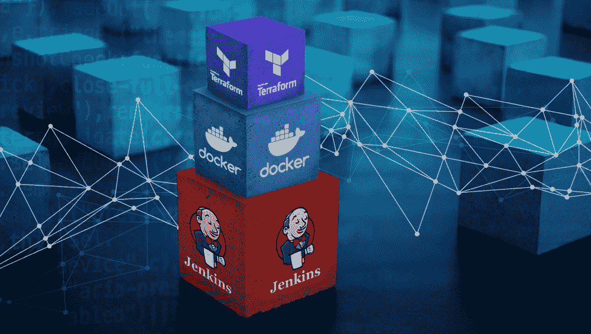

# 像对待应用程序一样对待地形:第 2 部分

> 原文：<https://medium.com/capital-one-tech/treating-your-terraform-like-an-application-how-to-dockerize-terraform-5d7edac741fc?source=collection_archive---------0----------------------->

## 如何对接 Terraform



> 关于在 Docker 中运行 Terraform 的两部分系列文章的第二部分

> *注意:这篇文章涵盖了 Terraform 11。Terraform 12 改变了插件的工作方式，需要不同的命令和文件来构建 Terraform 容器。更多信息请看:*【https://www.terraform.io/upgrade-guides/0-12.html 

转变团队的部署过程和文化的最基本的部分之一是从作为手动过程的基础设施到作为代码的基础设施(IaC)的转变。[如本系列第 1 部分所述](/capital-one-tech/treating-your-terraform-like-an-application-why-terraform-in-a-docker-container-31e802314b4)，将 Terraform 放入 Docker 容器有助于缓解运行 IaC 带来的新问题，尤其是在像 Jenkins 这样的集中式构建服务器上。在这篇文章中，我们将讨论 ***是如何做到的。***

*将 Terraform 放入 Docker 需要一些不同的步骤和背景。*

# 如何将 Terraform 放入容器

我在 dockerizing Terraform 中发现的两个最重要的原则是:

*   将构建基本 docker 映像的代码与构建 Terraform docker 映像的代码分开。
*   将应用 Terraform 的作业与构建 Terraform 的作业分开。

因此，为了满足这些需求，让我们编写一个基本 order 文件，其中包含验证、计划和应用/销毁所需的所有部分。

**Dockerfile:**

```
# build step to create a Terraform bundle per our included terraform-bundle.hcl
FROM golang:alpine AS bundler
RUN apk — no-cache add git unzip && \
    go get -d -v github.com/hashicorp/terraform && \
    git -C ./src/github.com/hashicorp/terraform checkout v0.11.11 && \
    go install ./src/github.com/hashicorp/terraform/tools/terraform-bundleCOPY terraform-bundle.hcl .RUN terraform-bundle package -os=linux -arch=amd64 terraform-bundle.hcl && \
        mkdir -p terraform-bundle && \
        unzip -d terraform-bundle terraform_*.zip
```

这是我们文档的开始。让我们走过它的每一步。

1.  它来自一个 Golang 容器。
2.  它从 Terraform 添加检查，并安装 Terraform。
3.  它从一个 HCL 文件复制(HCL 文件是一个配置，用于描述要运行的 Terraform 的提供者和版本)。我在这里提供了一个示例 HCL 文件。
4.  基于提供的 HCL 文件运行 terraform-bundle 包并下载。

我们将在这里暂停一会儿，看看我们为什么以这种方式构建一个基本容器。将 Terraform 装入容器肯定有其他方法。然而，这种方法有四个优点:

1.  **供应商是标准化的。**与其他依赖项非常相似，维护提供者非常重要，拥有一个能够更新和推广的单一位置非常有用。如果一个团队或产品需要一个不同版本的提供者，可以通过修改这个基本容器来完成。
2.  **terra form 版本是标准化的。**这防止了不必要的版本冲突，因为 Terraform 中最令人恼火的消息之一是`fail to read terraform_remote_state generated by tf<new-version> with tf<old-version>`
3.  **它防止外部依赖项被多次拉入。**你不必担心带宽，可以多次下载提供商。
4.  **它使我们能够标准化 Terraform 的认证流程。**这是一个我们将在稍后讨论的问题，但是拥有统一的身份验证方法可以实施最佳实践。

现在，我们已经有了 Terraform 及其提供者的基本 docker 映像，我们现在可以专注于构建一个容器，它实际上获取并运行 Terraform 命令。

# Terraform 命令 Docker 图像

对于这个 docker 文件，我们有许多必须发生的阶段:

1.  我们必须引入任何我们希望运行的 Terraform 代码。
2.  我们必须传递一个 ENV 变量给 Terraform。
3.  Terraform 必须能够自我认证。
4.  Terraform 必须有存储状态文件的地方。

这些是按照重要性或你应该解决的问题的顺序排列的。然而，它们是按照我们将如何看待它们的*倒序*列出的。

**Terraform 必须有存储状态文件的地方**

**首先，点#4。如果你打算使用 Docker 容器来运行你的 IaC，我推荐使用远程状态。这使您不必担心卷，允许您防止多个操作同时发生，并允许您对反映实际状态的远程状态充满信心。**

如果您没有使用 remote_state(我强烈建议您这样做)，您将需要挂载一个卷，编辑我们在本教程中使用的 Terraform 命令以写出一个状态文件，然后有一个单独的任务将该状态文件复制到您想要存储它的位置。 ***注意—您不能将状态文件存储在 Docker 容器中。***

**Terraform 必须能够自我认证**

**第二，第三点。**无论您是使用角色(如 IAM)还是密钥来根据您的基础设施认证 Terraform，使用单个基本容器都可以让您标准化认证方法。如果你使用访问密钥，那么你应该将它们加密存储在某个地方，并使用类似于 [Hashicorp Vault](https://www.vaultproject.io) 的东西在运行时获取它们。如果您使用像 IAM 这样的角色，那么您需要一种方法将环境变量/元数据放入容器本身。这是通过两步过程完成的:

1.  通过给 Docker 容器提供运行 Terraform 的机器或从机的所有 ENV 变量。
2.  通过使用这些 ENV 变量进行身份验证。对于 AWS，在从 EC2 实例的 ENV 或运行 Terraform 的用户传入角色后，该步骤将使用类似 AWS Assume 的东西与 STS 对话并获取凭证。

**将环境变量传递给地形**

第三，第二点。这一步不仅包括用于身份验证的 ENV 变量，还包括 Terraform init 变量，以允许跨区域或帐户或变量文件的远程状态管理，这些变量可能会根据所部署的应用程序而变化。这里有一些提示:

*   使用预先构建的 Terraform ENV 变量，如 TF_CLI_ARGS_INIT，这些变量可以在容器外部创建，然后传递运行时插入的 SECRET_KEY_ID 等值，尽管在构建时被告知存在。
*   根据正在运行的命令分离出正在传递的内容，以便为验证、计划、应用和销毁传递正确的参数。
*   在运行 init 时 set-get-plugins = false，这样您就不会试图从早期重新下载提供程序。

**通过要运行的平台**

最后，第一点。我建议将 Terraform 存储在正在部署的应用程序旁边，并将基础设施与应用程序部署分开。例如，如果您正在部署一个 ECS 集群，请将该 ECS 集群的所有 Terraform 和 ALB 放在一个存储库中，然后是 ECS 服务的 Terraform，最后是 ALB 监听器和应用程序代码。这有两个好处:

1.  应用程序可以部署在任何地方，而不需要影响底层基础设施或担心它在哪里。使用 Terraform 数据调用来查找信息使得 Terraform 看起来像:

```
data “aws_ecs_cluster” “ecs-cluster” {
   cluster_name = “${var.cluster}-cluster-${var.env}”
}
```

现在，您已经消除了复杂性，并且不再需要手动更新正在部署的环境/群集。

2.这允许您将您的应用程序 Terraform 与其代码一起版本化，允许该版本总是被部署，在功能上永远，只要数据查找被返回。

我建议将 Terraform 代码复制到 docker 文件中，作为部署的一部分。这允许您构建一个包含 Terraform 代码的工件，该代码可以下载到任何系统并进行部署。如果您有需要，我建议您将 Docker 容器推送到 Docker 存储库中。这有助于更好的审计。这也使得自动化变得非常容易。

# 结论

我们已经写了两个 docker 文件，一个显式的，一个隐式的。一个用于基本的 Terraform 容器，另一个用于 Terraform 的部署。不管您也正在部署提供者，或者您正在部署什么，在容器内标准化您的部署过程对于您的用例可能是有用的。它允许您对基础设施代码进行版本控制，从而方便回滚和审计。它还允许您确保基础架构可以从开发人员的笔记本电脑或 CICD 系统中部署。

这在大规模停机导致 CICD 系统宕机的情况下非常有用。如果这是真的，等待 CICD 系统恢复可能是不合理的，所以从任何地方部署都是有用的。它还允许您在一个位置管理所有的 Terraform 版本和提供者，同时仍然允许团队单独灵活地添加或升级。

## *相关*

*   [建筑特征切换成地形](/capital-one-tech/building-feature-toggles-into-terraform-d75806217647)
*   [使用 Terraform 部署多个环境](/capital-one-tech/deploying-multiple-environments-with-terraform-kubernetes-7b7f389e622)
*   [采用地形的多区域部署](/capital-one-tech/multi-region-deployments-with-terraform-kubernetes-a1f51bb96974)
*   像对待应用程序一样对待 Terraform:第 1 部分——为什么要在 Docker 容器中使用 Terraform？

*以上观点为作者个人观点。除非本帖中另有说明，否则 Capital One 不隶属于所提及的任何公司，也不被其认可。使用或展示的所有商标和其他知识产权都是其各自所有者的所有权。本文为 2019 首都一。*