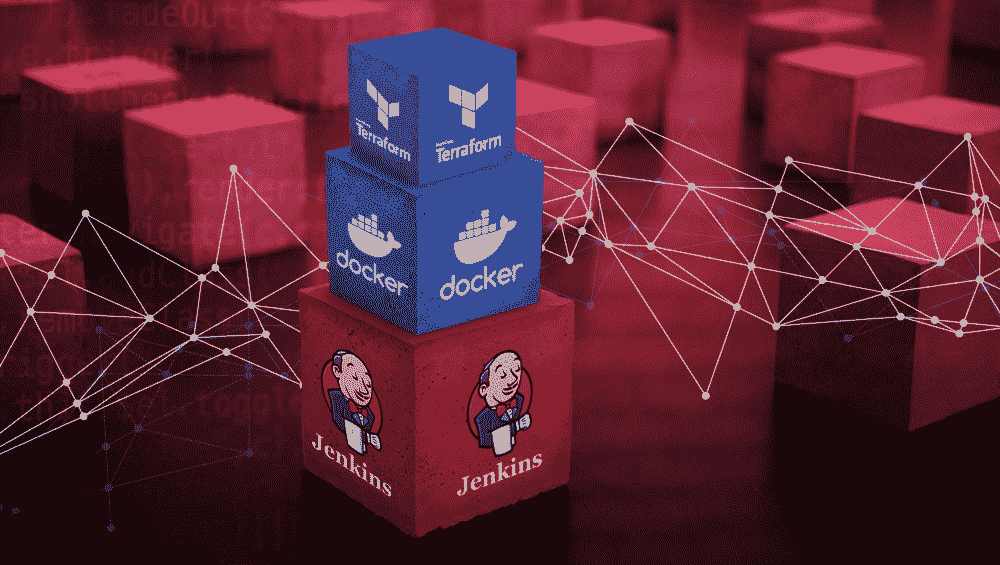

# 像对待应用程序一样对待地形:第 1 部分

> 原文：<https://medium.com/capital-one-tech/treating-your-terraform-like-an-application-why-terraform-in-a-docker-container-31e802314b4?source=collection_archive---------0----------------------->

## 为什么要在码头集装箱中使用 Terraform？

> 关于在 Docker 中运行 Terraform 的两部分系列文章的第一部分

# 什么是 Terraform？

Terraform 是一个了不起的工具；它允许以幂等和编程的方式创建基础设施。Terraform 允许创建和编写可重用的、与云无关的基础架构模块。它允许有条件的环境基础设施，允许通过阶段进行简单和可重复的推广。使用 Terraform 提供基础设施是基础设施即代码(IaC)的一个良好开端。

# Docker 是什么？

Docker 如今风靡一时，如果你不知道 Docker 是什么或者容器是做什么的，那么我推荐你在这里阅读。但是，对于 Docker 站点的简短描述:

> *“容器是一个标准的软件单元，它封装了代码及其所有依赖关系，因此应用程序可以快速可靠地从一个计算环境运行到另一个计算环境。Docker 容器映像是一个轻量级、独立、可执行的软件包，包括运行应用程序所需的一切:代码、运行时、系统工具、系统库和设置。”*

Docker 提供了一种打包完整应用程序的方法。这包括运行时和依赖性。它允许您发布应用程序并对运行结果充满信心。虽然这一结果可以通过裸机和虚拟机来实现，但 docker 容器比通过直接 OS 层来实现要小得多，更可移植，因为它可以由任何 docker 代理来解释，而不依赖于虚拟化层的类型，并且由于其占地面积小，可以以高得多的密度运行。

# 为什么我要把我的 Terraform 放在 Docker 容器中？

既然我们已经介绍了 Docker 和 Terraform 是什么，为什么还要把 Terraform 放在 Docker 容器中，并从其中运行呢？

根据我的经验，将 Terraform 放在 Docker 容器中可以:

*   Terraform 适合您已经创建的工件管理程序。
*   版本正确的基础设施。
*   基于版本化基础设施的重复环境。
*   部署环境的标准化和可移植性。

让我们逐一介绍。

# 工件管理程序

将 Terraform 放在 Docker 容器中的一大好处是，它现在可以像任何其他工件一样被处理。它可以像您的应用程序的代码/工件一样被存储、保留和管理。无论是出于合规、法律还是标准化的考虑，将您的 Terraform 放入 Docker 都可以简化完整且经过测试的基础设施的存储方式。

# 版本化基础设施

虽然带有源代码的 GitHub repo 总是可以被版本化，但是 GitHub repo 不会包含运行 Terraform 的所有依赖项，也不建议在 GitHub 中存储二进制文件和工件。大小工件的存储更适合 artifacty、Dockerhub、Nexus 等工件存储解决方案。通过把你的 Terraform 放在一个容器中，你允许依赖项被下载并包含在它旁边。这允许您在出现故障时回滚。

如果您已经编写了新的 Terraform，推出了它，并且遇到了一些问题，您可以简单地做一个`docker run myteams/terraform:<version> apply`并将您的所有更改回滚到一个已知的良好状态。

# 基于版本的复制环境

在理想情况下，您的每个团队/客户都将使用完全相同的应用程序版本和架构。然而，在现实世界中，情况并非如此。基于一个版本的代码，使用一个 Docker run 命令就可以运行和部署整个产品，这为您提供了 AWS OpsWorks 或 Elastic Beanstalk 的所有抽象，而无需使用托管服务(或者，如果您需要跨云提供商扩展，则无法使用托管产品，或者需要一个不受支持的依赖版本)。每个客户都可以通过简单地运行`docker run myteams/terraform:<version> apply`并提供一些参数来构建一个环境。同一个版本可以部署多次，只需更改参数或环境变量。可以通过一次部署在客户环境中完成推出和回滚，因为唯一的区别是变量。

# 部署的标准化和可移植性

如果您像大多数大型企业一样，您的 Terraform 可能是使用 Jenkins 或另一个 CICD 系统部署的。这些对很多事情来说都很棒，但一个大问题是，无论您的 CICD 系统有多高的可用性和弹性，它最终都会关闭。当它停机时，您的基础架构的其余部分很可能也会出现问题。让*能够通过 Docker 在本地执行*您的 Terraform 意味着您可以保证它独立于您的 CICD 系统，并且仍然可以部署基础设施。

将 Terraform 放在 Docker 容器中也意味着您可以保证在本地开发时运行相同的命令，而不是在 Jenkins 运行部署作业时运行相同的命令。如前所述，这意味着相同的依赖项是可用的，并且您可以对正在运行/部署/下载的内容充满信心。如果您需要转换到不同的 CICD 服务器，您可以简单地将容器和命令传递给它，并确信它也可以在那里工作。

# 结论

Terraform 允许您以可重复、可重用和自动化的方式定义基础设施。它可以防止配置漂移，允许您同步更改，并且无需手动更改即可支持整个环境。

Docker 允许你建立可重复使用的，可重复的，可移植的，微小的自包含图像。这些图像可以很容易地在抽象掉变量的环境之间移动。这些图像可以运行多次，得到相同的结果。

将 Terraform 和 Docker 结合起来意味着您可以获得可重复、可重用、自动化、可移植和独立的基础设施。在推出或回滚的情况下，只需运行 Docker 容器就足以将基础设施置于给定的状态。它可以防止 CICD 系统中的命令、代理或其他更改问题妨碍转出或回滚。

以我的经验来看，当生产系统或环境出现故障，团队面临压力时，这一点尤其有用。通过让版本基础设施工件用于推出来减少要记住的信息量，只需要从头脑中去掉一些东西，就可以专注于情况的其他方面。

在下一篇文章中，我将会介绍如何将 Terraform 进行 dockerize，因为在这个过程中你需要注意一些事情。

## 有关系的

*   [建筑特征切换成地形](/capital-one-tech/building-feature-toggles-into-terraform-d75806217647)
*   [使用 Terraform 部署多个环境](/capital-one-tech/deploying-multiple-environments-with-terraform-kubernetes-7b7f389e622)
*   [使用 Terraform 进行多区域部署](/capital-one-tech/multi-region-deployments-with-terraform-kubernetes-a1f51bb96974)
*   像对待一个应用程序一样对待你的地形:第 2 部分——如何对接地形

*以上观点为作者个人观点。除非本帖中另有说明，否则 Capital One 不隶属于所提及的任何公司，也不被其认可。使用或展示的所有商标和其他知识产权都是其各自所有者的所有权。本文为 2019 首都一。*