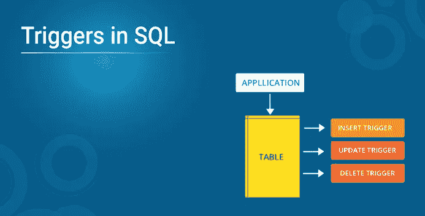

# 关于 SQL 中的触发器，您只需要知道

> 原文：<https://medium.com/edureka/triggers-in-sql-1c51b2bba4c1?source=collection_archive---------1----------------------->



SQL 中的触发器是一个过程代码，它会自动执行以响应指定表上的某些事件。理解这些小代码如何对数据库性能产生如此巨大的影响是很重要的。在本文中，您将通过示例了解如何实现触发器。

本文将涵盖以下主题:

*   什么是触发器？
*   语法和示例
*   触发器中的操作
*   利弊

# 什么是触发器？

触发器是为了响应特定表上的某些事件而自动执行的。这些用于维护数据的完整性。SQL 代码中的触发器是 SQL，其工作方式类似于真实世界中的触发器。例如，当枪的扳机被拉动时，子弹被发射。我们都知道这一点，但是这与 SQL 中的触发器有什么关系呢？为了理解这一点，让我们考虑一个假设的情况。


约翰是一家公司的营销人员。当一个新客户的数据被输入公司的数据库时，他必须向每个新客户发送欢迎信息。如果是一个或两个客户，John 可以手动完成，但如果数量超过 1000，该怎么办？在这种情况下，触发器就派上了用场。

因此，现在 John 可以轻松地创建一个触发器，一旦新客户的数据输入到数据库中，该触发器就会自动向他们发送一封欢迎电子邮件。所以我希望你清楚 SQL 中触发器的引入。

请始终记住，对于一个表，不能有两个动作时间和事件相似的触发器。例如，一个表不能有两个 BEFORE UPDATE 触发器。但是我们可以在更新之前有一个*，在插入*触发器之前有一个*，或者在更新*之前有一个*，在更新*触发器之后有一个*。*

在我们深入触发器的基础知识之前，我建议您理解 SQL 基础和规范化的概念，以便更好地掌握 SQL 中的触发器。

# **语法和示例**

现在让我们看看触发器的语法。

```
Create Trigger Trigger_Name
(Before | After)  [ Insert | Update | Delete]
on [Table_Name]
[ for each row | for each column ]
[ trigger_body ]
```

现在让我分解这个语法并详细解释每一部分。

*   ***创建触发器***
    这两个关键字用来指定一个触发器块将要被声明。
*   ***Trigger _ Name***
    它指定了触发器的名称。触发器名称必须是唯一的，并且不能重复。
*   **( *前|后*T23)这指定了触发器将被执行的时间。它告诉我们触发的时间，即，在正在进行的事件之前或之后。**
*   *Before 触发器*用于在记录值保存到数据库之前更新或验证记录值。
*   *After 触发器*用于访问系统设置的字段值，并影响其他记录的变化。激活 after 触发器的记录是只读的。如果我们想要更新记录，我们不能使用 After 触发器，因为这将导致只读错误。
*   **[ *插入|更新|删除* ]**
    这些是 DML 操作，我们可以在给定的触发器中使用它们中的任何一个。
*   ***on*[*Table _ Name***我们需要提到触发器所应用的表名。不要忘记在关键字上使用**，同时确保所选的表存在于数据库中。**
*   **【每行|每列】**

1.  行级触发器在*行*的任何列值改变之前或之后执行
2.  列级触发器在*指定列*改变之前或之后执行

所以这只是一个简单的导火索。但是我们也可以创建一个嵌套的触发器来完成多进程。处理它并在适当的时候终止它也是非常重要的。如果我们不正确地结束触发器，它可能会导致一个无限循环。

您可能想知道在什么情况下我们可以使用嵌套触发器。与其给你一个定制的答案，不如让我与你分享一个场景，这将帮助你更好地理解嵌套触发器。从前面的场景继续，John 为添加到公司数据库中的每个新客户发送一封电子邮件。现在，如果他希望跟踪收到电子邮件的客户数量，该怎么办呢？现在，John 需要创建一个嵌套触发器，以便在发送电子邮件的同时跟踪计数。

以上是关于触发器语法的所有内容，现在让我们尝试在 SQL 中实现一个触发器示例。

# **触发器示例:**

在下面的触发器中，一旦学生的详细信息被更新到数据库中，我们就试图计算该学生的百分比。

```
CREATE TRIGGER sample_trigger
before INSERT
ON student
FOR EACH ROW
SET new.total = new.marks/6;
```

这里的" **NEW"** 关键字指的是受到影响的行。

# 触发器中的操作

我们可以使用触发器执行许多操作。有些可能很简单，有些可能有点复杂，但是一旦我们通过查询就很容易理解了。

```
DROP TRIGGER trigger name;
```

下面的代码将显示所有存在的触发器。

```
SHOW TRIGGERS;
```

下面的代码将显示特定数据库中存在的所有触发器。

```
SHOW TRIGGERS IN database_name;
```

示例:

```
SHOW TRIGGERS IN edureka;
```

在上面的示例中，将显示名为 Edureka 的数据库中存在的所有触发器。

我们还看了插入前和插入后触发器的一些主要变体。我们已经在示例中看到了触发器。但是在表格的帮助下，让我们看看这到底是如何工作的。

我们已经了解了如何创建触发器，现在让我们了解触发器的两种变体:插入前和插入后。为了实现它们，让我们创建一个包含各种列的学生表，如下所示:

```
CREATE TABLE Student(
studentID INT NOT NULL AUTO_INCREMENT,
FName VARCHAR(20),
LName VARCHAR(20),
Address VARCHAR(30),
City VARCHAR(15),
Marks INT,
PRIMARY KEY(studentID)
);
```

现在，如果我们执行这个查询，我们会得到下表。


让我们试着在插入 之前使用第一个变体，即

```
*CREATE TRIGGER calculate
before INSERT
ON student
FOR EACH ROW
SET new.marks = new.marks+100;*
```

*这里，当我们将数据自动插入学生表时，触发器将被调用。触发器会将 100 添加到学生列的分数列中。*

*现在让我们在插入 之后使用第二个变体，即*

**为了使用这个变量，我们还需要一个表，即触发器存储结果的百分比。使用下面的代码创建百分比表。**

```
**create table
Final_mark( per int );**
```

**现在让我们使用 after insert 触发器**

```
**CREATE TRIGGER total_mark
after insert
ON student
FOR EACH ROW
insert into Final_mark values(new.marks);**
```

**以上是关于触发器的操作，现在让我们继续，看看它的优点和缺点。**

# **触发器的优点和缺点**

## ****优点****

*   **对数据库中存在的表强制进行安全审批**
*   **触发器提供了检查数据完整性的另一种方式**
*   ****冲正无效**交易**
*   **触发器**处理来自数据库层的错误****
*   **通常触发器对于**检查表格中的数据**变化很有用**
*   **触发器提供了运行预定任务的另一种方式。使用触发器，我们不必等待预定事件的运行，因为触发器会在表中的数据发生变化之前或之后自动调用**

## ****缺点****

*   **触发器只能提供扩展的**验证**，即不是所有类型的验证。对于简单的验证，可以使用 NOT NULL、UNIQUE、CHECK 和外键约束**
*   **触发器可能增加数据库的**开销****
*   **触发器很难排除故障，因为它们在数据库中自动执行，客户端应用程序可能看不到**

**这里当我们向表中插入数据时， *total_mark 触发器*会将结果存储在 Final_mark 表中。**

**这是所有关于触发器的操作。如果你想查看更多关于人工智能、DevOps、道德黑客等市场最热门技术的文章，那么你可以参考 [Edureka 的官方网站。](https://www.edureka.co/blog/?utm_source=medium&utm_medium=content-link&utm_campaign=triggers-in-sql)**

**请留意本系列中解释 SQL 其他各方面的其他文章。**

> ***1。*[*SQL For Data Science*](/edureka/sql-for-data-science-a8fe10fe2ef9)**
> 
> ***2。* [*甲骨文面试前 50 题*](/edureka/oracle-interview-and-answers-d1a99534e2d0)**
> 
> **[*3。前 65 个 SQL 面试问题*](/edureka/sql-interview-questions-162f97f37ac2)**

***原载于 2019 年 10 月 11 日*[*https://www.edureka.co*](https://www.edureka.co/blog/triggers-in-sql/)T22。**