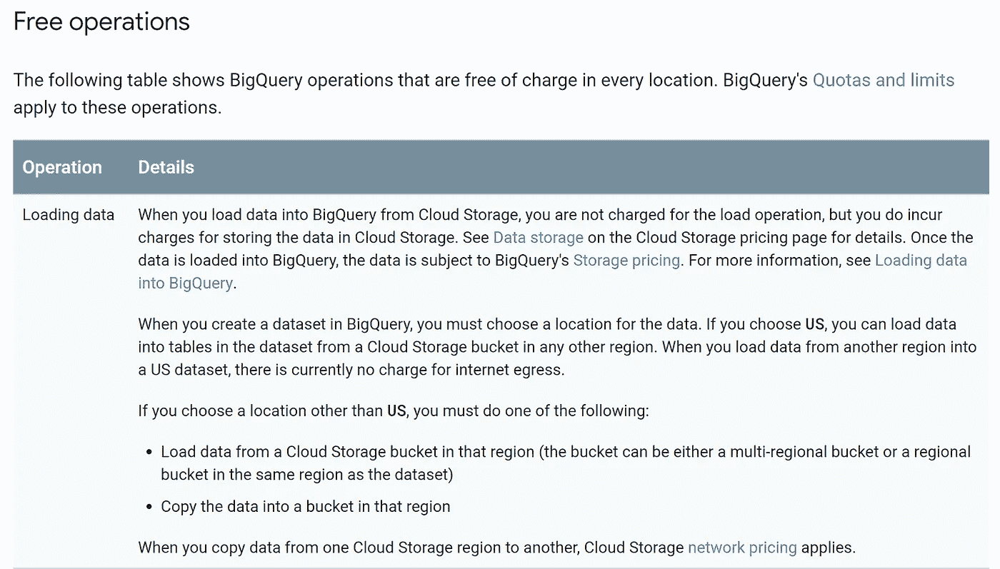
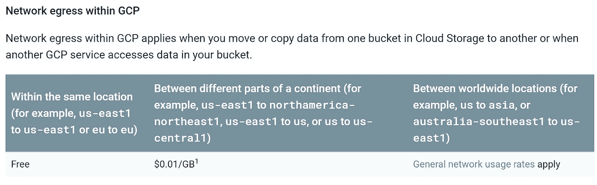
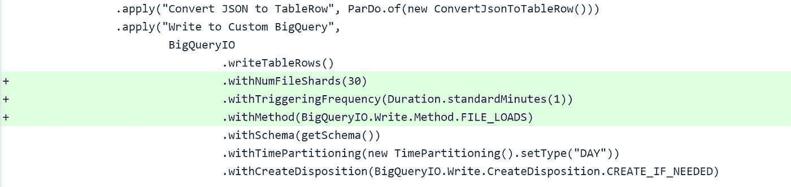
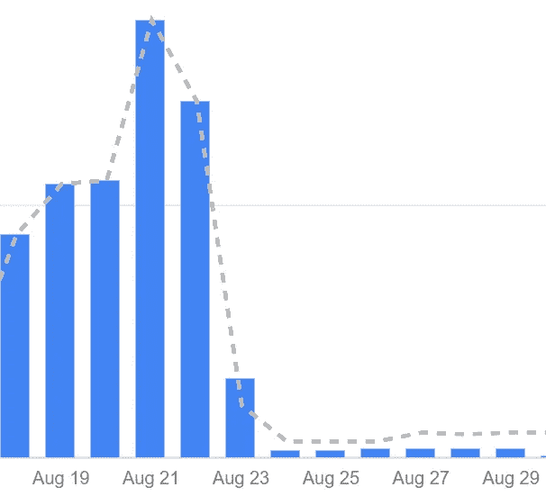

# 使用文件加载降低 95%以上的大查询成本

> 原文：<https://medium.com/google-developer-experts/trimming-down-over-95-of-your-bigquery-costs-using-file-loads-d08dd3d8b2fd?source=collection_archive---------2----------------------->

**TL；dr** :使用相对较低频率的文件加载，而不是使用云数据流的流插入

这个故事是我写的那个故事的前传[在这里](/@harshithdwivedi/how-disabling-external-ips-helped-us-cut-down-over-80-of-our-cloud-dataflow-costs-259d25aebe74)(是的，我是星战迷，续集在前传之前🤷‍♂️)

 [## 禁用外部 IPs 如何帮助我们削减超过 80%的云数据流成本

### 被“通过运营商对等网络的网络出口”的疯狂成本所困扰？请继续阅读，因为这篇文章正是你正在寻找的…

medium.com](/@harshithdwivedi/how-disabling-external-ips-helped-us-cut-down-over-80-of-our-cloud-dataflow-costs-259d25aebe74) 

如果你读了上面的博客文章，你就会知道我们正试图建立一个实时数据聚合管道，为此，我们在 GCP 家族中使用了以下产品:

1.  **应用引擎**:接收来自用户网页和应用的请求。
2.  **PubSub** :一个可伸缩且可靠的消息队列，接受传入 App Engine 的消息。
3.  **数据流**:数据处理管道，读取来自发布订阅的消息，并根据我们的需要对其进行转换。
4.  **big query**:data flow 摄取的所有数据都保存在其中的数据仓库。

这里的挑战显然是保持系统的吞吐量和可靠性尽可能高，同时保持延迟和成本最低。

就目前情况而言，我们每天处理超过 3 亿个事件，这些事件通过 Google Cloud 数据流一到达就存储到 BigQuery 中，以确保事件一发出就可供我们的客户使用(保证有 **< 4 秒**的延迟)。

有趣的是，我们的一些客户并不完全想要接近实时的数据；对他们来说，稍微晚一点(比如说几分钟)就能得到的数据也是一样好的，只要他们能为此支付更少的费用。

现在流插入，虽然对我们提供的实时性至关重要；有一个相关的成本，提供一个延迟的数据意味着我们可以通过批量插入 BigQuery 来节省一些成本！

我们回去看了一下 BigQuery 提供的定价计划，令我们惊讶的是，从外部来源加载数据到 BigQuery 是免费的！

这意味着，如果我们可以将传入的事件存储到 Google 云存储桶中，然后让 BigQuery 加载这些保存的事件，[这是免费的](https://cloud.google.com/bigquery/pricing#free)！

我们不得不承担的唯一代价是在 Google Cloud Storag bucket 中存储和下载事件；如果您在同一个区域输入和输出数据，这也是[免费的(我们是！).](https://cloud.google.com/storage/pricing#network-pricing)

弄清楚要做什么之后，剩下的唯一事情就是修改我们的数据流管道，将数据保存并加载到 BigQuery 中，而不是像现在这样流式传输。

多亏了 Apache Beam 提供的简单 API，这变成了一个不到 5 分钟的任务。

Less than 3 lines of code, and you’re done!

现在你可能想知道为什么我们不把频率降低到一个更小的数字(比如 3 秒)来模拟流插入的实时特性。

当然，这将是一个很好的选择，但有一些限制，阻止我们这样做。

1.  **BigQuery API 限制** 在撰写本文时，每天可以在 BigQuery 上执行的加载作业数量被限制在 1000 个，大约每 90 秒一次。
    请注意，这是一个硬限制，不能增加
2.  **数据流增加的内存需求** 数据流将所有传入的消息保存在其内存中，一旦达到触发频率，它会将它们上传到 Google 云存储，因此我们部署的新管道最终需要 2 个核心 CPU 和 13.5GB 内存，而我们的旧设置是 1 个核心 CPU 和 3.75GB 内存。虽然这并没有阻止我们实施接近实时的加载作业，但它会增加您的计费成本。

我们最终将触发频率设置为 90 秒，这足以让我们的客户(他们对延迟的延迟很满意)满意，并帮助我们减少了不必要的定价。

这里有一个快速截图，展示了我们实施文件加载前后的成本。

August 23rd afternoon was when we implemented File Loads

但这不全是钟声和低语；正如你在这篇博客中看到的[，我们遇到了另一个问题(经过几周的搜索和研究，我们设法解决了这个问题)。](/@harshithdwivedi/how-disabling-external-ips-helped-us-cut-down-over-80-of-our-cloud-dataflow-costs-259d25aebe74)

如果你在一家高速发展的公司工作，并且希望你的数据一创建出来就可以使用；看看[https://roobits.com/](https://roobits.com/)吧，我们可能就是你要找的人！

*感谢阅读！如果你喜欢这个故事，请点击**👏 ***按钮*** ***并分享*** *帮助别人找到它！欢迎留言评论*💬*下图。**

**有反馈？下面我们来连线推特上的***。***