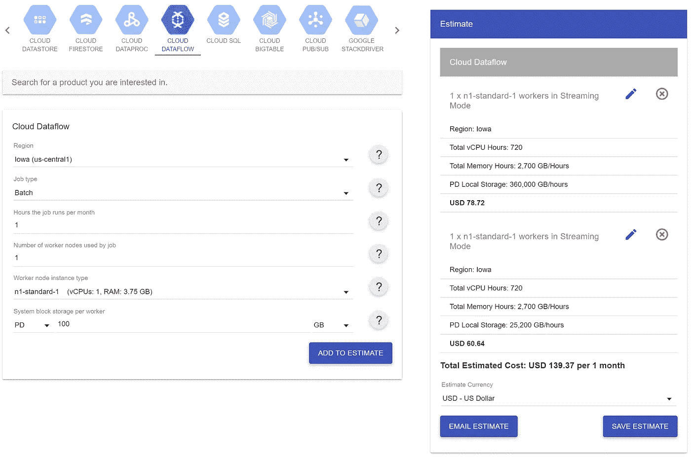
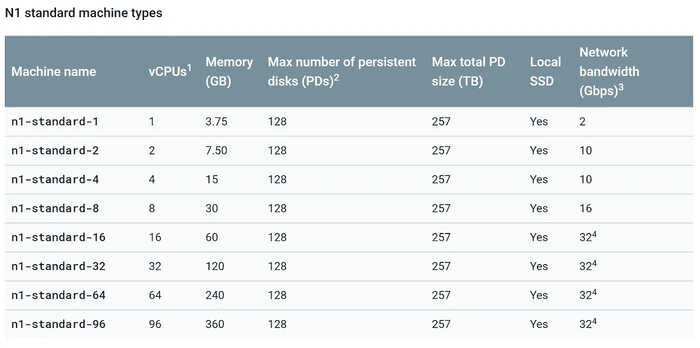

# 大规模削减运行谷歌云数据流的成本

> 原文：<https://medium.com/google-developer-experts/trimming-down-the-cost-of-running-google-cloud-dataflow-at-scale-1c796f72c002?source=collection_archive---------1----------------------->


Google Cloud Dataflow 是 Google Cloud Platform 提供的产品之一，可以帮助您接收和转换来自流或批量数据源的数据。

在 [**Roobits**](https://roobits.com/) ，我们广泛使用数据流管道来摄取事件，并将它们转换为客户所需的数据。

Dataflow 也是无服务器的，并根据输入负载自动扩展，这是对它已经提供的灵活性的额外奖励。

数据流本质上要求您编写对来自源(可能是 PubSub、Apache Kafka，甚至是一个文件)的传入事件执行的逻辑。)然后在 Google 的服务器上部署这个逻辑。

数据流允许你用 Java、Kotlin 或 Python 来编写这个逻辑。

数据流管道的一个非常简单的例子是获取输入段落并对其中的单词进行计数，如下所示:

虽然这里的代码可能看起来很复杂，但是您可以去 Apache Beam 的[文档页面了解更多关于这里发生的事情。](https://beam.apache.org/documentation/)

要在您的 Google Cloud 项目上部署此代码，您可以按如下方式进行:

```
**java -jar wordcount.jar \
  --runner=DataflowRunner \
  --project=<YOUR_GCP_PROJECT_ID>**
```

虽然这看起来不错，但当您计划扩展这一渠道时，在定价方面存在一些问题。

我们一个一个来看。

# 减小磁盘大小

默认情况下，数据流管道的磁盘大小对于批处理管道设置为 250GB，对于流式管道设置为 400GB。

如果您在内存中处理传入的事件，这很可能是一种资源浪费，因此，我建议将该参数减少到 30GB 或更少(最小推荐值是 30GB，但是在以 9–10GB 的 PD 运行管道时，我们没有遇到任何问题)

在部署管道时，可以通过如下方式指定磁盘大小来实现这一点:

```
**--diskSizeGb=30**
```

现在来看一下[谷歌云定价计算器](https://cloud.google.com/products/calculator)，降低这个值可以为我们每个员工每月节省**大约 20 美元**。



# 微批处理您的流管道

微批处理流管道帮助我们减少了数据流管道写入 BigQuery 的次数，从而降低了 BigQuery 写入的成本。

您可以看看下面的文章，了解更多关于如何做到这一点的见解:

[](/google-developer-experts/micro-batching-a-streaming-input-source-using-google-cloud-dataflow-ccd30d2aabf2) [## 使用 Google Cloud 数据流对流式输入源进行微批处理

### 通常，在构建数据处理管道时，您的数据可以是有界的(具有定义的大小)或无界的(具有……

medium.com](/google-developer-experts/micro-batching-a-streaming-input-source-using-google-cloud-dataflow-ccd30d2aabf2) 

# 指定自定义机器类型

默认情况下，Dataflow 支持用于管道的 n1 机器类型，尽管这些机器涵盖了各种用例，但是，您可能经常想要使用自己的定制机器，该机器具有强大的 CPU 或大容量 RAM。



The prebuilt machines supported by dataflow

为此，您可以在部署管道时添加以下参数:

```
**--workerMachineType=custom-8-7424**
```

上面的值对应于 8 个内核和 7424 MB 的内存，您可以根据自己的意愿进行调整，而不是局限于使用预设。

# 启用数据流引擎

串流引擎是数据流家族的新成员，与传统管道相比具有多项优势，其中包括:

1.  减少工作虚拟机上消耗的 CPU、内存和持久磁盘存储资源
2.  更灵敏的 [**自动缩放**](https://cloud.google.com/dataflow/service/dataflow-service-desc#autoscaling) 以响应传入数据量的变化
3.  提高了可支持性，因为您不需要重新部署管道来应用服务更新

截至目前，流媒体引擎仅在这里的[列表中提到的地区](https://cloud.google.com/dataflow/docs/guides/deploying-a-pipeline#streaming-engine)可用，但随着服务的成熟，将会增加更多地区。

要启用流引擎，只需将以下标志传递给管道执行即可！

```
**--enableStreamingEngine**
```

# 禁用公共 IP

默认情况下，数据流服务为您的管道分配公共和私有 IP 地址。

现在，如果您不希望您的数据对公众可用，禁用公共 IPs 是一个好主意，因为这不仅使您的管道更加安全，还可能帮助您节省一些网络成本。

向管道执行添加以下标志会禁用公共 IP:

```
**--usePublicIps=false**
```

# 将您的 GCP 服务保持在同一地区

虽然对一些人来说这可能是显而易见的，但我看到很多人(包括我自己)为在 GCP 服务之间传输的数据支付额外的费用，只是因为他们不在同一个地区。

例如，我们最终在一周内支付了大约 **500 美元**我们的一个项目，因为数据流管道和源代码应用引擎在不同的地方(美国和欧洲)

不仅仅是 AppEngine 和 Dataflow，很多 GCP 的服务都可以自由进出同一个地区！

要在部署数据流管道时设置区域，可以添加以下执行参数:

```
**--region=europe-west1**
```

以下列出了云数据流支持的地区:

 [## 区域端点|云数据流|谷歌云

### 云数据流区域端点存储和处理关于云数据流作业的元数据，并部署和控制…

cloud.google.com](https://cloud.google.com/dataflow/docs/concepts/regional-endpoints) 

就是这样！
结合使用上述技巧，我们能够从数据流上节省大量开支。

可以访问我的 Medium profile，阅读更多围绕数据流和谷歌云的博客；从我上周写的这篇开始！

[](/google-developer-experts/pitfalls-of-using-cron-jobs-with-google-app-engine-bf005f8bf7e6) [## 克服谷歌应用引擎 Cron 的缺陷

### 当预建服务无法满足需求时！

medium.com](/google-developer-experts/pitfalls-of-using-cron-jobs-with-google-app-engine-bf005f8bf7e6) 

*感谢阅读！如果你喜欢这个故事，请* ***点击*** 👏 ***按钮*** ***分享*** *帮助别人找到！欢迎留言*💬*下图。*

*有反馈吗？下面我们就来连线推特上的*[](https://twitter.com/harshithdwivedi)**。**