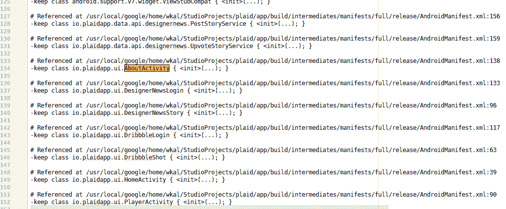

# Android 上的 ProGuard 问题疑难解答

> 原文：<https://medium.com/androiddevelopers/troubleshooting-proguard-issues-on-android-bce9de4f8a74?source=collection_archive---------1----------------------->

# 为什么是 ProGuard？

ProGuard 是一个缩小、优化和混淆代码的工具。虽然有其他工具可供开发人员使用，但 ProGuard 很容易作为 Android Gradle 构建过程的一部分，并随 SDK 一起提供。

在构建应用程序时，您可能有很多原因想要启用 ProGuard。一些开发人员更关心混淆部分，但对我来说，主要的好处是删除了所有未使用的代码，否则这些代码会作为 classes.dex 文件的一部分随 APK 一起提供。


An example size distribution chart of an Android app. Data source: [Topeka sample app](https://github.com/googlesamples/android-topeka).

让你的代码(和应用)变小有很多实实在在的好处，比如增加用户留存和满意度，更快的下载和安装时间，以及接触低端设备上的用户，尤其是在新兴市场。甚至在某些情况下，你需要限制你的应用程序的大小，例如[即时应用程序](https://developer.android.com/topic/instant-apps/faqs.html#apk-size)的 4MB 限制，这证明 ProGuard 是不可或缺的。

如果这还不足以说服你，那么考虑去掉未使用的代码并模糊所有的名字具有累积效应，并且可以解锁更多的优化:

*   在某些版本的 Android 上，DEX 代码在安装时或运行时被编译成机器代码。原始的 DEX 和优化后的代码一直保留在设备上，所以计算很简单:**代码越少，设备上的编译时间就越短，使用的存储空间也就越少**。
*   ProGuard 可以做的另一件事对代码大小有很大影响，那就是**将所有标识符(包、类和类成员)改为使用简称**，比如`a.A`和`a.a.B`。这个过程被称为*混淆*。模糊处理以两种方式减少代码大小:表示这些名称的实际字符串更短，此外，如果它们共享相同的签名，它们现在有更高的机会被不同的方法和字段重用，这减少了字符串池中的总项数。
*   使用 ProGuard 是启用[资源收缩器](https://developer.android.com/studio/build/shrink-code.html#shrink-resources)的先决条件。**资源收缩器** **去除项目**中代码未引用的资源(例如图像，这通常是 APK 的最大部分)。
*   **移除代码还可以把你从** [**64K dex 方法参考问题**](https://developer.android.com/studio/build/multidex.html) 中解救出来。通过仅将您的代码实际使用的方法打包到 APK 中，特别是当您考虑第三方库时，您可以大大减少在您的应用程序中使用 Multidex 的需要。

> **我觉得每个安卓 app 都应该用代码收缩吗？是啊！**

但在你采取行动之前，请继续阅读，了解当你启用 ProGuard 时，你的应用程序中可能出现的问题，有时是以非常微妙的方式出现的。虽然有些错误会阻止你构建你的应用程序，但也有一些错误你只能在运行时发现，所以确保你彻底测试了你的应用程序。

# 怎么 ProGuard？

在您的项目中启用 ProGuard 非常简单，只需在您的主应用程序模块的`build.gradle`文件中添加这些行(如果它们不在那里的话):

```
buildTypes {*/* you will normally want to enable ProGuard only for your release
builds, as it’s an additional step that makes the build slower and can make debugging more difficult */* release {
    minifyEnabled true
    proguardFiles getDefaultProguardFile(‘proguard-android.txt’), ‘proguard-rules.pro’ }
}
```

ProGuard 本身的配置是通过一个单独的配置文件来完成的。你可以在上面的片段中看到，我已经包含了 Android Gradle 插件 [](#9ca6) 提供的默认配置，然后我将在`proguard-rules.pro`中添加一些与我的项目相关的选项。

您可以在 ProGuard 网站上找到描述所有可能选项的[手册。在深入研究配置之前，最好先了解一下 ProGuard 是如何工作的，以及为什么我们需要指定额外的选项。](https://www.guardsquare.com/en/proguard/manual/usage#keepoptions)


You can also watch [part of this Google I/O session](https://youtu.be/AdfKNgyT438?t=6m50s) to see Shai Barack’s explanation.

简而言之，ProGuard 将项目的类文件作为输入，然后查看所有可能的应用程序入口点，并计算从这些入口点可到达的所有代码的映射，然后删除剩余的代码(死代码，或因为从未被调用而永远无法运行的代码)。

阅读 ProGuard 手册时，您应该跳过输入/输出部分，因为 Android Gradle 插件将为您指定输入(您的类)和库 jar(您构建应用程序所依据的 Android 框架类)。

正确配置 ProGuard 的重要部分是让它知道你的代码的哪些部分在运行时被访问，哪些不应该被删除(并且当模糊处理打开时，它们的名字也应该保持不变)。当只动态访问类或方法(使用反射)时，ProGuard 有时在构建所用代码的图形时无法确定它们的“活性”,并且会错误地删除这些类。当您只从 XML 资源中引用代码时(通常在幕后使用反射)，也会发生这种情况。

在典型的 Android 构建过程中，AAPT(处理资源的工具)会生成一个额外的 ProGuard 规则文件。它为Android 应用程序入口点添加了明确的 [**keep 规则**](https://www.guardsquare.com/en/proguard/manual/usage#keepoptions) ，因此 Android 清单中的所有活动、服务、广播接收者和内容提供者都应该保持不变。这就是为什么在上面的动画中，`MyActivity`类没有被删除或重命名。

AAPT 还将**保留**XML 布局中使用的所有视图(及其构造函数)和一些其他类，比如从动画过渡资源引用的过渡。您可以通过打开`<your_project>/<app_module>/build/intermediates/proguard-rules/<variant>/aapt_rules.txt:`来检查由 AAPT 在执行构建之后生成的配置文件



An example ProGuard configuration created by AAPT during build

我将在本文的[后面的](#5a16)部分详细讨论**保持**规则，但在此之前，最好先了解一下当…

# 当启用 ProGuard 会破坏您的构建时

在启用 ProGuard 测试运行时是否一切正常之前，首先您需要构建您的应用程序。不幸的是，当 ProGuard 检测到您的代码有问题时，例如引用丢失的类，它会在编译时发出警告，从而使您的构建失败。

修复构建的关键是查看构建输出消息，理解警告是关于什么的，并解决它们，通常是通过修复您的依赖关系或者将 [**-dontwarn**](https://www.guardsquare.com/en/proguard/manual/usage#dontwarn) 规则添加到您的 ProGuard 配置中。

出现警告的原因之一是当您的一个依赖项针对不在您的构建路径上的 jar 进行编译时，比如当使用*提供的*(仅编译时)依赖项时。有时候，在 Android 上运行库代码时，使用这些依赖关系的代码路径实际上并没有被调用。让我们看一个真实世界的例子。


Build output when building a project depending on OkHttp 3.8.0

OkHttp 库在 3.8.0 版本中给它们的类添加了新的注释(`javax.annotation.Nullable`)。因为它们使用了编译时依赖，注释本身不会进入依赖 OkHttp 的应用程序的最终版本(除非应用程序显式添加了`com.google.code.findbugs:jsr305`),并且 [ProGuard 会抱怨](https://github.com/square/okhttp/issues/3355)缺少类。

因为我们知道这些注释类不会在运行时使用，所以我们可以通过在 ProGuard 配置中添加 **-dontwarn** 规则来安全地忽略该警告，正如[在 OkHttp 手册](https://github.com/square/okhttp/pull/3354/files)中所建议的:

```
-dontwarn javax.annotation.Nullable
-dontwarn javax.annotation.ParametersAreNonnullByDefault
```

对于您在输出中看到的所有警告，您应该经历一个类似的过程，然后重新构建并重试，直到您的构建通过。重要的是理解为什么你会得到警告，忽略它是否安全，或者你是否真的在你的构建中遗漏了一些类。

现在，您可能想使用**-**[**ignore warnings**](https://www.guardsquare.com/en/proguard/manual/usage#ignorewarnings)选项来忽略所有警告，但这很少是个好主意。在某些情况下，ProGuard 警告实际上会让你知道会阻止你的应用程序工作的错误，以及你的配置的其他问题。

您可能还想阅读 ProGuard *注释*(优先级低于警告的消息)，它可以突出通过反射访问的类的问题。虽然它们不会破坏您的构建，但会导致严重的运行时崩溃。这可能发生在…

# 当 ProGuard 移除过多时

在某些情况下，ProGuard 不知道一个类或方法正在被使用，比如当它只被反射、XML 资源或 JNI 代码引用时。为了防止代码被删除或重命名，您必须在 ProGuard 配置中指定额外的 [**keep** rules](https://www.guardsquare.com/en/proguard/manual/usage#keepoptions) 。开发人员有责任找出代码的哪些部分可能有问题，并提供必要的规则。

在运行时得到一个`ClassNotFoundException`或`MethodNotFoundException`是您丢失类或方法的一个明确标志，要么是因为 ProGuard 删除了它们，要么是因为错误配置的依赖关系导致它们首先丢失。彻底测试应用的发布版本(启用 ProGuard)并处理这些错误是非常重要的。

您可以使用不同风格的 keep 选项来配置 Proguard:

*   **保留** —保留所有匹配类规范的类和方法
*   **keepclassmembers —** 指定要保留的成员，但是仅当它们的父类由于某种其他原因而被保留时(可以从入口点访问或者由另一个规则保留)
*   **keepclasseswithmembers** —将保留类及其成员，但前提是类规范中列出的所有成员都存在

我建议您熟悉 ProGuard 中的[类规范语法](https://www.guardsquare.com/en/proguard/manual/usage#classspecification)，上面提到的所有 keep 规则都使用它，上一节讨论的 **-dontwarn** 选项也使用它。还有三个 keep 规则的版本，只防止混淆(重命名)，不防止收缩。您可以在 ProGuard 网站上的一个方便的[表格](https://www.guardsquare.com/en/proguard/manual/usage#keepoverview)中查看所有 keep 选项的概述。

作为编写复杂的 ProGuard 规则的替代方法，您可以在不希望被 ProGuard 移除或重命名的单个类/方法/字段上添加一个`[**@Keep**](https://developer.android.com/reference/android/support/annotation/Keep.html)` [注释](https://developer.android.com/reference/android/support/annotation/Keep.html)。您需要在构建中包含默认的 Android ProGuard 配置文件来使用这种技术。

# APK 分析仪和程序

Android Studio 中的 [APK 分析器](https://developer.android.com/studio/build/apk-analyzer.html)可以帮助你查看哪些类被 ProGuard 删除，并为它们生成 keep 规则。当您在启用 ProGuard 的情况下构建 APK 时，会在`<app_module>/build/outputs/mapping/` 中创建额外的输出文件，这些文件包含有关删除的代码以及从模糊名称到原始名称的映射的信息。


Loading ProGuard mappings in APK Analyzer unlocks more information in the DEX viewer

当您将这些映射加载到 APK 分析器时(使用*“Load Proguard mappings……”*按钮)，您会在 DEX 树形视图中获得一些额外的功能:

*   所有的名字都去泡沫化了(你可以看到原来的名字)
*   由 ProGuard 配置规则保存的**包、类、方法和字段以**粗体**显示**
*   您可以启用“显示删除的节点”选项来查看 ProGuard 删除的任何内容(以删除线显示)。右键单击树中的一个节点可以生成一个 keep 规则，您可以将它粘贴到 ProGuard 配置文件中。

# 当 ProGuard 移除太少时

Android ProGuard 规则包括每个 Android 应用程序的一些安全默认设置，例如确保`View`getter 和 setters 通常通过反射访问——以及许多其他常见的方法和类没有被删除。虽然这将防止你的应用程序在许多情况下崩溃，但配置可能不是 100%适合你的应用程序。您可以删除默认的 ProGuard 文件并使用自己的文件。

如果您希望 ProGuard 删除所有未使用代码，您应该避免保留太宽泛的规则，例如涉及整个包的通配符匹配。相反，选择特定于类的规则或使用前面提到的`@Keep`注释。


Use the `-whyareyoukeeping <class-specification>` option to see why classes are not removed

如果您不确定为什么 ProGuard 没有删除您期望删除的部分代码，您可以在 ProGuard 配置文件中添加[**-whyareyoukeeping**](https://www.guardsquare.com/en/proguard/manual/usage#whyareyoukeeping)选项，然后重新构建您的 APK。在构建输出中，您将能够看到使 ProGuard 决定保留代码的使用链。


See references to classes and methods in APK Analyzer to track down what’s keeping them in the DEX

另一种方法不太准确，但不需要重新构建，并且适用于任何 APK，那就是在 APK 分析器中打开 DEX 文件，右键单击您感兴趣的类/方法。选择“ *Find usages* ”，你将能够浏览一个参考链，它可能会指导你哪部分代码正在使用给定的类/方法，从而防止它被移除。

# 程序保护和模糊堆栈跟踪

我提到过，在构建过程中处理类文件时，ProGuard 会输出映射和日志。每当您存储构建工件时，您应该将这些文件与您的 APK 一起保存。映射文件不能跨不同的版本使用，并且只能与生成它们的 APK 一起正确工作。拥有可用的映射将有助于您调试来自用户设备的崩溃，否则由于混淆的名称而难以检查。


Upload the ProGuard mapping file with your APK to Google Play Console in order to get deobfuscated stack traces

当在游戏控制台上发布你的混淆版本 APK 时，记得也上传每个版本的映射文件。这样，无论何时你进入 *ANRs &崩溃*页面，报告的堆栈跟踪将显示真实的类名和方法名以及行号，而不是缩短的和模糊的。

# 关于 ProGuard 和第三方库

正如您有责任为自己的代码提供 keep 规则一样，第三方库创建者也有责任为您提供必要的配置，以便在启用 ProGuard 时，您的构建不会失败或应用程序不会崩溃。

一些项目只是在其手册或自述文件中提到必要的规则，以便您可以将它们复制并粘贴到您的主 ProGuard 文件中。然而，有一个更好的方法。对于库模块和作为 AAR 发布的库，库的维护者可以指定 AAR 将提供的规则，并通过将以下代码片段添加到模块的`build.gradle`文件中，自动向库消费者的构建系统公开:

```
release { //or your own build type
  consumerProguardFiles ‘consumer-proguard.txt’
}
```

您放在`consumer-proguard.txt`文件中的规则将被附加到主 ProGuard 配置中，并在整个应用程序构建过程中使用。

> **请参考我们的** [**文档页面**](https://developer.android.com/studio/build/shrink-code.html) **了解更多关于代码和资源收缩的信息。**

启用 ProGuard 一开始可能会有点令人生畏，但我个人认为好处是值得的，只需一点时间投资，你就会得到一个更苗条、更优化的应用程序。更重要的是，现在花时间配置你的应用程序意味着你将准备好迎接名为 R8 的[实验性 progguard 替代产品](https://r8.googlesource.com/r8)的推出，它将与现有的 progguard 规则文件一起工作。

除了让你的代码变得更小，ProGuard 和 R8 可以选择性地应用优化来改变你的代码，让它运行得更快，但这是另一篇文章的主题…

ProGuard-Android . txt 文件之前取自 Sdk tools 文件夹(`Sdk/tools/ProGuard/ProGuard-android.txt`)，但在较新版本的 SDK Tools 和 Android Gradle plugin 2.2.0+中，它是在构建过程中从 Android plugin jar 中解压缩出来的。您可以在`<your_project>/build/intermediates/ProGuard-files/`中构建您的项目后找到配置文件