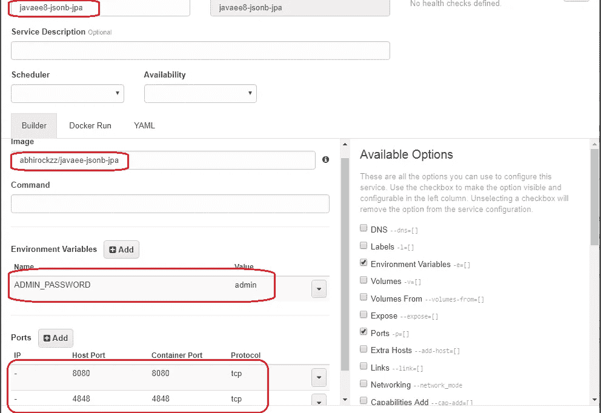
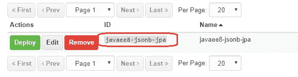
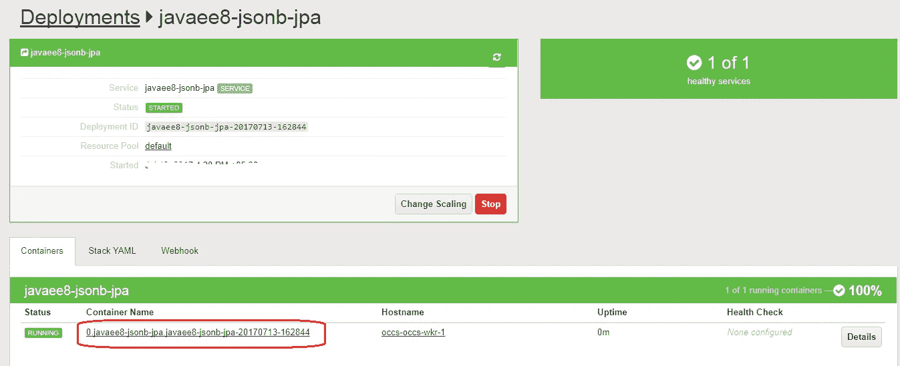

# 在 Glassfish 5 & Docker 上使用 Java EE 8 尝试 JSON-B 1.0、JPA 2.2

> 原文：<https://medium.com/oracledevs/try-out-json-b-1-0-jpa-2-2-using-java-ee-8-on-glassfish-5-docker-fe7ca45a6e7?source=collection_archive---------0----------------------->

**最新的 Glassfish 5 升级版**现已推出——支持许多 **Java EE 8** 规范，例如 JAX RS 2.1、JPA 2.2、JSON-B 1.0 等。更多细节请查看水族馆空间。本博客涵盖

*   在这个版本中测试了几个新的插件——JSON-B 1.0 和 JPA 2.2
*   由于有了 Glassfish 5 nightly Docker 映像，我们在 [Oracle 容器云](https://cloud.oracle.com/container)上运行了这个

# 应用

很简单——这里有[这里有](https://github.com/abhirockzz/javaee8-jsonb-jpa)

*   有一个 REST 端点(也是一个*@无状态* bean)
*   使用 JPA 与嵌入式(Derby)数据库交互——我们使用 Glassfish 中的 *jdbc/__TimerPool* 来简化事情
*   使用标准 JPA 特性在 *persistence.xml* 中引导测试数据(drop + create DB 和 SQL source)

# JSON-B 1.0 的实际应用

主要利用 [JSON-B 注释](https://static.javadoc.io/javax.json.bind/javax.json.bind-api/1.0/javax/json/bind/annotation/package-summary.html)来定制行为

*   `@JsonbProperty`修改 JSON 属性的名称，即与 POJO 字段/变量名不同
*   `@JsonbPropertyOrder`指定 JSON 属性的字典顺序反转(Z 到 A)

更多信息，请查看参考实现 Yasson

# JPA 2.2 在运行

示例应用程序使用添加到`**Query**` 和`**TypedQuery**` 接口的流结果特性，通过该特性，可以使用 JDK 8 流 API 来导航 JPA (JPQL、native 等)的结果集。)查询。对于 JPA 2.2 中的其他添加内容，[请检查此](https://jcp.org/aboutJava/communityprocess/maintenance/jsr338/ChangeLog-JPA-2.2-MR.txt)

# 建立 Docker 形象

*   **git 克隆**[https://github.com/abhirockzz/javaee8-jsonb-jpa.git](https://github.com/abhirockzz/javaee8-jsonb-jpa.git)
*   **mvn 全新安装** —这将在*目标*目录中产生 *javaee8-jsonb-jpa.war*
*   **docker build-t<image _ name>。** —这将创建一个 Docker 图像
*   **docker 推送<image _ name>**

> 捷径
> 
> 使用 Docker Hub 中的现有图像—**Docker pull abhirockzz/javaee-jsonb-JPA**

# 在 Oracle 容器云上运行

您可以使用我以前的博客中的[部分或文档(](https://community.oracle.com/community/cloud_computing/oracle-cloud-developer-solutions/blog/2017/06/16/test-drive-java-ee-8-using-glassfish-5-on-oracle-container-cloud#jive_content_id_Run_in_Oracle_Container_Cloud)[创建服务](http://docs.oracle.com/en/cloud/iaas/container-cloud/contu/creating-service-oracle-container-cloud-service.html)、[部署](http://docs.oracle.com/en/cloud/iaas/container-cloud/contu/deploying-service-oracle-container-cloud-service.html))来在 Oracle Container Cloud 上启动并运行它。超级简单

## **创建一个引用 Docker 图像的服务**



## **岗位服务创建**



## **启动部署**..

就是这样！你会看到类似这样的东西



# 测试事物

请记下您的 Oracle Container Cloud worker 节点(基本上是一个计算虚拟机)的主机 IP

## 获取所有员工

```
[http://](http://community.oracle.com/)<OCCS_HOST_IP>:8080/javaee8-jsonb-jpa/
```

所有员工都将获得一个 JSON 有效负载

```
[
 {
 “salary”: 100,
 “name”: “abhi”,
 “emp_email”: “[abhirockzz@gmail.com](mailto:abhirockzz@gmail.com)”
 },
 {
 “salary”: 99,
 “name”: “rockzz”,
 “emp_email”: “[kehsihba@hotmail.com](mailto:kehsihba@hotmail.com)”
 }
]
```

## 找一个雇员

```
[http://](http://community.oracle.com/)<OCCS_HOST_IP>:8080[/javaee8-jsonb-jpa/abhirockzz@gmail.com](mailto:/javaee8-jsonb-jpa/abhirockzz@gmail.com)
```

您将在中看到一个 JSON 有效负载作为响应

```
{
 “salary”: 100,
 “name”: “abhi”,
 “emp_email”: “[abhirockzz@gmail.com](mailto:abhirockzz@gmail.com)”
}
```

享受 Java EE 8 和 Glassfish！

> 本文表达的观点是我个人的观点，不一定代表甲骨文的观点