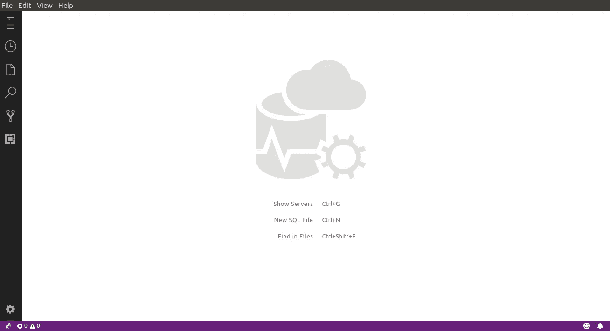

# 试试 SQL Operations Studio for Ubuntu。

> 原文：<https://medium.easyread.co/try-sql-operations-studio-for-ubuntu-573e256cdf37?source=collection_archive---------1----------------------->


SQL Operations Studio (SQLOPS)是一个管理 SQL 数据库的工具。我选择这个是因为当我想在 Ubuntu 中使用 SQL Server 时遇到了一个问题。当我需要恢复从 MSSQL 备份的数据库时，我遇到了困难。

在使用 SQLOPS 之前，您需要首先在您计算机上安装 sql server(在我的例子中，我使用的是 Ubuntu)。可以查一下[***https://docs . Microsoft . com/en-us/SQL/Linux/quick start-install-connect-Ubuntu？view = SQL-server-2017***](https://docs.microsoft.com/en-us/sql/sql-operations-studio/download?view=sql-server-2017)安装。安装完成后，您可以进入下一步安装 SQLOPS。下面是链接[***https://docs . Microsoft . com/en-us/SQL/SQL-operations-studio/download？view = SQL-server-2017***](https://docs.microsoft.com/en-us/sql/sql-operations-studio/download?view=sql-server-2017)***。***

完成所有安装后，运行 SQLOPS，你会得到这个窗口。



接下来，我们可以通过键入 **Ctrl + G** 来创建一个新的连接，打开连接窗口，如下图所示。


填写服务器(例如本地主机)、用户名、密码字段，然后单击连接按钮。你已经准备好了👌

我也有问题(也许你们有些人也有😅)当我想用导入数据库时。mdf 和。ldf 扩展。但是我已经修好了。只需创建一个新的查询并键入以下内容，就可以了。

```
CREATE DATABASE TestDB 
 ON (FILENAME = ‘/paht/to/your/.mdf file’), 
 (FILENAME = ‘/paht/to/your/.ldf file’) 
 FOR ATTACH;GO
```

我希望这能帮助那些和我有同样问题的人。
Ty。