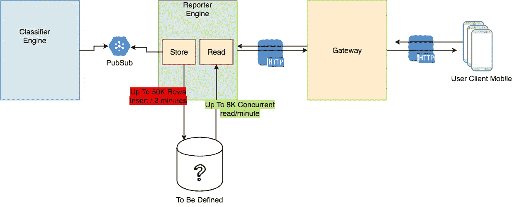
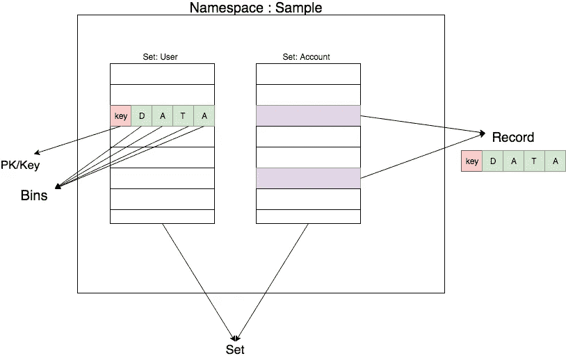
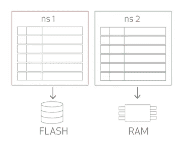
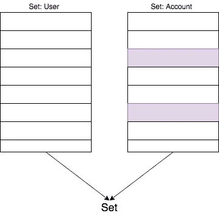
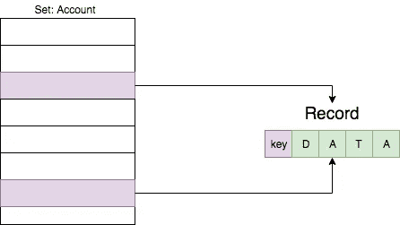
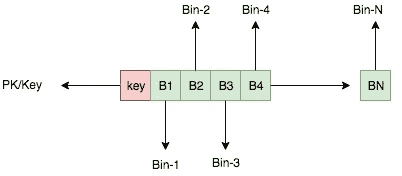
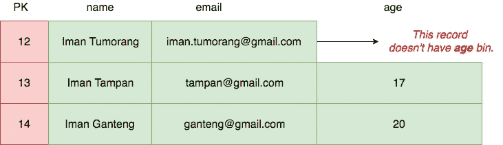
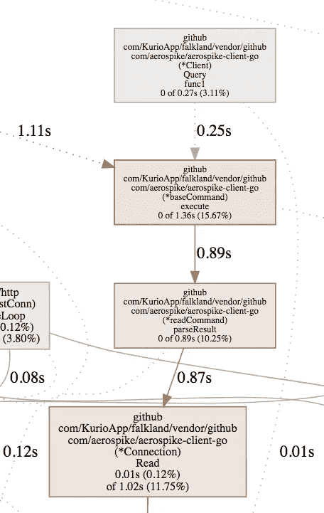
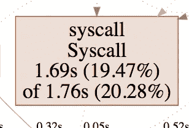

# 尝试将 Aerospike 作为 Kurio 中的数据存储

> 原文：<https://medium.easyread.co/trying-aerospike-as-data-store-in-kurio-99c82b9a7180?source=collection_archive---------0----------------------->

## 在 Kurio 尝试 Aerospike 的第一印象和一个小故事


aerospike logo from google images search

上周我们在 [Kurio](https://kurio.co) 开发了一个新功能。这个功能对我来说足够大了，因为我们只有两个后端团队+一个基础团队，被分配来完成这个项目。因此，我们需要找到一种适合我们以下情况的数据库应用程序:

*   支持——有一个官方库或者很容易与 Golang 集成，因为我们当前的项目已经在 Golang 上运行
*   我们想要一个快速读写的数据库，要么是 RDBMS，要么是 NoSQL。这意味着，当我们写入数据时，它不会影响读取性能。
*   数据库必须易于扩展。
*   数据是持久的并保存在磁盘上。

如果画在一张图上，我们有类似这样的东西:



Our System Schema

算出案例后，我们列出了几个数据库选项。

## 雷迪斯

我们知道 Redis 非常好，而且很快，因为它将数据保存在内存中。但我们知道它不适合我们的情况。如果有任何触发，Redis 会将数据保存到磁盘。根据我们的情况需要，我们需要将数据存储在磁盘中，并持久化和快速读取。

## MongoDB

MongoDB 是我们的第二个选择，因为在我们当前的系统中，我们使用 MongoDB 作为数据存储。但是我们需要更多的表演。

## 迈洛克斯

我们开始考虑的另一个选择是 MyRocks。脸书推出的 MyRocks，使用带有 RocksDB 的 MySql 作为存储引擎。因为它被脸书使用，我们认为它是一个更好的选择。但后来，在与我们的基础设施团队讨论后，MyRocks 与其他 MySql 一样，无法横向扩展。区别仅在于存储引擎，所以在“向外扩展”方面与另一个普通的 Mysql 没有太大的区别。

## 气塞式

后来，我发现很多数据库都有很好的性能，比如 Cassandra、Scylla 等等。很多都不记得了。直到我发现气塞。它就像一个后起之秀数据库。此外，在互联网上有许多关于它的文章基准。嗯，老实说，气塞对我来说是新事物，对 Kurio 的团队来说也是如此，但在看到所有的评论和气塞的特点，并且非常适合我们的情况后，我们决定尝试气塞。因此，在与团队和基础架构团队讨论后，我们决定使用 Aerospike，由于其可扩展性，基础架构团队不需要额外的工作来维护 Aerospike 的横向扩展。

# 第一印象

这是 Aerospike 的几个特点，让我们团队感到惊讶，也适合我们的情况。

## Redis 路

在了解了这个概念以及如何将数据保存在 Aerospike 中之后，我了解到 Aerospike 与 Redis 有类似的概念。它使用了`key:value`概念。

谈到检索数据的性能，当然，redis 也是如此。反正是一辆`key:value`。

## 辅助索引

我从 Aerospike 了解到的另一件事是，他们支持二级索引。因此，即使 aerospike 是一个`key:value`，我们也可以使用我们创建的另一个索引进行查询。

## 异步持久化

与 Redis 不同，Aerospike 将数据异步保存到磁盘。如果 redis 通过触发器或动作持久化数据，Aerospike 可以自动将数据持久化到磁盘，因为在 Aerospike 中我们可以使用混合数据存储。它将保存到内存和磁盘。

# 数据模型和模式

在 Aerospike 中，有一些与数据相关的术语是我们必须首先了解的。它们是:

*   命名空间
*   一组
*   记录
*   箱子



Aerospike Data Schema

## 名称空间

名称空间是容器的顶层。名称空间包含一个或多个集合、记录、箱、索引。如果我们把它比作 RDBMS，`namespace`类似于一个数据库模式。



Namespace image from Aerospike documentations

## 设置

Set 更类似于 MongoDB 中的集合，或者 RDBMS 中的表。它包含许多记录和箱。



Set in Aerospike

## 记录

记录更类似于 RDBMS 中的行。一条记录有一个主键(`key`)，并且有一个或多个 bin。而在一个`set/collection`里，它可能有很多记录。



Record in Aerospike

## 垃圾箱



Bin in Aerospike

Aerospike 中的 bin 更类似于 RDBMS 中的列。我们可以像任何 RDBMS 一样将索引添加到任何 bin 中。不同的是，它更加灵活和动态。在一个记录中可以有很多箱。对于单个 bin，它可以存储任何数据类型(Int、String、Byte 等)。它更像圆柱，但更灵活。



Example of Bins

关于这一点的更多信息已经在官方文档中做了很好的解释:[https://www.aerospike.com/docs/architecture/data-model.html](https://www.aerospike.com/docs/architecture/data-model.html)。所以这里就不多说这四个了。

# 查询和索引

因此，在开发了这个特性(使用 aerospike 作为数据存储)之后，我们必须学习如何在 Aerospike 中进行查询。

幸运的是，Aerospike 已经创建了许多客户端库并支持许多编程语言。我们可以在他们的官方 GitHub 账号这里看到[http://github.com/aerospike](http://github.com/aerospike)。为了帮助调试控制数据，他们还创建了`aql` (Aerospike 查询语言)。它为数据库、UDF(用户定义函数)和索引管理提供了一个类似 SQL 的命令行界面。

使用`aql`，我们可以对 Aerospike 服务器进行如下查询:

```
$ aql> SELECT * FROM test.user 
$ aql> SELECT * FROM test.user WHERE PK=2
```

更多关于命令和关于`aql`的信息你可以在这里阅读:[https://www.aerospike.com/docs/tools/aql](https://www.aerospike.com/docs/tools/aql)

对于我们的例子，因为我们在项目中使用 golang，所以我们在这里使用 Aerospike 创建的官方客户端:[https://github.com/aerospike/aerospike-client-go](https://github.com/aerospike/aerospike-client-go)

## 索引

众所周知，Aerospike 是一种`key:value`数据存储器。但是，aerospike 也支持 seconday 索引。那就是说，我们还在`value/bin`上加了一个索引。然后，使用该索引，我们可以查询值。这不仅仅是通过键获取数据，我们还可以通过值或索引 bin 获取数据。

例如，假设我有一个用户集，它有两个库:`user_id,name,email`。对于这个例子，我将使`user_id`成为 PK。所以总的来说，对于一个记录，我将有至少 2 个箱。


Example of User

有了这个记录，我可以直接查询或者通过 PK 得到记录。如果使用`aql`它就像这个命令一样:

```
$ aql> SELECT * FROM sample.user WHERE PK=12
```

另一种情况，假设我想通过电子邮件进行查询。我想通过电子邮件`ganteng@gmail.com`获得用户。如果使用`aql`会更像这样。

```
# Add Index on email bin
$ aql> CREATE INDEX email_user_idx ON sample.user (email) STRING 
# Query by Email
$ aql> SELECT * FROM sample.user WHERE email="ganteng@gmail.com"
# Will Display the result
|-----|---------------|------------------|
| PK  | name          | email            |
| 14  | Iman Ganteng  | ganteng@gmail.com|
|----------------------------------------|
```

关于这种查询和索引的更多信息，您可以在官方文档中阅读。

# 部署到生产

好吧，回到我们的故事，如果你想知道更多关于 Aerospike 的信息，你可以在他们网站的官方文档中阅读。

在完成所有的功能和环境后，我们试图将它部署到生产中。

我们在午夜部署它，大约从晚上 11:00 到晚上 11:59，我们只是把它留到早上收集数据。

但是在早上 06.00，我们的 CPU 使用率变得很高，达到峰值。不幸的是，我们必须将服务回滚到稳定版本。

## 检测和修复问题

因此，在尝试将其发布到产品中后，我们遇到了一些关键问题。当请求很高时，我们的 CPU 使用比旧版本更不正常。老实说，在这个新版本的功能中，它比以前的版本有许多计算过程。此外，我们还没有实现自动缩放机制。所以我们假设这是因为我们增加的功能导致 CPU 使用率变高。但是，直到我们试图剖析我们的应用程序，我们得到意想不到的情况。从分析中我们可以看出，客户端库的处理速度很慢，并且占用了大量的 CPU 资源。



Profiling golang using pprof. Show the CPU usage in client library aerospike



More usage caused by Syscall.

但后来，在这里找到 Aerospike 首席技术官的幻灯片演示后:[https://www.slideshare.net/brian-aerospike/go-meetup-nov142](https://www.slideshare.net/brian-aerospike/go-meetup-nov142)，并且在查看所有 pprof 图像后，我们可以看到这是由网络 I/O 造成的。因此，为了解决这个问题，我们在我们的系统中实施了自动缩放机制。

# 结论

所以，尝试过气塞之后，还是挺有挑战性的。因为这对我们来说是新的。我们只有两个人来做这件事，三个人外加一个团队成员。从我自己的角度来看，Aerospike 值得他们尝试寻找一个像我们这样的数据存储。类似 Redis 但持久化(混合:内存和磁盘)。以及对二级索引支持。

谈到缺点，我发现一些缺点，这是在图书馆 golang 本身，而不是气塞。库返回`map[string]interface{}`中的数据。我希望有人能向存储库提交一个 PR，这样当查询结果时，它将允许客户端库只返回`bytes`，这样我们就可以自己处理编组了。英雄联盟😈

嗯，也许我错过了一些东西，但我希望我能写好它。顺便说一句，我写这篇文章是基于我的观点和看法，以及我自己直接尝试气塞式气塞的经历。

*如果你觉得这个故事值得一读，就分享到你的圈子里，这样你的朋友也能读到这个。或者如果你有问题或其他看法，或者如果我写错了什么，请在下面回复，或者你可以* [*发电子邮件*](mailto:iman.tumorang@gmail.com) *给我。谢谢*