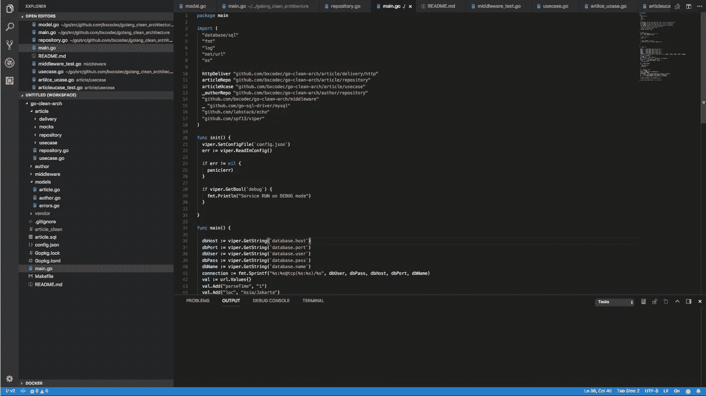
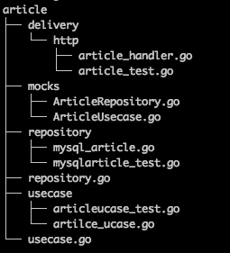

# 在 Golang-2 上尝试清洁建筑

> 原文：<https://medium.easyread.co/trying-clean-architecture-on-golang-2-44d615bf8fdf?source=collection_archive---------1----------------------->

## 独立的、可测试的和干净的



写完我的经历:“在 Golang 上尝试清洁建筑”这里:[https://hacker noon . com/Golang-Clean-Architecture-EFD 6d 7 c 43047](https://hackernoon.com/golang-clean-archithecture-efd6d7c43047)

我从那里的人们和其他地鼠那里学到了很多东西。在我的项目中，我收到了许多电子邮件、评论甚至 github 问题，这一切都让我更加明白我错过了什么和犯了什么错误。

## 循环导入

我以前的项目和故事是:“在 Golang 上尝试干净的建筑”，我可以说，这个项目和结构对 Golang 来说是有限的。我面临的最大问题之一是当模型中有多个依赖项时。这就是驱动循环导入，这里所说的[daf 0 rth](https://github.com/danf0rth):[https://github.com/bxcodec/go-clean-arch/issues/7](https://github.com/bxcodec/go-clean-arch/issues/7)。

## 包装系统

另一件事是，Golang 不同于其他编程语言。它使用包系统。换句话说，最好将所有项目的`struct`或`function`存储在一个包中，这样会更安全。我可以在许多 golang 项目的库中或 github 的开源中看到这一点。我们以 [logrus](https://github.com/sirupsen/logrus) 为例。所有的`struct`和`function`都存储在一个包中，它位于项目包本身的根目录下。因此，我们可以很容易地将`logrus`作为一个包导入到我们的任何整个项目中。

# 求解？

因此，在意识到这一点后，我尝试了许多方法，但没有错过“干净架构”的概念，即独立、可测试、可维护和干净，也没有失去 Golang 身份。最后，我对我的旧项目进行了更新，例如:[https://github.com/bxcodec/go-clean-arch](https://github.com/bxcodec/go-clean-arch)

## —避免循环导入

为了避免循环导入，我将模型分离到一个包中。因此，如果我们有模型之间的关系，我们可以解决它，因为它们已经存储在一个包中。

## —使用包装系统恢复 Golang 身份

在不失去 Golang 身份的情况下，作为一种包编程语言，我将接口(用例和存储库层)移动到他们的根域包。



domain package golang clean architecture

```
article
├── delivery
│   └── http
│       ├── article_handler.go
│       └── article_test.go
├── mocks
│   ├── ArticleRepository.go
│   └── ArticleUsecase.go
├── repository //**Encapsulated Implementation of Repository Interface**
│   ├── mysql_article.go
│   └── mysqlarticle_test.go
├── repository.go // **Repository Interface**
├── usecase //**Encapsulated Implementation of Usecase Interface**
│   ├── articleucase_test.go
│   └── artilce_ucase.go
└── usecase.go // **Usecase Interface.**
```

因此，从这个结构项目中，其他领域，如`Author`的领域，只知道接口和功能，而不知道实现。

嗯，实际上，我只是把接口`repository`和`usecase`移到它们的域根。

```
article/usecase/usecase.go **>>>>** article/usecase.go
article/repository/repository.go **>>>>** article/repository.go
```

并将它们实现留在它们的旧文件夹中。通过这些设计，我仍然可以在不更改合同的情况下更改它们的实现。我仍然可以将存储库实现从 MySQL 更改为 MongoDB，或者我仍然可以更改用例逻辑，而不更改函数的输出和输入。

## 测试？

观念依然没有改变。还有测试。还是老样子。这个改变仅仅是为了避免循环导入，也是为了恢复 golang 作为一个包编程的身份。

# 最后但并不是最不重要的

所有这些设计都是基于我自己的经验和对他人的学习。一些特性可能是我从其他源代码中获取，其中一些我做了一些改进。如果我在文章中犯了什么错误或遗漏了什么，我将非常感谢任何问题、评论或修改。

在戈朗的生活中，没有标准的建筑，我们可以自由地尝试许多方法，因为我们可以做和学习。对一些人来说，我提出的架构是有帮助的，但对另一些人来说，它真的不适合，也没有解决真正的问题。但是，我想说的是，Golang 是免费的，从来没有标准，您可以开发自己的标准，或者您可以尝试其他人在那里做的事情，有这么多其他人提出的干净的架构，这可能会对您有更多的帮助。

*但是，如果你发现这很好，并且适合你的问题，请分享并鼓掌帮助其他人解决这个问题。*